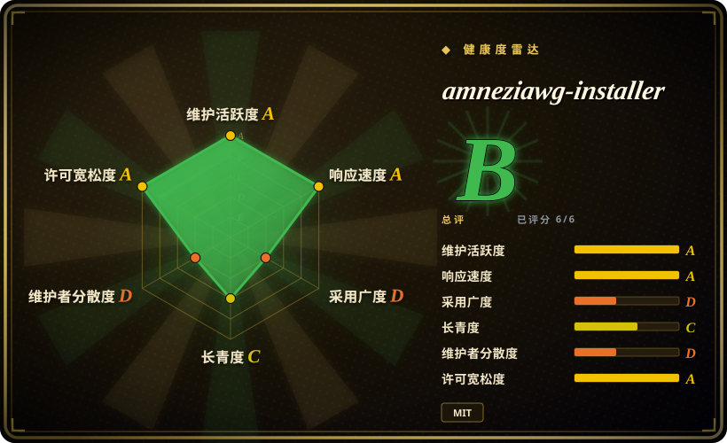
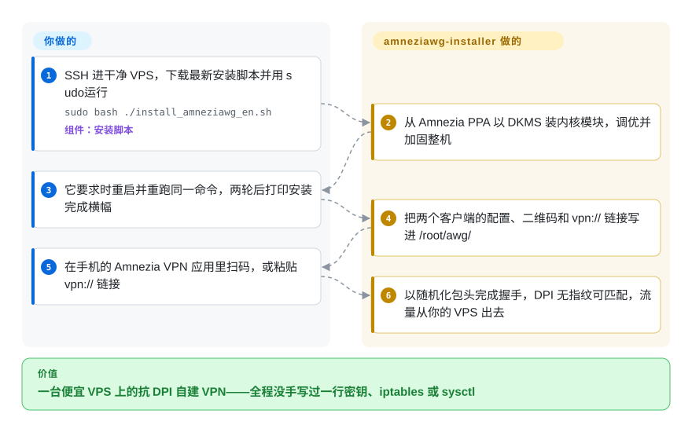

# amneziawg-installer

自家 VPS 上的 WireGuard 一夜之间握不上手：Wi-Fi 里好好的，一切手机流量就再也连不上——不是服务器挂了，是运营商的深度包检测（DPI）认出了它固定的包长和包头字节，直接丢弃。这个项目是一条可读的 bash 脚本：把一台干净的 Ubuntu/Debian VPS 一条命令装成 AmneziaWG 服务端，协议还是 WireGuard 那套，但包头随机化，DPI 没有固定指纹可以匹配；全程只需两次重启。

## 何时使用

你所在的网络会用 DPI 掐掉裸 WireGuard——俄罗斯的 TSPU、伊朗、土库曼斯坦、办公室或校园防火墙——而商业 VPN 又不是你能接受的答案（信任、共享出口 IP、费用）。你花每月三到五美元租了台便宜 VPS 想自己做出口，但不想手工拼一套混淆隧道：密钥、iptables、sysctl、内核模块、防火墙规则。你 SSH 登上一台干净的 Ubuntu 24.04 或 Debian 13，跑一条命令，回答三个问题（端口、子网、路由模式），重启两次，再用手机上的 Amnezia VPN 应用扫个码。这就是本项目完整的触发场景。

它对替代品的决定性取舍在于：混淆做在**协议内部**（内核态的 AmneziaWG 模块——没有 Docker、没有 Web 面板、没有常驻的伪装代理进程在四美元的小机器上烧内存），而且整台服务器顺带调优加固——UFW 全拒加 SSH 限速、Fail2Ban、BBR、按实际内存调的缓冲区和 swap。当机器是无头廉价机、你希望除了 VPN 本体之外零常驻服务时，选它而不是 wg-easy；当你想要的是把服务器本身调好、而不是在一个没调过的宿主机上丢一个 Docker 容器时，选它而不是官方 Amnezia 应用；当 WireGuard 在你的网络上确凿连不通时，选它而不是普通 WireGuard 安装脚本。家人朋友场景也合适：访客拿一个七天期限的客户端（`--expires=7d`），cron 到点自动删除；机器人还能通过 `--json` 接口接管管理。

## 怎么用起来

安装器是一份六千六百行、可读性很好的 bash 脚本（外加三千行的 `manage` 管理脚本），以 root 在干净机器上运行。**服务器上的活它全包；你只做几个决定、重启两次。**底层它从 Amnezia PPA（Launchpad 上的第三方软件源，密钥内嵌且仅信任该源）安装 AmneziaWG 内核模块——WireGuard 的改版，把 DPI 用来识别的包头字段（包长、魔数、时序）随机化并加填充——并经由 DKMS（Linux 在内核升级后自动重编内核模块的机制）管理。然后它调优整机（按内存调 sysctl 缓冲、BBR 拥塞控制、swap），上锁（UFW、Fail2Ban、600/700 文件权限）。装完之后，客户端生命周期都走 `manage` 脚本：`add`／`remove`／`list`／`stats`，通过 `awg syncconf` 热生效、不重启服务，另有备份、按客户端流量统计和给脚本用的 JSON 模式。你的手机全程不需要配置任何东西：每个客户端的 `.conf`、二维码和一键 `vpn://` 链接都落在服务器的 `/root/awg/` 里，扫一个或贴一个进 Amnezia 应用即可。

<!-- flow-steps:begin (generated from flows/amneziawg-installer.json by tools/flow_card.py — do not edit) -->

流程文字版

1. **你**：SSH 进干净 VPS，下载最新安装脚本并用 sudo 运行 — `sudo bash ./install_amneziawg_en.sh` — 组件：`安装脚本`
2. **amneziawg-installer**：从 Amnezia PPA 以 DKMS 装内核模块，调优并加固整机
3. **你**：它要求时重启并重跑同一命令，两轮后打印安装完成横幅
4. **amneziawg-installer**：把两个客户端的配置、二维码和 vpn:// 链接写进 /root/awg/
5. **你**：在手机的 Amnezia VPN 应用里扫码，或粘贴 vpn:// 链接
6. **amneziawg-installer**：以随机化包头完成握手，DPI 无指纹可匹配，流量从你的 VPS 出去

**价值**：一台便宜 VPS 上的抗 DPI 自建 VPN——全程没手写过一行密钥、iptables 或 sysctl

<!-- flow-steps:end -->

## 何时不用

- **你所在的网络裸 WireGuard 还能用。**继续用标准 WireGuard（如 [angristan/wireguard-install](https://github.com/angristan/wireguard-install)，未收录）：任何标准 WG 客户端都能连，没有混淆参数要持续调，配置更新也不会逼客户端换配置。AmneziaWG 要求支持 AWG 2.0 的客户端，而且 3.x 的新特性目前还没进生成的配置。
- **你想要浏览器面板来管理 peer。**这里刻意没有面板——管理就是 SSH 加命令行。家庭 Docker 机器上用 [wg-easy](https://github.com/wg-easy/wg-easy)（未收录），想要免 Docker 的原生面板用 [wiresock/amneziawg-install](https://github.com/wiresock/amneziawg-install)（未收录）；面板是一个常驻服务，恰恰是本项目要从机器上剥掉的东西。
- **你需要多协议或协议伪装。**OpenVPN／VLESS 支持、把流量伪装成 QUIC／DNS 以对抗主动探测，属于官方 [Amnezia VPN 应用](https://github.com/amnezia-vpn/amnezia-client)（未收录，经 SSH 部署多协议 Docker 栈）或 wiresock 的独立混淆代理。本安装器只有 AmneziaWG 一种协议，其混淆针对日常 DPI，不针对主动探测。
- **目标不是一台干净、可弃置、单一用途的 Ubuntu/Debian 机器。**脚本会跑 `apt upgrade`、删包（snapd、unattended-upgrades——自动安全更新就此停止——packagekit、udisks2）、默认关掉主机 IPv6、重启两次。在共享或生产服务器上请改走手工安装 AmneziaWG；`--no-tweaks`／`--keep-packages` 能软化清理，但重启免不了。
- **不是 Ubuntu/Debian，或内核太老。**CentOS／Alpine 不支持；群晖 DSM 7.4（内核 4.4）装不了模块（需要 ≥5.15）——文档给出的退路是上游的用户态方案。

## 横向对比

| 替代品 | 是否收录 | 我们的评价 | 取舍 |
|---|---|---|---|
| [angristan/wireguard-install](https://github.com/angristan/wireguard-install) | 未收录 | 当你的网络没有用 DPI 封 WireGuard 时，选这个普通安装脚本、继续用标准客户端；只有当握手确实连不通时，才选本页项目。 | 不需要专用客户端、不用调混淆参数、心智模型更简单；但会被指纹识别，且在若干国家已被封。真实仓库，本轮 tab-intake 批次未收录。 |
| [wg-easy](https://github.com/wg-easy/wg-easy) | 未收录 | 当你想在已经跑 Docker 的机器上用浏览器管理 peer 时，选 wg-easy；当机器无头、廉价、单一用途时，选本页项目。 | 有图形界面；代价是 Docker 守护进程、一个 Web 端口和容器里的用户态模块——而且它是裸 WireGuard，回答不了 DPI 封锁。真实仓库，本轮 tab-intake 批次未收录。 |
| [wiresock/amneziawg-install](https://github.com/wiresock/amneziawg-install) | 未收录 | 当你要 AmneziaWG 服务器**外加**免 Docker 的 Web 面板或独立伪装代理时，选 wiresock；当你不要任何常驻附加件、要协议内混淆时，选本页项目。 | 有原生面板和 Rust 伪装代理，本页项目都没有；该代理的完整双向模式要配他们的商业客户端。真实仓库，本轮 tab-intake 批次未收录。 |
| [Amnezia VPN 应用](https://github.com/amnezia-vpn/amnezia-client) | 未收录 | 当部署必须全程点击、不碰终端且要多协议时，选官方应用；当你要的是把服务器本身调优加固时，选本页项目。 | 应用经 SSH 把服务端部署成 Docker 容器——换来图形界面和协议选择，放弃了服务器级调优、包清理和内核模块性能。真实仓库，本轮 tab-intake 批次未收录。 |
| [spcfox/amnezia-wg-easy](https://github.com/spcfox/amnezia-wg-easy) | 未收录 | 已归档（2026-09-28 核实）——只当设计参考；要一条还在维护的 AWG-in-Docker 路线，应从 wg-easy 或 wiresock 出发。 | 有 wg-easy 的使用体验加 AWG 支持，但归档仓库不会再有依赖和安全修复。真实仓库，本轮 tab-intake 批次未收录。 |

## 技术栈

- **语言：**纯 Bash——安装器 `install_amneziawg_en.sh`（6,616 行）与 `manage_amneziawg_en.sh`（3,053 行），俄语版成对；以 root 运行前可以通读审查。
- **它装什么：**来自 Amnezia PPA（Launchpad；密钥内嵌且仅信任该源）的 `amneziawg-dkms` 内核模块、`amneziawg-tools` 加 `wireguard-tools`、`qrencode`、UFW、Fail2Ban，以及编译所需的 DKMS／gcc／内核头文件（部分 ARM 板用预编译模块包）。
- **发布工程：**自 v5.29.0 起发布件经 minisign 签名（公钥在 `KEYS.txt`），辅助脚本按 SHA256 锁定，签名威胁模型成文（`docs/SIGNING_DESIGN.md`）。
- **CI：**GitHub Actions 跑 2,416 个 bats 测试、分布在 166 个文件（在 v5.37.0 标签实测清点），外加 shellcheck、文档一致性检查和 ARM 包构建。
- **自动化面：**`manage` 几乎每个命令都支持 `--json`；已有第三方 Telegram 机器人和 macOS 图形界面建在这套接口上。

## 依赖

- **一台干净、专用的 VPS：**Ubuntu 24.04／26.04 或 Debian 13（Ubuntu 25.10／Debian 12 仅限迁移），x86_64／ARM64／ARMv7，内存 ≥512 MB（建议 1 GB），SSH 且有 root，能接受两次重启。
- **第三方 apt 源：**内核模块来自 Launchpad 上的 Amnezia PPA，属于外部依赖（安装器会针对 PPA 故障重试，并锁定源密钥）。
- **客户端必须支持 AmneziaWG 2.0：**Amnezia VPN ≥4.8.12.7（全平台）或 AmneziaWG ≥2.0.0（Windows／Android／iOS）。裸 WireGuard 客户端连不上。Perl 可选（仅用于生成 `vpn://` URI；Ubuntu／Debian 默认自带）。

## 运维难度

**安装低、日常低——锋利的边在于机器变成了什么，而不是操作本身。**一条命令、几个问题、两次重启、约二十分钟 [推断]。日常管理就一个脚本：add／remove／stats／backup 全部热生效不重启服务，过期客户端由 cron 每五分钟清理，内核升级后模块由 DKMS 自动重编（x86）。需要知道的边：包清理会停掉 `unattended-upgrades`，自动安全更新就此停止，除非你手动恢复；主机 IPv6 默认关闭，除非 `--allow-ipv6`；跑预编译模块的 ARM 板没有自动重编——内核变更后要重跑安装器；改动混淆相关旗标（`--mobile`、`--preset`、`--port`）会使所有已发放的客户端配置作废，必须 `regen` 重发一轮；提供 `--uninstall` 卸载，但会在 `/root` 留下一个含私钥的备份归档，要自己删。

## 健康度与可持续性

- **维护（2026-09-28）：异常活跃。**v5.37.0 发布于 2026-09-27——仅 2026 年 9 月就有五个带标签的发布；最后推送 2026-09-27；未归档。
- **治理／巴士系数：单一维护者。**CODEOWNERS 只有 `@bivlked`；约 493 次人工贡献中 488 次来自他本人（Ivan Bondarev）。缓解因素：MIT 许可、可读的 bash、带成文威胁模型的 minisign 签名发布，以及一份写明支持版本（5.37.x 全支持、5.36.x 仅安全修复）和 48 小时／7 天／30 天响应时限的 SECURITY.md。第三方生态（Telegram 机器人、macOS 图形界面）已依赖 `manage --json` 契约，他若停更恢复成本会变高，但也说明用户群是真 committed。
- **背书与年龄／Lindy：年轻、个人项目、骑在上游之上。**创建于 2025 年 4 月（约一年半）——没有基金会或厂商；资金是 GitHub Sponsors 加 README 里的主机商返利链接。协议和 PPA 模块构建属于上游 amnezia-vpn 组织，所以本页项目最好理解为「在别人协议之上的一层出色自动化」。年龄乘以活跃度读作「有前景，但还谈不上 Lindy 级」。
- **采用。**约 1.3k star／107 fork（2026-09-28）；README 列有第三方教程与报道（Hetzner 社区、Debian 论坛、XDA、LowEndTalk）[未验证]；2,416 个 CI 测试（v5.37.0 实测清点）佐证工程认真程度超出爱好级。
- **风险旗标。**以 root 运行的远程脚本——运行前先验 minisign 签名（公钥在 `KEYS.txt`；README 解释了为何同会话复制密钥只保护传输路径）。经 PPA 安装的第三方内核模块。加固本身改变了安全姿态（unattended-upgrades 被移除）。俄罗斯运营商的混淆数据会随封锁演进快速过期。许可 MIT，无改史。

## 存疑（未验证）

- [推断]「约二十分钟装好」与两次重启的节奏是维护者自述；本页核查没有专门开干净 VPS 复现。
- [未验证] 第三方报道（Hetzner 社区教程、Debian 论坛 how-to、XDA 评测、LibHunt 排名）仅来自 README「Featured in」一节的链接，核查时未逐篇打开。
- [推断] 移动运营商预设（Yota、Tele2、Megafon、Beeline）来自 issue／讨论中的用户上报；README 自己也警告「不保证：封锁和运营商参数会随时间变化」。
- [未验证] DPI 抗性是相对的而非绝对——README 承认地址与 UDP 端口封禁仍然有效（所以才需要 `--mobile` 和换端口）；本页未做独立 DPI 实测。
- [未验证]「PPA 现在承载 AmneziaWG 3.x 线；x86 内核 ≥6.7 拿到 3.x 模块」反映的是 v5.37.0 时 README 的说法；未直接查询 PPA 内容。
- [推断] 1,323 star／107 fork／17 关注／10 个开放 issue，截至 2026-09-28——数字随时间会变。
