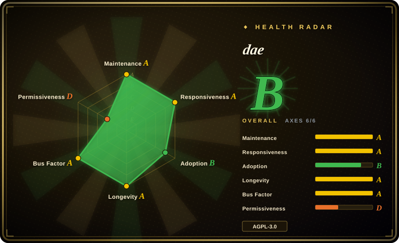
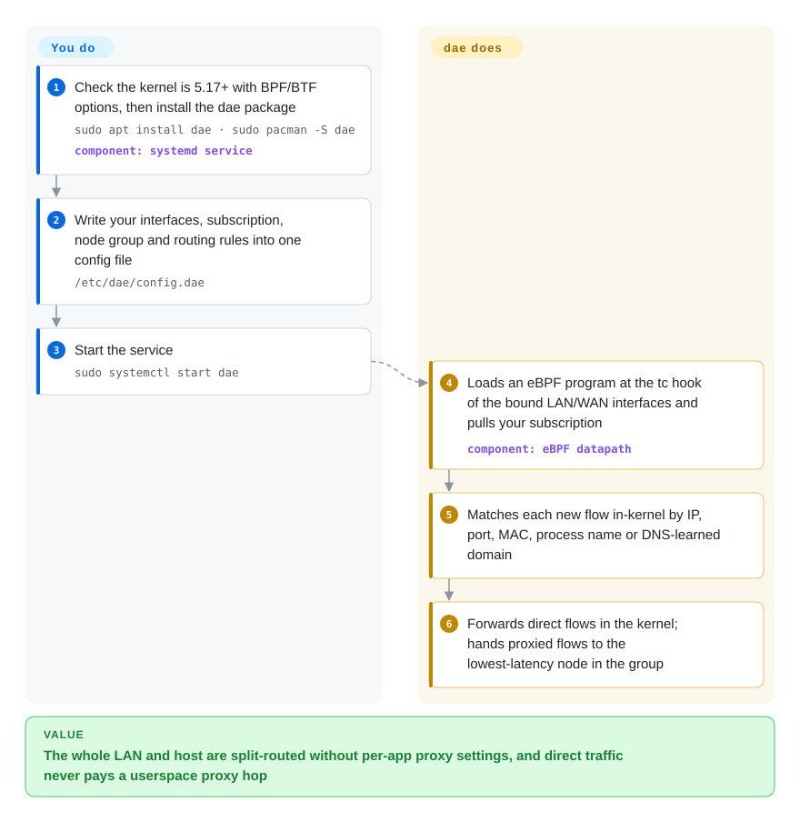

# dae

You run a proxy on your Linux router or desktop and *every* packet pays for it — even the domestic video stream that should go straight out gets copied into the proxy process and back, so the box's CPU climbs and direct traffic is slower than without a proxy at all. dae decides "direct or proxy" inside the Linux kernel before packets reach the network stack, so direct traffic never touches a proxy process and only the traffic you route to a node is handed to its userspace client.

## When to use

You maintain the gateway for a home or small-office LAN — a mini-PC, a soft router, an x86 box running Debian or Arch — and you need split routing: domestic sites and LAN services direct, everything else through a Shadowsocks/Trojan/VLESS/Hysteria2 node from your subscription. With a userspace transparent proxy (the usual Clash-style TUN or iptables-TPROXY setup), the router's CPU sits noticeably busy during a family evening of streaming even though most of that traffic is domestic and "direct", because each direct flow is still relayed through the proxy process. You install dae, write one `config.dae` with a `routing {}` block (`dip(geoip:cn) -> direct`, `pname(...)`, `mac(...)`, `fallback: proxy`) and a node group with a latency policy, bind it to the LAN and/or WAN interface, and start the systemd service.

What decides it over the substitutes: dae's traffic split runs as an eBPF program — a small program the kernel runs itself — attached to the tc hook, so "direct" really means the kernel forwards the packet without a userspace hop, while mihomo/sing-box relay every intercepted flow through their own process. You also get rules that are awkward elsewhere — by LAN device MAC address, by local process name read in-kernel instead of scanning `/proc`, and per-protocol TCP/UDP/IPv4/IPv6 latency-based node choice. You pay for that with a Linux-only, kernel-5.17-plus, root-level, config-file-only tool; when those costs are unacceptable, the substitutes below win.

## How it works

dae is one Go daemon plus eBPF programs it loads into your kernel. At start it attaches its eBPF program to the tc (traffic control) hook of the interfaces you bind — the point where packets are sorted before the kernel's TCP/IP stack and before iptables/nftables see them. **Everything after that is dae's job; yours is the config file.** For each new connection the kernel program checks your `routing` rules against what it can read on the spot — IPs, ports, TCP/UDP, the LAN device's MAC address, the local process name (captured at `connect`/`sendmsg` time through a cgroup hook) — and the domain name, learned by watching DNS answers that must pass through dae, or by briefly sniffing the TLS SNI (server name in the handshake) / HTTP Host in userspace. Flows judged `direct` are forwarded by the kernel like a plain router would; only flows routed to a group go to the Go process, which picks a node by measured latency and speaks the proxy protocol (Shadowsocks, VMess/VLESS, Trojan, Hysteria2, TUIC…). Think of it as a sorting office at the building's front door: letters for the neighbourhood never go up to the courier's desk. `dae reload` swaps in a new config and refreshes subscriptions without dropping existing connections.

<!-- flow-steps:begin (generated from flows/dae.json by tools/flow_card.py — do not edit) -->

Text version of the flow

1. **You**: Check the kernel is 5.17+ with BPF/BTF options, then install the dae package — `sudo apt install dae · sudo pacman -S dae` — component: `systemd service`
2. **You**: Write your interfaces, subscription, node group and routing rules into one config file — `/etc/dae/config.dae`
3. **You**: Start the service — `sudo systemctl start dae`
4. **dae**: Loads an eBPF program at the tc hook of the bound LAN/WAN interfaces and pulls your subscription — component: `eBPF datapath`
5. **dae**: Matches each new flow in-kernel by IP, port, MAC, process name or DNS-learned domain
6. **dae**: Forwards direct flows in the kernel; hands proxied flows to the lowest-latency node in the group

**Value**: The whole LAN and host are split-routed without per-app proxy settings, and direct traffic never pays a userspace proxy hop

<!-- flow-steps:end -->

## When NOT to use

- **Not Linux, or kernel older than 5.17.** Binding LAN or WAN needs kernel ≥5.17 with BTF and a list of BPF/tc options that embedded builds (OpenWrt, Armbian) often disable; macOS runs it only inside a Lima VM, and there is no Windows build (issue #899 open). On a desktop, especially Windows/macOS, use a GUI client over mihomo such as [Clash Verge Rev](../dev-utilities/ops-infra/clash-verge-rev.md); on a phone use a sing-box-based app ([sing-box](https://github.com/SagerNet/sing-box), 未收录).
- **Applications should opt in via a SOCKS/HTTP port.** dae has no local SOCKS/HTTP inbound — its `tproxy_port` is explicitly "NOT a HTTP/SOCKS port", only used by the eBPF program. If you only want `curl`/a browser to use a proxy explicitly, run [mihomo](https://github.com/MetaCubeX/mihomo) (未收录) or sing-box, which expose mixed inbound ports.
- **You need a GUI or web panel.** dae is a config file plus `systemctl`/`dae reload`. Its companion dashboard [daed](https://github.com/daeuniverse/daed) (未收录) is marked **archived** on GitHub as of 2026-09-28, despite a release-build commit on 2026-09-24. For a maintained web UI over a transparent proxy, [v2rayA](https://github.com/v2rayA/v2rayA) (未收录) is the older sibling from the same authors; on OpenWrt the usual path is a LuCI plugin over mihomo/sing-box (e.g. OpenClash, 未收录).
- **You rely on fake-IP DNS or DNS that bypasses the box.** Domain rules depend on DNS answers passing through dae (or on SNI sniffing within a 30 ms default window); fake-IP is not supported (issue #895 open), and encrypted DNS on clients silently weakens domain routing. If your network design needs fake-IP, mihomo or sing-box is the substitute.
- **The host is a public VPS that also serves UDP.** The README warns that outgoing UDP — including replies to your own Shadowsocks/Hysteria server — may be routed to a proxy unless you add a `sport(...) -> must_direct` rule. On a server-side box, run the server software alone, or [Xray-core](https://github.com/XTLS/Xray-core) (未收录) / sing-box as a server, instead of layering a client-side transparent proxy on it.
- **AGPL-3.0 is a problem for your distribution.** Embedding dae in a firmware or appliance you ship puts you under AGPL obligations, and the usual substitutes are copyleft too: mihomo's proxy code (its `Meta` release and `Alpha` dev branches, and the release tags) is GPL-3.0 — the MIT that GitHub shows for the repo comes from the default `main` branch, which holds an unrelated Python project — and sing-box is GPL-3.0-or-later with a naming clause. If you need a permissive license, look at [Xray-core](https://github.com/XTLS/Xray-core) (MPL-2.0, 未收录) or [v2ray-core](https://github.com/v2fly/v2ray-core) (MIT, 未收录), both userspace proxies without dae's in-kernel split.
- **You need a frozen, conservative network stack.** The v2 line changed defaults under existing configs (`sniffing_timeout` 100 ms → 30 ms, auto-set `so_mark_from_dae`, a mainland-China `bootstrap_resolver` default) and v2.1.1 merged a datapath/control-plane rework; read `CHANGELOGS.md` before every upgrade, or pin a version.

## Comparison

| Alternative | In index | Our verdict | Tradeoff |
|---|---|---|---|
| [mihomo](https://github.com/MetaCubeX/mihomo) | 未收录 | For a cross-platform rule engine with Clash-format configs, fake-IP DNS, SOCKS/HTTP inbounds and a large GUI ecosystem, pick mihomo; pick dae when the box is a Linux gateway and direct-traffic CPU is what you are trying to cut. | Portability, GUIs and fake-IP gained; every intercepted flow, direct included, pays a userspace relay. Real repo not added in this tab-intake batch. |
| [sing-box](https://github.com/SagerNet/sing-box) | 未收录 | For one proxy platform that runs on phones, desktops and servers alike (client and server roles, TUN inbound), pick sing-box; pick dae only for a Linux router/host where in-kernel direct forwarding matters. | Broadest platform and protocol coverage, server mode included; userspace TUN path for all traffic, GPL-3.0-or-later with a naming restriction. Real repo not added in this tab-intake batch. |
| [v2rayA](https://github.com/v2rayA/v2rayA) | 未收录 | For a web-panel-managed transparent proxy on top of v2ray/Xray with the least config writing, pick v2rayA; pick dae (its successor per the dae README) when you prefer a text config and in-kernel splitting. | Web UI and familiar v2ray core; transparent proxying through iptables/nftables and a userspace core. Real repo not added in this tab-intake batch. |
| [Clash Verge Rev](../dev-utilities/ops-infra/clash-verge-rev.md) | ✅ | On a Windows/macOS/Linux desktop where you want a GUI, profile switching and TUN mode, pick Clash Verge Rev; it is a desktop client, not a LAN gateway, which is dae's home. | Point-and-click on every desktop OS; bundles mihomo in userspace, so no in-kernel split. |
| [daed](https://github.com/daeuniverse/daed) | 未收录 | Archived on GitHub as of 2026-09-28 — treat it as a pattern source only; run dae from its config file, or pick v2rayA if a web UI is a hard requirement. | Web dashboard built on dae itself; an archived repo gets no further fixes. Real repo not added in this tab-intake batch. |

## Tech stack

- **Language:** Go (module targets Go 1.26) for the control plane; the datapath is C compiled to eBPF, loaded via `cilium/ebpf` with CO-RE (needs kernel BTF).
- **Kernel hooks:** tc ingress/egress on bound interfaces for traffic split; cgroupv2 socket hooks for process names; kprobes for `dae trace` (kernel ≥5.15, not built for arm/mips/s390x).
- **Config language:** its own `.dae` syntax parsed with an ANTLR4 grammar (`dae-config-dist`), with `global`, `subscription`, `node`, `group`, `dns`, `routing` sections.
- **Protocols:** implemented in the org's own `daeuniverse/outbound` library (pinned fork) and a forked `quic-go`; DNS via `miekg/dns`; netlink via `vishvananda/netlink`.

## Dependencies

- **Linux kernel ≥5.17** (5.15 for `dae trace` only) with `CONFIG_BPF`, `CONFIG_BPF_JIT`, `CONFIG_DEBUG_INFO_BTF`, `CONFIG_NET_CLS_BPF`, `CONFIG_NET_SCH_INGRESS`, kprobes, cgroups and related options enabled.
- **Root / BPF capabilities**, IP forwarding for "real direct" on a gateway, and DNS for clients pointed at (or routed through) the box.
- **Geo data:** `geoip.dat` / `geosite.dat` (v2ray format) for `geoip:`/`geosite:` rules — shipped by distro packages or the NixOS module's `assets`.
- **Upstream proxy nodes** — dae is a client; you bring a subscription or node links.
- **Packaging:** Debian/Ubuntu APT and Fedora/RHEL/openSUSE RPM repos from daeuniverse, Arch official repo/AUR, gentoo-zh, a NixOS flake, Docker image, systemd unit included.

## Ops difficulty

**Medium.** Installing from a distro package and starting the systemd unit is quick, but the work sits elsewhere: checking the kernel config (the docs ship a grep one-liner), learning the `.dae` routing and DNS routing grammar, and getting DNS to flow through dae so domain rules fire. Failure modes are network-wide — binding WAN with a restrictive host firewall, PVE bridges, PPPoE interfaces and leftover `/run/netns/daens` each have their own troubleshooting section, and a loop (dae proxying its own upstream or your local proxy program) needs a `must_direct` rule. Day-2 is light: `dae reload` hot-applies configs and refreshes subscriptions, `dae suspend` pauses it. Upgrades need changelog reading, since the v2 series changed defaults under unchanged configs.

## Health & viability

- **Maintenance (2026-09-28): active.** v2.1.1 released 2026-09-18, v2.0.0 on 2026-07-08, v1.1.0 on 2026-04-23; nightly builds added 2026-09; last push 2026-09-25. Release cadence is a few stable releases a year with frequent merged PRs in between.
- **Governance / bus factor: an organization, but with shifting core authors.** The `daeuniverse` org has `governance`, `docs`, `release` and `infra` teams in CODEOWNERS. The founding author mzz2017 holds 556 of the counted commits but has no commit since 2025-02-20; the recent datapath rework (the "kdae full sync", PR #1099) came from a different contributor (olicesx), and the last 35 default-branch commits spread over roughly twenty people. Healthy breadth, but the deep eBPF knowledge is concentrated in few hands [推断].
- **Backing & age/Lindy.** Created 2023-01 (~3.7 years), successor to v2rayA (same authors, 15.6k stars, still pushed in 2026-09). No foundation or company backing; community-run. Age × still-active reads as *established within its niche, not yet Lindy-scale*.
- **Adoption.** 6.2k stars / 409 forks (2026-09-28); packaged in Arch's official repo, NixOS flake, gentoo-zh and its own APT/RPM repos — a meaningful distribution footprint for a niche tool.
- **Risk flags.** AGPL-3.0. The companion web UI daed shows as archived (2026-09-28) with no explanation found. Protocol support lives in an org-maintained fork pin (`daeuniverse/outbound`, forked `quic-go`), so protocol fixes arrive through that fork. The tool's main use case is bypassing network censorship, which carries jurisdiction-dependent legal risk for operators [推断].

## Caveats (unverified)

- [未验证] The "high performance" / minimal-loss claim for direct traffic rests on an upstream Google Sheets benchmark linked from the README; it was not opened or reproduced for this page, and the actual CPU gap vs mihomo/sing-box depends on hardware and traffic mix.
- [未验证] Why daed was archived is not stated anywhere I found; the repo still received commits on 2026-09-24, so the archive flag may be recent or temporary.
- [未验证] mihomo's license (GPL-3.0) was read from the `LICENSE` file on its `Meta` and `Alpha` branches and the `v1.19.32` tag, and from the `Meta` README, on 2026-10-09; the default `main` branch holds an unrelated MIT-licensed Python package, which is why the GitHub API reports MIT. Whether Xray-core or v2ray-core fits a given transparent-proxy design was not checked; only their licenses were read from the GitHub API.
- [推断] "Deep eBPF knowledge concentrated in few hands" is inferred from commit authorship of datapath PRs, not from any maintainer statement.
- [推断] The CPU symptom in the lead and When to use is the mechanism the README describes (direct traffic bypassing the proxy process), not a measured result on specific hardware.
- [推断] Legal risk around censorship circumvention depends on jurisdiction and was not researched per country.
- [推断] 6,249 stars / 409 forks / 136 open issues as of 2026-09-28 — date-sensitive counts.
