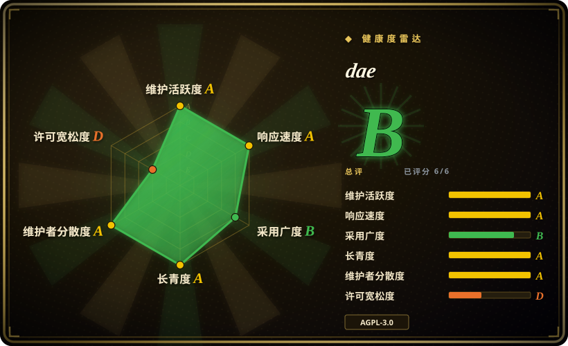
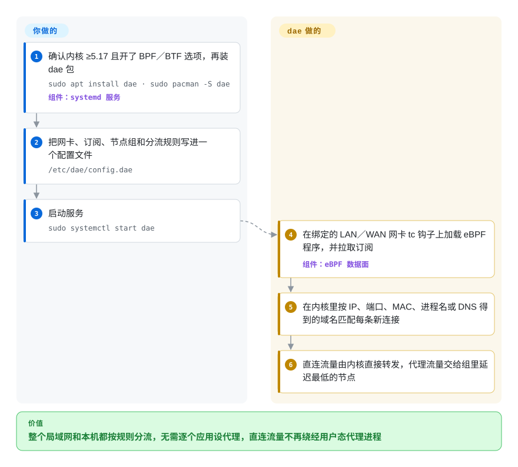

# dae

你在 Linux 软路由或电脑上开了透明代理，结果**所有**流量都要过一遍代理进程——连本该直连的国内视频也被搬进代理程序再搬出来，晚上全家一刷视频，路由器 CPU 就上去了，直连反而比不开代理还慢。dae 把“直连还是走代理”的判断放进 Linux 内核里、在数据包进协议栈之前就做完：直连流量根本不经过代理进程，只有分给节点的流量才交给用户态去转发。

## 何时使用

你管着家里或小办公室的网关——一台小主机、软路由，或者跑 Debian／Arch 的 x86 盒子——需要分流：国内网站和局域网服务直连，其余走订阅里的 Shadowsocks／Trojan／VLESS／Hysteria2 节点。用常见的用户态透明代理（Clash 系的 TUN 模式或 iptables TPROXY 方案）时，哪怕晚高峰的流量大多是国内“直连”，路由器 CPU 也明显忙着，因为每条直连连接照样被代理进程中转一遍。你装上 dae，写一个 `config.dae`：`routing {}` 里写 `dip(geoip:cn) -> direct`、`pname(...)`、`mac(...)`、`fallback: proxy`，再配一个按延迟选节点的节点组，绑定 LAN 和／或 WAN 网卡，启动 systemd 服务。

它胜过替代品的决定性取舍：分流逻辑是挂在 tc 钩子上的 eBPF 程序（一段由内核自己执行的小程序），所以“直连”真的是内核直接转发、没有用户态中转；而 mihomo／sing-box 会把截获的每条连接都经过自己的进程。你还能写别处不好写的规则——按局域网设备 MAC 地址、按本机进程名（在内核里读，不用扫 `/proc`）、按 TCP／UDP／IPv4／IPv6 分别测延迟选节点。代价是：只能跑在 Linux 上、内核要 5.17 以上、要 root 权限、只有配置文件没有界面；这些代价接受不了时，下面的替代品更合适。

## 怎么用起来

dae 是一个 Go 守护进程，加上它装进你内核的 eBPF 程序。启动时，它把 eBPF 程序挂到你所绑定网卡的 tc（流量控制）钩子上——这是数据包进入内核 TCP/IP 协议栈、被 iptables／nftables 看到之前的分拣点。**之后的事都归 dae，你只管配置文件。** 对每条新连接，内核里的程序用当场能读到的信息去匹配你的 `routing` 规则：IP、端口、TCP／UDP、局域网设备的 MAC 地址、本机进程名（通过 cgroup 钩子在 `connect`／`sendmsg` 时记下），以及域名——域名靠观察必须经过 dae 的 DNS 应答得到，或者在用户态短暂嗅探 TLS 的 SNI（握手里写明要访问的服务器名）／HTTP Host。判为 `direct` 的连接由内核像普通路由器一样直接转发；只有分到节点组的连接才交给 Go 进程，由它按实测延迟挑节点、用对应代理协议（Shadowsocks、VMess／VLESS、Trojan、Hysteria2、TUIC 等）转发出去。打个比方：大楼门口就有分拣台，寄给本小区的信根本不用送上楼去快递员的办公桌。`dae reload` 会换上新配置并刷新订阅，不断开已有连接。

<!-- flow-steps:begin (generated from flows/dae.json by tools/flow_card.py — do not edit) -->

流程文字版

1. **你**：确认内核 ≥5.17 且开了 BPF／BTF 选项，再装 dae 包 — `sudo apt install dae · sudo pacman -S dae` — 组件：`systemd 服务`
2. **你**：把网卡、订阅、节点组和分流规则写进一个配置文件 — `/etc/dae/config.dae`
3. **你**：启动服务 — `sudo systemctl start dae`
4. **dae**：在绑定的 LAN／WAN 网卡 tc 钩子上加载 eBPF 程序，并拉取订阅 — 组件：`eBPF 数据面`
5. **dae**：在内核里按 IP、端口、MAC、进程名或 DNS 得到的域名匹配每条新连接
6. **dae**：直连流量由内核直接转发，代理流量交给组里延迟最低的节点

**价值**：整个局域网和本机都按规则分流，无需逐个应用设代理，直连流量不再绕经用户态代理进程

<!-- flow-steps:end -->

## 何时不用

- **不是 Linux，或内核低于 5.17。** 绑定 LAN 或 WAN 需要内核 ≥5.17、带 BTF，还要一串 BPF／tc 编译选项，嵌入式发行版（OpenWrt、Armbian）常默认关掉其中一部分；macOS 只能在 Lima 虚拟机里跑，没有 Windows 版本（issue #899 仍开着）。桌面端、尤其 Windows／macOS，用基于 mihomo 的图形客户端，比如 [Clash Verge Rev](../dev-utilities/ops-infra/clash-verge-rev.zh.md)；手机上用基于 [sing-box](https://github.com/SagerNet/sing-box)（未收录）的应用。
- **你想让应用通过 SOCKS／HTTP 端口自己选择走代理。** dae 没有本地 SOCKS／HTTP 入站——它的 `tproxy_port` 在示例配置里写明“不是 HTTP／SOCKS 端口”，只给 eBPF 程序用。如果只想让 `curl` 或浏览器显式走代理，用 [mihomo](https://github.com/MetaCubeX/mihomo)（未收录）或 sing-box，它们提供混合入站端口。
- **你需要图形界面或网页面板。** dae 只有配置文件加 `systemctl`／`dae reload`。配套面板 [daed](https://github.com/daeuniverse/daed)（未收录）截至 2026-09-28 在 GitHub 上被标为**已归档**，尽管 2026-09-24 还有一次发版构建提交。需要持续维护的网页界面，同一批作者更早的 [v2rayA](https://github.com/v2rayA/v2rayA)（未收录）是选项；OpenWrt 上常见做法是 mihomo／sing-box 的 LuCI 插件（如 OpenClash，未收录）。
- **你依赖 fake-IP 或让 DNS 绕开这台机器。** 域名规则要求 DNS 应答经过 dae（或在默认 30 毫秒窗口内嗅探到 SNI）；不支持 fake-IP（issue #895 仍开着），客户端若用加密 DNS，域名分流会悄悄变弱。网络设计离不开 fake-IP 时，用 mihomo 或 sing-box。
- **机器是一台同时提供 UDP 服务的公网 VPS。** README 明确提醒：出站 UDP——包括你自己 Shadowsocks／Hysteria 服务端回给客户端的包——可能被路由到代理，必须加 `sport(...) -> must_direct` 规则。服务端机器应单独跑服务端程序，或把 [Xray-core](https://github.com/XTLS/Xray-core)（未收录）／sing-box 当服务端用，不要再叠一个客户端透明代理。
- **AGPL-3.0 与你的分发方式冲突。** 把 dae 塞进你要出货的固件或设备，会带上 AGPL 义务，而常见替代品同样是 copyleft：mihomo 的代理代码（`Meta` 发布分支、`Alpha` 开发分支以及各发布 tag）是 GPL-3.0——GitHub 给这个仓库显示的 MIT 来自默认的 `main` 分支，那里放的是一个无关的 Python 项目；sing-box 是 GPL-3.0-or-later 外加命名限制条款。需要宽松许可证时，看 [Xray-core](https://github.com/XTLS/Xray-core)（MPL-2.0，未收录）或 [v2ray-core](https://github.com/v2fly/v2ray-core)（MIT，未收录），两者都是用户态代理，没有 dae 那种内核内分流。
- **你要一个冻结、保守的网络栈。** v2 系列在配置不变的情况下改了默认值（`sniffing_timeout` 从 100 毫秒降到 30 毫秒、自动设置 `so_mark_from_dae`、默认 `bootstrap_resolver` 指向中国大陆的 DNS），v2.1.1 又合入了数据面／控制面的整体重写；每次升级前都要读 `CHANGELOGS.md`，或者锁定版本。

## 横向对比

| 替代品 | 是否收录 | 我们的评价 | 取舍 |
|---|---|---|---|
| [mihomo](https://github.com/MetaCubeX/mihomo) | 未收录 | 要跨平台的规则引擎、Clash 格式配置、fake-IP DNS、SOCKS／HTTP 入站和庞大的图形客户端生态，选 mihomo；机器是 Linux 网关、想砍掉直连流量的 CPU 开销时，选 dae。 | 得到可移植性、图形界面和 fake-IP；代价是所有被截获的连接（包括直连）都要经用户态中转。真实仓库，本批次未收录。 |
| [sing-box](https://github.com/SagerNet/sing-box) | 未收录 | 要一个手机、电脑、服务器通吃的代理平台（客户端和服务端两种角色、TUN 入站），选 sing-box；只有在内核直连转发要紧的 Linux 路由器／主机上才选 dae。 | 平台和协议覆盖最广、还能当服务端；所有流量走用户态 TUN，许可证是 GPL-3.0-or-later 加命名限制。真实仓库，本批次未收录。 |
| [v2rayA](https://github.com/v2rayA/v2rayA) | 未收录 | 想用网页面板管理、基于 v2ray／Xray、尽量少写配置的透明代理，选 v2rayA；更喜欢文本配置、要内核内分流时，选 dae（dae README 自称是它的继任者）。 | 有网页界面、沿用熟悉的 v2ray 内核；透明代理靠 iptables／nftables 加用户态内核实现。真实仓库，本批次未收录。 |
| [Clash Verge Rev](../dev-utilities/ops-infra/clash-verge-rev.zh.md) | ✅ | 在 Windows／macOS／Linux 桌面上要图形界面、切换配置和 TUN 模式，选 Clash Verge Rev；它是桌面客户端，不是局域网网关，而网关才是 dae 的主场。 | 各桌面系统点点鼠标即可；内置 mihomo 跑在用户态，没有内核内分流。 |
| [daed](https://github.com/daeuniverse/daed) | 未收录 | 截至 2026-09-28 在 GitHub 上已归档——只把它当设计参考；直接用配置文件跑 dae，若网页界面是硬需求就选 v2rayA。 | 基于 dae 本身的网页面板；归档仓库不再有后续修复。真实仓库，本批次未收录。 |

## 技术栈

- **语言：** 控制面用 Go（模块要求 Go 1.26）；数据面是编译成 eBPF 的 C 代码，通过 `cilium/ebpf` 以 CO-RE 方式加载（需要内核 BTF）。
- **内核钩子：** 绑定网卡上的 tc 入口／出口钩子负责分流；cgroupv2 socket 钩子取进程名；`dae trace` 用 kprobe（内核 ≥5.15，arm／mips／s390x 构建不含此功能）。
- **配置语言：** 自有的 `.dae` 语法，用 ANTLR4 语法文件（`dae-config-dist`）解析，分 `global`、`subscription`、`node`、`group`、`dns`、`routing` 几段。
- **协议实现：** 在组织自己的 `daeuniverse/outbound` 库（锁定的分叉版本）和分叉的 `quic-go` 里；DNS 用 `miekg/dns`，netlink 用 `vishvananda/netlink`。

## 依赖

- **Linux 内核 ≥5.17**（只用 `dae trace` 时 5.15 即可），需开启 `CONFIG_BPF`、`CONFIG_BPF_JIT`、`CONFIG_DEBUG_INFO_BTF`、`CONFIG_NET_CLS_BPF`、`CONFIG_NET_SCH_INGRESS`、kprobe、cgroup 等选项。
- **root／BPF 权限**；网关场景下“真直连”需要开 IP 转发；客户端的 DNS 要指向这台机器或被它路由。
- **地理数据：** `geoip:`／`geosite:` 规则需要 v2ray 格式的 `geoip.dat`／`geosite.dat`——发行版包或 NixOS 模块的 `assets` 会带上。
- **上游代理节点**——dae 是客户端，订阅或节点链接要你自己提供。
- **安装渠道：** daeuniverse 自建的 Debian／Ubuntu APT 源和 Fedora／RHEL／openSUSE RPM 源、Arch 官方仓库与 AUR、gentoo-zh、NixOS flake、Docker 镜像，自带 systemd 单元。

## 运维难度

**中等。** 从发行版包安装、启动 systemd 单元很快，功夫花在别处：核对内核配置（文档给了一行 grep 命令）、学会 `.dae` 的分流语法和 DNS 分流语法、让 DNS 真正经过 dae 以便域名规则生效。出错时影响整个网络——绑定 WAN 时主机防火墙过严、PVE 网桥、PPPoE 网卡、残留的 `/run/netns/daens` 各有一节排错文档；出现回环（dae 代理了它自己的上游，或你本机的代理程序）要加 `must_direct` 规则。日常运维很轻：`dae reload` 热加载配置并刷新订阅，`dae suspend` 暂停。升级要读变更日志，因为 v2 系列在配置不变时改过默认值。

## 健康度与可持续性

- **维护（2026-09-28）：活跃。** v2.1.1 于 2026-09-18 发布，v2.0.0 于 2026-07-08，v1.1.0 于 2026-04-23；2026-09 新增每日构建；最近推送 2026-09-25。稳定版一年几次，中间 PR 合入频繁。
- **治理／巴士因子：是组织，但核心作者在换人。** `daeuniverse` 组织在 CODEOWNERS 里设了 `governance`、`docs`、`release`、`infra` 几个团队。创始作者 mzz2017 占统计提交中的 556 次，但自 2025-02-20 起没有新提交；最近的数据面重写（“kdae full sync”，PR #1099）出自另一位贡献者（olicesx），默认分支最近 35 次提交分散在二十人左右。广度不错，但深层 eBPF 知识集中在少数人手里 [推断]。
- **背景与年龄／Lindy。** 创建于 2023-01（约 3.7 年），是 v2rayA（同一批作者，1.56 万 star，2026-09 仍有推送）的继任者。没有基金会或公司支持，属社区自治。年龄 × 仍活跃的判断：*在细分领域已站稳，但还谈不上 Lindy 级别*。
- **采用度。** 6.2k star／409 fork（2026-09-28）；进了 Arch 官方仓库、NixOS flake、gentoo-zh，还有自建 APT／RPM 源——对一个细分工具来说分发面相当可观。
- **风险信号。** AGPL-3.0。配套网页面板 daed 显示已归档（2026-09-28），未找到说明。协议实现依赖组织维护的分叉版本（`daeuniverse/outbound`、分叉的 `quic-go`），协议修复要经那个分叉进来。它的主要用途是绕过网络审查，运营者面临因司法辖区而异的法律风险 [推断]。

## 存疑（未验证）

- [未验证] “高性能”、直连几乎零损耗的说法来自 README 链接的一张 Google 表格基准；本页没有打开或复现它，与 mihomo／sing-box 的实际 CPU 差距取决于硬件和流量构成。
- [未验证] daed 为何归档，没找到任何说明；该仓库 2026-09-24 仍有提交，归档标记可能是刚加的或临时的。
- [未验证] mihomo 的许可证（GPL-3.0）读自 `Meta`、`Alpha` 两个分支和 `v1.19.32` tag 上的 `LICENSE` 文件，以及 `Meta` 分支的 README（2026-10-09）；默认的 `main` 分支放的是一个无关的 MIT 许可 Python 包，所以 GitHub API 报 MIT。Xray-core、v2ray-core 是否适合某种透明代理部署没有核对，只从 GitHub API 读了它们的许可证。
- [推断] “深层 eBPF 知识集中在少数人手里”是从数据面 PR 的提交作者推出来的，并非维护者的表态。
- [推断] 导语和“何时使用”里的 CPU 症状，是 README 所描述机制（直连流量绕过代理进程）的推论，不是在具体硬件上测出的结果。
- [推断] 绕过审查的法律风险随司法辖区而异，本页没有逐国调研。
- [推断] 6,249 star／409 fork／136 个未关闭 issue，数据截至 2026-09-28，会随时间变化。
