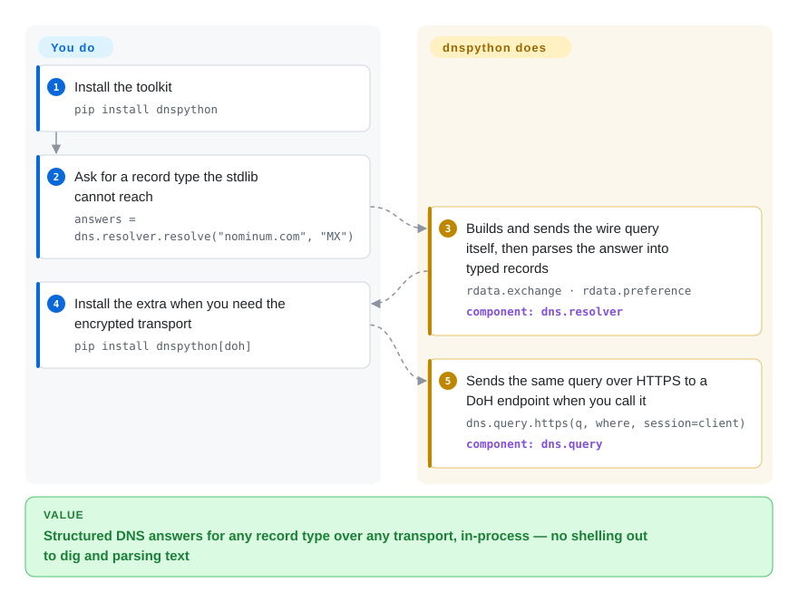

# dnspython

Python's standard library can only ask the OS resolver for A/AAAA records — need a host's MX records, a zone transfer, a DNSSEC-validating answer, or a query sent over DNS-over-HTTPS, and `socket.getaddrinfo()` has no way to say it. dnspython is a pure-Python toolkit that speaks the DNS protocol itself: typed record objects, any record type, any nameserver, and UDP/TCP plus the encrypted DoT/DoH/DoQ transports.

## When to use

You're building a Python service — a mail server's SPF/MX checker, a security tool that enumerates DNS records, a health-checker that must resolve a name a *specific* way — and the standard library's `socket.getaddrinfo()` is too blunt. It only does A/AAAA via the OS resolver; it can't query arbitrary record types, talk to a specific nameserver, do a zone transfer (AXFR), validate DNSSEC, or send a query over DNS-over-HTTPS. You `pip install dnspython`, then `dns.resolver.resolve('example.com', 'MX')` gives you structured `MX` records; `dns.query.https(...)` sends the query encrypted to a DoH endpoint; `dns.zone.from_xfr(dns.query.xfr(...))` pulls a whole zone. Records are real typed objects, not strings to re-parse. When you need to *construct* DNS — dynamic DNS updates with `dns.update`, TSIG-signed messages, or crafting raw wire-format packets — it gives you the full message model that the stdlib never exposes.

It's also the substrate under much of the Python networking/security ecosystem: when a tool needs to "do DNS properly" rather than shell out to `dig`, it almost always reaches for dnspython. Use it directly when you need typed records, non-default resolvers, modern encrypted transports, or zone/DNSSEC operations from Python.

## How it works

dnspython talks DNS itself instead of asking the operating system. You call a resolver function — `dns.resolver.resolve("nominum.com", "MX")` — and it builds the wire-format query, sends it to the nameservers it read from system config (or the ones you pin yourself), and parses the answer into typed records: an `MX` record arrives as an object with `.exchange` and `.preference` attributes, not a string you must re-split. The same message model works bottom-up: `dns.message.make_query(...)` crafts raw packets and the `dns.query` module picks the transport — UDP, TCP, TLS, HTTPS (`dns.query.https`), or experimental QUIC — where each encrypted transport needs its extra installed (`pip install dnspython[doh]`). Zone transfers, dynamic updates, TSIG signing, and DNSSEC validation are more uses of those same typed message/record objects. What stays yours: transport choice and its extra, timeouts and retries on flaky networks, and the meaning you attach to the records.

<!-- flow-steps:begin (generated from flows/dnspython.json by tools/flow_card.py — do not edit) -->

Text version of the flow

1. **You**: Install the toolkit — `pip install dnspython`
2. **You**: Ask for a record type the stdlib cannot reach — `answers = dns.resolver.resolve("nominum.com", "MX")`
3. **dnspython**: Builds and sends the wire query itself, then parses the answer into typed records — `rdata.exchange · rdata.preference` — component: `dns.resolver`
4. **You**: Install the extra when you need the encrypted transport — `pip install dnspython[doh]`
5. **dnspython**: Sends the same query over HTTPS to a DoH endpoint when you call it — `dns.query.https(q, where, session=client)` — component: `dns.query`

**Value**: Structured DNS answers for any record type over any transport, in-process — no shelling out to dig and parsing text

<!-- flow-steps:end -->

## When NOT to use

- **You only need a basic forward lookup.** For "give me the IP of this host," `socket.getaddrinfo()` / `socket.gethostbyname()` is simpler, uses the OS resolver (and `/etc/hosts`), and adds no dependency — the dnspython README says exactly this.
- **You rely on `/etc/hosts` or OS resolver behavior.** dnspython talks DNS directly and **does not consult `/etc/hosts`** — the README states "`/etc/hosts` is thus not used" outright — and it doesn't follow your OS resolver config the way the system resolver does; results can legitimately differ from `ping`/`getent`.
- **You're not on Python 3.10+.** The README states "dnspython supports Python 3.10 and later" (Python 2 support ended at 1.16.0, and PyPI metadata for 2.8.0 pins `requires_python >=3.10`); on older interpreters you're stuck on old releases.
- **You want a command-line DNS tool.** It's a *library*, not a CLI — for interactive lookups `dig`/`drill`/`kdig` are the right tools; dnspython is for code.
- **You expect DNSSEC/DoH/DoQ with zero extra deps.** The core is pure-Python, but DNSSEC needs `cryptography`, DoH needs `httpx`, IDNA needs `idna`, DoQ is experimental — install the right extras and treat DoQ as not-yet-stable.

## Comparison

| Alternative | In index | Our verdict | Tradeoff |
|---|---|---|---|
| `socket.getaddrinfo` (stdlib) | 未收录 | Choose `socket.getaddrinfo` when zero dependencies and OS resolver behavior matter more than DNS protocol control. | Uses `/etc/hosts` and system config, but only covers basic forward host-to-address lookups. |
| `dig` / `drill` / `kdig` (CLI) | 未收录 | Choose CLI tools when the job is interactive DNS debugging from a shell, not in-process Python logic. | Full-featured for humans, but a subprocess to parse rather than a typed Python API. |
| aiodns / pycares | 未收录 | Choose aiodns or pycares when async lookup speed is enough and you do not need dnspython's full record/message model. | Thin C-Ares lookup layer, not a zone/DNSSEC/custom-message toolkit. |
| `getdns` Python bindings | 未收录 | Choose getdns bindings when stub-resolver and DNSSEC features from the getdns C library justify a native dependency. | Smaller Python ecosystem than dnspython and more native-library coupling. |

## Tech stack

- **Language:** pure Python core (the typed record/message model, resolver, transports are Python).
- **Transports:** UDP, TCP, DNS-over-TLS (DoT), DNS-over-HTTPS (DoH, via httpx), and experimental DNS-over-QUIC (DoQ).
- **Async:** supports both **asyncio** (stdlib) and **Trio** (optional extra) alongside the synchronous API.
- **Crypto/DNSSEC:** DNSSEC validation/signing via the **`cryptography`** package when installed.

## Dependencies

- **Runtime:** Python **3.10+**; the core needs no third-party packages — the README states the default installation depends on nothing outside the standard library. Optional extras pull in (per PyPI metadata, 2026-09): `cryptography` (DNSSEC), `httpx` + `httpcore` + `h2` (DoH), `aioquic` (DoQ), `idna` (IDNA), `trio` (Trio async), `wmi` (Windows resolver config, Windows-only).
- **External services:** none of its own — it talks to whatever DNS servers/resolvers you target.
- **Install:** `pip install dnspython` (or `pip install dnspython[doh,dnssec,idna]` for combinations of extras).

## Ops difficulty

**Low (as a library).** Nothing to deploy — `pip install` and import. The operational nuance is in *correct usage*: choosing the right transport (and installing its extra), setting timeouts/retries on flaky networks, deciding whether to honor the system resolver vs query a fixed server, and remembering it bypasses `/etc/hosts` (so test environments that rely on hosts-file overrides won't behave as with the OS resolver). DNSSEC and DoQ paths carry extra dependency/maturity considerations. For typical resolution it's effectively zero-ops; the care is in DNS semantics, not deployment.

## Health & viability

- **Responsiveness**: Grade A — median first-response time 31.5 hours across 19 qualifying issues/PRs.
- **Maintenance (2026-09).** Repo pushed 2026-09-27 (GitHub API) and the README on `main` now calls itself "the development version of dnspython 2.9.0" — commits continue toward the next release even though the latest published release is still **v2.8.0 (2025-09-07)**, after 2.7.0 (2024-10) and 2.6.1 (2024-02): a roughly annual feature-release cadence, **actively maintained**, not archived. Open issue+PR count is at 1 (GitHub API), signaling tight triage.
- **Governance / bus factor.** Owner type is **User** (Bob Halley / rthalley, ~1,850 commits) with a meaningful second contributor (bwelling, ~200) and dependabot — a **single-primary-maintainer** project, so bus factor is the main governance caveat despite long, careful upkeep. [推断]
- **Age & Lindy verdict.** Created **2011**, ~15 years old and **still actively releasing** ⇒ a **strong Lindy** signal: it is the de-facto Python DNS library, depended on across the security/networking ecosystem. [推断]
- **Adoption.** ~2.7k stars (2,677, GitHub API 2026-09) and 215,925,023 PyPI downloads/month (health scorer) — very heavy transitive use (mail, security, infra tools that "do DNS properly" use it); excellent docs at dnspython.readthedocs.io.
- **Risk flags.** **ISC** license (README badge and LICENSE file; GitHub's API reports `NOASSERTION`); ISC is a permissive, MIT-equivalent license, no relicense history found. The single-maintainer concentration is the standing risk. [推断]

## Caveats (unverified)

- [未验证] License is **ISC** per the repo's LICENSE file and README badge; GitHub's API returned `NOASSERTION` (it didn't auto-classify it) — confirmed by reading the file, but re-verify if it matters legally.
- [未验证] ~2,677 stars / ~577 forks / ~1 open issue+PR as of 2026-09 (GitHub API) — date-sensitive, indicative only.
- [推断] The optional-extras mapping is from PyPI metadata for 2.8.0 (retrieved 2026-09-28); exact extra names/requirements can shift between releases (the `main` branch already targets 2.9.0).
- [推断] DoQ (DNS-over-QUIC) is documented as experimental by the README ("try the experimental DNS-over-QUIC code") — treat its stability/API as not guaranteed.
- [未验证] The ~1,850 / ~200 commit split (rthalley vs bwelling) dates from the 2026-06 pass and was not re-counted this pass; directionally single-maintainer either way.
