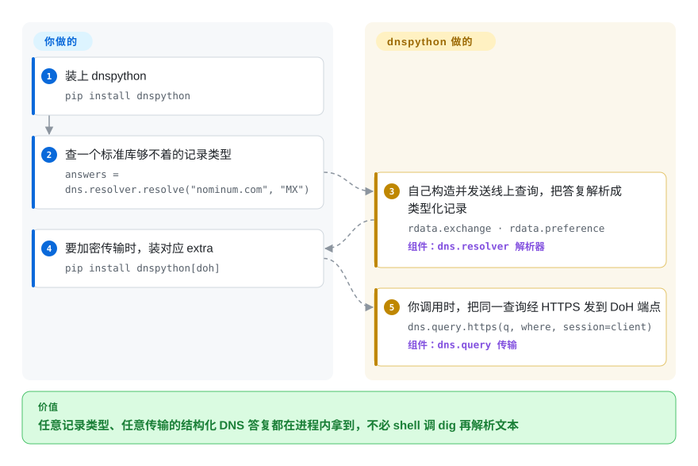

# dnspython

标准库只能经系统解析器查 A/AAAA——要 MX 记录、区域传送、DNSSEC 验证的答复，或把查询经 DNS-over-HTTPS 发出，`socket.getaddrinfo()` 都开不了口。dnspython 是自己讲 DNS 协议的纯 Python 工具包：记录是类型化对象，可查任意记录类型、对任意服务器发问，除 UDP/TCP 还支持 DoT/DoH/DoQ 加密传输。

## 何时使用

你在构建一个 Python 服务——邮件服务器的 SPF/MX 检查器、枚举 DNS 记录的安全工具、必须以*特定*方式解析某个名字的健康检查器——而标准库的 `socket.getaddrinfo()` 太钝了。它只经 OS 解析器做 A/AAAA；它没法查任意记录类型、没法对指定 nameserver 发问、没法做区域传送（AXFR）、没法验证 DNSSEC，也没法把查询经 DNS-over-HTTPS 发出。你 `pip install dnspython`，然后 `dns.resolver.resolve('example.com', 'MX')` 给你结构化的 `MX` 记录；`dns.query.https(...)` 把查询加密发到 DoH 端点；`dns.zone.from_xfr(dns.query.xfr(...))` 拉下整个 zone。记录是真正的类型化对象，不是要重新解析的字符串。当你需要*构造* DNS——用 `dns.update` 做动态 DNS 更新、TSIG 签名报文，或手工拼裸 wire-format 包——它给你标准库从不暴露的完整报文模型。

它也是大半个 Python 网络/安全生态的底座：当一个工具需要「正经地做 DNS」而非 shell 调 `dig`，它几乎总会选 dnspython。当你需要类型化记录、非默认解析器、现代加密传输，或在 Python 里做 zone/DNSSEC 操作时，直接用它。

## 怎么用起来

dnspython 自己讲 DNS，不经系统解析器。你调一个解析函数——`dns.resolver.resolve("nominum.com", "MX")`——它构造 wire-format 查询、发给从系统配置读来的（或你钉死的）nameserver，再把答复解析成类型化记录：`MX` 记录回来时是带 `.exchange` 与 `.preference` 属性的对象，不是要你再拆的字符串。同一套报文模型也能自下而上地用：`dns.message.make_query(...)` 手拼裸包，`dns.query` 模块决定传输——UDP、TCP、TLS、HTTPS（`dns.query.https`）或实验性的 QUIC——每个加密传输都要装对应 extra（`pip install dnspython[doh]`）。区域传送、动态更新、TSIG 签名、DNSSEC 验证，都是同一套类型化报文/记录对象的不同用法。留给你的：传输选择与它的 extra、不稳网络下的超时与重试，以及对拿到记录后的解读。

<!-- flow-steps:begin (generated from flows/dnspython.json by tools/flow_card.py — do not edit) -->

流程文字版

1. **你**：装上 dnspython — `pip install dnspython`
2. **你**：查一个标准库够不着的记录类型 — `answers = dns.resolver.resolve("nominum.com", "MX")`
3. **dnspython**：自己构造并发送线上查询，把答复解析成类型化记录 — `rdata.exchange · rdata.preference` — 组件：`dns.resolver 解析器`
4. **你**：要加密传输时，装对应 extra — `pip install dnspython[doh]`
5. **dnspython**：你调用时，把同一查询经 HTTPS 发到 DoH 端点 — `dns.query.https(q, where, session=client)` — 组件：`dns.query 传输`

**价值**：任意记录类型、任意传输的结构化 DNS 答复都在进程内拿到，不必 shell 调 dig 再解析文本

<!-- flow-steps:end -->

## 何时不用

- **你只需要基础的正向查询。** 要「给我这台主机的 IP」，`socket.getaddrinfo()` / `socket.gethostbyname()` 更简单、用 OS 解析器（和 `/etc/hosts`）、不加依赖——dnspython 的 README 白纸黑字就是这么说的。
- **你依赖 `/etc/hosts` 或 OS 解析器行为。** dnspython 直接说 DNS，**不查 `/etc/hosts`**——README 明言「`/etc/hosts` is thus not used」——也不像系统解析器那样读你的 OS 解析配置；结果与 `ping`/`getent` 不一致是合理的。
- **你不在 Python 3.10+ 上。** README 写明「dnspython supports Python 3.10 and later」（Python 2 支持止于 1.16.0，2.8.0 的 PyPI 元数据也钉 `requires_python >=3.10`）；旧解释器上你只能停在老版本。
- **你想要一个命令行 DNS 工具。** 它是*库*，不是 CLI——交互式查询用 `dig`/`drill`/`kdig` 才对；dnspython 是给代码用的。
- **你指望 DNSSEC/DoH/DoQ 零额外依赖。** 核心是纯 Python，但 DNSSEC 需要 `cryptography`、DoH 需要 `httpx`、IDNA 需要 `idna`、DoQ 是实验性的——装对 extra，并把 DoQ 当作尚不稳定。

## 横向对比

| 替代品 | 是否收录 | 我们的评价 | 取舍 |
|---|---|---|---|
| `socket.getaddrinfo`（标准库） | 未收录 | 零依赖和 OS 解析器行为比 DNS 协议控制更重要时，选 `socket.getaddrinfo`。 | 它使用 `/etc/hosts` 和系统配置，但只覆盖基础主机名到地址的正向查询。 |
| `dig` / `drill` / `kdig`（CLI） | 未收录 | 任务是 shell 里的交互式 DNS 调试，而不是进程内 Python 逻辑时，选 CLI 工具。 | 对人类调试功能完整，但它是要解析的 subprocess，不是类型化 Python API。 |
| aiodns / pycares | 未收录 | 异步查询速度已经足够，且不需要 dnspython 的完整记录／报文模型时，选 aiodns 或 pycares。 | 它是薄 C-Ares 查询层，不是 zone、DNSSEC 或自定义报文工具包。 |
| `getdns` Python 绑定 | 未收录 | getdns C 库的 stub-resolver 和 DNSSEC 特性值得引入原生依赖时，选 getdns 绑定。 | Python 生态比 dnspython 小，且更依赖原生库。 |

## 技术栈

- **语言：** 纯 Python 核心（类型化的记录/报文模型、解析器、传输都是 Python）。
- **传输：** UDP、TCP、DNS-over-TLS（DoT）、DNS-over-HTTPS（DoH，经 httpx），以及实验性的 DNS-over-QUIC（DoQ）。
- **异步：** 在同步 API 之外，同时支持 **asyncio**（标准库）和 **Trio**（可选 extra）。
- **加密/DNSSEC：** 装了 **`cryptography`** 包时经它做 DNSSEC 验证/签名。

## 依赖

- **运行时：** Python **3.10+**；核心不需要第三方包——README 明言默认安装只依赖标准库。可选 extra 会拉入（按 2026-09 的 PyPI 元数据）：`cryptography`（DNSSEC）、`httpx` + `httpcore` + `h2`（DoH）、`aioquic`（DoQ）、`idna`（IDNA）、`trio`（Trio 异步）、`wmi`（Windows 解析配置，仅 Windows）。
- **外部服务：** 自身没有——它对你指定的任何 DNS 服务器/解析器发问。
- **安装：** `pip install dnspython`（或按需组合 extra，如 `pip install dnspython[doh,dnssec,idna]`）。

## 运维难度

**低（作为库）。** 没有要部署的东西——`pip install` 后 import 即可。运维上的微妙处在*正确使用*：选对传输（并装它的 extra）、在不稳网络上设超时/重试、决定是遵循系统解析器还是查固定服务器，并记住它绕过 `/etc/hosts`（所以靠 hosts 文件覆盖的测试环境不会像 OS 解析器那样表现）。DNSSEC 和 DoQ 路径带额外的依赖/成熟度考量。对典型解析它基本零运维；要在意的是 DNS 语义，而非部署。

## 健康度与可持续性

- **响应速度**：Grade A——中位首次响应时间 31.5 小时，基于 19 个 qualifying issues/PRs。
- **维护（2026-09）。** 仓库 push 于 2026-09-27（GitHub API），`main` 上 README 自称「the development version of dnspython 2.9.0」——提交仍在为下个版本推进，尽管最新已发布版本仍是 **v2.8.0（2025-09-07）**，之前是 2.7.0（2024-10）和 2.6.1（2024-02）——约一年的特性发布节奏，**在积极维护**，未归档。open issue+PR 数只有 1（GitHub API），处理很紧。
- **治理 / bus factor。** owner 类型为 **User**（Bob Halley / rthalley，约 1,850 次提交），有一位有分量的第二贡献者（bwelling，约 200）和 dependabot——一个**单一主维护者**项目，所以尽管长期细心打理，bus factor 仍是主要治理存疑点。[推断]
- **年龄与 Lindy 判断。** **2011** 年创建，约 15 岁且**仍在积极发布**⇒ **强 Lindy** 信号：它是事实上的 Python DNS 库，被安全/网络生态广泛依赖。[推断]
- **采用度。** 约 2.7k star（2,677，GitHub API 2026-09），PyPI 月下载 215,925,023（健康度评分器）——传递使用极重（邮件、安全、要「正经做 DNS」的基础设施工具都用它）；dnspython.readthedocs.io 文档优秀。
- **风险标记。** **ISC** 许可（README 徽章与 LICENSE 文件；GitHub API 报的是 `NOASSERTION`）；ISC 是宽松的、等价 MIT 的许可，未发现 relicense 历史。单一维护者集中是长期风险。[推断]

## 存疑（未验证）

- [未验证] 依仓库 LICENSE 文件与 README 徽章，许可为 **ISC**；GitHub API 返回 `NOASSERTION`（它没自动分类）——已通过读文件确认，但若涉及法律请再核。
- [未验证] 截至 2026-09 约 2,677 star / 约 577 fork / 约 1 个 open issue+PR（GitHub API）——对时间敏感，仅供参考。
- [推断] 可选 extra 的映射来自 2.8.0 的 PyPI 元数据（2026-09-28 取回）；确切的 extra 名称/要求会在版本间变动（`main` 已在做 2.9.0）。
- [推断] DoQ（DNS-over-QUIC）被 README 标注为实验性（「try the experimental DNS-over-QUIC code」）——把它的稳定性/API 当作不作保证。
- [未验证] rthalley 约 1,850 次提交 / bwelling 约 200 次的分布是 2026-06 一跑的数字，本轮未重数；方向上仍是单一主维护者。
