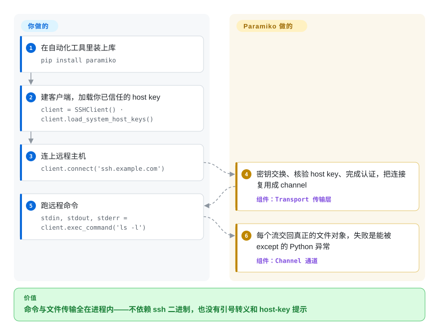

# Paramiko

部署脚本要登上两百台主机跑 `df`——用 subprocess 调系统 `ssh` 意味着引号转义、host-key 交互提示和一堆要解析的 stderr。Paramiko 用纯 Python 实现了 SSHv2：`SSHClient` 连上后，`exec_command()` 直接交回真正的 stdin/stdout/stderr 文件对象，`open_sftp()` 传文件，失败是能被 except 的 Python 异常——全程在进程内，容器里不必装任何 SSH CLI。

## 何时使用

你在写一个 Python 自动化工具——部署脚本、网络设备采集器、CI 步骤——它得通过 SSH 登录远程主机、跑命令、把文件拉回来。你不想 `subprocess` 系统的 `ssh` 客户端（脆弱的引号转义、host-key 交互提示、没有结构化错误处理），也不想依赖容器里装着某个 CLI。你 `pip install paramiko`，打开一个 `SSHClient`，用 key 或密码 `connect()`，于是你就有了可编程的 `exec_command()`——返回真正的 stdin/stdout/stderr 文件对象——外加一个 `open_sftp()` 通道做上传下载，全程进程内，抛出你能捕获并重试的 Python 异常。当你需要精细控制时——自定义 `Transport`、端口转发、agent 转发，甚至用 Python 起一个 SSH*服务端*——Paramiko 把上层工具所依赖的协议层暴露给你。

它也是你间接继承下来的底座：README 自述 Paramiko 是「高层 SSH 库 Fabric 的基础」，Ansible 的 SSH 连接插件历史上也用它（现在的 Ansible 在可用时更偏好 libssh）。排查这些工具的连接行为时，理解 Paramiko 就值回票价。当你想要的是一个库而非一个框架时——原始的 SSH/SFTP 传输、归你代码所有——直接选 Paramiko。

## 怎么用起来

Paramiko 在 Python 里实现了完整的 SSHv2 协议栈。`connect()` 时会做密钥交换——协商流量怎么加密、并拿 known-hosts 数据核验服务器的 host key——然后用密码、私钥或 agent 完成认证。认证之后，单条 TCP 连接被复用成若干 **channel**（一条连接里的虚拟数据流）：`exec_command()` 为远程命令开一个 channel，返回它的 stdin/stdout/stderr 文件对象；`open_sftp()` 开的 channel 跑 SFTP 子系统来传文件。真正的加密原语不是 Paramiko 自己写的——都来自 `cryptography` 包（原生后端）。每个 `Transport` 跑一个后台线程，这就是它线程/阻塞（而非 asyncio）模型的由来。留给你的：host-key 策略（默认是*拒绝*未知 key，`AutoAddPolicy` 要自己显式开）、连接生命周期与清理、超时/keepalive，以及跨机器的连接池与重试——Fabric 那类编排是盖在这层传输之上的。

<!-- flow-steps:begin (generated from flows/paramiko.json by tools/flow_card.py — do not edit) -->

流程文字版

1. **你**：在自动化工具里装上库 — `pip install paramiko`
2. **你**：建客户端，加载你已信任的 host key — `client = SSHClient() · client.load_system_host_keys()`
3. **你**：连上远程主机 — `client.connect('ssh.example.com')`
4. **Paramiko**：密钥交换、核验 host key、完成认证，把连接复用成 channel — 组件：`Transport 传输层`
5. **你**：跑远程命令 — `stdin, stdout, stderr = client.exec_command('ls -l')`
6. **Paramiko**：每个流交回真正的文件对象，失败是能被 except 的 Python 异常 — 组件：`Channel 通道`

**价值**：命令与文件传输全在进程内——不依赖 ssh 二进制，也没有引号转义和 host-key 提示

<!-- flow-steps:end -->

## 何时不用

- **你只需要跑几个远程任务，而非实现 SSH。** Paramiko 自己的 README 就推荐把「跑远程 shell 命令、传文件」这类常见客户端场景交给 **Fabric**，并说直接使用 Paramiko「只适合需要底层原语、或要在 Python 里跑 sshd 的用户」。直接用它意味着连接、host key 和线程都得你自己管。
- **你需要最高吞吐 / 与原生 OpenSSH 对齐。** 作为纯 Python，Paramiko 在批量 SFTP 传输上比 C 写的 OpenSSH 客户端慢，也不一定能匹配 OpenSSH 的每一个配置项、cipher 或 `~/.ssh/config` 细节。大量文件搬运走真客户端的 `rsync`/`scp` 可能更快。
- **你必须继续连老 SSH 服务端。** 4.x/5.x 大版本激进移除旧密码学：4.0.0（2025-08）移除 DSA key；5.0.0（2026-05）移除 SHA-1 RSA 签名（`"ssh-rsa"` 算法标识）、SHA-1 密钥交换（`diffie-hellman-group1*-sha1`）和 GSSAPI——changelog 明确警告这些是向后不兼容变更，对无法控制的老主机建议留在 3.x。只实现这些算法的老旧网络设备与嵌入式 SSH 栈，从 5.x 起连不上。
- **你需要某个很新的加密算法或 OpenSSH 特性首日可用。** Paramiko 在较新算法上历来落后 OpenSSH——比如混合后量子 ML-KEM 密钥交换 2026-08-09 才合入 `main`，截至 2026-09 仍未随任何版本发布（最新仍是 5.0.0）。请核实你需要的 KEX/cipher/host-key 算法在你锁定的版本里被支持。
- **LGPL-2.1 对你的分发模式有问题。** Paramiko 是 **LGPL-2.1**，而非 Python 生态常见的 MIT/BSD。对多数应用（动态链接 / pip 导入）这没问题，但若你做静态打包或有严格许可政策，请审查。[推断]
- **你要 async 原生的 I/O。** Paramiko 面向线程/阻塞；要 asyncio 原生的 SSH，**AsyncSSH** 是为此打造的替代品。

## 横向对比

| 替代品 | 是否收录 | 我们的评价 | 取舍 |
|---|---|---|---|
| AsyncSSH | 未收录 | 代码库是 asyncio 原生，并希望 SSH 客户端/服务端 API 围绕 `await` 设计时，选 AsyncSSH。 | asyncio 原生的 SSHv2 客户端+服务端，现代算法支持广；更适合 async 代码库，但 API 不同（基于 await）且依赖它的生态更小。 |
| Fabric | 未收录 | 任务是「在这些主机上跑这条命令」时就选 Fabric——Paramiko 自己的 README 把常见客户端场景推荐给它，并说直接使用 Paramiko 只适合要底层原语或在 Python 里跑 sshd 的人。 | 构建*在* Paramiko 之上的高层远程执行框架；做任务编排很好，但它是上面那层，不是传输库。 |
| `subprocess` + 系统 `ssh` | 未收录 | 零 Python 依赖和完全 OpenSSH 对齐比稳健 Python API 更重要时，选系统 `ssh`。 | 零 Python 依赖、与 OpenSSH 完全对齐，但脆弱（文本解析、引号、host-key 提示），且要求 `ssh` 二进制存在。 |
| libssh2 / ssh2-python | 未收录 | 传输速度和 C 后端依赖比 Python 风格 API 更重要时，选 libssh2 绑定。 | C 库绑定——传输更快，但带一个编译依赖、Python 风格的 API 更薄。 |
| [`sshtunnel`](sshtunnel.zh.md) | ✅ | 只需要一个薄 Paramiko 封装来做端口转发隧道时，选 sshtunnel。 | 一个只做端口转发隧道的薄 Paramiko*封装*——范围更窄，建在同一引擎上。 |

## 技术栈

- **语言：** 纯 Python（自身无 C 扩展）。
- **加密：** 依赖 **`cryptography`** 包（并经它依赖 OpenSSL）来做 cipher、密钥交换和密钥处理——真正的原语是经由这个依赖走原生代码。
- **协议面：** SSHv2 传输、认证（密码/公钥/键盘交互；GSS-API 支持已在 5.0.0（2026-05）移除）、channel、`exec`/`shell`、SFTP 子系统，以及一个 SSH*服务端*实现。后量子 ML-KEM 混合密钥交换已合入 `main`（2026-08），截至 2026-09 尚未发布。
- **并发模型：** 线程/阻塞 socket；每个 `Transport` 跑一个后台线程。

## 依赖

- **运行时：** Python **>=3.9**（5.0.0 的 PyPI 元数据）；核心安装依赖是 **`bcrypt>=3.2`、`cryptography>=3.3`、`invoke>=2.0`、`pynacl>=1.5`**——`invoke` 在 4.0.0（2025-08）起成为核心依赖，`[all]`/`[invoke]` extra 同时被移除。真正的加密原语经 `cryptography` 的原生（OpenSSL 后端）wheel 提供。
- **外部服务：** 自身没有——你把它指向你已经在跑的任何 SSH 服务端。
- **构建/安装：** `pip install paramiko`；唯一非纯 Python 的部分是 `cryptography` 的原生后端。

## 运维难度

**低（作为库）。** 没有要部署的东西——它就是在你应用里 `pip install paramiko`。运维上的摩擦在*使用*层面：host-key 校验策略（生产里别无脑 `AutoAddPolicy`）、线程/连接的生命周期与清理、长连接上的超时与 keepalive，以及锁版本——因为 `cryptography` 依赖和受支持算法会随时间变。长跑的多主机自动化需要你自己做连接池和错误处理，因为 Paramiko 给你的是传输，不是编排。

## 健康度与可持续性

- **响应速度**：Grade C——中位首次响应时间 265.0 小时，基于 10 个 qualifying issues/PRs。
- **维护（2026-09）。** 仓库最后 push 于 2026-08-29（GitHub API），**活跃**，未归档。发布走 **PyPI**——GitHub Releases 列表为空（本轮 API 复核），但近期版本的 git tag 存在；节奏：3.5.1（2025-02）→ 4.0.0（2025-08）→ **5.0.0（2026-05-09）**。大版本在设计上是安全优先的（DSA、SHA-1 签名/KEX、GSSAPI 都带 changelog 警告地移除了），代价是升级颠簸。
- **治理 / bus factor。** 归 **`paramiko` 组织**，但历史上压倒性地由一位维护者驱动（**bitprophet** / Jeff Forcier）——尽管有组织外壳，这仍是真实的 **bus-factor** 考量。[推断]
- **年龄与 Lindy 判断。** **2009** 年创建，约 17 岁且**仍活跃**⇒ **强 Lindy** 信号：它是事实上的 Python SSH 库，被 Fabric 和一大片 Python 基础设施工具依赖。[推断]
- **采用度。** 约 9.9k star（9,863，GitHub API 2026-09）、约 2,080 fork，加上经由下游工具（Fabric 及其生态）的巨量传递使用——采用度毋庸置疑。约 1.2k 个 open issue/PR（API 口径，2026-09）反映的是庞大的面和悠久历史，而非弃坑。
- **风险标记。** **LGPL-2.1**（在该生态里少见——做静态链接/严格政策分发时需审查）、单一维护者集中度，以及**约 10 个月内两个大版本（4.0、5.0）移除了旧密码学**——要连老设备可能得无限期钉在 3.x。作为 SSH/加密库它也是安全敏感依赖——跟踪它的安全公告并保持 `cryptography` 更新。[推断]

## 存疑（未验证）

- [未验证] 截至 2026-09 约 9,863 star / 约 2,080 fork / 约 1,199 个 open issue+PR（GitHub API）——数字对时间敏感，仅供参考；open 数含 pull request。
- [推断] Ansible 与 libssh 的细节（现版本 Ansible 的 `ssh` 连接插件可能更偏好 libssh 而非 Paramiko）来自生态常识，本轮未对 Ansible 文档复核。
- [推断] 留在 3.x 与升到 4.x/5.x 之间超出 changelog 清单的行为差异，未做实机对照。
- [推断] LGPL-2.1 相对你分发模式的义务是法律判断，这里不断言它是阻断项。
- [推断] ML-KEM 后量子密钥交换合入 `main` 有提交日期为证（2026-08-09/2026-08-29），「尚未发布」则是从 2026-09-28 时 PyPI 最新仍为 5.0.0 推得；下个版本可能改变这一状态。
