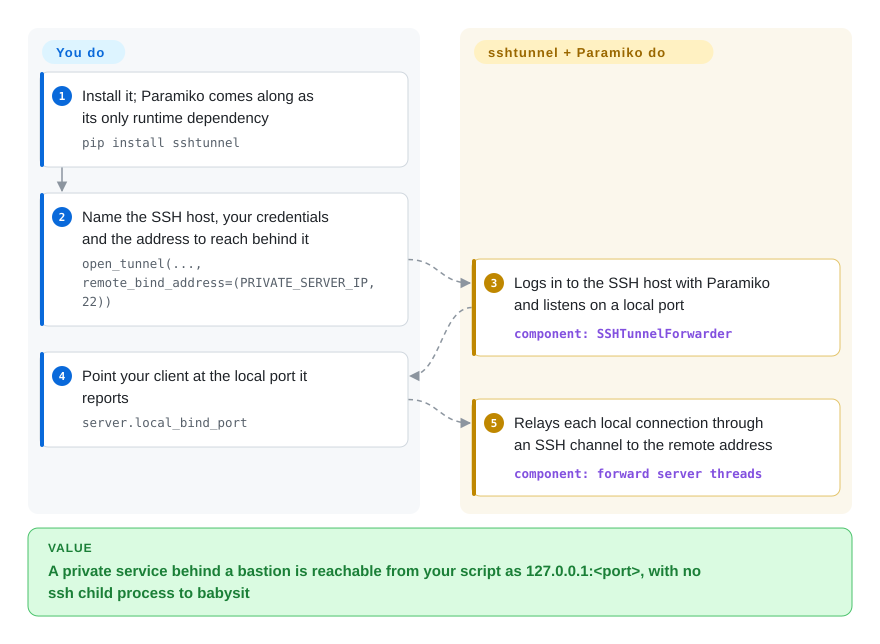

# sshtunnel

Your Python script needs a database that only answers inside a private network, so you spawn `ssh -L 5432:db.internal:5432 bastion` as a child process and sleep until the port seems to be up — then clean up the stray `ssh` when the script crashes. sshtunnel does the port forwarding inside your own process: a `with` block opens a local port that leads through the SSH host to the private service, and closes it when the block ends.

## When to use

You're writing a Python script that needs to talk to a Postgres (or Redis, or an internal HTTP API) that lives inside a private network, reachable only by SSH through a bastion host. Doing this by hand means spawning `ssh -L 5432:db.internal:5432 bastion` in a subprocess and racing to know when the tunnel is up; when your script dies on an exception, the `ssh` child stays behind holding the port, and the next run fails with `Address already in use`. Instead you wrap it: `with SSHTunnelForwarder(('bastion', 22), ssh_username=..., remote_bind_address=('db.internal', 5432)) as tunnel:` and point your DB client at `127.0.0.1:tunnel.local_bind_port`. The tunnel opens on entry, tears down on exit, and the bound local port comes back as a Python value.

It fits throwaway automation and data scripts: a one-off migration that must hit a DB behind a bastion, a notebook pulling from an internal service, a test fixture. Pick it over raw [Paramiko](paramiko.md) when you want forwarding without writing the socket-relay loop yourself, and over a subprocess `ssh -L` when the tunnel's lifetime should follow your Python code's lifetime. In 2026, go in knowing it is barely maintained and needs `paramiko<4` pinned (see When NOT to use).

## How it works

sshtunnel is one Python module on top of Paramiko, a pure-Python implementation of the SSH protocol. When you start a forwarder, it logs in to the SSH host through Paramiko, then opens a local listening socket (a port on `127.0.0.1` or an address you choose). **For every connection your client makes to that port, it asks the SSH host to open a "direct-tcpip" channel** — SSH's built-in way of saying "connect onward to this host:port for me" — and copies bytes both ways on background threads. **You supply** the SSH address, the credentials (password, key file, or agent keys it can load from `~/.ssh`), and the remote address to reach; **you then use** `local_bind_port` like any local service. It sends SSH keepalives every 5 seconds by default, but it does not reconnect a dropped session — that is your code's job. A `python -m sshtunnel` CLI exposes the same thing for shell use.

<!-- flow-steps:begin (generated from flows/sshtunnel.json by tools/flow_card.py — do not edit) -->

Text version of the flow

1. **You**: Install it; Paramiko comes along as its only runtime dependency — `pip install sshtunnel`
2. **You**: Name the SSH host, your credentials and the address to reach behind it — `open_tunnel(..., remote_bind_address=(PRIVATE_SERVER_IP, 22))`
3. **sshtunnel**: Logs in to the SSH host with Paramiko and listens on a local port — component: `SSHTunnelForwarder`
4. **You**: Point your client at the local port it reports — `server.local_bind_port`
5. **sshtunnel**: Relays each local connection through an SSH channel to the remote address — component: `forward server threads`

**Value**: A private service behind a bastion is reachable from your script as 127.0.0.1:<port>, with no ssh child process to babysit

<!-- flow-steps:end -->

## When NOT to use

- **⚠ A fresh `pip install sshtunnel` breaks on current Paramiko.** The latest release (0.4.0, January 2021) declares `paramiko>=2.7.2` with no upper bound and references `paramiko.DSSKey` in the key loading that runs when a forwarder is constructed; Paramiko 4.0 (August 2025) removed DSA keys, so on Paramiko 4.x/5.x creating a forwarder raises `AttributeError: module 'paramiko' has no attribute 'DSSKey'`. Reported in issues #302/#309; fix PRs #303/#307/#316 were still unmerged on 2026-10-08. If you must use it, pin `paramiko<4` — which means forgoing Paramiko's newer security releases. For new code, write the forward directly on [Paramiko](paramiko.md) (`Transport.open_channel('direct-tcpip', ...)`) or use AsyncSSH's forwarding API.
- **You need a maintained dependency.** No release since 2021, and no commit on the default branch since 2025-08-27; the maintainer pushed CI repair work to a side branch on 2026-10-08, which may be the start of a revival but is not a release. Treat it as abandonment-risk: vendor the single module or pick a maintained library.
- **Production-grade, long-lived, high-throughput tunnels.** Relaying happens in Python threads over Paramiko, and a dropped session is not re-established. For durable tunnels use native `ssh -L` under `autossh` or a systemd unit — native OpenSSH is faster and reconnects.
- **You need OpenSSH config fidelity.** It does not honour your full `~/.ssh/config` (ProxyJump chains, `Match` blocks, every option) the way the OpenSSH client does; for complex multi-hop setups use native `ssh`.
- **You already manage a Paramiko `Transport`.** Adding sshtunnel puts a second layer over something [Paramiko](paramiko.md) does with one `open_channel('direct-tcpip', ...)` call plus a relay loop — and brings the `DSSKey` breakage with it.
- **You're on asyncio.** Its thread-per-connection model does not fit an event loop; AsyncSSH's `forward_local_port` keeps the tunnel inside the loop.

## Comparison

| Alternative | In index | Our verdict | Tradeoff |
|---|---|---|---|
| [Paramiko](paramiko.md) | ✅ | For new code, write the forward directly on Paramiko; pick sshtunnel only for legacy scripts that already use it with `paramiko<4` pinned. | You write the socket relay and lifecycle yourself, but you stay on a maintained library with current security releases. |
| native `ssh -L` / `autossh` | not indexed | When the tunnel must stay up for hours or days, run OpenSSH under autossh or systemd instead of an in-process forwarder. | Full `~/.ssh/config` support, native speed and automatic reconnects, but it is a separate process to supervise. |
| `subprocess` + `ssh` | not indexed | When you want zero Python SSH dependencies and OpenSSH's exact behaviour, launch `ssh -L` from Python and wait for the port. | No Paramiko version risk, but readiness detection, child cleanup and error handling are yours. |
| AsyncSSH (forwarding API) | not indexed | When your codebase is asyncio-native, use AsyncSSH's `forward_local_port` so the tunnel lives in the event loop. | Actively maintained and async, but a different API and a heavier dependency than a single-module wrapper. |

## Tech stack

- **Language:** pure Python; the whole library is one module, `sshtunnel.py`.
- **Core dependency:** **Paramiko** provides the SSH transport, authentication and channels; sshtunnel adds `SSHTunnelForwarder` / `open_tunnel`, key discovery, the local listener and the relay threads.
- **Concurrency:** `socketserver` with `ThreadingMixIn` — one thread per forwarded connection, over Paramiko's blocking channels.
- **Surface:** a context manager or `start()` / `stop()` object exposing `local_bind_port(s)`, plus a `python -m sshtunnel` CLI.

## Dependencies

- **Runtime:** Python 3 and **Paramiko** (which pulls in `cryptography`, `bcrypt` and `pynacl`). In practice you must pin `paramiko<4` — see When NOT to use.
- **External:** an SSH server you can authenticate to, with TCP forwarding allowed (`AllowTcpForwarding` in sshd), and the target service reachable from that server. Nothing runs server-side besides the stock sshd.
- **Install:** `pip install sshtunnel` or `conda install -c conda-forge sshtunnel`.

## Ops difficulty

**Low to deploy, rising with lifetime.** Nothing to deploy — install and use the context manager. The real work is elsewhere: keeping the Paramiko pin in place, since an unpinned environment rebuild silently pulls Paramiko 5 and breaks every tunnel at construction time; adding your own reconnect and retry for anything long-lived, because keepalives alone don't re-establish a dropped session; and handling keys and host-key policy safely, since you inherit Paramiko's defaults. For a short script it is close to zero-ops; for anything persistent, budget for supervision you would get for free from `autossh`.

## Health & viability

- **Maintenance (2026-10) — dormant (grade D).** No release since 0.4.0 (2021-01-11); the last default-branch commit is 2025-08-27, 407 days before this check, with no active weeks in the last 13. The Paramiko 4 incompatibility has stayed unfixed in a release for over a year. A CI-repair branch and PR from the owner appeared on 2026-10-08 — watch whether a release follows.
- **Responsiveness and governance — not scorable.** The scorer found no recent issue/PR window with a measurable first response and could not attribute the last year's commits to active maintainers. Historically the work came from two people, pahaz (owner) and fernandezcuesta; the one 2025 commit was a drive-by contribution.
- **Backing & longevity (grade D).** Created June 2014 (~12 years), personally owned, no company or foundation. Age does not help here: Lindy needs age *and* activity, and this project has the first without the second.
- **Adoption (grade A).** Still heavily used through inertia: 15,322,801 PyPI downloads in the last month and 1,287 dependent repos — which is exactly why the unpinned-Paramiko breakage hurts so many installs.
- **Risk flags.** MIT, no relicense. The risk is not the license but the dependency: Paramiko keeps moving (5.0 is out) while this wrapper does not.

## Caveats (unverified)

- [未验证] ~1.3k stars / ~200 forks / 81 open issues as of 2026-10-08 — volatile.
- [推断] That every `SSHTunnelForwarder` construction hits `paramiko.DSSKey` is read from the source (`__init__` → `_consolidate_auth` → `get_keys` builds a dict containing `paramiko.DSSKey`), corroborated by issue reports; not reproduced with a live install here.
- [推断] The 2026-10-08 CI-repair activity by the owner may or may not lead to a new release; nothing in the repo commits to one.
- [推断] Paramiko's transitive dependencies (`cryptography`, `bcrypt`, `pynacl`) vary by Paramiko version.
- [未验证] Behaviour with multi-hop / ProxyJump setups and how much of `~/.ssh/config` is honoured via `ssh_config_file` was not tested.
