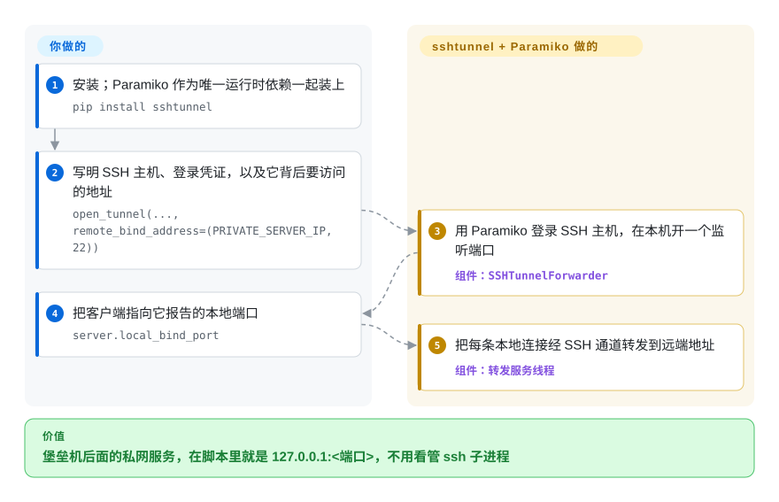

# sshtunnel

你的 Python 脚本要连一个只在私网里应答的数据库，于是你起一个 `ssh -L 5432:db.internal:5432 bastion` 子进程，sleep 到端口“大概通了”，脚本崩了还得去清理残留的 `ssh` 进程。sshtunnel 在你自己的进程里做端口转发：一个 `with` 块打开一个本地端口，经 SSH 主机通到私网服务，块结束就关掉。

## 何时使用

你在写一个 Python 脚本，要访问跑在私网里的 Postgres（或 Redis，或内部 HTTP API），它只能经堡垒机走 SSH 才能到达。手动做意味着在 subprocess 里跑 `ssh -L 5432:db.internal:5432 bastion`，再去猜隧道什么时候起好；脚本一旦因异常退出，`ssh` 子进程还占着端口，下次运行直接报 `Address already in use`。改用它来包：`with SSHTunnelForwarder(('bastion', 22), ssh_username=..., remote_bind_address=('db.internal', 5432)) as tunnel:`，然后把 DB 客户端指向 `127.0.0.1:tunnel.local_bind_port`。进入时打开隧道，退出时拆掉，绑定的本地端口作为 Python 值直接拿到。

它适合临时自动化和数据脚本：一次性迁移要打到堡垒机后面的 DB、notebook 从内部服务拉数、测试夹具。比起裸用 [Paramiko](paramiko.zh.md)，你不用自己写套接字转发循环；比起 subprocess 跑 `ssh -L`，隧道的生命周期跟着你的 Python 代码走。但 2026 年用它要先知道：它几乎没人维护，而且必须锁定 `paramiko<4`（见“何时不用”）。

## 怎么用起来

sshtunnel 是架在 Paramiko 上的一个 Python 模块，Paramiko 是用纯 Python 实现的 SSH 协议。启动转发器时，它先经 Paramiko 登录 SSH 主机，再在本机开一个监听套接字（`127.0.0.1` 上的一个端口，或你指定的地址）。**你的客户端每连一次这个端口，它就请 SSH 主机开一条 “direct-tcpip” 通道**——这是 SSH 自带的“替我再连到某个 host:port”机制——然后在后台线程里双向搬运字节。**你负责提供** SSH 地址、凭证（密码、私钥文件，或它能从 `~/.ssh` 和 agent 读出的密钥）以及要访问的远端地址；**之后你只管**像用本地服务一样用 `local_bind_port`。它默认每 5 秒发一次 SSH keepalive，但会话断了不会自动重连——那是你代码的事。另有 `python -m sshtunnel` 命令行，供 shell 里用。

<!-- flow-steps:begin (generated from flows/sshtunnel.json by tools/flow_card.py — do not edit) -->

流程文字版

1. **你**：安装；Paramiko 作为唯一运行时依赖一起装上 — `pip install sshtunnel`
2. **你**：写明 SSH 主机、登录凭证，以及它背后要访问的地址 — `open_tunnel(..., remote_bind_address=(PRIVATE_SERVER_IP, 22))`
3. **sshtunnel**：用 Paramiko 登录 SSH 主机，在本机开一个监听端口 — 组件：`SSHTunnelForwarder`
4. **你**：把客户端指向它报告的本地端口 — `server.local_bind_port`
5. **sshtunnel**：把每条本地连接经 SSH 通道转发到远端地址 — 组件：`转发服务线程`

**价值**：堡垒机后面的私网服务，在脚本里就是 127.0.0.1:<端口>，不用看管 ssh 子进程

<!-- flow-steps:end -->

## 何时不用

- **⚠ 新装的 `pip install sshtunnel` 在当前 Paramiko 上直接报错。** 最新发布版（0.4.0，2021 年 1 月）声明 `paramiko>=2.7.2` 且不设上限，构造转发器时运行的密钥加载代码引用了 `paramiko.DSSKey`；Paramiko 4.0（2025 年 8 月）删掉了 DSA 密钥，所以在 Paramiko 4.x/5.x 上一创建转发器就抛 `AttributeError: module 'paramiko' has no attribute 'DSSKey'`。问题见 issue #302/#309，修复 PR #303/#307/#316 到 2026-10-08 都没有合并。非用不可就锁 `paramiko<4`——代价是放弃 Paramiko 更新的安全版本。新代码直接在 [Paramiko](paramiko.zh.md) 上写转发（`Transport.open_channel('direct-tcpip', ...)`），或用 AsyncSSH 的转发 API。
- **你需要一个有人维护的依赖。** 2021 年后没有发布，默认分支自 2025-08-27 起没有新提交；维护者在 2026-10-08 往一个侧分支推了修 CI 的提交，也许是复活的开始，但不是发布。按弃置风险对待：要么把这一个模块 vendor 进来，要么换一个有人维护的库。
- **生产级、长寿命、高吞吐的隧道。** 字节在 Python 线程里经 Paramiko 转发，会话断了也不会重建。持久隧道用原生 `ssh -L` 配 `autossh` 或 systemd 单元——原生 OpenSSH 更快，而且会重连。
- **你需要 OpenSSH config 的完整还原度。** 它不会像 OpenSSH 客户端那样照顾你完整的 `~/.ssh/config`（ProxyJump 链、`Match` 块、每一个选项）；复杂的多跳设置用原生 `ssh`。
- **你已经在管理一个 Paramiko `Transport`。** 再加 sshtunnel，就是给 [Paramiko](paramiko.zh.md) 一次 `open_channel('direct-tcpip', ...)` 加一个转发循环就能做的事再套一层——还顺带引入 `DSSKey` 的问题。
- **你的代码基于 asyncio。** 它每条连接一个线程的模型和事件循环不搭；AsyncSSH 的 `forward_local_port` 让隧道留在事件循环里。

## 横向对比

| 替代品 | 是否收录 | 我们的评价 | 取舍 |
|---|---|---|---|
| [Paramiko](paramiko.zh.md) | ✅ | 新代码直接在 Paramiko 上写转发；只有已经在用 sshtunnel、并锁了 `paramiko<4` 的老脚本才继续用它。 | 套接字转发和生命周期要自己写，但留在一个有人维护、持续出安全版本的库上。 |
| 原生 `ssh -L` / `autossh` | 未收录 | 隧道要连续开几小时、几天时，用 autossh 或 systemd 托管 OpenSSH，而不是进程内转发器。 | 完整支持 `~/.ssh/config`、原生速度、自动重连，但它是一个要另外看管的进程。 |
| `subprocess` + `ssh` | 未收录 | 想零 Python SSH 依赖、行为与 OpenSSH 完全一致时，从 Python 里起 `ssh -L` 并等端口就绪。 | 没有 Paramiko 版本风险，但就绪检测、子进程清理和错误处理都归你。 |
| AsyncSSH（转发 API） | 未收录 | 代码库原生基于 asyncio 时，用 AsyncSSH 的 `forward_local_port`，让隧道活在事件循环里。 | 有人维护、原生异步，但 API 不同，依赖也比单模块封装重。 |

## 技术栈

- **语言：** 纯 Python；整个库就是一个模块 `sshtunnel.py`。
- **核心依赖：** **Paramiko** 负责 SSH 传输、认证和通道；sshtunnel 加上 `SSHTunnelForwarder` / `open_tunnel`、密钥发现、本地监听和转发线程。
- **并发：** `socketserver` 加 `ThreadingMixIn`——每条转发连接一个线程，底下是 Paramiko 的阻塞式通道。
- **接口：** 上下文管理器，或 `start()` / `stop()` 对象，暴露 `local_bind_port(s)`；另有 `python -m sshtunnel` 命令行。

## 依赖

- **运行时：** Python 3 和 **Paramiko**（它会拉入 `cryptography`、`bcrypt`、`pynacl`）。实际使用必须锁 `paramiko<4`——见“何时不用”。
- **外部：** 一台你能认证、且允许 TCP 转发（sshd 的 `AllowTcpForwarding`）的 SSH 服务器，以及从这台服务器可达的目标服务。服务端除了普通 sshd 什么都不用跑。
- **安装：** `pip install sshtunnel` 或 `conda install -c conda-forge sshtunnel`。

## 运维难度

**部署门槛低，用得越久负担越重。** 没有要部署的东西——装上就能用上下文管理器。真正的活在别处：一是守住 Paramiko 的版本锁，环境一重建、没锁住就会悄悄装上 Paramiko 5，所有隧道在构造时就报错；二是长期运行要自己加重连和重试，keepalive 只能探活，不能重建断掉的会话；三是安全地管理密钥和 host key 策略，因为你继承的是 Paramiko 的默认值。短脚本几乎零运维；常驻场景，要预留出 `autossh` 本来白送给你的那份看管工作。

## 健康度与可持续性

- **维护（2026-10）——休眠（D 级）。** 自 0.4.0（2021-01-11）以来没有发布；默认分支最后一次提交在 2025-08-27，距本次核查 407 天，最近 13 周没有活跃周。Paramiko 4 不兼容的问题一年多没有进发布版。2026-10-08 维护者开了修 CI 的分支和 PR——值得观察后面会不会跟一个发布。
- **响应速度与治理——无法评分。** 评分器在近期找不到可测首次响应的 issue/PR 窗口，也没法把过去一年的提交归到活跃维护者名下。历史上主要是两个人在做：pahaz（所有者）和 fernandezcuesta；2025 年唯一的一次提交来自外部贡献者。
- **背书与长期性（D 级）。** 2014 年 6 月创建（约 12 年），个人所有，没有公司或基金会。年龄在这里帮不上忙：Lindy 要的是年龄**加**仍在活跃，这个项目只有前者。
- **采用度（A 级）。** 靠惯性仍被大量使用：上月 PyPI 下载 15,322,801 次，1,287 个依赖仓库——这也正是不锁 Paramiko 就报错会波及大量安装的原因。
- **风险标记。** MIT，没有改许可证。风险不在许可证，而在依赖：Paramiko 一直在往前走（5.0 已发布），这层封装原地不动。

## 存疑（未验证）

- [未验证] 截至 2026-10-08 约 1.3k star、约 200 fork、81 个 open issue——易变。
- [推断]“每次构造 `SSHTunnelForwarder` 都会碰到 `paramiko.DSSKey`”是读源码得出的（`__init__` → `_consolidate_auth` → `get_keys` 构造的字典里含 `paramiko.DSSKey`），与 issue 报告一致；本次没有实际安装复现。
- [推断] 维护者 2026-10-08 的修 CI 动作不一定带来新发布；仓库里没有任何发布承诺。
- [推断] Paramiko 的传递依赖（`cryptography`、`bcrypt`、`pynacl`）随 Paramiko 版本而变。
- [未验证] 多跳 / ProxyJump 场景下的行为，以及 `ssh_config_file` 能还原多少 `~/.ssh/config`，没有实测。
