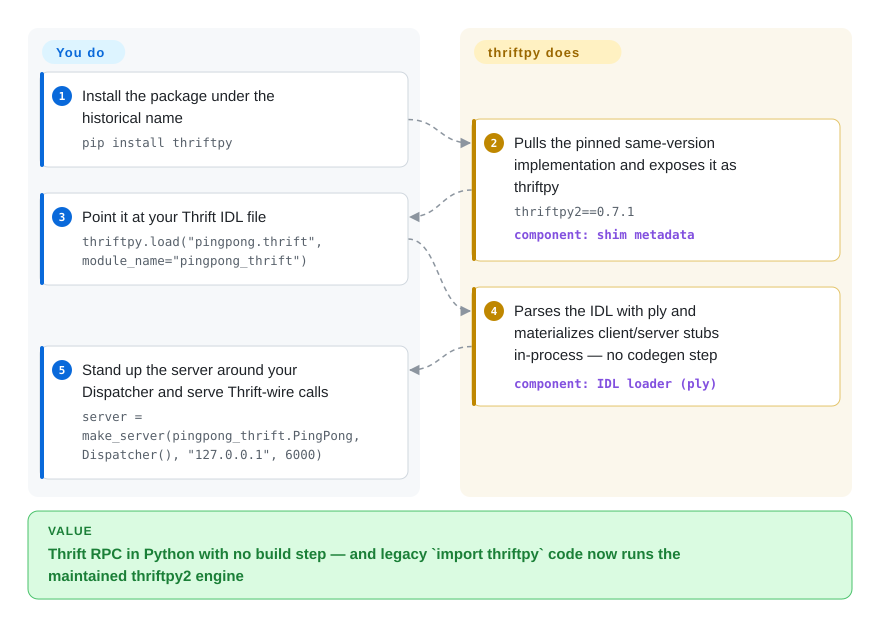

# ThriftPy

You inherit a service whose code still says `import thriftpy`, and the history reads as abandoned: the original pure-Python Thrift runtime stopped releasing in 2016 and development moved to thriftpy2. That is no longer the whole story — in mid-2026 the maintainers recovered the PyPI name and turned `thriftpy` into a compatibility shim: installing it pulls the same-versioned thriftpy2 and re-exports it under the historical name, so the legacy import now runs the maintained implementation.

## When to use

You're a Python backend engineer at a shop that talks Apache Thrift between services, and the official `thrift` Python binding annoys you: it needs a code-generation step (`thrift --gen py`), the generated code is verbose, and building the compiler can be a chore. You want to point at the `.thrift` IDL and have working client/server objects appear — `pingpong = thriftpy.load("pingpong.thrift")`, a server via `make_server`, a client via `make_client`, no build step, wire-compatible with upstream Thrift servers and clients in any language.

The concrete scenario this page exists for is the **legacy migration**: a service pinned to the frozen `thriftpy==0.3.9` (Python 2.7 era) can now move to `thriftpy>=0.6` and keep every `import thriftpy` line, because the current package re-exports thriftpy2 under the old name. If you're choosing the stack fresh instead, `thriftpy` and `thriftpy2` are released in lockstep with identical version numbers (the README says you can pick either name) — this page is where you learn that the historical name is alive again, and what "alive" actually means underneath.

## How it works

The shipped `thriftpy` package is nearly hollow: its metadata declares a hard-pinned dependency on the implementation — `thriftpy2==0.7.1` for shim 0.7.1 — and re-exports that code under the historical name; the two names now release in sync. The real work happens in the thriftpy2 runtime behind it: `thriftpy.load("pingpong.thrift", module_name="pingpong_thrift")` parses Thrift's IDL — the `.thrift` file describing your services and types — at import time with `ply` (a Python lexer/parser toolkit, the runtime's main dependency) and materializes working client/server stubs as Python objects in memory. That replaces the offline `thrift --gen py` codegen step you would need with the official bindings. On top of that, `make_server`/`make_client` speak the standard Thrift wire protocols over TCP, so a thriftpy server answers calls from clients written in any Thrift language. What stays yours: the `.thrift` files, the dispatcher class implementing each service method, and the process/transport supervision around the server loop.

<!-- flow-steps:begin (generated from flows/thriftpy.json by tools/flow_card.py — do not edit) -->

Text version of the flow

1. **You**: Install the package under the historical name — `pip install thriftpy`
2. **ThriftPy**: Pulls the pinned same-version implementation and exposes it as thriftpy — `thriftpy2==0.7.1` — component: `shim metadata`
3. **You**: Point it at your Thrift IDL file — `thriftpy.load("pingpong.thrift", module_name="pingpong_thrift")`
4. **ThriftPy**: Parses the IDL with ply and materializes client/server stubs in-process — no codegen step — component: `IDL loader (ply)`
5. **You**: Stand up the server around your Dispatcher and serve Thrift-wire calls — `server = make_server(pingpong_thrift.PingPong, Dispatcher(), "127.0.0.1", 6000)`

**Value**: Thrift RPC in Python with no build step — and legacy `import thriftpy` code now runs the maintained thriftpy2 engine

<!-- flow-steps:end -->

## When NOT to use

- **Don't expect the 2016 codebase when you install the current one.** Since v0.6.0 (released 2026-06-29) `thriftpy` is a shim over thriftpy2 — the original pure-Python implementation with optional Cython protocol extensions and its `tornado>=4.0,<5.0`/`toro` async pins belongs to the frozen 0.3.x era, not to today's package. An old 0.3.9 install and a 0.7.x install are effectively different codebases wearing the same name; audit accordingly.
- **You're starting new code and want the canonical name.** Depend on **thriftpy2** directly: the shim adds a strict-equality pin (`thriftpy2==0.7.1`) that can collide with other packages in your environment requiring a different thriftpy2 version, and you gain nothing from the indirection unless the import name must stay `thriftpy`.
- **You need the oldest frozen interpreter.** The current shim requires Python >=3.7 (packaging metadata); running Python 2.7-era code unmodified means staying on the unsupported 0.3.9 wheel — a dead end for modern interpreters and CVE fixes.
- **You need protocols/transports beyond the runtime's set.** The implementation covers the Thrift protocol/transport combinations thriftpy2 supports; anything newer or exotic in Apache Thrift should be checked against thriftpy2's docs before you commit.
- **You need vendor/foundation support.** It remains a community project (originally from eleme, now run by the Thriftpy organization); there is no support channel. For backed Thrift tooling, the official Apache Thrift bindings are the reference implementation.
- **You don't actually need Thrift wire-compatibility.** For greenfield RPC, gRPC + Protocol Buffers has a far larger modern ecosystem; the Thrift-compat niche is the only reason to pick either thriftpy name.

## Comparison

| Alternative | In index | Our verdict | Tradeoff |
|---|---|---|---|
| thriftpy2 | 未收录 | For new Python Thrift services, depend on thriftpy2 directly: it is the actual implementation (this repo's package is a name-compatibility shim over it) and avoids the shim's strict equality pin; keep `import thriftpy` only when legacy code must not be edited. | The maintained runtime, released in lockstep with this page's package; community-backed only, no vendor support. |
| Apache Thrift (official `thrift` Python lib) | 未收录 | Choose official Apache Thrift when canonical multi-language stubs and foundation governance matter more than runtime IDL loading — its generated-code workflow is the cost. | Reference implementation with code generation; heavier build step, but the broadest language coverage and foundation support. |
| gRPC + Protocol Buffers | 未收录 | Choose gRPC and Protocol Buffers for new RPC designs that do not need Thrift wire compatibility — the deciding factor is an existing estate of `.thrift` services. | Larger modern ecosystem over HTTP/2/protobuf, but it is a migration to a different protocol. |
| Apache Avro | 未收录 | Choose Avro when schema-based serialization in data/Hadoop pipelines outweighs serving live RPC over the Thrift wire. | JSON-defined schemas and RPC support, but not wire-compatible with Thrift. |

## Tech stack

- **Packaging:** the current `thriftpy` distribution is a thin re-export of thriftpy2 — the README calls it "a thin compatibility shim around thriftpy2" — with `requires_python >=3.7`.
- **Under the hood (thriftpy2):** pure-Python runtime; its PyPI metadata (2026-09) requires `ply>=3.4,<4.0` (the IDL parser) and `ijson>=3.0,<4.0`.
- **Model:** loads `.thrift` files into Python module objects at runtime (`thriftpy.load`), replacing an offline codegen step; speaks the standard Thrift wire protocols (`make_server`/`make_client`).
- **History:** the pre-shim implementation (last frozen release v0.3.9, 2016-08) shipped optional Cython extensions for the binary/compact protocols and a Tornado-4 async transport — that architecture is historical, not the current package.

## Dependencies

- **Runtime:** `thriftpy2` at the identical version, hard-pinned by the shim's metadata (0.7.1 → `thriftpy2==0.7.1`); behind it, ply (parser) and ijson. No datastore, no daemon, no external service of its own — it's a client/server RPC library; the Thrift-speaking services are yours.
- **Install:** `pip install thriftpy` (or depend on `thriftpy2` directly).

## Ops difficulty

**Low, with two sharp edges.** As a library there is nothing to deploy beyond your own service process. The edges: (1) the shim's strict-equality pin (`thriftpy2==X.Y.Z`) makes it the wrong choice if other packages in your environment need a different thriftpy2 version — resolver conflicts are your problem; (2) upgrading a legacy install from the frozen 0.3.9 era to the 0.6+ shim swaps the underlying implementation, not just the patch number — re-test the RPC paths rather than assuming old behavior carries over. [推断：行为差异未实测]

## Health & viability

- **Responsiveness**: Cannot be scored — no_traffic.
- **Maintenance (2026-09).** Revived, not rotting: the repo was unarchived and converted into the thriftpy2 shim on 2026-06-29 (first shim release v0.6.0), followed by v0.7.0 (2026-08-09) and v0.7.1 (2026-09-05), each released in lockstep with the same thriftpy2 version. Default branch is `master`; last push 2026-09-05 (GitHub API). [推断：2018-12 至 2026-06 间的归档窗口依据 2026-06 快照与提交历史]
- **Governance / bus factor.** Run by the **Thriftpy organization** — effectively the same volunteer pool as thriftpy2; the scorer counted 1 active maintainer in the trailing 12 months with 100% commit share (grade D). Single-point governance remains the standing caveat.
- **Age & Lindy verdict.** The repository dates to ~2013 (12+ years), but the *shim architecture* is only months old and the name spent 2016–2026 frozen. Read Lindy through the lineage: the runtime idea survived a decade via thriftpy2, while the `thriftpy` name itself demonstrated it can go dormant for years — good news for legacy migrations, a caution for supply-chain reviewers. [推断]
- **Adoption.** ~1.1k stars (1,148, GitHub API 2026-09) and 38,919 PyPI downloads/month on the `thriftpy` name (health scorer) — traffic that now mostly represents the pinned-legacy-to-shim migration path rather than greenfield use.
- **Risk flags.** MIT license, no relicense history. The structural risk is the **supply-chain shape**: one PyPI name is a pinned re-export of another — an "I recovered the needed release access" story (README's own words) means control of the name changed hands once before (the 2016–2026 thriftpy2 split). Watch the org and keep both names on the same lockstep version. [推断]

## Caveats (unverified)

- [未验证] The claim that existing `import thriftpy` code runs unchanged on the shim is read from the README and the PyPI summary ("re-exports it under the historical `thriftpy` package name"); a real 0.3.9-era codebase was not run against 0.7.1.
- [未验证] thriftpy2-side facts (ply/ijson requirements, protocol/transport coverage, current Python support) were read from PyPI metadata for thriftpy2 0.7.1, not tested on the wire.
- [未验证] ~1,148 stars / ~281 forks / ~61 open issues+PRs as of 2026-09 (GitHub API); the issue count started moving again after the revival.
- [推断] The strict-pin conflict risk is inferred from `thriftpy2==0.7.1` in the shim's requires_dist; no resolver conflict was reproduced.
- [推断] The archive-window dates (last pre-shim push 2018-12, v0.3.9 in 2016-08) come from the previous verified snapshot and the tag/release history on GitHub.
