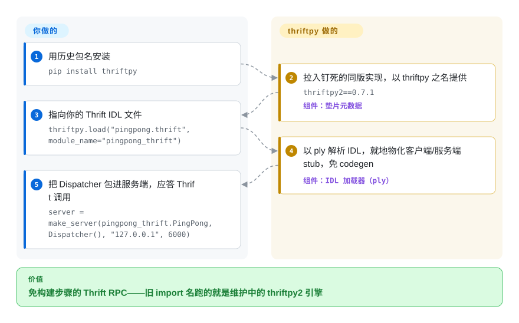

# ThriftPy

接手的服务里还写着 `import thriftpy`，而这段历史看上去是弃坑：原版纯 Python Thrift 运行时 2016 年就停止发布，开发早已迁去 thriftpy2。但如今故事不止于此——2026 年中维护者取回了 PyPI 包名，把 `thriftpy` 变成兼容垫片：安装它会带上同版本的 thriftpy2 并以历史包名重导出，旧的 import 跑的正是维护中的实现。

## 何时使用

你在一家服务间走 Apache Thrift 的公司做 Python 后端，官方 `thrift` 的 Python 绑定让你头疼：它需要一步代码生成（`thrift --gen py`），生成的代码冗长，编译器本身也可能是构建负担。你想直接对着 `.thrift` IDL 让可用的客户端/服务端对象出现——`pingpong = thriftpy.load("pingpong.thrift")`，`make_server` 起服务端、`make_client` 起客户端，没有 codegen 构建步骤，且与任何 Thrift 语言的服务端/客户端在线协议上兼容。

这一页真正存在的场景是**遗留迁移**：钉在冻结版 `thriftpy==0.3.9`（Python 2.7 时代）的服务，如今可以升到 `thriftpy>=0.6` 而保留每一行 `import thriftpy`——因为现在的包就是在旧名之下重导出 thriftpy2。若你是从零选型：`thriftpy` 与 `thriftpy2` 以相同版本号同步发布（README 明言两个名字任选）——这一页告诉你的是历史名字复活了，以及「活着」在底层意味着什么。

## 怎么用起来

发出去的 `thriftpy` 包几乎是空心的：它的元数据声明对实现版本的硬钉依赖——垫片 0.7.1 钉 `thriftpy2==0.7.1`——然后把那份代码以历史包名重导出；两个名字现在同步发布。真正的活在背后的 thriftpy2 运行时里：`thriftpy.load("pingpong.thrift", module_name="pingpong_thrift")` 在 import 时用 `ply`（一个 Python 词法/语法分析工具箱，也是运行时的主依赖）解析 Thrift 的 IDL——描述服务与类型的 `.thrift` 文件——把可用的客户端/服务端 stub 物化成内存里的 Python 对象，顶替了官方绑定那步离线的 `thrift --gen py`。在此之上，`make_server`/`make_client` 用标准 Thrift 线协议走 TCP 通信，所以 thriftpy 服务端能被任何 Thrift 语言写的客户端调用。留给你的：`.thrift` 文件本身、实现每个服务方法的 Dispatcher 类，以及服务端循环之外的进程与传输看管。

<!-- flow-steps:begin (generated from flows/thriftpy.json by tools/flow_card.py — do not edit) -->

流程文字版

1. **你**：用历史包名安装 — `pip install thriftpy`
2. **ThriftPy**：拉入钉死的同版实现，以 thriftpy 之名提供 — `thriftpy2==0.7.1` — 组件：`垫片元数据`
3. **你**：指向你的 Thrift IDL 文件 — `thriftpy.load("pingpong.thrift", module_name="pingpong_thrift")`
4. **ThriftPy**：以 ply 解析 IDL，就地物化客户端/服务端 stub，免 codegen — 组件：`IDL 加载器（ply）`
5. **你**：把 Dispatcher 包进服务端，应答 Thrift 调用 — `server = make_server(pingpong_thrift.PingPong, Dispatcher(), "127.0.0.1", 6000)`

**价值**：免构建步骤的 Thrift RPC——旧 import 名跑的就是维护中的 thriftpy2 引擎

<!-- flow-steps:end -->

## 何时不用

- **别指望装到手的还是 2016 年的那份代码。** 自 v0.6.0（2026-06-29 发布）起 `thriftpy` 就是 thriftpy2 之上的垫片——原版纯 Python 实现、可选 Cython 协议扩展、`tornado>=4.0,<5.0`/`toro` 的异步钉版本属于冻结的 0.3.x 时代，不属于今天的包。旧的 0.3.9 安装和 0.7.x 安装实质是两套代码共用一个名字；审计时分清对象。
- **你在起新代码、要用正名。** 直接依赖 **thriftpy2**：垫片带一个严格等号钉（`thriftpy2==0.7.1`），环境里别的包需要不同 thriftpy2 版本时会撞车；除非 import 名必须保持 `thriftpy`，否则多这层间接没有任何收益。
- **你要跑在最老的冻结解释器上。** 现行垫片要求 Python >=3.7（打包元数据）；想在 Python 2.7 原样跑旧代码只能停在无人支持的 0.3.9 wheel——对现代解释器和 CVE 修复是死路。
- **你需要运行时那套之外的协议/传输。** 实现覆盖的是 thriftpy2 支持的 Thrift 协议/传输组合；Apache Thrift 里更新或更冷门的东西，落注前先对照 thriftpy2 的文档核实。
- **你需要厂商/基金会支持。** 它仍是社区项目（最初出自 eleme，现由 Thriftpy 组织打理），没有支持渠道。要有背书的 Thrift 工具链，官方 Apache Thrift 绑定才是参考实现。
- **你其实不需要 Thrift 线兼容。** 从零设计的 RPC 选 gRPC + Protocol Buffers，现代生态大得多；Thrift 兼容这个理由几乎是选任何一个 thriftpy 名字的唯一原因。

## 横向对比

| 替代品 | 是否收录 | 我们的评价 | 取舍 |
|---|---|---|---|
| thriftpy2 | 未收录 | 新的 Python Thrift 服务直接依赖 thriftpy2：它才是实现本体（本页的包只是名称兼容垫片），还避开垫片的严格等号钉；只有必须保留 `import thriftpy` 不动的遗留代码才留在本页项目。 | 与本页包同步版本发布的维护中运行时；仅社区背书，没有厂商支持。 |
| Apache Thrift（官方 `thrift` Python 库） | 未收录 | 标准多语言 stub 和基金会治理比运行时 IDL 加载更重要时，选官方 Apache Thrift——代价是它要离线代码生成那套工作流。 | 参考实现且语言覆盖最广，但构建更重，有基金会背书。 |
| gRPC + Protocol Buffers | 未收录 | 新 RPC 设计不需要兼容 Thrift 线协议时，选 gRPC 和 Protocol Buffers——决定性因素是你是否已有一屋子 `.thrift` 服务。 | 更大的现代 HTTP/2/protobuf 生态，但这是迁移到另一套协议。 |
| Apache Avro | 未收录 | 数据/Hadoop 管道里的 schema 序列化重于在线 Thrift RPC 时，选 Avro。 | JSON 定义 schema 且支持 RPC，但不兼容 Thrift 线协议。 |

## 技术栈

- **打包：** 现行 `thriftpy` 发行物是 thriftpy2 的薄重导出——README 自称「a thin compatibility shim around thriftpy2」——`requires_python >=3.7`。
- **底层（thriftpy2）：** 纯 Python 运行时；其 PyPI 元数据（2026-09）要求 `ply>=3.4,<4.0`（IDL 解析器）与 `ijson>=3.0,<4.0`。
- **模型：** 运行时把 `.thrift` 文件加载成 Python 模块对象（`thriftpy.load`），顶替离线 codegen 步骤；经 `make_server`/`make_client` 说标准 Thrift 线协议。
- **历史：** 垫片之前的原版实现（冻结于 v0.3.9，2016-08）带可选 Cython 协议扩展与 Tornado 4 异步传输——那是历史架构，不是现在的包。

## 依赖

- **运行时：** 同版本的 `thriftpy2`，由垫片元数据硬钉（0.7.1 → `thriftpy2==0.7.1`）；再往下是 ply（解析器）与 ijson。没有数据存储、没有守护进程、没有自有外部服务——它是 RPC 客户端/服务端库，说 Thrift 的服务由你提供。
- **安装：** `pip install thriftpy`（或直接依赖 `thriftpy2`）。

## 运维难度

**运维低，但有两处利刃。** 作为库，除了自己的服务进程外没有要部署的东西。两处：其一，垫片的严格等号钉（`thriftpy2==X.Y.Z`）让环境里别的包需要不同 thriftpy2 版本时成为错误选择——依赖解析冲突归你处理；其二，从冻结的 0.3.9 时代升到 0.6+ 垫片，换的是底层实现而不只是补丁号——RPC 路径要重测，别假设旧行为原样带过来。[推断：行为差异未实测]

## 健康度与可持续性

- **响应速度**：无法计算——no_traffic。
- **维护（2026-09）。** 复活而非腐烂：仓库解除归档并于 2026-06-29 转换为 thriftpy2 垫片（首个垫片版 v0.6.0），随后 v0.7.0（2026-08-09）、v0.7.1（2026-09-05），每次都同号发布 thriftpy2。默认分支为 `master`；最后 push 2026-09-05（GitHub API）。[推断：2018-12 至 2026-06 的归档窗口依据 2026-06 快照与提交历史]
- **治理 / bus factor。** 由 **Thriftpy 组织**运营——实际与 thriftpy2 是同一批志愿者；评分器数到过去 12 个月仅 1 位活跃维护者、提交占比 100%（Grade D）。单点治理仍是长期存疑点。
- **年龄与 Lindy 判断。** 仓库约 2013 年创建（12+ 年），但垫片架构只有几个月历史，这个名字本身在 2016–2026 冻了十年。Lindy 要顺着谱系读：运行时理念经 thriftpy2 活了十年，而 `thriftpy` 这个名字证明它可以休眠多年——对遗留迁移是好消息，对供应链审查者是一记提醒。[推断]
- **采用度。** 约 1.1k star（1,148，GitHub API 2026-09），`thriftpy` 名下 PyPI 月下载 38,919（健康度评分器）——如今更多代表从钉旧版到垫片的迁移流量，而非新建使用。
- **风险标记。** MIT 许可，未发现 relicense 历史。结构性风险在**供应链形态**：一个 PyPI 名字是另一个项目的等号钉重导出——README 自述「取回了需要的发布权限」意味着该名字的控制权换过手（2016–2026 的 thriftpy2 分立就是证据）。盯住该组织，并把两个名字保持在同一同步版本。[推断]

## 存疑（未验证）

- [未验证] 「既有 `import thriftpy` 代码可原样运行」的说法读自 README 与 PyPI 摘要（「re-exports it under the historical `thriftpy` package name」），未用真实 0.3.9 时代代码库对 0.7.1 实跑。
- [未验证] thriftpy2 侧事实（ply/ijson 依赖、协议/传输覆盖、当前 Python 支持）取自 thriftpy2 0.7.1 的 PyPI 元数据，未做线上实测。
- [未验证] 截至 2026-09 约 1,148 star / 约 281 fork / 约 61 个 open issue+PR（GitHub API）；归档解除后 issue 数重新开始变动。
- [推断] 严格等号钉的冲突风险是从垫片 requires_dist 里的 `thriftpy2==0.7.1` 推得，未复现依赖解析冲突。
- [推断] 冻结窗口日期（垫片前最后 push 2018-12、v0.3.9 发布于 2016-08）依据上一次核验快照与 GitHub 的 tag/release 历史。
