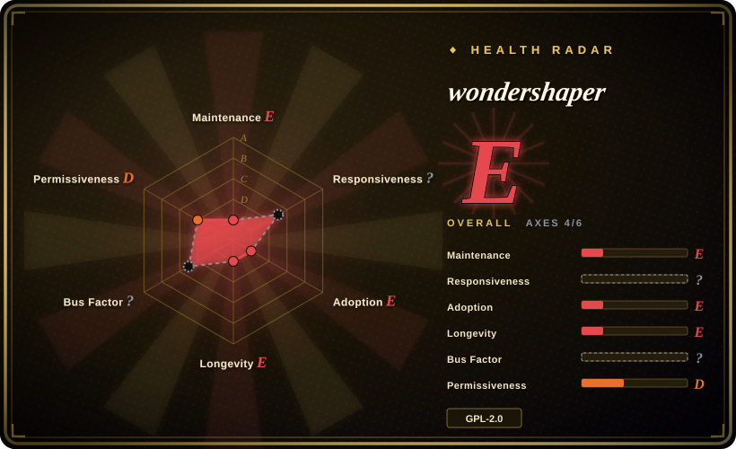
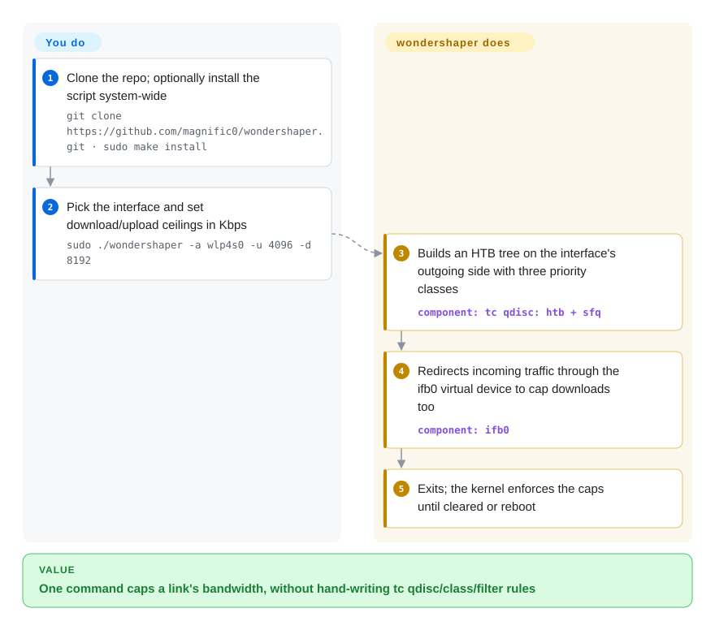

# wondershaper

A single Bash script that wraps Linux `tc` (traffic control) to cap the up/download bandwidth of a network adapter with one command — `wondershaper -a eth0 -d 8192 -u 2048` instead of a wall of HTB queueing-discipline incantations.

## When to use

You're on a Linux box — a home server seeding torrents, a CI runner, a shared dev machine, an embedded gateway — and one process is saturating your link, starving everything else (SSH gets laggy, video calls stutter). You don't want to learn the full `tc` qdisc/class/filter DSL just to say "don't let this NIC exceed 8 Mbit down / 2 Mbit up." You install wondershaper (it's one script), run `sudo wondershaper -a eth0 -d 8192 -u 2048`, and it builds the HTB traffic-shaping rules for you; `wondershaper -c -a eth0` clears them again. For a persistent cap you drop in the provided systemd unit and a small config file so the limit re-applies on boot. It's the fastest path from "this link needs a ceiling" to a working shaped adapter without hand-writing `tc`.

It fits ad-hoc and lightweight-persistent QoS on a *single host's* adapter: throttle a backup job, keep a downloader from eating the whole pipe, or give a low-powered router a simple upload/download ceiling.

## How it works

wondershaper is one Bash script that writes Linux traffic-control rules for you. Linux can already throttle a network card in the kernel through `tc`, but you have to describe queues ("qdiscs" — the waiting lines packets join before they leave), classes and filters in a terse mini-language. **The script ships that whole recipe**: for outgoing traffic it builds an HTB tree (Hierarchical Token Bucket — a meter that hands out sending permission at your chosen rate) with three priority classes, and since Linux cannot directly delay packets that are already arriving, it redirects incoming traffic through a virtual interface, `ifb0`, and caps it there. You only name the interface and the two rates in kilobits per second; the script sets the rules and exits, and the kernel enforces them until you clear them with `-c` or reboot. Keeping the cap after a reboot is a config file plus the bundled systemd unit — also yours to switch on.

<!-- flow-steps:begin (generated from flows/wondershaper.json by tools/flow_card.py — do not edit) -->

Text version of the flow

1. **You**: Clone the repo; optionally install the script system-wide — `git clone https://github.com/magnific0/wondershaper.git · sudo make install`
2. **You**: Pick the interface and set download/upload ceilings in Kbps — `sudo ./wondershaper -a wlp4s0 -u 4096 -d 8192`
3. **wondershaper**: Builds an HTB tree on the interface's outgoing side with three priority classes — component: `tc qdisc: htb + sfq`
4. **wondershaper**: Redirects incoming traffic through the ifb0 virtual device to cap downloads too — component: `ifb0`
5. **wondershaper**: Exits; the kernel enforces the caps until cleared or reboot

**Value**: One command caps a link's bandwidth, without hand-writing tc qdisc/class/filter rules

<!-- flow-steps:end -->

## When NOT to use

- **You need real multi-class QoS / per-flow prioritization.** wondershaper sets a simple overall up/down ceiling (with some prioritization heuristics); for fine-grained per-application/per-IP traffic classes, write `tc`/`nftables` rules directly or use a router OS (OpenWrt's SQM/`cake`).
- **You want modern bufferbloat-aware shaping.** Version 1.4.1 applies HTB with `sfq` leaves (and an `ifb0` redirect for downloads) — no `cake` or `fq_codel`. For latency under load, use **`cake`** / `fq_codel`, typically via OpenWrt SQM or a hand-written `tc` line.
- **You're not on Linux with `tc`.** It's a Bash wrapper around `iproute2`'s `tc`; no Windows/macOS, and it needs `iproute2` present. Containers/network namespaces add caveats.
- **You need shaping across many hosts centrally.** It's a per-host CLI, not a fleet/SDN controller — no central policy, no coordination between machines.
- **You require active upstream support.** The last commit on `master` is **2021-10-15** (five years quiet as of 2026-10-08); it's an old, thin script with no one fixing it. Read it once and test on your kernel/`iproute2` version, or write the few `tc` lines yourself so you own them. [未验证]

## Comparison

| Alternative | In index | Our verdict | Tradeoff |
|---|---|---|---|
| raw `tc` (iproute2) | 未收录 | Choose raw `tc` when full qdisc/class/filter control is worth dealing with the steep traffic-control DSL. | Most flexible; wondershaper is only a friendly wrapper over this engine. |
| `cake` / SQM (OpenWrt) | 未收录 | Choose cake or SQM when bufferbloat latency under load is the main problem and the shaper can live on the router. | Better for router/OpenWrt setups, not a quick per-host script. |
| `tcconfig` (Python) | 未收录 | Choose `tcconfig` when richer scripted rules such as per-IP, per-port, loss, or delay matter more than one Bash file. | More featureful over `tc`, but brings a Python dependency. |
| `trickle` | 未收录 | Choose `trickle` when you only need to limit one userspace process and want to avoid root-level `tc`. | LD_PRELOAD per-process shaping, not a NIC-wide cap. |
| Linux `tc` + `fq_codel` by hand | 未收录 | Choose hand-written `tc` plus `fq_codel` when current qdiscs and correctness matter more than wrapper convenience. | Same engine with less abstraction, but more configuration to write. |

## Tech stack

- **Language:** Bash (a single shell script) — no compilation.
- **Engine:** Linux **`tc`** from **`iproute2`**, applying **HTB** (Hierarchical Token Bucket) shaping (upgraded from the original CBQ; ingress handling improved in later versions).
- **Persistence:** an optional **systemd** service unit + config file to re-apply limits at boot.

## Dependencies

- **Runtime:** a Linux kernel with traffic-control support and **`iproute2`** (`tc`, `ip`) installed; **root/sudo** to apply rules. Optionally **systemd** for the persistent service.
- **External services:** none — it's purely local kernel queueing configuration.
- **Install:** clone the repo and run `./wondershaper` in place, or `sudo make install` to put it in `/usr/bin`; persistent mode reads `/etc/systemd/wondershaper.conf` via the bundled `wondershaper.service`. Distro packages may exist but were not checked.

## Ops difficulty

**Low.** One script, one command to apply, one to clear; the systemd unit makes a persistent cap a copy-config-and-enable job. The real care is conceptual, not operational: pick the right interface, get the rate units right (rates are in **Kbps/kilobits**, easy to confuse with kilobytes), remember it needs root and that rules are kernel state that vanish on reboot unless persisted. Verifying the cap actually holds (and doesn't add latency) means an `iperf`/ping test before and after. There's no daemon to babysit — it sets kernel qdiscs and exits.

## Health & viability

- **Responsiveness**: Cannot be scored — no_traffic.
- **Maintenance (as of 2026-10-08).** Last commit on `master` **2021-10-15** (the 2024-07 `pushed_at` did not touch the default branch); version 1.4.1 per the `VERSION` file, no tagged GitHub releases, not archived. **Dormant**, not merely low-activity: a small script that still does what it says, but nobody is responding to kernel or `iproute2` changes.
- **Governance / bus factor.** Owner type **User** (magnific0, ~20 commits) with a few minor contributors — a **single-maintainer** small utility; bus factor is thin but the surface is tiny. [推断]
- **Age & Lindy verdict.** Created **2012** (and itself a continuation of the much older Wondershaper lineage from the Linux Advanced Routing HOWTO) — ~14 years; old **but quiet**, so Lindy is *moderate*: long-lived and still works, yet HTB-era design is dated next to modern `cake`/`fq_codel`. [推断]
- **Adoption.** ~1.9k stars and a long history as the go-to "simple bandwidth limit" script in Linux how-tos; widely copied. [未验证]
- **Risk flags.** **GPL-2.0** (copyleft — fine for use, relevant if you redistribute modified versions). The technical risk is staleness vs modern bufferbloat-aware shaping, not licensing or abandonment of a tiny script. [推断]

## Caveats (unverified)

- [未验证] ~1.9k stars / ~277 forks per the GitHub API on 2026-10-08 — date-sensitive, indicative only.
- [未验证] No GitHub releases are tagged; the version (1.4.1) lives in the `VERSION` file and `ChangeLog`. A distro package may ship a different version — check what you install.
- [推断] The qdisc layout (HTB + `sfq`, `ifb0` for ingress) was read from the script on 2026-10-08; its actual latency-under-load behavior was not measured — test on your kernel.
- [未验证] Distro packages (and whether they match this repo) were not checked.
- [未验证] Behavior inside containers / network namespaces and on non-systemd inits is not verified.
