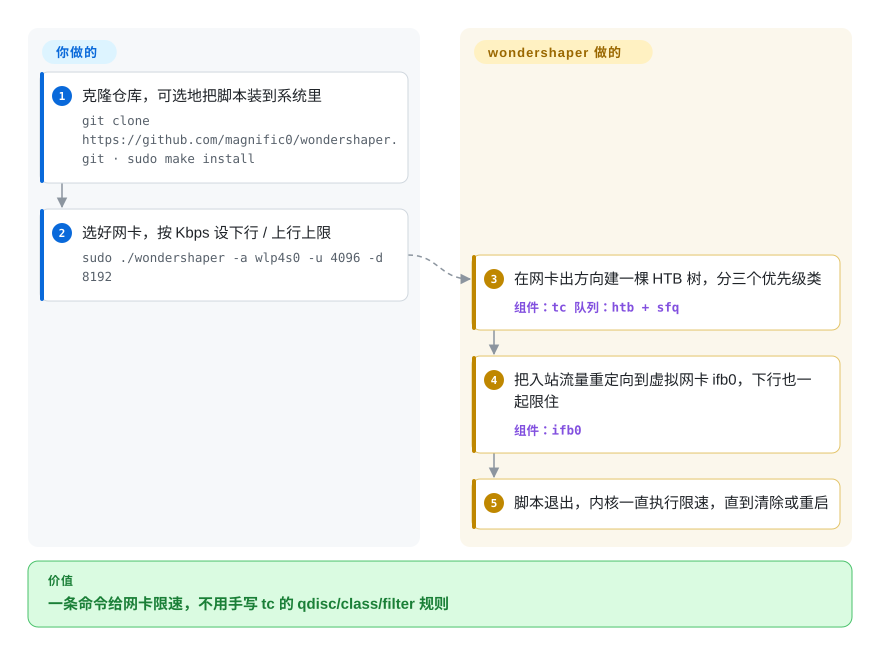

# wondershaper

一个单文件 Bash 脚本，封装 Linux `tc`（流量控制），一条命令就给某个网卡的上/下行带宽封顶——`wondershaper -a eth0 -d 8192 -u 2048`，而不是一大堆 HTB 排队规则咒语。

## 何时使用

你在一台 Linux 机器上——挂种子的家庭服务器、CI runner、共享开发机、嵌入式网关——某个进程把链路打满了，饿死了别的一切（SSH 变卡、视频通话卡顿）。你不想为了说一句「别让这块网卡超过 8 Mbit 下 / 2 Mbit 上」就去学完整的 `tc` qdisc/class/filter DSL。你装上 wondershaper（就一个脚本），跑 `sudo wondershaper -a eth0 -d 8192 -u 2048`，它就替你建好 HTB 流量整形规则；`wondershaper -c -a eth0` 再把它们清掉。要持久封顶，你放进它提供的 systemd unit 和一个小配置文件，重启后限速会自动重新生效。从「这条链路需要个上限」到一块整形好的网卡，这是不手写 `tc` 的最快路径。

它适合*单台主机*网卡上的临时和轻量持久 QoS：给备份任务限速、别让某个下载器吃光整条管道，或给一台低功耗路由器一个简单的上下行上限。

## 怎么用起来

wondershaper 是一个替你写 Linux 流量控制规则的 Bash 脚本。Linux 内核本来就能通过 `tc` 给网卡限速，但你得用一套很简省的小语言去描述队列（qdisc——数据包出门前要排的队）、类和过滤器。**这整套配方脚本里都写好了**：出方向它建一棵 HTB 树（分层令牌桶——按你设的速率发放“发送许可”的计量器），分三个优先级类；入方向的包已经到了门口，Linux 没法直接让它们慢下来，所以脚本把入站流量转到一块虚拟网卡 `ifb0` 上再在那里限速。你只需报出网卡名和两个以千比特每秒计的速率；脚本设好规则就退出，内核一直执行，直到你用 `-c` 清除或重启。想让限速在重启后还在，就填一个配置文件、启用附带的 systemd unit——这一步也由你来开。

<!-- flow-steps:begin (generated from flows/wondershaper.json by tools/flow_card.py — do not edit) -->

流程文字版

1. **你**：克隆仓库，可选地把脚本装到系统里 — `git clone https://github.com/magnific0/wondershaper.git · sudo make install`
2. **你**：选好网卡，按 Kbps 设下行 / 上行上限 — `sudo ./wondershaper -a wlp4s0 -u 4096 -d 8192`
3. **wondershaper**：在网卡出方向建一棵 HTB 树，分三个优先级类 — 组件：`tc 队列：htb + sfq`
4. **wondershaper**：把入站流量重定向到虚拟网卡 ifb0，下行也一起限住 — 组件：`ifb0`
5. **wondershaper**：脚本退出，内核一直执行限速，直到清除或重启

**价值**：一条命令给网卡限速，不用手写 tc 的 qdisc/class/filter 规则

<!-- flow-steps:end -->

## 何时不用

- **你需要真正的多类 QoS / 按流优先级。** wondershaper 设的是一个简单的整体上/下行上限（带一些优先级启发式）；要做细粒度的按应用/按 IP 流量分类，请直接写 `tc`/`nftables` 规则，或用路由器系统（OpenWrt 的 SQM/`cake`）。
- **你想要现代的抗 bufferbloat 整形。** 1.4.1 版用的是 HTB 加 `sfq` 叶子队列（下行另走 `ifb0` 重定向），没有 `cake` 或 `fq_codel`。要做负载下低延迟，用 **`cake`** / `fq_codel`，通常经 OpenWrt 的 SQM，或者手写一行 `tc`。
- **你不在带 `tc` 的 Linux 上。** 它是围绕 `iproute2` 的 `tc` 的 Bash 封装；没有 Windows/macOS，且需要 `iproute2` 存在。容器/网络命名空间另有注意事项。
- **你需要跨多台主机集中整形。** 它是按主机的 CLI，不是机群/SDN 控制器——没有中央策略，机器间不协调。
- **你要求上游积极支持。** `master` 最后一次提交在 **2021-10-15**（截至 2026-10-08 已沉寂五年）；这是个又老又薄、没人修的脚本。读一遍，在你的内核/`iproute2` 版本上测过再用，或者干脆自己写那几行 `tc`，出了问题自己能改。[未验证]

## 横向对比

| 替代品 | 是否收录 | 我们的评价 | 取舍 |
|---|---|---|---|
| 裸 `tc`（iproute2） | 未收录 | 完整 qdisc/class/filter 控制值得你直接面对陡峭 traffic-control DSL 时，选裸 `tc`。 | 最灵活；wondershaper 只是这个引擎上的友好封装。 |
| `cake` / SQM（OpenWrt） | 未收录 | 主要问题是负载下 bufferbloat 延迟，且整形器可以放在路由器上时，选 cake 或 SQM。 | 更适合路由器／OpenWrt 设置，不是按主机的快脚本。 |
| `tcconfig`（Python） | 未收录 | 按 IP、端口、丢包或延迟等更丰富的脚本化规则比一个 Bash 文件更重要时，选 `tcconfig`。 | 它在 `tc` 之上功能更丰富，但会引入 Python 依赖。 |
| `trickle` | 未收录 | 只需要限制一个用户态进程，并且想避开 root 级 `tc` 时，选 `trickle`。 | 这是 LD_PRELOAD 的按进程整形，不是网卡级上限。 |
| 手写 Linux `tc` + `fq_codel` | 未收录 | 当前 qdisc 和正确性比封装便利更重要时，选手写 `tc` 加 `fq_codel`。 | 同一引擎、抽象更少，但要写更多配置。 |

## 技术栈

- **语言：** Bash（一个 shell 脚本）——无需编译。
- **引擎：** 来自 **`iproute2`** 的 Linux **`tc`**，施加 **HTB**（分层令牌桶）整形（从最初的 CBQ 升级而来；后续版本改进了 ingress 处理）。
- **持久化：** 一个可选的 **systemd** 服务 unit + 配置文件，在开机时重新施加限速。

## 依赖

- **运行时：** 带流量控制支持的 Linux 内核，并装好 **`iproute2`**（`tc`、`ip`）；施加规则需 **root/sudo**。持久服务可选 **systemd**。
- **外部服务：** 没有——它纯粹是本地内核排队配置。
- **安装：** clone 仓库后直接运行 `./wondershaper`，或 `sudo make install` 装到 `/usr/bin`；持久模式经附带的 `wondershaper.service` 读取 `/etc/systemd/wondershaper.conf`。发行版里可能有包，但未核查。

## 运维难度

**低。** 一个脚本，一条命令施加，一条清除；systemd unit 让持久封顶变成拷配置加 enable 的活。真正要在意的是概念而非运维：选对网卡、把速率单位搞对（速率以 **Kbps/千比特** 计，容易和千字节混）、记住它需要 root 且规则是内核状态，不持久化的话重启即失。验证封顶真的生效（且没加延迟）意味着前后跑一次 `iperf`/ping。没有要照看的 daemon——它设好内核 qdisc 就退出了。

## 健康度与可持续性

- **响应速度**：无法计算——no_traffic。
- **维护（截至 2026-10-08）。** `master` 最后一次提交在 **2021-10-15**（2024-07 的 `pushed_at` 没有动默认分支）；按 `VERSION` 文件是 1.4.1，没有 GitHub tag 发布，未归档。是**休眠**而不只是低活跃：这个小脚本仍然做得到它说的事，但没人跟进内核或 `iproute2` 的变化。
- **治理 / bus factor。** owner 类型 **User**（magnific0，约 20 次提交），有几位次要贡献者——一个**单一维护者**的小工具；bus factor 薄，但面也极小。[推断]
- **年龄与 Lindy 判断。** **2012** 年创建（且本身是更古老的 Wondershaper 血统——源自 Linux Advanced Routing HOWTO——的延续）——约 14 岁；老**但安静**，所以 Lindy *中等*：长寿且仍能用，但 HTB 时代的设计相比现代 `cake`/`fq_codel` 已显陈旧。[推断]
- **采用度。** 约 1.9k star，作为 Linux how-to 里首选的「简单带宽限制」脚本有悠久历史；被广泛抄用。[未验证]
- **风险标记。** **GPL-2.0**（copyleft——使用没问题，重分发修改版时相关）。技术风险是相对现代抗 bufferbloat 整形的陈旧，而非许可或一个小脚本的弃坑。[推断]

## 存疑（未验证）

- [未验证] 2026-10-08 GitHub API 显示约 1.9k star / 约 277 fork——对时间敏感，仅供参考。
- [未验证] 未打 GitHub release；版本号（1.4.1）在 `VERSION` 文件和 `ChangeLog` 里。发行版的包可能是别的版本——核实你装的是哪个。
- [推断] 队列结构（HTB + `sfq`，入方向走 `ifb0`）是 2026-10-08 从脚本里读出来的；它在负载下的实际延迟表现没有实测——在你的内核上测。
- [未验证] 发行版包（以及是否与本仓库一致）未经核查。
- [未验证] 在容器 / 网络命名空间内以及非 systemd init 上的行为未经核实。
