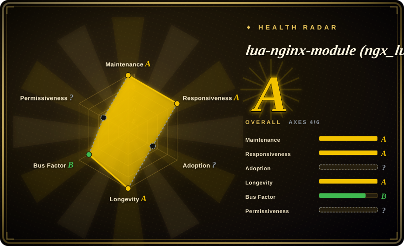
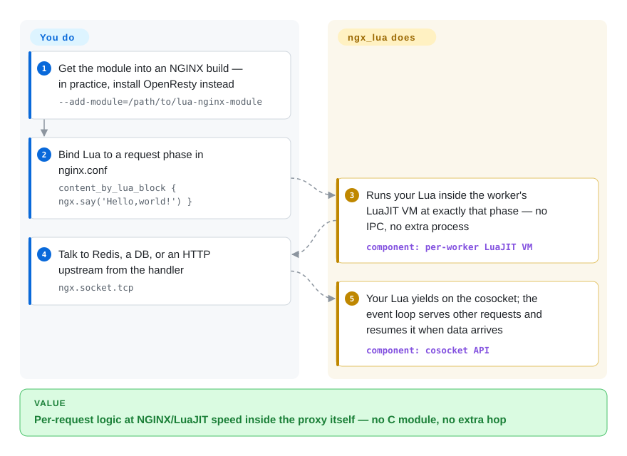

# lua-nginx-module (ngx_lua)

You need NGINX to make a per-request decision — auth, dynamic routing, a rate-limit check — but writing a C module and recompiling NGINX for every logic change is misery, and putting a separate app server in the hot path defeats the point of doing it at the edge. lua-nginx-module embeds a LuaJIT VM into each NGINX worker so your Lua runs inside the request phases themselves, on a non-blocking socket API (cosocket): waiting for Redis or an upstream never stalls the worker.

## When to use

You're building gateway/edge logic on top of NGINX — auth, request shaping, A/B routing, dynamic upstream selection, rate-limiting, custom headers — and you've hit the wall of what static `nginx.conf` directives can express. You don't want to write a C module and recompile NGINX for every behavior change, and you don't want a separate app server in the request path just to make a routing decision. You drop in `ngx_lua` (almost always via the OpenResty bundle), and now you write that logic in Lua: `access_by_lua_block { ... }` to gate a request, `content_by_lua_block { ... }` to serve a response, `rewrite_by_lua` to mutate the URI — all running inside the NGINX worker with the speed of LuaJIT.

The decisive feature is the **cosocket** API: your Lua can open non-blocking TCP/UDP connections to Redis, a database, or an internal HTTP service mid-request, `await` the result, and continue — without blocking the event loop. That's what turns NGINX from a static proxy into a programmable platform, and it's the foundation under API gateways (Kong, APISIX), WAFs, and bespoke edge logic. Reach for it when you want NGINX's performance but need real per-request programmability.

## How it works

ngx_lua runs one LuaJIT VM per NGINX worker and hooks it into the request lifecycle: you bind Lua snippets or files to phases in `nginx.conf` (`rewrite_by_lua_block`, `access_by_lua_block`, `content_by_lua_block`, …), and the module executes them *inside* the worker at exactly that phase — no IPC, no extra process, no recompile when the logic changes. The part that makes it production-grade is the **cosocket** API: when your Lua calls `ngx.socket.tcp` (or a `lua-resty-*` driver built on it), your Lua coroutine yields and NGINX's event loop takes over, resuming the coroutine when the socket has data — so the worker keeps serving thousands of other connections while Redis answers. What stays yours: the OpenResty distribution (or the hand-built NGINX + NDK + LuaJIT triple) you deploy, your Lua code and its versioned shared state (`lua_shared_dict`), and the discipline never to call a blocking C library or `os.execute` inside a handler — that one call does stall the whole worker.

<!-- flow-steps:begin (generated from flows/lua-nginx-module.json by tools/flow_card.py — do not edit) -->

Text version of the flow

1. **You**: Get the module into an NGINX build — in practice, install OpenResty instead — `--add-module=/path/to/lua-nginx-module`
2. **You**: Bind Lua to a request phase in nginx.conf — `content_by_lua_block { ngx.say('Hello,world!') }`
3. **lua-nginx-module (ngx_lua)**: Runs your Lua inside the worker's LuaJIT VM at exactly that phase — no IPC, no extra process — component: `per-worker LuaJIT VM`
4. **You**: Talk to Redis, a DB, or an HTTP upstream from the handler — `ngx.socket.tcp`
5. **lua-nginx-module (ngx_lua)**: Your Lua yields on the cosocket; the event loop serves other requests and resumes it when data arrives — component: `cosocket API`

**Value**: Per-request logic at NGINX/LuaJIT speed inside the proxy itself — no C module, no extra hop

<!-- flow-steps:end -->

## When NOT to use

- **You only need static config.** If `proxy_pass`, `map`, `limit_req`, and friends already express your routing, adding a Lua VM is unnecessary complexity and a new failure surface. Don't script what config can declare.
- **You're not on the OpenResty/LuaJIT path.** This module is tightly bound to a specific NGINX version and LuaJIT; you almost never build it standalone — you use OpenResty. Pinning it to a bleeding-edge or vendor-patched NGINX is painful and easy to get wrong.
- **Blocking I/O in Lua.** The whole model depends on cosockets and non-blocking calls. Calling a blocking C library, `os.execute`, or a synchronous DB driver from inside a handler stalls the entire worker — a footgun that bites teams new to the event model.
- **CPU-heavy work per request.** Lua runs in the worker; heavy crypto, big-data crunching, or long loops per request will hurt latency for everyone on that worker. Offload to an upstream service.
- **You want a batteries-included gateway.** This is the *substrate*, not a product. If you want routing, plugins, auth, and an admin API out of the box, use a gateway built on it (Kong/APISIX) rather than assembling one from raw `ngx_lua`.
- **Maintainer-concentration sensitivity.** Development is heavily concentrated in the OpenResty core (see Health); fine for a battle-tested module, but weigh it if you need broad independent governance.

## Comparison

| Alternative | In index | Our verdict | Tradeoff |
|---|---|---|---|
| OpenResty (bundle) | 未收录 | Choose OpenResty when you want the supported consumption path: matched NGINX, LuaJIT, this module, and lua-resty libraries together. | In practice this is how many teams consume ngx_lua; this repo is one component inside that distribution. |
| njs (nginx JavaScript) | 未收录 | Choose njs when first-party NGINX JavaScript scripting is more important than the Lua/OpenResty ecosystem. | Simpler to install and official, but smaller and less mature than the Lua/OpenResty world. |
| nginx C modules | 未收录 | Choose a C module when maximum control and performance justify writing C and recompiling NGINX for every change. | This is the high-friction path ngx_lua exists to avoid. |
| [Envoy](../api-gateway/envoy.md) + Lua/Wasm filters | ✅ | Choose Envoy filters when the proxy platform itself should be Envoy with xDS, observability, and Lua/Wasm extension points. | Richer control-plane story, but heavier to operate than NGINX+Lua. |
| Caddy + plugins (Go) | 未收录 | Choose Caddy plugins when automatic TLS and a Go plugin ecosystem matter more than NGINX edge scripting depth. | Different language and ecosystem, with less raw ngx_lua-style phase scripting. |
| [lua-resty-redis](lua-resty-redis.md) | ✅ | Do not treat lua-resty-redis as a substitute; use it when you need a Redis client running on top of ngx_lua cosockets. | Complementary library, not an alternative to the module that provides its runtime API. |

## Tech stack

- **Language:** C (the NGINX module) embedding **LuaJIT** (preferred) or standard Lua 5.1.
- **Execution model:** Lua handlers at NGINX request phases (`set_by_lua`, `rewrite_by_lua`, `access_by_lua`, `content_by_lua`, `header_filter_by_lua`, `body_filter_by_lua`, `log_by_lua`, plus `init_by_lua`/timers).
- **Cosocket API:** non-blocking TCP/UDP sockets integrated with NGINX's event loop — the basis for the `lua-resty-*` driver ecosystem.
- **NGINX version coupling:** the README's compatibility list (2026-09) tests up to NGINX 1.31.2; the module tracks NGINX releases closely, another reason the matched OpenResty bundle is the normal path.
- **Distribution:** built into the NGINX binary at compile time; in practice consumed via the OpenResty bundle (matched NGINX + LuaJIT + lua-resty libs).

## Dependencies

- **A matching NGINX source tree** and the **ngx_devel_kit (NDK)** module, compiled together — you build NGINX *with* this module, you don't load it dynamically by default (dynamic module builds are possible but version-sensitive). [未验证]
- **LuaJIT** (recommended) or Lua 5.1 headers/runtime at build time.
- **lua-resty-core + lua-resty-lrucache** are now part of the README's manual-build steps: current module versions no longer allow `lua_load_resty_core off`, so a hand-built setup must install these two pure-Lua companions alongside (OpenResty bundles them).
- **In practice: OpenResty** — almost everyone consumes a pre-bundled, version-matched distribution rather than wiring NGINX + NDK + LuaJIT + this module by hand.
- **Runtime:** whatever your Lua talks to (Redis, DB, HTTP upstreams) via cosockets — yours to run.

## Ops difficulty

**Medium.** Day-to-day it runs exactly as NGINX does — you operate one server process; the Lua lives in config files. The cost is concentrated at the edges: (1) **builds** are version-sensitive — module ⇄ NGINX ⇄ LuaJIT versions must align, which is why using the OpenResty bundle (vs hand-compiling) is strongly advised; (2) **the programming model is unforgiving** — a single blocking call inside a handler stalls a worker, so the team must understand the cosocket/non-blocking discipline; (3) **observability** — debugging Lua in the request path needs `lua_code_cache`, error-log discipline, and care with shared dict state. Upgrades mean re-validating the version triple. Once stable, it's as boring to run as NGINX itself.

## Health & viability

- **Maintenance**: Grade A — 8/13 active weeks in trailing 13; last commit 4 days ago (2026-09-24).
- **Responsiveness**: Grade A — median first-response time 7.1 hours across 10 qualifying issues/PRs.
- **Adoption**: Cannot be scored — ambiguous.
- **Longevity**: Grade A — 6009 days old.
- **Governance**: Grade B — top-3 contributor share 71.2% (21 active maintainers in the trailing 12 months).
- **Risk / License**: Cannot be scored — unknown.

## Caveats (unverified)

- [未验证] ~393 open issues was counted in the 2026-06 pass and not re-tallied this one. Verified instead via the GitHub API on 2026-09-28: 11,783 stars, last push 2026-09-24, latest stable tag **v0.10.31** (2026-05-29), release candidates through **v0.10.32rc5** (2026-09-16) — while the README's own "Version" section still documents v0.10.29 (2025-10-24), i.e. the doc text lags the tags.
- [未验证] License: GitHub's API returned no SPDX id (`license: null`); the README's "Copyright and License" section states **BSD** (2-clause text, copyrights 2009–2025 chaoslawful / agentzh / OpenResty Inc.) — recorded here as BSD-2-Clause from reading that section, but a dedicated `LICENSE`/`COPYRIGHT` file was not located via the API.
- [未验证] Dynamic-module vs static-compile build details and the exact NGINX/LuaJIT version matrix are version-sensitive and not pinned here; consult the OpenResty bundle docs.
- [推断] "Core-team concentration / vendor-led governance" is inferred from the contributor list and OpenResty Inc.'s role, not a published governance document.
