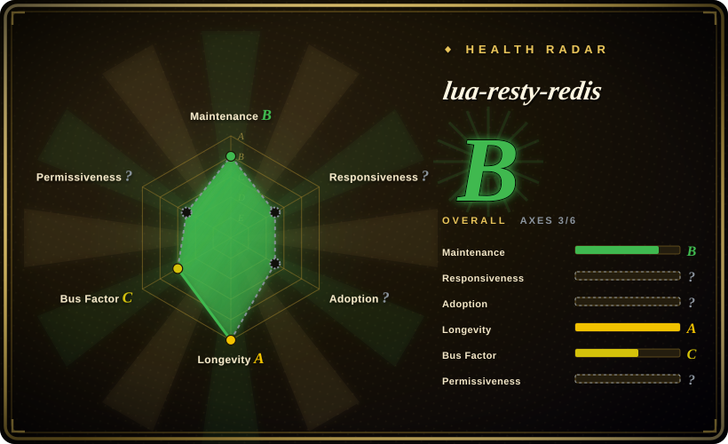
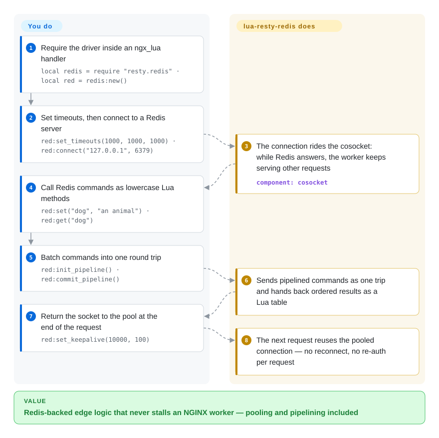

# lua-resty-redis

You want to check a Redis counter or session key inside an `access_by_lua` handler, but a normal Lua Redis client blocks — one synchronous call stalls every other connection that NGINX worker is serving. lua-resty-redis speaks the Redis protocol over the ngx_lua cosocket API so your call yields cooperatively while the worker keeps serving, and ships connection pooling (`set_keepalive`) and pipelining built in.

## When to use

You're writing edge logic in OpenResty — a rate limiter, a session/token check, a feature-flag lookup, a cache-aside in front of your origin — and you need to hit Redis on the hot path of a request. You can't use a normal blocking Redis client, because a synchronous call inside an NGINX worker would stall every other connection that worker is serving. You `local redis = require "resty.redis"`, create a client, `red:connect("127.0.0.1", 6379)`, and call commands as Lua methods (`red:get(key)`, `red:set(...)`, `red:incr(...)`) — every call yields cooperatively on the cosocket so the worker keeps serving other requests while it waits for Redis.

It's the standard way to reach Redis from `access_by_lua`/`content_by_lua` handlers, and it ships the ergonomics you need for production: `set_keepalive()` to return the socket to a connection pool instead of reconnecting per request, and `init_pipeline()`/`commit_pipeline()` to batch commands into one round trip. When your gateway logic — Kong/APISIX style or hand-rolled — needs Redis-backed state, this is the driver underneath.

## How it works

The library is pure Lua with no C extension of its own: every Redis command becomes a lowercase Lua method on a client object (`red:set(...)`, `red:get(...)`), and every socket operation rides the ngx_lua **cosocket** (`ngx.socket.tcp`), which is wired into NGINX's event loop. When you call a command, your Lua coroutine yields; the worker serves other requests until Redis replies, then resumes your coroutine with the parsed RESP value (`nil` plus an error string on failure, and a Lua table for pipelines). Connection reuse is explicit: `set_keepalive(timeout, size)` hands the socket back to a per-worker pool that the next request picks up without reconnecting or re-authenticating, and `init_pipeline()`/`commit_pipeline()` fold several commands into one round trip. What stays yours: setting timeouts (`set_timeouts`) so a slow Redis doesn't pile up requests, sizing the pool against Redis `maxclients`, and any cluster/sharding routing — this driver targets one connection at a time.

<!-- flow-steps:begin (generated from flows/lua-resty-redis.json by tools/flow_card.py — do not edit) -->

Text version of the flow

1. **You**: Require the driver inside an ngx_lua handler — `local redis = require "resty.redis" · local red = redis:new()`
2. **You**: Set timeouts, then connect to a Redis server — `red:set_timeouts(1000, 1000, 1000) · red:connect("127.0.0.1", 6379)`
3. **lua-resty-redis**: The connection rides the cosocket: while Redis answers, the worker keeps serving other requests — component: `cosocket`
4. **You**: Call Redis commands as lowercase Lua methods — `red:set("dog", "an animal") · red:get("dog")`
5. **You**: Batch commands into one round trip — `red:init_pipeline() · red:commit_pipeline()`
6. **lua-resty-redis**: Sends pipelined commands as one trip and hands back ordered results as a Lua table
7. **You**: Return the socket to the pool at the end of the request — `red:set_keepalive(10000, 100)`
8. **lua-resty-redis**: The next request reuses the pooled connection — no reconnect, no re-auth per request

**Value**: Redis-backed edge logic that never stalls an NGINX worker — pooling and pipelining included

<!-- flow-steps:end -->

## When NOT to use

- **You're not inside OpenResty/ngx_lua.** It depends on the cosocket API; it is **not** a general-purpose Lua Redis client for plain Lua, a CLI, or another runtime. Outside the NGINX worker it doesn't work.
- **You need Redis Cluster slot-routing built in.** This driver speaks the Redis wire protocol to one connection; cluster topology, slot mapping, and failover are not its job. For Cluster you layer a separate `lua-resty-redis-cluster`-style library or handle routing yourself. [未验证]
- **High-level abstractions / ORMs.** It's a thin command driver, not a caching framework, lock manager, or object mapper. Patterns like distributed locks or cache stampede protection are yours to build on top.
- **Heavy per-request Redis chatter.** Many sequential round trips per request add latency to the worker; pipeline them or rethink the access pattern — the driver is fast, but the network model still applies.
- **You forget connection pooling.** Skipping `set_keepalive()` means a new TCP connect (and possibly auth) per request — a common performance footgun, not a defect of the library.

## Comparison

| Alternative | In index | Our verdict | Tradeoff |
|---|---|---|---|
| [lua-nginx-module](lua-nginx-module.md) | ✅ | Do not treat lua-nginx-module as the Redis client; use it when you need the ngx_lua runtime and cosocket API this driver depends on. | Foundation, not alternative: without ngx_lua/OpenResty, this driver has nowhere to run. |
| lua-resty-redis-cluster | 未收录 | Choose a cluster wrapper when Redis Cluster slot routing is a hard requirement on top of this driver. | Single-node lua-resty-redis is simpler; cluster routing adds another community layer. |
| resty.redis via OpenResty bundle | 未收录 | Choose the OpenResty-bundled copy when version matching with ngx_lua matters more than vendoring this repo directly. | Usually how teams get the library in production. |
| A blocking Lua Redis client (redis-lua) | 未收录 | Choose a blocking Lua client only for plain Lua programs outside NGINX workers. | It blocks, which is the opposite of the non-blocking cosocket design needed inside NGINX. |
| [Kong](../api-gateway/kong.md) / [APISIX](../api-gateway/apisix.md) | ✅ | Choose these gateways' Redis-backed plugins when you want the rate-limiting or caching *feature*, not a driver to build it yourself; their Lua runs on the same ngx_lua substrate. | Higher-level feature layer configured through gateway APIs; less control than hand-rolled `resty.redis` calls, and you inherit the gateway's upgrade cycle. |

## Tech stack

- **Language:** pure Lua (LuaJIT under OpenResty), no C extension of its own.
- **Built on:** the ngx_lua **cosocket** API (`ngx.socket.tcp`) — non-blocking sockets integrated with NGINX's event loop.
- **Protocol:** speaks the Redis wire protocol (RESP) directly; commands are exposed as Lua methods.
- **Production helpers:** connection pooling via `set_keepalive()`, pipelining via `init_pipeline()`/`commit_pipeline()`.

## Dependencies

- **OpenResty / ngx_lua** providing the cosocket API — the hard requirement; this library does nothing without it.
- **A reachable Redis server** (the thing it's a client for) — yours to run.
- **No external Lua packages required** beyond what OpenResty bundles; it's typically already present in the OpenResty distribution.
- **Runtime:** runs inside the NGINX worker process — no separate process or service of its own.

## Ops difficulty

**Low (as a library).** There's nothing to deploy or operate for the driver itself — it's Lua code loaded by OpenResty, almost always already bundled. The operational care is in *how you use it*: always `set_keepalive()` to reuse connections (sizing the pool to your worker count and Redis `maxclients`), set sensible connect/read timeouts so a slow Redis doesn't pile up requests, handle auth/TLS if your Redis requires it, and pipeline where you'd otherwise do chatty sequential calls. The hard thing to run is **Redis itself** (HA, persistence, memory) — the driver just connects to it.

## Health & viability

- **Responsiveness**: Cannot be scored — no_traffic.
- **Maintenance (2026-09) — active.** Last push **2026-09-18**; tag line through **v0.33** (2025-07-09, via the git tags API). The GitHub *releases* UI still lists v0.29 (2020-10) as the latest formal release, and the repo publishes via tags rather than releases. README states "considered production ready." Not archived.
- **Governance / backing.** `Organization`-owned (OpenResty / OpenResty Inc.); same core team as ngx_lua (agentzh et al.). Development is **concentrated in the OpenResty core** — vendor/founder-led, a bus-factor consideration, but it's first-party tooling for the platform it targets, which lowers abandonment risk.
- **Age × Lindy.** Created **2012-02** (~14.6 years) and **still maintained** ⇒ a **strong Lindy** signal [推断] — it's the canonical, long-proven Redis driver for the OpenResty ecosystem, embedded under major gateways. Old-and-active.
- **Adoption.** Broad within the OpenResty/gateway world (the default Redis driver there); ~2.0k stars (1,955, GitHub API 2026-09-28) understates real usage because it ships inside OpenResty and gateway products. License BSD-2-Clause (read from README: "licensed under the BSD license", 2-clause text, © 2012–2017 agentzh / OpenResty Inc.).
- **Risk flags.** Tight coupling to OpenResty (useless outside it) and OpenResty-core concentration are the real ones; no Cluster routing built in is a scope boundary, not a health flag. No relicense history found.

## Caveats (unverified)

- [未验证] ~75 open issues was counted in the 2026-06 pass and not re-tallied this one. Verified via the GitHub API on 2026-09-28: 1,955 stars, last push 2026-09-18, tags through **v0.33** (2025-07-09) while the releases UI still shows **v0.29** (2020-10) as the latest formal release — the repo ships via tags, not releases.
- [未验证] License: GitHub's API returned no SPDX id (`license: null`); the README's "Copyright and License" states **BSD** (2-clause text) — recorded as BSD-2-Clause from reading that section; no standalone `LICENSE` file located via the API.
- [未验证] Redis Cluster support is not built in; cluster routing requires a separate library — exact options/versions not verified here.
- [推断] "OpenResty-core concentration / vendor-led" is inferred from the shared OpenResty contributor base, not a governance document.
- [推断] The Health bullets' "strong Lindy / default driver with broad gateway-world adoption / no relicense history" are heuristic readings of repo age, commit stats, and the README text — not governance documents, deployment counts, or a legal review.
