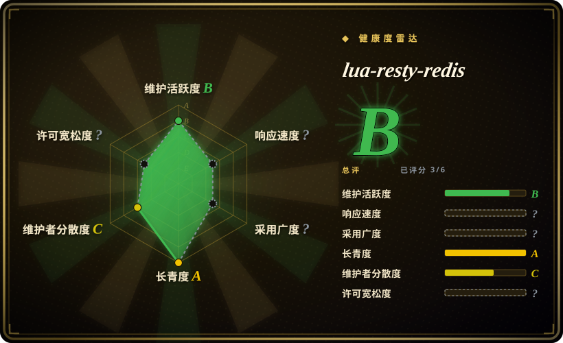
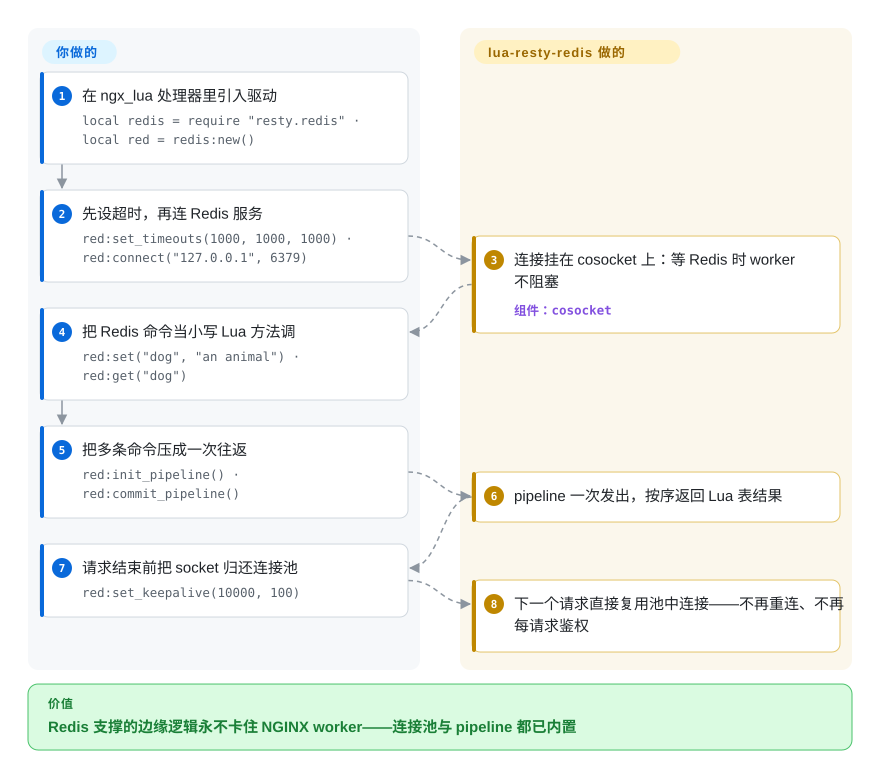

# lua-resty-redis

你想在 `access_by_lua` 处理器里查一个 Redis 计数器或会话 key，但普通 Lua Redis 客户端会阻塞——一次同步调用就卡住该 NGINX worker 正在服务的所有其它连接。lua-resty-redis 在 ngx_lua cosocket API 上讲 Redis 协议，你的调用协作式让出、worker 照常服务，并内建连接池（`set_keepalive`）和 pipeline。

## 何时使用

你在 OpenResty 里写边缘逻辑——限流器、会话/令牌校验、特性开关查询、源站前的 cache-aside——需要在请求热路径上访问 Redis。你不能用普通的阻塞 Redis 客户端，因为在 NGINX worker 里的同步调用会卡住该 worker 正在服务的所有其它连接。你 `local redis = require "resty.redis"`，建一个客户端，`red:connect("127.0.0.1", 6379)`，把命令当 Lua 方法调（`red:get(key)`、`red:set(...)`、`red:incr(...)`）——每次调用都在 cosocket 上协作式让出，所以 worker 在等 Redis 时仍继续服务其它请求。

它是从 `access_by_lua`/`content_by_lua` 处理器里访问 Redis 的标准方式，并自带生产所需的工效：`set_keepalive()` 把 socket 归还连接池而非每请求重连，`init_pipeline()`/`commit_pipeline()` 把命令批量打成一次往返。当你的网关逻辑——Kong/APISIX 风格或手写——需要 Redis 支撑的状态时，底下就是这个驱动。

## 怎么用起来

这个库是纯 Lua、自身没有 C 扩展：每条 Redis 命令都变成客户端对象上的一个小写 Lua 方法（`red:set(...)`、`red:get(...)`），而每一次 socket 操作都跑在 ngx_lua 的 **cosocket**（`ngx.socket.tcp`）上，与 NGINX 事件循环打通。你调用一条命令时，Lua 协程挂起；worker 先去服务其它请求，等 Redis 回包后再恢复你的协程，交回解析好的 RESP 值（失败时是 `nil` 加错误字符串，pipeline 返回 Lua 表）。连接复用是显式的：`set_keepalive(timeout, size)` 把 socket 归还给按 worker 划分的连接池，下一个请求直接领用、不重连也不重新鉴权；`init_pipeline()`/`commit_pipeline()` 把多条命令压成一次往返。仍然归你的：用 `set_timeouts` 设好超时以免慢 Redis 堆积请求、按 Redis `maxclients` 给连接池定容，以及所有集群/分片路由——这个驱动一次只对准一个连接。

<!-- flow-steps:begin (generated from flows/lua-resty-redis.json by tools/flow_card.py — do not edit) -->

流程文字版

1. **你**：在 ngx_lua 处理器里引入驱动 — `local redis = require "resty.redis" · local red = redis:new()`
2. **你**：先设超时，再连 Redis 服务 — `red:set_timeouts(1000, 1000, 1000) · red:connect("127.0.0.1", 6379)`
3. **lua-resty-redis**：连接挂在 cosocket 上：等 Redis 时 worker 不阻塞 — 组件：`cosocket`
4. **你**：把 Redis 命令当小写 Lua 方法调 — `red:set("dog", "an animal") · red:get("dog")`
5. **你**：把多条命令压成一次往返 — `red:init_pipeline() · red:commit_pipeline()`
6. **lua-resty-redis**：pipeline 一次发出，按序返回 Lua 表结果
7. **你**：请求结束前把 socket 归还连接池 — `red:set_keepalive(10000, 100)`
8. **lua-resty-redis**：下一个请求直接复用池中连接——不再重连、不再每请求鉴权

**价值**：Redis 支撑的边缘逻辑永不卡住 NGINX worker——连接池与 pipeline 都已内置

<!-- flow-steps:end -->

## 何时不用

- **你不在 OpenResty/ngx_lua 内。** 它依赖 cosocket API；它**不是**给普通 Lua、CLI 或其它运行时用的通用 Lua Redis 客户端。在 NGINX worker 之外它不工作。
- **你需要内建的 Redis Cluster 槽位路由。** 这个驱动对单个连接讲 Redis 线协议；集群拓扑、槽位映射、故障转移不归它管。要用 Cluster 就叠一个单独的 `lua-resty-redis-cluster` 之类的库，或自己处理路由。[未验证]
- **高层抽象 / ORM。** 它是薄命令驱动，不是缓存框架、锁管理器或对象映射。分布式锁、缓存击穿保护这类模式得你自己在它之上搭。
- **逐请求与 Redis 频繁来回。** 每请求多次顺序往返会给 worker 加延迟；把它们 pipeline 起来或重想访问模式——驱动很快，但网络模型仍在。
- **你忘了连接池。** 跳过 `set_keepalive()` 意味着每请求一次新 TCP 连接（可能还有 auth）——是常见的性能雷，不是库的缺陷。

## 横向对比

| 替代品 | 是否收录 | 我们的评价 | 取舍 |
|---|---|---|---|
| [lua-nginx-module](lua-nginx-module.zh.md) | ✅ | 不要把 lua-nginx-module 当 Redis 客户端；需要本驱动依赖的 ngx_lua 运行时和 cosocket API 时才选它。 | 它是基础而非替代品：没有 ngx_lua/OpenResty，本驱动无处运行。 |
| lua-resty-redis-cluster | 未收录 | Redis Cluster 槽位路由是硬需求时，在本驱动之上选 cluster wrapper。 | 单节点 lua-resty-redis 更简单；cluster 路由会多一层社区实现。 |
| OpenResty 套件里的 resty.redis | 未收录 | 与 ngx_lua 版本匹配比直接 vendor 本仓库更重要时，选 OpenResty 内置副本。 | 这通常是生产里拿到本库的方式。 |
| 阻塞式 Lua Redis 客户端（redis-lua） | 未收录 | 只在 NGINX worker 之外的普通 Lua 程序里，才选阻塞式 Lua 客户端。 | 它会阻塞，正好违背 NGINX 内所需的非阻塞 cosocket 设计。 |
| [Kong](../api-gateway/kong.zh.md) / [APISIX](../api-gateway/apisix.zh.md) | ✅ | 想要限流／缓存这类 Redis 支撑的*功能*、而不是自己拿驱动搭时，选这两个网关的对应插件；它们的 Lua 跑在同一块 ngx_lua 基质上。 | 更高层的功能层，经网关 API 配置；控制力不如手写 `resty.redis`，还要继承网关的升级节奏。 |

## 技术栈

- **语言：** 纯 Lua（OpenResty 下为 LuaJIT），自身无 C 扩展。
- **构建于：** ngx_lua 的 **cosocket** API（`ngx.socket.tcp`）——与 NGINX 事件循环集成的非阻塞 socket。
- **协议：** 直接讲 Redis 线协议（RESP）；命令以 Lua 方法暴露。
- **生产辅助：** 通过 `set_keepalive()` 做连接池，通过 `init_pipeline()`/`commit_pipeline()` 做 pipeline。

## 依赖

- **OpenResty / ngx_lua** 提供 cosocket API——硬性要求；没有它本库什么都干不了。
- **一个可达的 Redis 服务**（它是其客户端）——你自己跑。
- **无需 OpenResty 之外的额外 Lua 包**；它通常已在 OpenResty 发行版里。
- **运行时：** 跑在 NGINX worker 进程里——没有自己的独立进程或服务。

## 运维难度

**低（作为库）。** 驱动本身没东西要部署或运维——它是 OpenResty 加载的 Lua 代码，几乎总是已经打包好。运维上的讲究在*你怎么用*：始终 `set_keepalive()` 复用连接（按 worker 数和 Redis `maxclients` 给连接池定容）、设合理的 connect/read 超时以免慢 Redis 堆积请求、若 Redis 需要就处理 auth/TLS，并在本会频繁顺序调用处做 pipeline。难跑的是 **Redis 本身**（HA、持久化、内存）——驱动只是连上去。

## 健康度与可持续性

- **响应速度**：无法计算——no_traffic。
- **维护（2026-09）——活跃。** 最后 push **2026-09-18**；tag 线到 **v0.33**（2025-07-09，经 git tags API 核实）。GitHub 的 *releases* 界面仍把 v0.29（2020-10）列为最新正式发布——该仓库靠 tag 发版而非 releases。README 写「considered production ready」。未归档。
- **治理 / 背书。** `Organization` 所有（OpenResty / OpenResty Inc.）；与 ngx_lua 同一核心团队（agentzh 等）。开发**集中在 OpenResty 核心**——厂商/创始人主导，是个 bus-factor 考量，但它是其所服务平台的第一方工具，这降低了被弃风险。
- **年龄 × Lindy。** 2012-02 创建（约 14.6 年）且**仍在维护** ⇒ **强 Lindy** 信号 [推断]——它是 OpenResty 生态里规范、久经验证的 Redis 驱动，嵌在主流网关底下。老而活跃。
- **采用度。** 在 OpenResty/网关世界里很广（那里默认的 Redis 驱动）；约 2.0k star（2026-09-28 API 计数 1,955）低估了真实使用，因为它随 OpenResty 和网关产品一起分发。许可 BSD-2-Clause（读自 README：「licensed under the BSD license」，2 句文本，© 2012–2017 agentzh / OpenResty Inc.）。
- **风险标记。** 与 OpenResty 紧耦合（之外无用）和 OpenResty 核心集中是真正的风险；不内建 Cluster 路由是范围边界，而非健康红旗。未发现 relicense 历史。

## 存疑（未验证）

- [未验证] 约 75 个 open issue 是 2026-06 那轮数的，本轮未重新统计。本轮（2026-09-28）经 GitHub API 核实的：1,955 star、最后 push 2026-09-18、tag 到 **v0.33**（2025-07-09），而 releases 页面仍显示 **v0.29**（2020-10）为最新正式发布——该仓库靠 tag 发版，不走 releases。
- [未验证] 许可：GitHub API 未返回 SPDX id（`license: null`）；README 的「Copyright and License」写 **BSD**（2 句文本）——此处依据阅读该小节记为 BSD-2-Clause；未通过 API 定位到独立的 `LICENSE` 文件。
- [未验证] 不内建 Redis Cluster 支持；集群路由需要单独的库——具体方案/版本此处未核实。
- [推断]「OpenResty 核心集中 / 厂商主导」由共享的 OpenResty 贡献者群推断，而非治理文档。
- [推断] 健康度小节里「强 Lindy / 网关世界默认驱动、采用广泛 / 无 relicense 历史」是对仓库年龄、提交统计与 README 文字的启发式判读，不是治理文档、部署计数或法律审查。
