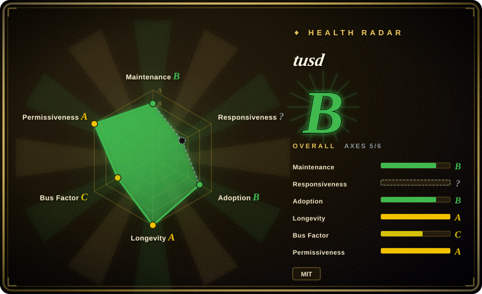
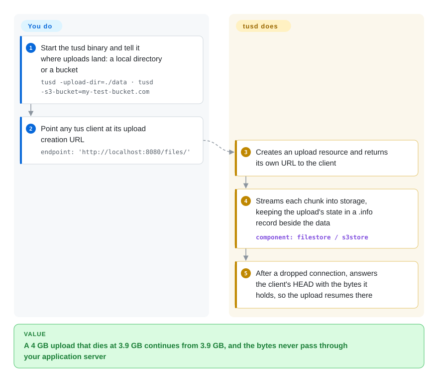

# tusd

A user's 4 GB video upload dies at 97% when the train enters a tunnel, and your multipart form handler makes them start again from zero. tusd is a standalone upload server that remembers how many bytes of each upload it already has, so any tus client can resume from exactly that point, while the bytes stream straight into disk or S3/GCS/Azure instead of through your app.

## When to use

You're building a web or mobile app where users upload large files — videos, raw photos, backups — and uploads keep failing on spotty Wi-Fi, mobile network handoffs, or users closing the app mid-transfer. Your support inbox has "it got to 95% and started over" tickets, and your app servers spend their worker slots holding slow upload connections open. You want a protocol, not a homemade chunking scheme, so that when a transfer breaks the client asks the server "how much do you have?" and continues from there. You run tusd as its own HTTP service (or embed its handler in a Go service), point the front end's `tus-js-client` or Uppy at its `/files/` endpoint, and send the bytes to local disk or a bucket. Your application only hears about uploads through hooks — a `pre-create` call to authorize, a `post-finish` call when the file is complete.

Pick tusd over S3 presigned multipart uploads when you want one open protocol across web, iOS, Android and CLI clients and storage you can switch, rather than client code tied to one cloud's API; pick it over a framework upload handler when files are big enough that resumability and keeping slow connections off your app servers matter.

## How it works

tus is an open HTTP protocol for resumable uploads: the client first `POST`s to create an upload and gets back a URL for it, then sends the bytes with `PATCH` requests; if the connection drops, it sends a `HEAD` to learn the current offset (how many bytes the server already has) and continues from there. **tusd implements the server side of that protocol for you** — it creates upload resources, streams incoming bytes into the storage backend you configured, keeps each upload's state in a JSON `.info` file or object next to the data, and holds a per-upload lock so two overlapping requests for the same upload cannot corrupt it. **You choose** the storage backend with CLI flags, put it behind your reverse proxy, and connect your application through hooks: small programs, HTTP endpoints, gRPC services or Go plugins that tusd calls at points such as `pre-create` (accept or reject an upload) and `post-finish` (hand the finished file to your pipeline). It is like a coat check that keeps a ticket for every partial delivery: the courier can leave and return, show the ticket, and keep adding to the same pile.

<!-- flow-steps:begin (generated from flows/tusd.json by tools/flow_card.py — do not edit) -->

Text version of the flow

1. **You**: Start the tusd binary and tell it where uploads land: a local directory or a bucket — `tusd -upload-dir=./data · tusd -s3-bucket=my-test-bucket.com`
2. **You**: Point any tus client at its upload creation URL — `endpoint: 'http://localhost:8080/files/'`
3. **tusd**: Creates an upload resource and returns its own URL to the client
4. **tusd**: Streams each chunk into storage, keeping the upload's state in a .info record beside the data — component: `filestore / s3store`
5. **tusd**: After a dropped connection, answers the client's HEAD with the bytes it holds, so the upload resumes there

**Value**: A 4 GB upload that dies at 3.9 GB continues from 3.9 GB, and the bytes never pass through your application server

<!-- flow-steps:end -->

## When NOT to use

- **Small files on reliable networks.** If uploads are a few MB over stable connections, a standard multipart form POST handled by your framework is simpler — no extra service, no hooks to wire up.
- **Your clients can upload straight to the bucket.** If every client can use S3/GCS presigned URLs and the cloud SDK's multipart upload, the bytes skip your infrastructure entirely; use that instead of adding a tusd hop. tusd earns its place when you need one protocol across many client platforms or storage you can swap.
- **You plan to scale out across several instances without sticky routing.** tusd's locks are either PID files on local disk or in-process mutexes (the default for S3/GCS/Azure), and the docs state there is no built-in distributed lock yet. Behind a round-robin load balancer, a client's resume can hit another instance while the first is still writing, risking corrupted uploads. Use sticky sessions, the separately maintained `tusd-etcd3-locker`, or embed the handler in a Go service where you supply your own locker.
- **You need one server writing to different backends per tenant or file size.** The tusd binary loads one storage backend at startup and cannot switch dynamically; route between backends by embedding `github.com/tus/tusd/v2/pkg/handler` in your own Go service with several handlers, or run several tusd instances.
- **You need NGINX itself to take the upload at the edge.** tusd is a standalone HTTP server, not an NGINX module; it sits behind NGINX as a proxy target (with request buffering off). If the requirement is that NGINX writes the body to disk without another service, use [nginx-upload-module](nginx-upload-module.md) — at the cost of resumability.
- **Your stack has no Go and you want the upload server inside your Node app.** tus also maintains `@tus/server` (tus-node-server), which mounts into Express/Fastify/Next.js; use it rather than operating a separate Go binary.
- **No ops bandwidth for another service.** Even as a single binary, tusd needs deploying, TLS, monitoring (it exposes `/metrics`), cleanup of abandoned uploads, and upgrades.

## Comparison

| Alternative | In index | Our verdict | Tradeoff |
|---|---|---|---|
| [nginx-upload-module](nginx-upload-module.md) | ✅ | When NGINX itself must stream multipart uploads to disk with no extra service, pick nginx-upload-module; when interrupted uploads must resume, pick tusd. | No separate service, but a low-activity third-party C module without the tus resume protocol. |
| tus-node-server (`@tus/server`) | not indexed | When your backend is Node.js and you want the tus server mounted inside it, pick tus-node-server; pick tusd for a standalone binary independent of your app's language. | Same protocol and store types from the same organization, but runs in your Node process instead of beside it. |
| Direct-to-S3 presigned (multipart) uploads | not indexed | When all clients can talk to one cloud's object storage, pick presigned uploads and skip the server hop; pick tusd when you need a vendor-neutral protocol across many client platforms. | Best scalability and no upload tier to run, but client code is tied to one provider's multipart API. |
| Framework upload handling (Django/Rails/Express) | not indexed | When uploads are small and rare and ops time is the binding constraint, keep them in the framework; pick tusd once large files and flaky networks make restarts costly. | Zero extra infrastructure, but slow clients occupy app workers and a failed upload restarts from zero. |
| Uppy | not indexed | When the missing piece is the browser upload UI, add Uppy — it is a client and usually pairs with tusd rather than replacing it. | Polished widget with a tus plugin, but no server: it still needs tusd or another tus server behind it. |
| Resumable.js | not indexed | When a legacy app already uses Resumable.js chunking, keep it; for new work pick tusd, because tus is an open protocol with maintained clients on many platforms. | A simple browser-side chunking library, but its server half is yours to write and it has no cross-platform protocol. |

## Tech stack

- **Language:** Go — ships as a single static binary and as Docker image `tusproject/tusd`.
- **Protocol:** tus resumable upload protocol 1.0.0 over HTTP/1.1 and HTTP/2 (`POST` to create, `PATCH` to append, `HEAD` for the offset, `DELETE` to terminate); extensions creation, creation-with-upload, termination, concatenation, creation-defer-length.
- **Storage backends:** local disk (`filestore`), Amazon S3 and S3-compatible stores via `-s3-endpoint` (e.g. MinIO), Google Cloud Storage, Azure Blob Storage.
- **Locking:** `filelocker` (PID files) or `memorylocker` (in-process).
- **Hooks:** `pre-create`, `post-create`, `post-receive`, `pre-finish`, `post-finish`, `pre-terminate`, `post-terminate`, delivered as executable files (`-hooks-dir`), HTTP(S) (`-hooks-http`, 15 s timeout and 3 retries by default), gRPC (`-hooks-grpc`) or Go plugins.
- **Embedding:** `github.com/tus/tusd/v2/pkg/handler` plus the store and locker packages; Prometheus metrics at `/metrics`.

## Dependencies

- **A place to run the binary** — a container, systemd service or Kubernetes deployment; Go is only needed if you embed or build it.
- **A storage backend** — a local directory (default `./data`) or bucket credentials for S3/S3-compatible, GCS or Azure.
- **No database** — upload state lives in the `.info` file/object beside each upload's data in the storage backend.
- **Typically a reverse proxy** — NGINX, Traefik or Caddy for TLS and routing, configured not to buffer request bodies.
- **Your hook receiver** — if you want authorization or post-processing, an endpoint or script that tusd calls.

## Ops difficulty

**Low to medium.** One binary, one port, flags instead of a config file. The work sits in four places. **Storage permissions:** getting the S3 IAM policy right for multipart uploads, and a lifecycle rule for abandoned multipart parts. **Hooks:** `pre-create` and `pre-finish` block the upload, so a slow hook endpoint stalls clients — tune `-hooks-http-timeout` and retries. **Reverse proxy:** start tusd with `-behind-proxy`, turn off the proxy's request buffering, and raise body-size limits and timeouts for long `PATCH` requests. **Scaling and cleanup:** more than one instance needs sticky routing or an external locker, and finished uploads' `.info` files are not deleted automatically, so cleanup of old and abandoned uploads is yours. Once configured, it runs quietly.

## Health & viability

- **Maintenance (2026-10) — steady, fix-driven (grade B).** v2.10.1 shipped 2026-09-16 after v2.10.0 (2026-06-16) and v2.9.x (February–March 2026); before that came a ten-month gap after v2.8.0 (April 2025). Commits landed in 3 of the last 13 weeks, about half of them dependency bumps. It is in maintenance mode around a stable protocol rather than feature growth.
- **Responsiveness — not scorable this run.** The scorer found no qualifying recent issue/PR window (the previous run graded it A on a small PR sample); 85 open issues as of 2026-10-08.
- **Governance / bus factor (grade C).** 12 people committed in the last 12 months, but one maintainer (Acconut) wrote ~66% of those commits and the top three ~80%. The repo belongs to the `tus` organization, which also runs the protocol spec and client libraries, but day-to-day stewardship rests largely on one person.
- **Backing & longevity (grade A).** Created March 2013 (~13.5 years) and still releasing — a strong Lindy prior — with a protocol at 1.0.0 that several independent servers and clients implement, so even a slowdown here would not strand your clients.
- **Adoption (grade B).** 120 dependent Go modules and ~1.1M release-asset downloads; Uppy and tus-js-client are its usual front ends.
- **Risk flags.** MIT, no relicense history, no open-core gating found.

## Caveats (unverified)

- [未验证] ~3.9k stars / 555 forks / 85 open issues as of 2026-10-08 — volatile.
- [推断] Transloadit's backing is inferred from the tus project's history and its maintainers' affiliations, not from a written commitment in the repo.
- [推断] "Maintenance mode around a stable protocol" is a reading of the 2025–2026 release notes (mostly fixes, few features) and the dependabot share of recent commits.
- [未验证] `tusd-etcd3-locker` is linked from tusd's docs as a distributed-lock option; its maintenance state and compatibility with tusd v2 were not checked.
- [未验证] Azure and GCS backends are documented; their feature parity with the S3 backend was not verified against code.
