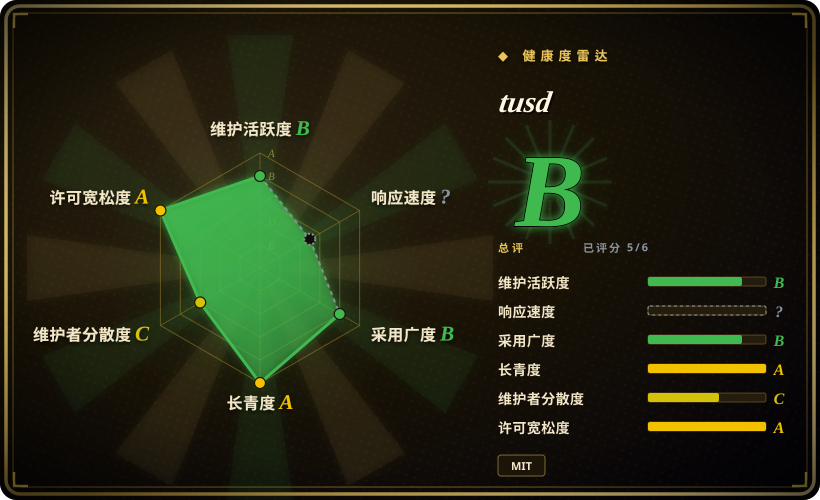
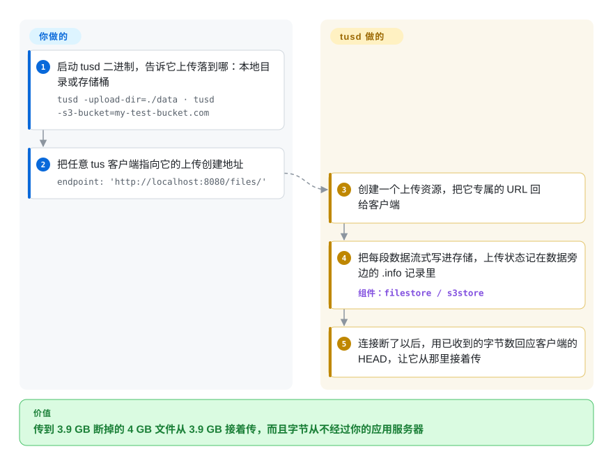

# tusd

用户传一个 4 GB 的视频，火车进隧道时断在 97%，你的 multipart 表单接口只能让他从零重来。tusd 是一个独立的上传服务器，它记得每个上传已经收到多少字节，任何 tus 客户端都能从那个位置接着传；字节直接流进磁盘或 S3/GCS/Azure，不经过你的应用。

## 何时使用

你在做一个 Web 或移动应用，用户要上传大文件——视频、RAW 照片、备份——而 Wi-Fi 不稳、移动网络切换、用户中途关掉应用都会让上传失败。客服邮箱里全是“传到 95% 又从头开始了”，应用服务器的 worker 也被慢吞吞的上传连接占满。你要的是一个协议，而不是自己拼的分块方案：传输断了，客户端问服务器“你收到多少了”，然后从那里继续。你把 tusd 作为独立的 HTTP 服务运行（或者把它的 handler 嵌进一个 Go 服务），前端的 `tus-js-client` 或 Uppy 指向它的 `/files/` 端点，字节落到本地磁盘或存储桶。你的应用只通过钩子知道上传的存在——`pre-create` 时调用一次做鉴权，`post-finish` 时调用一次通知文件已完整。

比起 S3 预签名分块上传，当你想让 Web、iOS、Android、命令行客户端共用一个开放协议、存储也能换，而不是把客户端代码绑死在某一家云的 API 上时，选 tusd；比起框架自带的上传处理，当文件大到断点续传、以及把慢连接挡在应用服务器之外变得重要时，选 tusd。

## 怎么用起来

tus 是一个用于断点续传的开放 HTTP 协议：客户端先 `POST` 创建一个上传，拿回这个上传专属的 URL，再用 `PATCH` 请求发送字节；连接断了，就发一个 `HEAD` 查询当前偏移量（服务器已经收到多少字节），从那里继续。**tusd 替你实现了这个协议的服务端**——创建上传资源，把收到的字节流式写进你配置的存储后端，把每个上传的状态记在数据旁边的 JSON `.info` 文件或对象里，并给每个上传加锁，防止同一上传的两个重叠请求把数据写坏。**你负责**用命令行参数选存储后端、把它放到反向代理后面，再用钩子接上你的应用：钩子可以是小程序、HTTP 端点、gRPC 服务或 Go 插件，tusd 在 `pre-create`（接受或拒绝一个上传）、`post-finish`（把完成的文件交给你的处理流程）等时机调用它们。打个比方，它像一个给每次零散送货都开票据的寄存处：送货的人可以走开再回来，出示票据，接着往同一堆里添。

<!-- flow-steps:begin (generated from flows/tusd.json by tools/flow_card.py — do not edit) -->

流程文字版

1. **你**：启动 tusd 二进制，告诉它上传落到哪：本地目录或存储桶 — `tusd -upload-dir=./data · tusd -s3-bucket=my-test-bucket.com`
2. **你**：把任意 tus 客户端指向它的上传创建地址 — `endpoint: 'http://localhost:8080/files/'`
3. **tusd**：创建一个上传资源，把它专属的 URL 回给客户端
4. **tusd**：把每段数据流式写进存储，上传状态记在数据旁边的 .info 记录里 — 组件：`filestore / s3store`
5. **tusd**：连接断了以后，用已收到的字节数回应客户端的 HEAD，让它从那里接着传

**价值**：传到 3.9 GB 断掉的 4 GB 文件从 3.9 GB 接着传，而且字节从不经过你的应用服务器

<!-- flow-steps:end -->

## 何时不用

- **小文件、网络可靠。** 如果上传只有几 MB、连接也稳定，框架处理的普通 multipart 表单 POST 更简单——不用多一个服务，也不用接钩子。
- **客户端可以直传存储桶。** 如果每个客户端都能用 S3/GCS 预签名 URL 和云 SDK 的分块上传，字节就完全绕开你的基础设施；那就直传，别再加一跳 tusd。tusd 的价值在于多种客户端平台共用一个协议，或者存储可以替换。
- **你打算多实例横向扩展，又没有粘性路由。** tusd 的锁要么是本地磁盘上的 PID 文件，要么是进程内互斥锁（S3/GCS/Azure 的默认），文档明说目前没有内置分布式锁。放在轮询负载均衡后面，客户端的续传请求可能打到另一个实例，而前一个实例还在写，上传可能被写坏。用粘性会话、单独维护的 `tusd-etcd3-locker`，或者把 handler 嵌进 Go 服务、自己提供锁实现。
- **你需要一个服务器按租户或文件大小写到不同后端。** tusd 二进制启动时只加载一个存储后端，不能动态切换；要在多个后端间路由，就把 `github.com/tus/tusd/v2/pkg/handler` 嵌进自己的 Go 服务、建多个 handler，或者跑多个 tusd 实例。
- **你需要 NGINX 自己在边缘接住上传。** tusd 是独立 HTTP 服务器，不是 NGINX 模块；它作为代理目标坐在 NGINX 后面（要关掉请求缓冲）。如果硬要求是“NGINX 直接把请求体落盘、不加别的服务”，用 [nginx-upload-module](nginx-upload-module.zh.md)——代价是没有断点续传。
- **你的技术栈没有 Go，想把上传服务器放进 Node 应用里。** tus 组织还维护 `@tus/server`（tus-node-server），可以挂进 Express/Fastify/Next.js；用它，而不是另外运维一个 Go 二进制。
- **没有运维带宽再管一个服务。** 即便只是一个二进制，tusd 也要部署、配 TLS、监控（它暴露 `/metrics`）、清理被放弃的上传、做升级。

## 横向对比

| 替代品 | 是否收录 | 我们的评价 | 取舍 |
|---|---|---|---|
| [nginx-upload-module](nginx-upload-module.zh.md) | ✅ | 必须让 NGINX 自己把 multipart 上传流式落盘、不加额外服务时，选 nginx-upload-module；中断的上传必须能续传时，选 tusd。 | 不用额外服务，但它是低活跃的第三方 C 模块，没有 tus 续传协议。 |
| tus-node-server（`@tus/server`） | 未收录 | 后端是 Node.js、想把 tus 服务器挂进应用里时，选 tus-node-server；想要一个与应用语言无关的独立二进制时，选 tusd。 | 同一个组织出的同一协议、同类存储，但它跑在你的 Node 进程里，而不是旁边。 |
| 直传 S3 预签名（分块）上传 | 未收录 | 所有客户端都能直连同一家云的对象存储时，选预签名上传、省掉服务器这一跳；需要跨多种客户端平台的厂商中立协议时，选 tusd。 | 扩展性最好，也不用运维上传层，但客户端代码绑定某一家的分块上传 API。 |
| 应用框架上传处理（Django/Rails/Express） | 未收录 | 上传又小又少、运维时间才是硬约束时，留在框架里处理；一旦大文件加不稳定网络让重传代价变高，换 tusd。 | 不加任何基础设施，但慢客户端占着应用 worker，上传失败就得从零重来。 |
| Uppy | 未收录 | 缺的是浏览器上传界面时，加上 Uppy——它是客户端，通常与 tusd 搭配，而不是替代它。 | 精致的组件，带 tus 插件，但没有服务端：背后仍需要 tusd 或别的 tus 服务器。 |
| Resumable.js | 未收录 | 老应用已经在用 Resumable.js 分块，就继续用；新项目选 tusd，因为 tus 是开放协议，各平台都有维护中的客户端。 | 简单的浏览器端分块库，但服务端那一半要你自己写，也没有跨平台协议。 |

## 技术栈

- **语言：** Go——以单个静态二进制和 Docker 镜像 `tusproject/tusd` 发布。
- **协议：** tus 断点续传协议 1.0.0，跑在 HTTP/1.1 和 HTTP/2 上（`POST` 创建、`PATCH` 追加、`HEAD` 查偏移、`DELETE` 终止）；扩展包括 creation、creation-with-upload、termination、concatenation、creation-defer-length。
- **存储后端：** 本地磁盘（`filestore`）、Amazon S3 以及经 `-s3-endpoint` 接入的 S3 兼容存储（如 MinIO）、Google Cloud Storage、Azure Blob Storage。
- **锁：** `filelocker`（PID 文件）或 `memorylocker`（进程内）。
- **钩子：** `pre-create`、`post-create`、`post-receive`、`pre-finish`、`post-finish`、`pre-terminate`、`post-terminate`，投递方式有可执行文件（`-hooks-dir`）、HTTP(S)（`-hooks-http`，默认 15 秒超时、重试 3 次）、gRPC（`-hooks-grpc`）和 Go 插件。
- **嵌入：** `github.com/tus/tusd/v2/pkg/handler` 加各存储与锁的包；Prometheus 指标在 `/metrics`。

## 依赖

- **运行二进制的地方**——容器、systemd 服务或 Kubernetes 部署；只有嵌入或自行编译时才需要 Go。
- **一个存储后端**——本地目录（默认 `./data`），或 S3/S3 兼容、GCS、Azure 的存储桶凭证。
- **不需要数据库**——上传状态存在存储后端里、每个上传数据旁边的 `.info` 文件/对象中。
- **通常还有反向代理**——NGINX、Traefik 或 Caddy 做 TLS 和路由，并配置为不缓冲请求体。
- **你的钩子接收方**——要做鉴权或后处理，就需要一个供 tusd 调用的端点或脚本。

## 运维难度

**低到中等。** 一个二进制、一个端口，用命令行参数而不是配置文件。工作量在四处。**存储权限：** 给 S3 分块上传配对 IAM 策略，再加一条清理被放弃分块的生命周期规则。**钩子：** `pre-create` 和 `pre-finish` 会阻塞上传，钩子端点一慢客户端就卡住——要调 `-hooks-http-timeout` 和重试。**反向代理：** 用 `-behind-proxy` 启动 tusd，关掉代理的请求缓冲，为长时间的 `PATCH` 请求放宽请求体大小和超时。**扩展与清理：** 多于一个实例就需要粘性路由或外部锁；完成上传的 `.info` 文件不会自动删除，旧上传和被放弃的上传要你自己清理。配好之后它跑得很安静。

## 健康度与可持续性

- **维护（2026-10）——稳定，以修复为主（B 级）。** v2.10.1 于 2026-09-16 发布，之前是 v2.10.0（2026-06-16）和 v2.9.x（2026 年 2–3 月）；再往前，v2.8.0（2025 年 4 月）之后空了十个月。最近 13 周有 3 周有提交，其中约一半是依赖升级。它处在围绕稳定协议的维护模式，而不是功能扩张期。
- **响应速度——本次无法评分。** 评分器在近期找不到符合条件的 issue/PR 窗口（上一次评分基于少量 PR 样本给了 A）；截至 2026-10-08 有 85 个 open issue。
- **治理与 bus factor（C 级）。** 过去 12 个月有 12 人提交，但一位维护者（Acconut）贡献了约 66% 的提交，前三名约 80%。仓库属于 `tus` 组织，它同时负责协议规范和客户端库，但日常维护主要压在一个人身上。
- **背书与长期性（A 级）。** 2013 年 3 月创建（约 13.5 年），至今仍在发布——Lindy 先验很强；协议已到 1.0.0，有多个独立的服务端和客户端实现，即便这里放缓，你的客户端也不会被困住。
- **采用度（B 级）。** 120 个依赖它的 Go 模块，发布资产下载约 110 万次；常见的前端搭档是 Uppy 和 tus-js-client。
- **风险标记。** MIT，没有改许可证的历史，没发现 open-core 功能阉割。

## 存疑（未验证）

- [未验证] 截至 2026-10-08 约 3.9k star、555 fork、85 个 open issue——易变。
- [推断] Transloadit 的背书是根据 tus 项目的历史和维护者的所属机构推断的，仓库里没有书面承诺。
- [推断]“围绕稳定协议的维护模式”是对 2025–2026 年 release notes（以修复为主、功能很少）和近期提交中 dependabot 占比的解读。
- [未验证] `tusd-etcd3-locker` 在 tusd 文档里被列为分布式锁选项；它的维护状态以及与 tusd v2 的兼容性没有核查。
- [未验证] Azure 和 GCS 后端有文档，但与 S3 后端的功能对等性没有对照代码核实。
