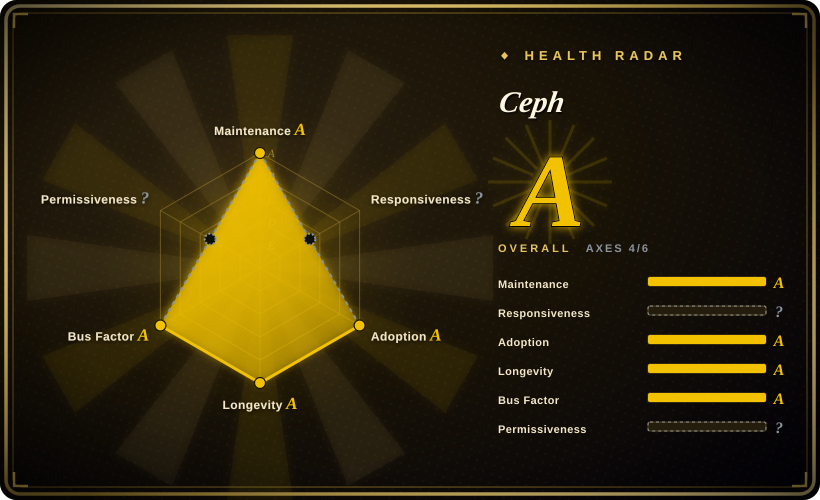
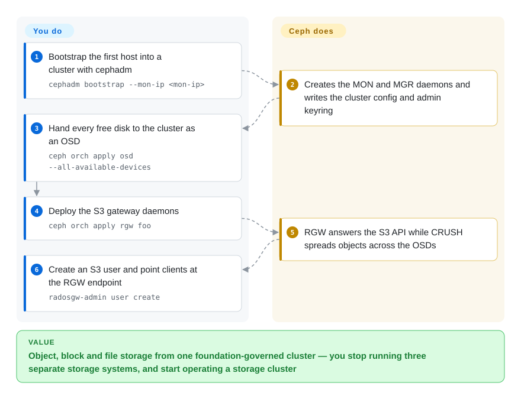

# Ceph

The foundation-governed distributed storage platform that gives you S3 (RGW), block (RBD) and file (CephFS) from one cluster — in exchange for operating a real storage cluster instead of a single binary.

## When to use

You need object storage, but you also need — or will soon need — block devices and a shared filesystem from the same pool of hardware, and your organization values foundation governance and a decade-plus support record over a minimal install. Ceph is the platform for that: RADOS underneath, with the Object Gateway (RGW) providing an S3-compatible endpoint, RBD providing virtual block devices, and CephFS providing a POSIX filesystem, all spread across commodity servers with no single point of failure. You deploy it with `cephadm` (or a Kubernetes operator such as Rook), hand it raw disks as OSDs, deploy RGW daemons, and create S3 users. The deciding tradeoff against its closest substitutes is *breadth versus weight*: [Silo](silo.md)/[MinIO](minio.md) give you one S3 server you can run in an afternoon, [Garage](garage.md) gives you multi-site S3 with a fraction of Ceph's machinery, and [SeaweedFS](seaweedfs.md) gives you object+filesystem with a lighter Go footprint — none of them give you RBD, CephFS, erasure-coded durability across hundreds of OSDs with CRUSH placement, or a non-profit foundation behind the project. If what you actually need is only "an S3 bucket on my hardware", Ceph is the wrong amount of tool.

## How it works

Ceph splits storage into daemons: **MON** keeps the cluster map and quorum, **MGR** runs the management modules, **OSD** daemons own the disks and do the actual reads/writes, and **RGW** is a stateless gateway that speaks S3 at the front. Data placement is handled by CRUSH, which maps objects to OSDs algorithmically, so clients can compute where data lives instead of asking a metadata server. Bootstrap with `cephadm bootstrap --mon-ip <mon-ip>` creates the first MON and MGR and writes `/etc/ceph/ceph.conf` plus the admin keyring; you then add hosts, claim disks with `ceph orch apply osd --all-available-devices`, and deploy gateways with `ceph orch apply rgw <name>`. S3 users are created with `radosgw-admin user create --uid=… --display-name=…`, and after that any S3 client works against the RGW endpoint. The line between you and the project: Ceph gives you the placement algorithm, replication/erasure coding, self-healing, the S3 API and orchestration tooling; you own the cluster's hardware plan, network, failure domains and upgrades — which is the actual cost of using it.

<!-- flow-steps:begin (generated from flows/ceph.json by tools/flow_card.py — do not edit) -->

Text version of the flow

1. **You**: Bootstrap the first host into a cluster with cephadm — `cephadm bootstrap --mon-ip <mon-ip>`
2. **Ceph**: Creates the MON and MGR daemons and writes the cluster config and admin keyring
3. **You**: Hand every free disk to the cluster as an OSD — `ceph orch apply osd --all-available-devices`
4. **You**: Deploy the S3 gateway daemons — `ceph orch apply rgw foo`
5. **Ceph**: RGW answers the S3 API while CRUSH spreads objects across the OSDs
6. **You**: Create an S3 user and point clients at the RGW endpoint — `radosgw-admin user create`

**Value**: Object, block and file storage from one foundation-governed cluster — you stop running three separate storage systems, and start operating a storage cluster

<!-- flow-steps:end -->

## When NOT to use

- **All you need is an S3 endpoint for one application.** Running a Ceph cluster for one bucket is the classic overkill. Use [Silo](silo.md) (or [MinIO](minio.md)'s lineage), [Garage](garage.md) or [SeaweedFS](seaweedfs.md) — one process instead of a cluster.
- **You do not have a storage team or the hardware to spare.** Ceph's value depends on failure domains: multiple hosts, spare capacity, and someone to watch recovery, CRUSH and upgrades. Without that, choose a simpler store or a hosted service; with it, Ceph rewards you.
- **You need a small, easy footprint or a build-from-source Go binary.** Ceph is a large C++ project with its own packaging, container images and orchestration. For a single binary, use Go stores ([Silo](silo.md), [SeaweedFS](seaweedfs.md)) or Rust ([Garage](garage.md)).
- **You mainly need many small files served cheaply.** SeaweedFS's append-only-volume model is purpose-built for object count; Ceph's RADOS objects are the right substrate at a different granularity. Choose [SeaweedFS](seaweedfs.md) for the small-file case.
- **You need multi-site S3 over unreliable links with cheap heterogeneous machines.** Ceph can do multi-site RGW, but it assumes clusters you operate deliberately; [Garage](garage.md) is designed for the flaky-link, mismatched-hardware case.
- **You need a drop-in MinIO replacement.** Ceph has its own architecture and RGW's S3 behaviour is its own; a MinIO data disk does not mount into it. Use [Silo](silo.md) for drop-in continuity.
- **You need the newest features immediately.** A major release lands roughly annually and fixes are backported to the last two releases only; if you depend on bleeding-edge capabilities or very fast fixes, that cadence is a constraint.

## Comparison

| Alternative | In index | Our verdict | Tradeoff |
|---|---|---|---|
| [Silo](silo.md) | ✅ | Choose Silo when the job is "an S3 endpoint with MinIO's exact behaviour and format" and you want a single binary; choose Ceph when you need object plus block plus file and foundation-backed governance. | Silo buys drop-in compatibility and a tiny operational surface; Ceph buys unified storage, scale and a non-profit foundation, and charges a cluster to operate. |
| [SeaweedFS](seaweedfs.md) | ✅ | Choose SeaweedFS when the pressure is object count and you want a lighter Go stack with a filesystem face; choose Ceph when you need block storage, CRUSH-based durability at large scale, and multi-vendor governance. | SeaweedFS is a smaller operational footprint tuned for small files; Ceph is a broader platform with block/file services and a much heavier ops bill. |
| [Garage](garage.md) | ✅ | Choose Garage when the cluster is a few unreliable sites and the requirement is multi-site S3 with minimal machinery; choose Ceph when the requirement is a serious single (or multisite) storage platform with block and file services. | Garage trades scale and services for simplicity and link tolerance; Ceph trades simplicity for breadth, scale and governance. |
| [MinIO](minio.md) | ✅ | Do not pick MinIO for new deployments — it is archived. If you liked its simplicity, [Silo](silo.md) continues it; if you need more than S3, Ceph is the governed platform choice. | MinIO is a frozen single binary; Ceph is an actively maintained distributed platform with far more capability and cost. |
| AWS S3 / Cloudflare R2 | not indexed | Choose hosted S3 when you never want to own disks or a cluster; choose Ceph when data residency, on-prem latency, per-GB economics or air-gapped operation force you to run your own storage. | Hosted removes all operators and adds egress bills, lock-in and data-residency limits; Ceph removes those and makes durability, capacity planning and upgrades your responsibility. |

## Tech stack

- **Language:** C++ (with Python tooling for orchestration, e.g. `cephadm` and the dashboard).
- **Architecture:** RADOS object store as the base layer; CRUSH for deterministic placement; MON/MGR/OSD daemons for cluster state, management and data; RGW daemons for the S3/Swift object gateway; MDS for CephFS; iSCSI/NVMe-oF and NFS gateways for other protocols.
- **Deployment:** `cephadm` (container-based orchestration) is the current default; packages exist for major distributions; Kubernetes deployments typically use the Rook operator. The RGW endpoint supports HTTPS via cephadm-managed certificates and HA via the `ingress` service (haproxy + keepalived).
- **S3 surface:** RGW implements the S3 API with users/keys/subusers, quotas, rate limits, bucket policies, versioning, Object Lock and multisite replication; administration is via `radosgw-admin` and the dashboard.
- **Licensing:** most of Ceph is dual-licensed **LGPL-2.1 or LGPL-3**, with some BSD/public-domain and some GPL components; documentation is CC-BY-SA-3.0. This is markedly more permissive than AGPL for embedding.
- **Governance/quality:** hosted and funded by the non-profit Ceph Foundation; the repository carries an OpenSSF Best Practices badge.

## Dependencies

- **Multiple servers with local disks** for a production cluster — MON quorum (3 or 5), enough OSDs to make erasure coding or replication meaningful, and spare capacity for recovery. A single host works only for evaluation (`--single-host-defaults`).
- **A container runtime** (Podman or Docker) with **Python 3, systemd, LVM2 and time synchronization** — cephadm deploys daemons as containers.
- **SSH connectivity between hosts** for cephadm to distribute configuration and keys.
- **A network plan** separating public (client) and cluster (replication/recovery) traffic for larger clusters; the `cephadm bootstrap` step needs the first host's monitor IP.
- **Optional but common:** Rook (on Kubernetes) as the operator, an HA ingress (haproxy + keepalived) in front of RGW, KMS for encryption, and a Prometheus/Grafana stack for monitoring.
- **Client side:** any S3 SDK against RGW, `librbd`/kernel RBD for block, and the Ceph kernel client or FUSE for CephFS.

## Ops difficulty

**High.** This is the defining property: Ceph is a distributed system you operate, not a service you install. You plan failure domains and device classes, choose between replication and erasure coding, watch rebalancing and recovery (which competes with client I/O), manage MON quorum and upgrades across many daemons, and size hardware for peak recovery. `cephadm` and Rook have made day-1 deployment far easier than the old days, and the project publishes security checklists and hardware guidance — but the day-2 burden remains the reason people choose minimal stores for simple S3 needs. Budget for expertise, not just hardware.

## Health & viability

- **Maintenance (2026-09-20).** Very active and mature. Current major line v21: `v21.0.0` (2026-03-25) and `v21.3.0` (2026-06-10); the previous major was v20 (`v20.3.0`, 2025-04). Ceph ships a major release roughly annually and backports security and bug fixes to the last two releases (per its SECURITY.md), with commits on the default branch on 2026-09-20.
- **Governance / bus factor (2026-09-20).** The strongest governance story in this category: the project is funded and hosted by the non-profit Ceph Foundation (under the Linux Foundation umbrella), with development contributed by many vendors and institutions — the contributor list spans more than a hundred accounts, led by long-tenured engineers rather than a single vendor's roadmap. For a selection decision, that means the project does not depend on one person or one company continuing.
- **Backing & Lindy (2026-09-20).** Created 2011-09-01 — about 15 years — with continuous activity and production use the whole time, making it the archetypal Lindy-positive bet in this category (both age and current activity). It also carries an OpenSSF Best Practices badge and a documented, annual release process.
- **Adoption & ecosystem (2026-09-20).** ~17k stars on `ceph/ceph`, ~6.5k forks, 622 watchers, and a very large deployment base (service providers, research, on-prem clouds) plus an ecosystem of operators (Rook), distributions and monitoring integrations. Documentation is extensive and multiple books/guides exist.
- **Risk flags (2026-09-20).** Operational complexity is the real risk, not project health; a major release roughly yearly with support for the last two releases constrains how long you can stay on a version; the open-issue count is large (~1,455 on the repository) as is normal for a project this size; licensing is LGPL (permissive-ish, and friendly to embedding compared with AGPL). No relicense controversy.

## Caveats (unverified)

- [未验证] The "v21 is the current stable major and v20 the previous" reading is inferred from tag dates and Ceph's stated cadence of one major release per year with backports to the last two releases; the project's releases page was not fetched to confirm the exact active/EOL window.
- [未验证] The exact licence mix by file comes from the repository's `COPYING` inventory (mostly LGPL-2.1-or-LGPL-3, with some GPL and BSD components, docs under CC-BY-SA-3.0); GitHub reports the repository licence as "NOASSERTION", so the frontmatter's `LGPL-2.1` is a summarization, not an SPDX determination for the whole tree.
- [未验证] The RGW S3 feature list (multisite, bucket policies, Object Lock, quotas, rate limits) is taken from Ceph's admin and RGW documentation; no compatibility test against a specific application was run.
- [推断] Contributor-count statements use the GitHub contributors endpoint, which caps at 100 accounts returned and includes bots; they indicate breadth, not the number of active maintainers.
- [未验证] No benchmark or capacity-planning numbers are asserted here; Ceph's performance depends heavily on hardware, network and pool configuration.
