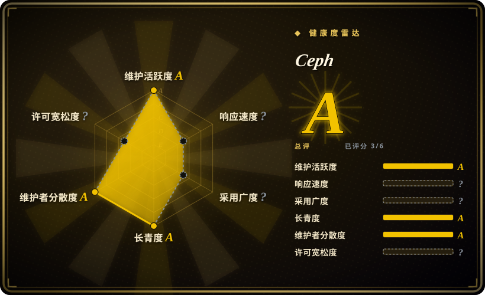
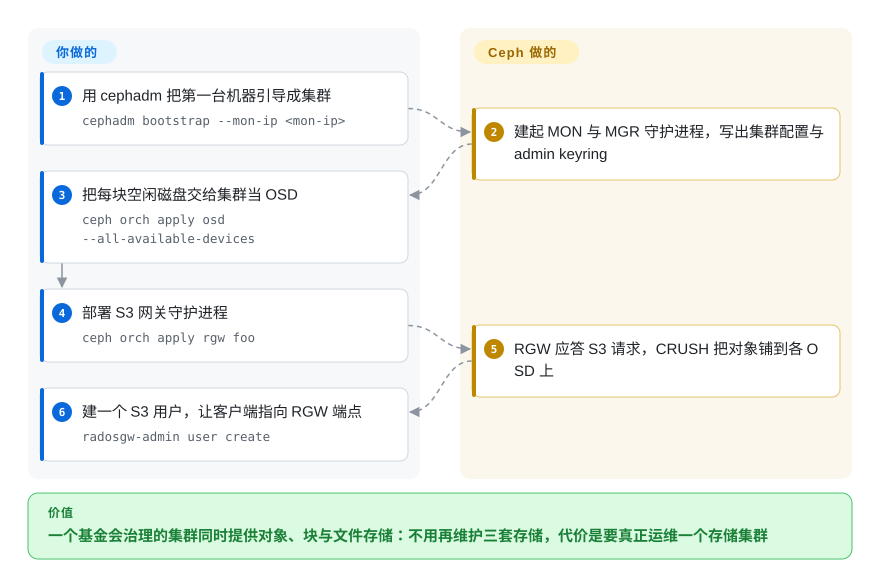

# Ceph

基金会治理的分布式存储平台：一个集群同时给你 S3（RGW）、块（RBD）与文件（CephFS）——代价是你得运维一个真正的存储集群，而不是跑一个二进制。

## 何时使用

你需要对象存储，但同时（或很快）也需要同一池硬件提供块设备与共享文件系统，而且你的组织看重基金会治理与十年以上的支持记录，胜过极简安装。Ceph 就是这个平台：底层是 RADOS，对象网关（RGW）提供 S3 兼容端点，RBD 提供虚拟块设备，CephFS 提供 POSIX 文件系统，全部铺在商用服务器上且无单点。你用 `cephadm`（或 Kubernetes operator，如 Rook）部署，把裸盘交给它当 OSD，部署 RGW 守护进程，再建 S3 用户。相对最接近的替代品，决定性的取舍是**广度对重量**：[Silo](silo.zh.md)／[MinIO](minio.zh.md) 给你一下午就能跑起来的单台 S3 服务端，[Garage](garage.zh.md) 用少得多的机器给你多站点 S3，[SeaweedFS](seaweedfs.zh.md) 用更轻的 Go 足迹给你对象加文件系统——但它们都不提供 RBD、CephFS、跨数百 OSD 的纠删码持久性与 CRUSH 放置，背后也没有非营利基金会。如果你真正需要的只是“我硬件上的一个 S3 桶”，Ceph 就是过量的工具。

## 怎么用起来

Ceph 把存储拆成若干守护进程：**MON** 维护集群图与仲裁，**MGR** 跑管理模块，**OSD** 掌管磁盘并真正读写数据，**RGW** 是前面那层无状态的 S3 网关。数据放置由 CRUSH 负责，它用算法把对象映射到 OSD，所以客户端可以自行算出数据在哪，而不必问元数据服务器。用 `cephadm bootstrap --mon-ip <mon-ip>` 引导会建起第一个 MON 与 MGR，并写出 `/etc/ceph/ceph.conf` 与管理 keyring；接着加主机、用 `ceph orch apply osd --all-available-devices` 认领磁盘、用 `ceph orch apply rgw <name>` 部署网关。S3 用户用 `radosgw-admin user create --uid=… --display-name=…` 创建，此后任意 S3 客户端都能对着 RGW 端点工作。你与项目之间的分工：Ceph 提供放置算法、复制／纠删码、自愈、S3 API 与编排工具；你负责集群的硬件规划、网络、故障域和升级——这正是在使用它时真正的成本。

<!-- flow-steps:begin (generated from flows/ceph.json by tools/flow_card.py — do not edit) -->

流程文字版

1. **你**：用 cephadm 把第一台机器引导成集群 — `cephadm bootstrap --mon-ip <mon-ip>`
2. **Ceph**：建起 MON 与 MGR 守护进程，写出集群配置与 admin keyring
3. **你**：把每块空闲磁盘交给集群当 OSD — `ceph orch apply osd --all-available-devices`
4. **你**：部署 S3 网关守护进程 — `ceph orch apply rgw foo`
5. **Ceph**：RGW 应答 S3 请求，CRUSH 把对象铺到各 OSD 上
6. **你**：建一个 S3 用户，让客户端指向 RGW 端点 — `radosgw-admin user create`

**价值**：一个基金会治理的集群同时提供对象、块与文件存储：不用再维护三套存储，代价是要真正运维一个存储集群

<!-- flow-steps:end -->

## 何时不用

- **你只需要给一个应用一个 S3 端点。** 为一个桶跑一整个 Ceph 集群是典型的杀鸡用牛刀。用 [Silo](silo.zh.md)（或 [MinIO](minio.zh.md) 的血统）、[Garage](garage.zh.md) 或 [SeaweedFS](seaweedfs.zh.md)——一个进程而不是一个集群。
- **你没有存储团队，也没有富余硬件。** Ceph 的价值依赖故障域：多台主机、富余容量、以及有人盯着恢复、CRUSH 和升级。没有这些就选更简单的存储或托管服务；有这些，Ceph 才回报你。
- **你需要小巧、易上手，或一个 Go 源码二进制。** Ceph 是庞大的 C++ 项目，有自己的打包、容器镜像与编排。要单二进制，用 Go 系（[Silo](silo.zh.md)、[SeaweedFS](seaweedfs.zh.md)）或 Rust 系（[Garage](garage.zh.md)）。
- **你主要需要便宜地服务海量小文件。** SeaweedFS 的追加写卷模型就是为对象数量而生；Ceph 的 RADOS 对象是另一种粒度上的正确基底。小文件场景请选 [SeaweedFS](seaweedfs.zh.md)。
- **你需要用便宜异构机器、跨不可靠链路做多站点 S3。** Ceph 能做多站点 RGW，但它假定的是你有计划地运维的集群；[Garage](garage.zh.md) 才是为“链路不稳、硬件参差”而设计。
- **你想要 MinIO 的即插即用替代。** Ceph 有自己的架构，RGW 的 S3 行为也是它自己的；MinIO 数据盘挂不进来。要即插即用，用 [Silo](silo.zh.md)。
- **你需要立刻用上最新功能。** 大版本约一年一发，修复只回移到最近两个版本；如果你的业务依赖前沿能力或极快的修复，这个节奏就是约束。

## 横向对比

| 替代品 | 是否收录 | 我们的评价 | 取舍 |
|---|---|---|---|
| [Silo](silo.zh.md) | ✅ | 任务只是“一个行为与格式精确等于 MinIO 的 S3 端点”、且你想要单二进制时选 Silo；需要对象＋块＋文件以及基金会背书的治理时选 Ceph。 | Silo 换到即插即用兼容性与极小的运维面；Ceph 换到统一存储、规模与非营利基金会，代价是要运维一个集群。 |
| [SeaweedFS](seaweedfs.zh.md) | ✅ | 压力在对象数量、想要更轻的 Go 栈加一个文件系统面时选 SeaweedFS；需要块存储、大规模 CRUSH 持久性与多厂商治理时选 Ceph。 | SeaweedFS 是面向小文件、足迹更小的系统；Ceph 是带块／文件服务、运维账单重得多的平台。 |
| [Garage](garage.zh.md) | ✅ | 集群是几台不可靠站点上的机器、需求是用最小机器量做多站点 S3 时选 Garage；需要一个严肃的（多）站点存储平台并带块与文件服务时选 Ceph。 | Garage 用规模与服务面换简单与链路容忍度；Ceph 用简单换广度、规模与治理。 |
| [MinIO](minio.zh.md) | ✅ | 新部署别选 MinIO——它已归档。若你欣赏它的简单，[Silo](silo.zh.md) 延续了它；若你需要的不止 S3，Ceph 是受治理的平台选择。 | MinIO 是一个冻结的单二进制；Ceph 是活跃维护的分布式平台，能力与成本都大得多。 |
| AWS S3／Cloudflare R2 | 未收录 | 永远不想拥有磁盘或集群时选托管 S3；数据驻留、内网低延迟、按 GB 成本或离线运行迫使你自建存储时选 Ceph。 | 托管方案去掉所有运维并加上出网费、锁定与数据驻留限制；Ceph 去掉这些，但把持久性、容量规划与升级变成你的责任。 |

## 技术栈

- **语言：** C++（编排层另有 Python 工具，如 `cephadm` 与 dashboard）。
- **架构：** 底层是 RADOS 对象存储；CRUSH 做确定性放置；MON／MGR／OSD 分别负责集群状态、管理与数据；RGW 守护进程提供 S3／Swift 对象网关；MDS 服务 CephFS；另有 iSCSI／NVMe-oF 与 NFS 网关提供其他协议。
- **部署：** 当前默认是 `cephadm`（基于容器的编排）；各主流发行版有软件包；Kubernetes 部署通常用 Rook operator。RGW 端点支持由 cephadm 管理的 HTTPS 证书，并通过 `ingress` 服务（haproxy＋keepalived）做高可用。
- **S3 能力面：** RGW 实现 S3 API，含用户／密钥／子用户、配额、限流、桶策略、版本控制、Object Lock 与多站点复制；管理通过 `radosgw-admin` 与 dashboard。
- **许可证：** Ceph 大部分代码是 **LGPL-2.1 或 LGPL-3** 双许可，另有少量 BSD／公有领域与部分 GPL 组件；文档为 CC-BY-SA-3.0。对嵌入场景而言这比 AGPL 宽松得多。
- **治理与质量：** 由非营利的 Ceph Foundation 托管与资助；仓库带有 OpenSSF Best Practices 徽章。

## 依赖

- **多台带本地磁盘的服务器**用于生产集群——MON 仲裁（3 或 5 个）、足以让纠删码或复制有意义的 OSD 数量，以及供恢复使用的富余容量。单机只适合评估（`--single-host-defaults`）。
- **容器运行时**（Podman 或 Docker）加上 **Python 3、systemd、LVM2 与时间同步**——cephadm 把守护进程作为容器部署。
- **主机之间 SSH 可达**，cephadm 靠它分发配置与密钥。
- **一份网络规划**，为较大集群分离公网（客户端）与集群（复制／恢复）流量；`cephadm bootstrap` 需要第一台主机的 monitor IP。
- **可选但常见：** Kubernetes 上用 Rook 当 operator，RGW 前加 HA ingress（haproxy＋keepalived），加密用 KMS，监控用 Prometheus／Grafana。
- **客户端侧：** 任意 S3 SDK 对 RGW，块用 `librbd`／内核 RBD，文件用 Ceph 内核客户端或 FUSE。

## 运维难度

**高。** 这是它最定义性的属性：Ceph 是你去运维的分布式系统，不是装上就完事的服务。你要规划故障域与设备类别、在复制与纠删码之间取舍、盯着再平衡与恢复（它们会和客户端 I/O 抢资源）、跨大量守护进程管理 MON 仲裁与升级，并按恢复峰值来配硬件。`cephadm` 与 Rook 让第一天的部署比过去容易太多，项目也发布了安全检查表与硬件指南——但第二天的负担依旧存在，这正是人们在简单 S3 需求下选择极简存储的原因。为它做的是**专长**预算，而不只是硬件预算。

## 健康度与可持续性

- **维护状态（2026-09-20）。** 非常活跃且成熟。当前大版本线为 v21：`v21.0.0`（2026-03-25）、`v21.3.0`（2026-06-10）；上一个主要版本是 v20（`v20.3.0`，2025-04）。Ceph 大约每年发一个大版本，并按 SECURITY.md 只把安全与缺陷修复回移到最近两个版本；默认分支在 2026-09-20 仍有提交。
- **治理／巴士系数（2026-09-20）。** 本分类里最强的治理故事：项目由非营利的 Ceph Foundation 资助与托管（隶属 Linux Foundation 体系），开发来自众多厂商与机构——贡献者名单跨一百多个账号，领头的是长期任职的工程师，而不是某家厂商的路线图。对选型决策而言，这意味着项目不依赖某一个人或某一家公司继续投入。
- **背书与 Lindy（2026-09-20）。** 创建于 2011-09-01，约 15 年，全程活跃并在生产中使用，是本分类里最典型的 Lindy 正例（年龄与当前活跃度两半都成立）。它还有 OpenSSF Best Practices 徽章与文档化的年度发版流程。
- **采用与生态（2026-09-20）。** `ceph/ceph` 约 1.7 万 stars、约 6.5 千 fork、622 个 watcher，部署面极大（服务商、科研、私有云），并有 operator（Rook）、发行版与监控集成的生态。文档极其丰富，另有多种书籍与指南。
- **风险标记（2026-09-20）。** 真正的风险是运维复杂度，而不是项目健康度；大约一年一个大版本、只支持最近两个版本，限制了你停留在某版本上的时间；仓库 open issue 数很大（约 1,455），对这么大体量的项目属正常；许可为 LGPL（相对宽松，比 AGPL 更友好于嵌入）。无换证争议。

## 存疑（未验证）

- [未验证] “v21 是当前稳定大版本、v20 是上一个”是从 tag 日期与 Ceph 声称的“一年一个大版本、只回移最近两个版本”推断的；未取用项目的 releases 页面确认确切的活跃／EOL 窗口。
- [未验证] 逐文件的许可构成来自仓库的 `COPYING` 清单（多为 LGPL-2.1 或 LGPL-3，另有部分 GPL 与 BSD 组件，文档为 CC-BY-SA-3.0）；GitHub 把仓库许可报为 “NOASSERTION”，所以 frontmatter 的 `LGPL-2.1` 是一种概括，而不是对整棵代码树的 SPDX 判定。
- [未验证] RGW 的 S3 功能清单（多站点、桶策略、Object Lock、配额、限流）取自 Ceph 的管理与 RGW 文档；未针对具体应用做兼容性测试。
- [推断] 贡献者数量的表述使用 GitHub contributors 接口，它最多返回 100 个账号且包含机器人；它说明的是广度，不代表活跃维护者人数。
- [未验证] 本页不给出任何基准或容量规划数字；Ceph 的性能高度依赖硬件、网络与存储池配置。
