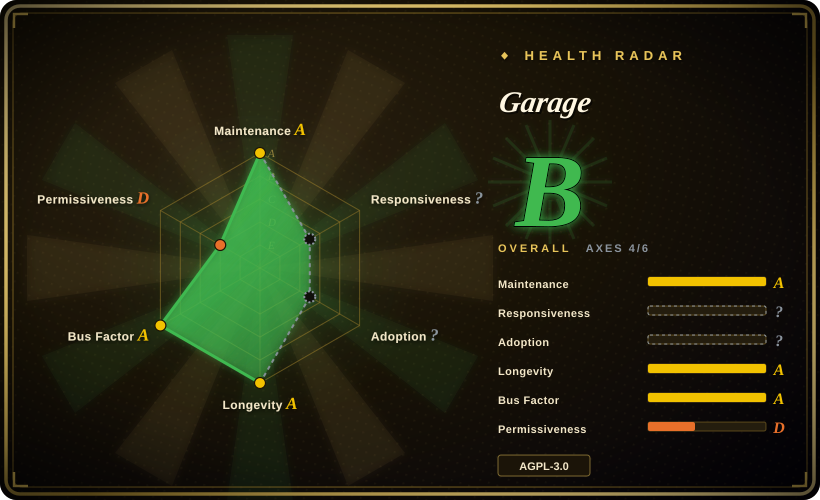
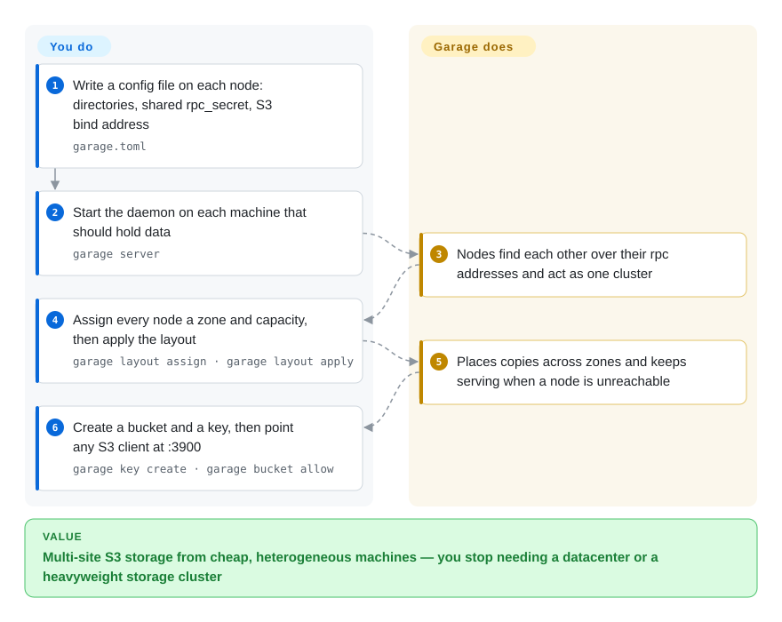

# Garage

A compact S3-compatible object store in Rust built for small-to-medium self-hosted clusters spread across several sites — it assumes cheap, heterogeneous machines and unreliable links, and trades throughput and S3 breadth for staying available anyway.

## When to use

You are a self-hoster, small team or collective with a handful of machines in *different places* — a home server, an office box, a friend's rack, two cheap VPSs — and you want one S3 endpoint over all of them that replicates across sites and keeps serving when one is offline. Garage is designed for exactly that shape: nodes need not be identical, replication is placed across declared zones (roughly, sites), and the whole thing is a single Rust binary with a TOML config. You reach for it when "multi-site durability from unreliable, mismatched hardware" is the requirement, not throughput or the full S3 feature surface. The deciding tradeoff against its closest substitutes is *design center*, not features: [Silo](silo.md)/[MinIO](minio.md) are single-site S3 servers whose data model you cannot simply mount into Garage, [SeaweedFS](seaweedfs.md) optimizes object count and capacity growth inside one cluster, and [Ceph](ceph.md) gives you object+block+file with orders of magnitude more operational weight. Against a hosted bucket, Garage keeps the data on your machines for free — at the cost of being the one who runs it.

## How it works

Each node gets a `garage.toml` describing where data and metadata live, a shared `rpc_secret`, and where the S3 API should listen. You start `garage server` everywhere and the nodes find each other over their RPC addresses. Then you declare the *layout* — which node is in which zone and how much capacity it contributes — with `garage layout assign`, and apply it; from that point Garage decides where each object's replicas go and rebuilds them when a node leaves or a disk dies. The S3 API is on `:3900`, administration is a CLI against the same config file (`garage status`, `garage key create`, `garage bucket allow`) plus an admin HTTP API on `:3903`. The line between you and the project: you own config, layout decisions, keys and upgrades; Garage owns placement, replication, repair and cluster membership.

<!-- flow-steps:begin (generated from flows/garage.json by tools/flow_card.py — do not edit) -->

Text version of the flow

1. **You**: Write a config file on each node: directories, shared rpc_secret, S3 bind address — `garage.toml`
2. **You**: Start the daemon on each machine that should hold data — `garage server`
3. **Garage**: Nodes find each other over their rpc addresses and act as one cluster
4. **You**: Assign every node a zone and capacity, then apply the layout — `garage layout assign · garage layout apply`
5. **Garage**: Places copies across zones and keeps serving when a node is unreachable
6. **You**: Create a bucket and a key, then point any S3 client at :3900 — `garage key create · garage bucket allow`

**Value**: Multi-site S3 storage from cheap, heterogeneous machines — you stop needing a datacenter or a heavyweight storage cluster

<!-- flow-steps:end -->

## When NOT to use

- **You need the full S3 surface: bucket policies, ACLs, IAM-style access control.** Garage's own documentation lists S3 features it does not implement (ACL and policy semantics among them). If those are load-bearing for your app, use [SeaweedFS](seaweedfs.md), whose gateway implements the object, bucket, IAM and STS APIs, or [Silo](silo.md)/[MinIO](minio.md) for MinIO-style admin and policy semantics.
- **You need maximum single-cluster throughput or billions of small files.** Garage is tuned for lightweight availability, not raw performance at scale. For O(1) reads per blob and capacity that grows by adding volume servers, use [SeaweedFS](seaweedfs.md); for a full storage platform with erasure coding and CRUSH placement, use [Ceph](ceph.md).
- **You want a drop-in replacement for an existing MinIO deployment.** Garage's on-disk layout is its own, so adopting it means migrating objects and abandoning MinIO-shaped runbooks. To keep MinIO's format and config namespace, use [Silo](silo.md).
- **You need block devices or a POSIX filesystem.** Garage is object storage only. Use [Ceph](ceph.md) (RBD/CephFS) or SeaweedFS's filer/FUSE mount when the application needs a filesystem or a volume.
- **You need enterprise support, an SLA, or foundation governance.** Garage is built by Deuxfleurs, a small French self-hosting collective, and its GitHub repository is explicitly a mirror of their own instance. If procurement needs a vendor contract or a foundation, choose [Ceph](ceph.md) or a commercial product.
- **You need a Windows/macOS server or managed cloud service.** The design target is Linux nodes you operate; there is no hosted Garage. For fully managed storage, use a cloud S3 service — the tradeoff is egress cost and vendor lock-in.

## Comparison

| Alternative | In index | Our verdict | Tradeoff |
|---|---|---|---|
| [Silo](silo.md) | ✅ | Choose Silo when you already have MinIO-shaped data, config and tooling and want a maintained single-site S3 server; choose Garage when the requirement is many unreliable sites rather than compatibility with MinIO. | Silo is a drop-in continuation of MinIO's protocol *and* format; Garage is a different architecture, so the choice is compatibility versus multi-site design. |
| [MinIO](minio.md) | ✅ | Do not pick MinIO for anything new — it is archived and unmaintained. If what you liked about MinIO was "one simple binary, self-hosted", Garage is a live alternative with a comparable operational feel. | Both are single-binary, self-hosted and AGPL; the difference is that MinIO stopped and Garage did not — and they do not share a data format. |
| [SeaweedFS](seaweedfs.md) | ✅ | Choose SeaweedFS when the numbers are object count and capacity inside one system; choose Garage when the numbers are sites and link reliability. | SeaweedFS scales file counts with volume servers and a filer; Garage scales *sites* with a declared layout and cross-zone replication. Different bottleneck, different tool. |
| [Ceph](ceph.md) | ✅ | Choose Ceph when you need one governed platform for object, block and file and have a storage team; choose Garage when you want multi-site S3 with a fraction of the machinery. | Ceph buys breadth, scale and foundation governance and charges a cluster's worth of operational complexity; Garage buys simplicity and site tolerance, and gives up scale and services. |
| AWS S3 / Cloudflare R2 | not indexed | Choose hosted S3 when you want zero operations and global durability and can accept egress bills and lock-in; choose Garage when the data must live on machines you own and the sites are unreliable by nature. | Hosted removes ops, hardware and multi-site engineering; Garage removes recurring egress cost and vendor dependency but makes you the operator. |

## Tech stack

- **Language:** Rust. Distributed as a single `garage` binary (server and CLI in one) plus a Docker image (`dxflrs/garage`).
- **Configuration:** a TOML file (`garage.toml`) with `metadata_dir`, `data_dir`, `db_engine`, `replication_factor`, RPC bind/public addresses, `[s3_api]`, `[s3_web]` and `[admin]` sections. Metadata uses an embedded database (the quick start uses `db_engine = "sqlite"`); LMDB is the other supported engine [未验证].
- **Protocols:** S3 API on `:3900`, static-website serving on `:3902`, admin/metrics HTTP API on `:3903`, and a node-to-node RPC/gossip channel on `:3901`.
- **Replication model:** a cluster layout assigns each node a zone and a capacity; objects are replicated across zones according to `replication_factor`. Nodes may run on different hardware and at different locations — that heterogeneity is the design target.
- **Clients:** any S3 SDK plus `aws cli`, `mc`/`minio-client`, `s3cmd`, `rclone`, Cyberduck and WinSCP, per the project's integration docs.

## Dependencies

- **Linux machines with local disks, ideally in more than one location.** A single node works for evaluation; the point of Garage is spreading nodes across zones/sites.
- **A shared `rpc_secret` and reachable RPC addresses between nodes** — the cluster forms over that channel.
- **An S3 client** (any SDK, or `aws cli`). No external database, control plane or cloud service is required for the server itself.
- **The `garage` CLI** reads the same config file and needs access to the metadata directory, so administration is local or via the node's admin API.

## Ops difficulty

**Low-to-medium.** Day one is one binary and one TOML file per node, and the mental model is small: declare nodes, declare zones, apply, use S3. There is no external metadata service and no separate control plane. The medium part is the part that is genuinely distributed: capacity and zone planning affect durability, adding/removing nodes means editing and applying a layout, and recovery behaviour depends on how replicas are spread — so you do need to understand the layout concept before trusting a cluster. Multi-site operation also means owning the network reality between nodes, which is exactly what Garage is built to tolerate but not to hide.

## Health & viability

- **Maintenance (2026-09-20).** Active. Latest release `v2.4.1` tagged 2026-09-07, with `v2.0.0` (2025-06), `v2.1.0` (2025-09), `v2.2.0` (2026-01), `v2.3.0` (2026-04) — a steady quarter-or-so cadence on the v2 line. Commits land weekly (latest 2026-09-19), and the repository is not archived.
- **Governance / bus factor (2026-09-20).** Built and operated by Deuxfleurs, a small French self-hosting collective that has run Garage in production since its first release in 2020; the maintainer set is small but real (a handful of recurring committers, ~96 contributors overall, with the top contributor carrying roughly two-thirds of recorded contributions). This is a small-org project, not a single-person hobby — but also not a foundation. Note that the canonical repository lives on the org's own Forgejo (`git.deuxfleurs.fr`); GitHub is a mirror, so treat the mirror as a convenience, not the source of truth.
- **Backing & Lindy (2026-09-20).** Created 2021-11-17, so the repository is about 4.8 years old and has been continuously active and in production the whole time — both halves of "age × still-active" are satisfied, and the production user is the maintainer org itself. It is a smaller bet than Ceph's 15-year, foundation-backed record, but not a young-hype risk either.
- **Adoption & ecosystem (2026-09-20).** ~4.6k stars, ~176 forks, ~6.1M Docker Hub pulls for `dxflrs/garage`, and a documented ecosystem of S3 clients and integrations (NextCloud is the canonical example in the quick start). The website and manual are unusually complete for a project this size. There is no managed offering.
- **Risk flags (2026-09-20).** AGPL-3.0; GitHub is a mirror of a self-hosted forge (so availability/policy of the canonical host matters); a deliberately partial S3 implementation (no ACL/policy semantics) that some applications assume; and a small maintainer team behind multi-site durability. Clean licence history.

## Caveats (unverified)

- [未验证] The claim that Garage does not implement S3 ACL/policy semantics is taken from the project's own S3 compatibility documentation pointer in the quick start, not from a feature-by-feature test; verify the specific operations your application uses.
- [未验证] Supported metadata engines: the quick start uses `db_engine = "sqlite"`; LMDB is mentioned here as the alternative engine without being confirmed against the current configuration reference.
- [推断] Bus-factor and cadence statements are derived from GitHub mirror data (commit dates, contributor counts, tags). Because the GitHub repository is a mirror of the Deuxfleurs Forgejo instance, activity figures may lag or omit work that happened on the canonical host.
- [未验证] No independent throughput/scale benchmark was run or found; the "lightweight, small-to-medium" positioning is the project's own scope statement, not a measured ceiling.
- [未验证] Docker Hub pull counts and star/fork figures are point-in-time (2026-09-20) and include CI and experimentation, not only production users.
- [推断] "Nodes find each other over their rpc addresses" is inferred from the `rpc_bind_addr` / `rpc_public_addr` / `rpc_secret` configuration and the cluster-forming workflow; the exact membership protocol is not described in this page.
