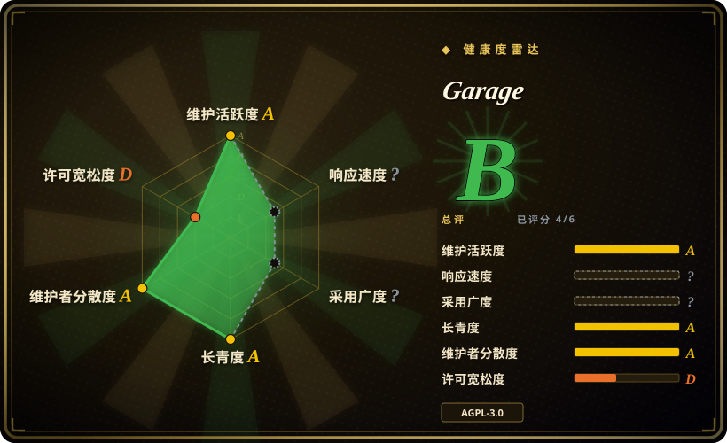
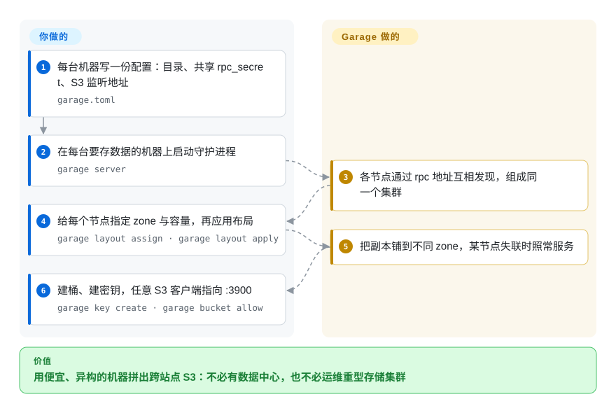

# Garage

一个用 Rust 写的紧凑型 S3 兼容对象存储，面向跨多个站点、规模小到中等的自建集群——它假定机器便宜、型号各异、链路不可靠，并以此换到“照样可用”。

## 何时使用

你是自建玩家、小团队或合作社，手上只有**分散在不同地方**的几台机器——一台家用的、一台办公室的、朋友机柜里的、两台便宜 VPS——你想要一个覆盖它们的 S3 端点，能跨站点复制，且其中一台离线时仍继续服务。Garage 正是为这种形态设计的：节点不必同构，副本按声明出的 zone（大致等于站点）铺开，整体就是一个 Rust 二进制加一份 TOML 配置。当需求是“用不可靠、参差的硬件做多站点持久性”，而不是吞吐或完整 S3 功能面时，就该想起它。相对最接近的替代品，决定性的取舍是**设计中心**而非功能清单：[Silo](silo.zh.md)／[MinIO](minio.zh.md) 是单站点 S3 服务端，其数据模型无法直接挂进 Garage；[SeaweedFS](seaweedfs.zh.md) 优化的是单集群内的对象数量与容量增长；[Ceph](ceph.zh.md) 给你对象＋块＋文件，但要重得多的运维代价。相对托管桶，Garage 把数据留在你自己的机器上且没有租金——代价是由你来运维它。

## 怎么用起来

每台节点拿一份 `garage.toml`，描述数据与元数据放哪、共享的 `rpc_secret` 是什么、S3 API 监听在哪。你在所有机器上启动 `garage server`，各节点通过各自的 RPC 地址互相发现。然后你声明**布局**——哪个节点属于哪个 zone、贡献多少容量——用 `garage layout assign` 指定并应用；从这一刻起，每个对象副本放在哪、节点退出或磁盘损坏后如何重建，都由 Garage 决定。S3 API 在 `:3900`，管理则是对着同一份配置文件跑 CLI（`garage status`、`garage key create`、`garage bucket allow`），外加 `:3903` 上的管理 HTTP API。你与项目之间的分工：配置、布局决策、密钥和升级归你；放置、复制、修复与集群成员关系归 Garage。

<!-- flow-steps:begin (generated from flows/garage.json by tools/flow_card.py — do not edit) -->

流程文字版

1. **你**：每台机器写一份配置：目录、共享 rpc_secret、S3 监听地址 — `garage.toml`
2. **你**：在每台要存数据的机器上启动守护进程 — `garage server`
3. **Garage**：各节点通过 rpc 地址互相发现，组成同一个集群
4. **你**：给每个节点指定 zone 与容量，再应用布局 — `garage layout assign · garage layout apply`
5. **Garage**：把副本铺到不同 zone，某节点失联时照常服务
6. **你**：建桶、建密钥，任意 S3 客户端指向 :3900 — `garage key create · garage bucket allow`

**价值**：用便宜、异构的机器拼出跨站点 S3：不必有数据中心，也不必运维重型存储集群

<!-- flow-steps:end -->

## 何时不用

- **你需要完整的 S3 能力面：桶策略、ACL、类 IAM 的访问控制。** Garage 自己的文档列出了它未实现的 S3 特性（其中包含 ACL 与策略语义）。如果这些对你的应用是承重的，请用 [SeaweedFS](seaweedfs.zh.md)——它的网关实现了对象、桶、IAM 与 STS API——或用 [Silo](silo.zh.md)／[MinIO](minio.zh.md) 以获得 MinIO 式的管理与策略语义。
- **你需要单集群最大吞吐或十亿级小文件。** Garage 调优的方向是轻量可用，而不是大规模原始性能。要每个 blob 一次读盘、靠加卷服务扩容量，选 [SeaweedFS](seaweedfs.zh.md)；要带纠删码与 CRUSH 放置的完整存储平台，选 [Ceph](ceph.zh.md)。
- **你想要现有 MinIO 部署的即插即用替代。** Garage 的落盘布局是它自己的，采用它意味着迁移对象并放弃 MinIO 形态的运维手册。要保留 MinIO 的格式与配置命名空间，请用 [Silo](silo.zh.md)。
- **你需要块设备或 POSIX 文件系统。** Garage 只做对象存储。应用需要文件系统或卷时，用 [Ceph](ceph.zh.md)（RBD／CephFS）或 SeaweedFS 的 filer／FUSE 挂载。
- **你需要企业支持、SLA 或基金会治理。** Garage 由 Deuxfleurs 打造，那是法国一个小型自托管合作社，其 GitHub 仓库明确只是镜像。若采购需要厂商合同或基金会背书，请选 [Ceph](ceph.zh.md) 或商业产品。
- **你需要 Windows／macOS 服务端或托管云服务。** 设计目标是你在 Linux 上运维的节点；没有托管版 Garage。想要完全托管的存储，就用云 S3——代价是出网费与厂商锁定。

## 横向对比

| 替代品 | 是否收录 | 我们的评价 | 取舍 |
|---|---|---|---|
| [Silo](silo.zh.md) | ✅ | 你已有 MinIO 形态的数据、配置与工具链、想要一个在维护的单站点 S3 服务端时选 Silo；需求是“很多不可靠站点”而不是“兼容 MinIO”时选 Garage。 | Silo 连协议带格式地接管 MinIO；Garage 是另一套架构，所以这是兼容性与多站点设计之间的选择。 |
| [MinIO](minio.zh.md) | ✅ | 任何新用途都别选 MinIO——它已归档、无人维护。如果你喜欢 MinIO 的是“一个简单的自建二进制”，Garage 是运维手感相近的活跃替代。 | 两者都是单二进制、自建、AGPL；区别在于 MinIO 停了而 Garage 没停——而且它们不共享数据格式。 |
| [SeaweedFS](seaweedfs.zh.md) | ✅ | 你要的数字是对象数量与单系统内的容量时选 SeaweedFS；你要的数字是站点数与链路可靠性时选 Garage。 | SeaweedFS 靠卷服务和 filer 扩文件数；Garage 靠声明式布局与跨 zone 复制扩**站点**。瓶颈不同，工具不同。 |
| [Ceph](ceph.zh.md) | ✅ | 你需要一个受治理的平台同时提供对象、块与文件且有存储团队时选 Ceph；只想要多站点 S3 且机器量少得多时选 Garage。 | Ceph 用一整个集群的运维复杂度换取广度、规模与基金会治理；Garage 用规模与服务面换取简单与站点容忍度。 |
| AWS S3／Cloudflare R2 | 未收录 | 想要零运维、全球持久性且能接受出网费与锁定时选托管 S3；数据必须放在自有机器、站点天然不可靠时选 Garage。 | 托管方案省掉运维、硬件与多站点工程；Garage 省掉持续出网费与厂商依赖，但让你成为运维方。 |

## 技术栈

- **语言：** Rust。以单个 `garage` 二进制分发（服务端与 CLI 合一），另有 Docker 镜像（`dxflrs/garage`）。
- **配置：** 一份 TOML（`garage.toml`），含 `metadata_dir`、`data_dir`、`db_engine`、`replication_factor`、RPC 绑定／公开地址，以及 `[s3_api]`、`[s3_web]`、`[admin]` 各段。元数据使用内嵌数据库（快速上手用 `db_engine = "sqlite"`）；LMDB 是另一个受支持的引擎 [未验证]。
- **协议：** `:3900` 上的 S3 API、`:3902` 的静态站点服务、`:3903` 的管理／指标 HTTP API，以及 `:3901` 的节点间 RPC／gossip 通道。
- **复制模型：** 集群布局给每个节点指定 zone 与容量；对象按 `replication_factor` 跨 zone 复制。节点可以在不同硬件、不同地点运行——这种异构正是设计目标。
- **客户端：** 任意 S3 SDK，加上 `aws cli`、`mc`／`minio-client`、`s3cmd`、`rclone`、Cyberduck 与 WinSCP（据项目的集成文档）。

## 依赖

- **带本地磁盘的 Linux 机器，最好位于不止一个地点。** 单节点可用于评估；Garage 的意义在于把节点铺到不同 zone／站点。
- **共享的 `rpc_secret` 与节点间可达的 RPC 地址**——集群靠这条通道成形。
- **一个 S3 客户端**（任意 SDK 或 `aws cli`）。服务端本身不需要外部数据库、控制面或云服务。
- **`garage` CLI** 读同一份配置文件，并需要访问元数据目录，因此管理是本地进行或通过节点的管理 API。

## 运维难度

**低到中等。** 第一天就是每台一个二进制加一份 TOML，心智模型也小：声明节点、声明 zone、应用、用 S3。没有外部元数据服务，也没有独立控制面。“中等”来自真正分布式的部分：容量与 zone 规划直接影响持久性，增删节点意味着改布局并重新应用，恢复行为取决于副本如何铺开——所以在信任一个集群前，你确实得先理解布局这个概念。多站点运维还意味着要面对节点之间的网络现实，而这正是 Garage 想容忍、但不会替你掩盖的东西。

## 健康度与可持续性

- **维护状态（2026-09-20）。** 活跃。最新版本 `v2.4.1` 于 2026-09-07 打标，此前 `v2.0.0`（2025-06）、`v2.1.0`（2025-09）、`v2.2.0`（2026-01）、`v2.3.0`（2026-04）——v2 线大致保持一季一发的节奏。提交每周都有（最近一次 2026-09-19），仓库未归档。
- **治理／巴士系数（2026-09-20）。** 由 Deuxfleurs 打造并运营，那是一个法国小型自托管合作社，自 2020 年首个版本起就在生产中使用 Garage；维护者规模小但真实（几位反复出现的提交者，累计约 96 位贡献者，其中贡献最多者约承担已记录贡献的三分之二）。这是小型组织项目，不是单人爱好——但也不是基金会。注意规范仓库在组织自建的 Forgejo（`git.deuxfleurs.fr`）上，GitHub 只是镜像，所以把镜像当便利入口，而不是事实源。
- **背书与 Lindy（2026-09-20）。** 创建于 2021-11-17，仓库约 4.8 年，且全程持续活跃并在生产中使用——“年龄 × 仍在活跃”两半都成立，且生产用户就是维护方自己。它比 Ceph 十五年、基金会背书的履历赌注小，但也绝不是年轻炒作的风险。
- **采用与生态（2026-09-20）。** 约 4.6 千 stars、约 176 个 fork、`dxflrs/garage` 在 Docker Hub 上约 611 万次拉取，并有成体系的 S3 客户端与集成（快速上手用 NextCloud 当标准例子）。对一个这个体量的项目，官网与手册写得异常完整。没有托管服务。
- **风险标记（2026-09-20）。** AGPL-3.0；GitHub 是自建 forge 的镜像（规范站点的可用性与政策会影响你）；S3 实现刻意不完整（无 ACL／策略语义），而有些应用会假定它有；多站点持久性背后是一支小型维护者队伍。许可证历史干净。

## 存疑（未验证）

- [未验证] “Garage 不实现 S3 ACL／策略语义”来自项目快速上手文档中的 S3 兼容性说明链接，而非逐项功能测试；请针对你应用实际用到的操作自行验证。
- [未验证] 支持的元数据引擎：快速上手使用 `db_engine = "sqlite"`；本页把 LMDB 列为备选引擎，但未对照当前配置参考确认。
- [推断] 巴士系数与发版节奏的结论来自 GitHub 镜像数据（提交日期、贡献者计数、tag）。由于 GitHub 仓库是 Deuxfleurs Forgejo 的镜像，活动数字可能滞后或漏掉规范站点上的工作。
- [未验证] 本次没有跑也没有找到独立的吞吐／规模基准；“轻量、中小规模”的说法是项目自身的范围声明，不是实测上限。
- [未验证] Docker 拉取数与 star／fork 数是 2026-09-20 的时点数据，包含 CI 与试验流量，不只是生产用户。
- [推断] “各节点通过 rpc 地址互相发现”是从 `rpc_bind_addr`／`rpc_public_addr`／`rpc_secret` 配置与组网流程推断的，本页不描述其确切的成员关系协议。
