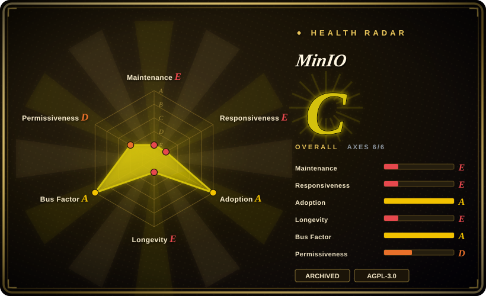
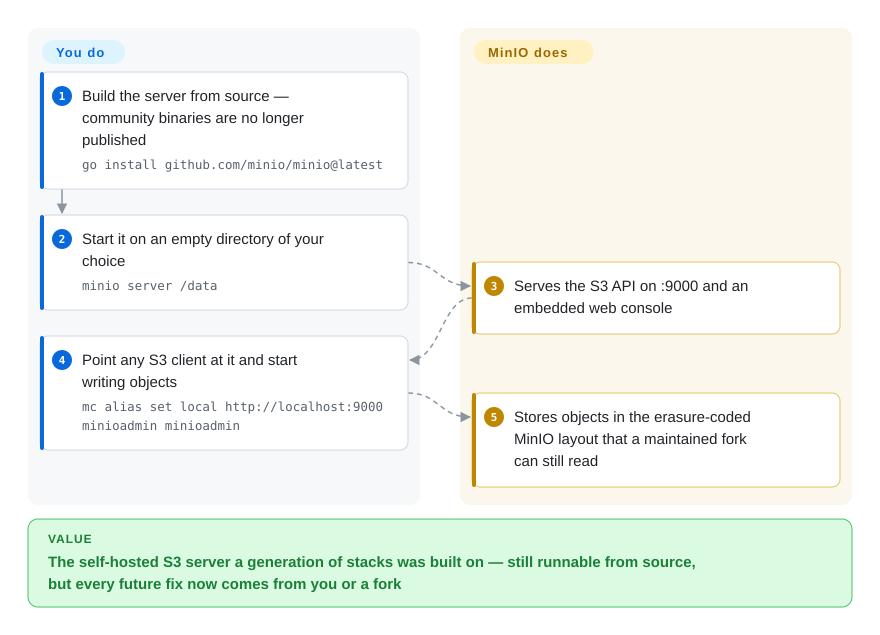

# MinIO

The high-performance S3-compatible object server that made self-hosted object storage mainstream — now **archived and unmaintained**, distributed by its vendor as source only, with the community edition replaced by a commercial product.

## When to use

You find MinIO in your infrastructure — a Compose file, a Kubernetes tenant, a backup target with years of data on `.minio.sys` disks — and its vendor's repository now says `THIS REPOSITORY IS NO LONGER MAINTAINED`. You are not choosing MinIO; you are deciding what to do about the MinIO you already have. That is the one scenario in which this page is the right reference: you need the facts (last release 2025-10-15, archived 2026-04-24, source-only distribution, no prebuilt community binaries, console cut back) to make an exit plan. The deciding tradeoff is that MinIO is the *protocol and on-disk format* your stack is built on, and that contract is what you must preserve — which is why the shortest path is usually [Silo](silo.md), the maintained fork that keeps the S3 API, disk layout, `MINIO_*` config and metrics names unchanged, rather than a store with its own architecture. If nothing constrains you to MinIO's format, treat its wide deployment and 12-year design as a starting point and choose a maintained store instead: [Garage](garage.md) for small multi-site clusters, [SeaweedFS](seaweedfs.md) for billions of small objects, [Ceph](ceph.md) for object + block + file under foundation governance.

## How it works

MinIO is a single Go binary that turns a directory (or a set of drives across many nodes) into an S3 endpoint: `minio server /data` serves the S3 wire API on `:9000`, an embedded web console, and an admin API, storing objects in an erasure-coded layout under a `.minio.sys` metadata tree. For a decade that made it the default self-hosted S3 server — one process, no external database, S3 SDKs working unchanged. The project's ending is a distribution change, not a code deletion: since the vendor moved its business to the commercial AIStor editions, the community repository became source-only — `go install github.com/minio/minio@latest` still compiles a server, historical binaries remain downloadable, and existing installations keep running, but no one is publishing fixes for the community line, and the README now points users at AIStor Free/Enterprise. What you own if you stay is everything: builds, packaging, the console, and every future security patch.

<!-- flow-steps:begin (generated from flows/minio.json by tools/flow_card.py — do not edit) -->

Text version of the flow

1. **You**: Build the server from source — community binaries are no longer published — `go install github.com/minio/minio@latest`
2. **You**: Start it on an empty directory of your choice — `minio server /data`
3. **MinIO**: Serves the S3 API on :9000 and an embedded web console
4. **You**: Point any S3 client at it and start writing objects — `mc alias set local http://localhost:9000 minioadmin minioadmin`
5. **MinIO**: Stores objects in the erasure-coded MinIO layout that a maintained fork can still read

**Value**: The self-hosted S3 server a generation of stacks was built on — still runnable from source, but every future fix now comes from you or a fork

<!-- flow-steps:end -->

## When NOT to use

- **You need any ongoing maintenance or security fixes.** This is the disqualifier, not a caveat: the repository is archived (2026-04-24), the last community release is `RELEASE.2025-10-15`, commit activity has been zero for months, and the README states the project is no longer maintained. For a server that holds your data, use [Silo](silo.md) — the same codebase with a maintained release line — or a different store entirely ([Garage](garage.md), [SeaweedFS](seaweedfs.md), [Ceph](ceph.md)).
- **You want prebuilt community binaries or a supported container image.** The vendor's README says the community edition is "source code only" and that legacy binaries "will not receive updates". If you do not want to own a Go build pipeline, use Silo's signed packages/images or a store with an active release process.
- **You are starting something new.** Adopting an archived project for new production data means inheriting an unpatched dependency on day one. Only choose it to reproduce a pinned legacy environment, and treat that as a temporary state.
- **You want vendor support or an SLA for this exact project.** The vendor's supported product is the commercial AIStor line, a different (proprietary) offering; the archived AGPL repository has no support commitment. If you need supported S3 on your own hardware, budget for Ceph plus your own team, or buy a commercial product.
- **You or your legal team cannot accept AGPL-3.0 network-service obligations.** That is true of MinIO and of the maintained fork too; if AGPL is the blocker, choose an Apache-2.0-licensed store such as [SeaweedFS](seaweedfs.md), or a hosted service.
- **You rely on MinIO-operated services.** Update polling, callhome, SUBNET registration and the hosted console path are tied to the vendor and to a product line that has moved on; a frozen repository will not keep them working.

## Comparison

| Alternative | In index | Our verdict | Tradeoff |
|---|---|---|---|
| [Silo](silo.md) | ✅ | Pick Silo when you want this exact server and data format to keep working: it is a community fork of the MinIO codebase with the same S3 API, `.minio.sys` layout and `MINIO_*` namespace, plus a maintained release line, forked console and published compatibility audit. Pick archived MinIO only when you must reproduce a frozen build and will own every future CVE yourself. | Identical protocol and disk format, so the entire difference is maintenance: an active downstream fork against a dead upstream repository. |
| [Garage](garage.md) | ✅ | Choose Garage when you are building a *new* S3 endpoint across a few unreliable sites and want a lightweight Rust store designed for that; choose MinIO only if MinIO's ecosystem and layout are already what you have. | Garage is not a drop-in — its own layout and consistency model mean migration — but it is designed for the multi-site case MinIO's erasure sets handle awkwardly. |
| [SeaweedFS](seaweedfs.md) | ✅ | Choose SeaweedFS when the workload is billions of small objects and you want one binary serving S3, a filesystem and a table layer; stay with MinIO-compatible storage when your tooling assumes MinIO's data layout or admin API. | SeaweedFS optimizes object count and capacity growth; MinIO optimizes S3-server compatibility — and is now frozen. |
| [Ceph](ceph.md) | ✅ | Choose Ceph when you need object, block and file from one foundation-governed platform and can staff it; choose a MinIO-compatible single binary ([Silo](silo.md)) when you only need an S3 endpoint. | Ceph buys breadth, governance and scale at a much higher operational cost; MinIO's lineage buys a small surface and a huge install base — which is why its archival matters. |
| AIStor Free / Enterprise | not indexed | Choose the vendor's commercial editions when you want a supported product from the same company and can accept proprietary licensing and feature gating; choose the archived repository only as a pattern/legacy reference. | Not a repository in this index: AIStor is closed and vendor-controlled, so you trade AGPL obligations for vendor lock-in and licence terms. |

## Tech stack

- **Language:** Go (the README's source build requires Go 1.24+). One statically linked server binary, no external database.
- **Storage engine:** erasure-coded object store — drives, erasure sets, `.minio.sys` metadata, healing and rebalancing; single-node single-drive deployments use the same binary.
- **Interfaces:** S3 wire API (SigV4) plus MinIO-specific extensions, an admin API, `minio_*` Prometheus metrics, and an embedded web console.
- **Ecosystem (still usable, since forks inherit it):** every S3 SDK, the `mc` client, the MinIO Kubernetes Operator, Helm charts, backup tools (pgBackRest, Velero, restic) and gateway integrations.
- **Distribution as of the archive:** source-build only for the community edition (`go install` / `docker build`); prebuilt binaries and images remain as unmaintained legacy artifacts.

## Dependencies

- **A host or cluster with persistent storage.** A single directory works for evaluation; erasure-coded durability needs multiple drives and, ideally, multiple nodes.
- **A build toolchain if you follow the current instructions:** Go 1.24+ for `go install github.com/minio/minio@latest`, or Docker if you build the provided Dockerfile.
- **TLS certificates** for production endpoints.
- **Client side:** any S3 SDK, or `mc`. The embedded console is part of the server image.
- **Notably absent:** there is no vendor-operated control plane to depend on — and, after the archive, no upstream dependency to lean on for fixes either.

## Ops difficulty

**Low to run, impossible to keep healthy.** Operationally it is one of the simplest object servers ever shipped: a single binary, drives as arguments, no external metadata database, well-understood deployment patterns and a large body of runbooks. That is exactly why it spread. But an archived server has no patch path: security advisories, dependency upgrades and console fixes stop. Running it is easy; owning it means either freezing your risk or doing your own maintenance — and doing your own maintenance on a large Go codebase is far more expensive than switching to a maintained fork.

## Health & viability

- **Maintenance (2026-09-20).** **Archived.** Last push 2026-04-24, no commit activity in the last 16 weeks (GitHub participation stats all zero), last commit 2026-02-12 by the long-time lead maintainer, and the last community release was `RELEASE.2025-10-15` (2025-10-16). The README's first line is a maintenance notice pointing to the vendor's commercial AIStor editions.
- **Governance / bus factor (2026-09-20).** Historically a single-vendor project (MinIO, Inc.) with one dominant committer: the top contributor accounts for roughly 5,680 of the recorded contributions, with a handful of maintainers behind. There is no foundation and no multi-vendor steering body; the roadmap followed the vendor's commercial strategy, which is what ended the community line.
- **Backing & Lindy (2026-09-20).** The codebase is genuinely long-lived — created 2015-01-14, so about 11.7 years — and widely deployed, which is real Lindy credit. It is the *other* half of "age × still-active" that fails: the project is explicitly not active. Do not let age and popularity cancel the archive notice.
- **Adoption & ecosystem (2026-09-20).** Large and load-bearing: ~61k stars, ~8.0k forks, 653 watchers, a Kubernetes operator, and years as the default self-hosted S3 backend. Adoption is the reason its archival is a migration problem rather than a curiosity — countless deployments, tutorials and integrations assume it.
- **Risk flags (2026-09-20).** Archived and unmaintained; source-only distribution with legacy binaries that will not be updated; vendor pivot to commercial/open-core editions; AGPL-3.0 network obligations; and no successor release line inside the upstream repository. The practical mitigation for MinIO-shaped deployments is [Silo](silo.md), which is why that fork exists.

## Caveats (unverified)

- [未验证] The commercial framing (that the community edition was wound down to push users to AIStor) is inferred from the README's maintenance notice and its AIStor Free/Enterprise links; MinIO, Inc. has not been quoted on the reason here.
- [未验证] AIStor Free/Enterprise licensing terms were not read in this pass; the README describes a "free license" edition and a paid, support-backed edition, but the actual licence text is not captured here.
- [未验证] Docker Hub pull counts for `minio/minio` could not be retrieved on 2026-09-20 (the API returned no data), so no pull number is asserted.
- [推断] The claim that existing deployments "keep running" is a statement about an unchanging binary, not a maintenance guarantee: with no patches, any newly discovered vulnerability in the frozen code stays unfixed.
- [未验证] No audit of the final release's open security advisories was performed; whether any known CVE affects the last community release is not stated here.
