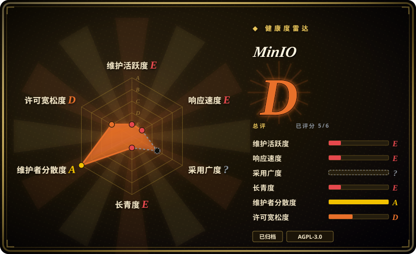
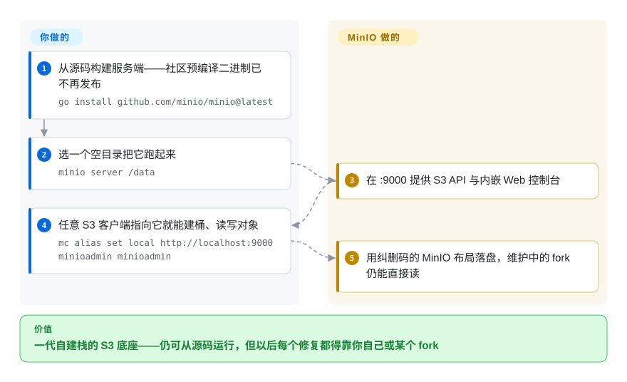

# MinIO

让自建对象存储走入主流的 S3 兼容高性能对象服务端——如今已**归档且无人维护**，厂商只以源码形式发布，社区版被商业产品取代。

## 何时使用

你在自己的基础设施里发现了 MinIO——某个 Compose 文件、某个 Kubernetes tenant、某个存了多年数据在 `.minio.sys` 磁盘上的备份目标——而它的仓库现在写着 `THIS REPOSITORY IS NO LONGER MAINTAINED`。你不是在选择 MinIO，你是在决定**已经存在的 MinIO** 怎么办。本页只在这一个场景下是你的正确参考：你需要事实（最后版本 2025-10-15、仓库 2026-04-24 归档、仅源码分发、不再提供社区预编译二进制、控制台被削减）来制定退出方案。决定性的取舍在于：MinIO 是你整套技术栈所依赖的**协议与落盘格式**，而这份契约必须被保住——所以最省事的路径通常是 [Silo](silo.zh.md)：维护中的 fork，S3 API、磁盘布局、`MINIO_*` 配置与指标名全部不变，而不是换一套自有架构的存储。如果没有任何东西把你绑在 MinIO 的格式上，那就把它广泛的部署基础与十二年设计当作起点，改选一个在维护的存储：[Garage](garage.zh.md) 适合小型多站点集群，[SeaweedFS](seaweedfs.zh.md) 适合十亿级小对象，[Ceph](ceph.zh.md) 提供基金会治理下的对象＋块＋文件。

## 怎么用起来

MinIO 是一个 Go 二进制，把一个目录（或跨多节点的多块盘）变成一个 S3 端点：`minio server /data` 在 `:9000` 提供 S3 线协议、一个内嵌 Web 控制台与管理 API，对象以纠删码布局写进 `.minio.sys` 元数据树。十年来这正是它成为自建 S3 默认选择的原因——一个进程、不需要外部数据库、S3 SDK 原样可用。它的结束是**分发方式的变化**，不是代码被删除：自从厂商把生意转向商业版 AIStor，社区仓库就变成了仅源码——`go install github.com/minio/minio@latest` 仍能编出服务端，历史二进制仍可下载，已有部署也继续运行，但社区线不再有人发修复，README 现在引导用户去看 AIStor Free／Enterprise。如果你留下来，你拥有的就是全部：构建、打包、控制台，以及未来每一个安全补丁。

<!-- flow-steps:begin (generated from flows/minio.json by tools/flow_card.py — do not edit) -->

流程文字版

1. **你**：从源码构建服务端——社区预编译二进制已不再发布 — `go install github.com/minio/minio@latest`
2. **你**：选一个空目录把它跑起来 — `minio server /data`
3. **MinIO**：在 :9000 提供 S3 API 与内嵌 Web 控制台
4. **你**：任意 S3 客户端指向它就能建桶、读写对象 — `mc alias set local http://localhost:9000 minioadmin minioadmin`
5. **MinIO**：用纠删码的 MinIO 布局落盘，维护中的 fork 仍能直接读

**价值**：一代自建栈的 S3 底座——仍可从源码运行，但以后每个修复都得靠你自己或某个 fork

<!-- flow-steps:end -->

## 何时不用

- **你需要任何持续维护或安全修复。** 这不是提醒而是取消资格的理由：仓库已归档（2026-04-24），最后一个社区版本是 `RELEASE.2025-10-15`，提交活动已停摆数月，README 明确说明项目不再维护。对于承载你数据的服务端，请用 [Silo](silo.zh.md)——同一份代码加上一条在维护的发版线——或换用别的存储（[Garage](garage.zh.md)、[SeaweedFS](seaweedfs.zh.md)、[Ceph](ceph.zh.md)）。
- **你想要预编译的社区二进制或受支持的容器镜像。** 厂商 README 写明社区版“仅源码”，历史二进制“不会再收到更新”。如果你不想自己养一条 Go 构建流水线，就用 Silo 的签名软件包／镜像，或选一个有在跑发版流程的存储。
- **你要开始一个新项目。** 用归档项目承载新的生产数据，等于第一天就继承一个不会被打补丁的依赖。只有在需要复现某个固定的历史环境时才选它，并且把它当作临时状态。
- **你想要厂商支持或 SLA。** 厂商在支持的是商业 AIStor 产品线，那是另一个（专有）产品；这个归档的 AGPL 仓库没有任何支持承诺。如果你需要在自己硬件上得到受支持的 S3，请为 Ceph 加自建团队做预算，或直接采购商业产品。
- **你或你的法务不能接受 AGPL-3.0 的网络服务义务。** 这对 MinIO 和维护它的 fork 同样成立；如果 AGPL 是硬阻塞，请选 Apache-2.0 的存储如 [SeaweedFS](seaweedfs.zh.md)，或托管服务。
- **你依赖 MinIO 运营的在线服务。** 更新轮询、callhome、SUBNET 注册与托管控制台路径都绑定在厂商及其已经转向的产品线上；一个冻结的仓库不会让它们继续可用。

## 横向对比

| 替代品 | 是否收录 | 我们的评价 | 取舍 |
|---|---|---|---|
| [Silo](silo.zh.md) | ✅ | 想让你这套服务端和数据格式继续可用时选 Silo：它是 MinIO 代码库的社区 fork，S3 API、`.minio.sys` 布局与 `MINIO_*` 命名空间都不变，另有一条在维护的发版线、fork 版控制台和公开的兼容性审计。只有在必须复现某个冻结构建、并愿意自己扛下未来每一个 CVE 时才选归档的 MinIO。 | 协议与磁盘格式完全一致，所以全部差别就是“谁在维护”：一个活跃的下游 fork 对一个已死的上游仓库。 |
| [Garage](garage.zh.md) | ✅ | 你要在几个不可靠站点间**新起**一个 S3 端点、且想要为这种场景设计的轻量 Rust 存储时选 Garage；只有当 MinIO 的生态与布局本来就是你现状时才继续用 MinIO。 | Garage 不是即插即用——它自有的布局与一致性模型意味着要迁移——但它为多站点场景而设计，而 MinIO 的纠删组处理这类场景本就吃力。 |
| [SeaweedFS](seaweedfs.zh.md) | ✅ | 负载是十亿级小对象、想要一个二进制同时提供 S3、文件系统和表格式层时选 SeaweedFS；当你的工具链假定 MinIO 的数据布局或管理 API 时，就留在 MinIO 兼容存储上。 | SeaweedFS 优化对象数量与容量增长；MinIO 优化 S3 服务端兼容性——而它现在已经冻结。 |
| [Ceph](ceph.zh.md) | ✅ | 你需要基金会治理的同一平台同时提供对象、块与文件、且养得起团队时选 Ceph；只需要一个 S3 端点时选 MinIO 兼容的单二进制方案（[Silo](silo.zh.md)）。 | Ceph 用高得多的运维成本换取广度、治理与规模；MinIO 的血统换来更小的运维面和巨大的装机量——这正是它归档值得重视的原因。 |
| AIStor Free／Enterprise | 未收录 | 想要同一家厂商提供的受支持产品、且能接受专有许可与功能阉割时选厂商商业版；归档仓库只作为模式／历史参考。 | 它不是本索引里的仓库：AIStor 闭源且由厂商控制，你是用 AGPL 义务换来厂商锁定与许可条款。 |

## 技术栈

- **语言：** Go（README 的源码构建要求 Go 1.24 以上）。单个静态链接服务端二进制，不需要外部数据库。
- **存储引擎：** 纠删码对象存储——磁盘、纠删组、`.minio.sys` 元数据、修复与再平衡；单机单盘部署用的是同一个二进制。
- **接口：** S3 线协议（SigV4）加 MinIO 专有扩展、管理 API、`minio_*` Prometheus 指标，以及内嵌 Web 控制台。
- **生态（fork 仍可继承，因此仍可用）：** 所有 S3 SDK、`mc` 客户端、MinIO Kubernetes Operator、Helm Chart、备份工具（pgBackRest、Velero、restic）与各类网关集成。
- **归档后的分发方式：** 社区版只能从源码构建（`go install`／`docker build`）；预编译二进制与镜像作为不再维护的历史产物保留。

## 依赖

- **一台主机或一个集群，加上持久存储。** 单目录可用于评估；纠删码持久性需要多块盘，最好再加多节点。
- **若按当前说明构建则需要工具链：** 执行 `go install github.com/minio/minio@latest` 需要 Go 1.24 以上，或使用 Docker 构建仓库自带的 Dockerfile。
- **生产端点需要 TLS 证书。**
- **客户端侧：** 任意 S3 SDK，或 `mc`。内嵌控制台属于服务端镜像的一部分。
- **显著地没有：** 你不需要依赖任何厂商运营的控制面——而归档之后，你也没法再依赖上游给你修东西。

## 运维难度

**跑起来很低，保持健康不可能。** 从运维上说，它是有史以来最简单的对象服务端之一：一个二进制、磁盘路径当参数、没有外部元数据库、部署范式众所周知、现成 runbook 一大把。这正是它铺开的原因。但归档的服务端没有补丁通道：安全公告、依赖升级与控制台修复都停了。运行它很容易；拥有它意味着要么冻结风险，要么自己做维护——而在一套庞大的 Go 代码库上自己做维护，成本远高于换到一个在维护的 fork。

## 健康度与可持续性

- **维护状态（2026-09-20）。** **已归档。** 最后推送 2026-04-24，最近 16 周提交活动为零（GitHub participation 统计全为 0），最后一次提交是 2026-02-12、由长期主导维护者完成，最后一个社区版本是 `RELEASE.2025-10-15`（2025-10-16 发布）。README 第一行就是维护公告，指向厂商的商业版 AIStor。
- **治理／巴士系数（2026-09-20）。** 历史上是单一厂商项目（MinIO, Inc.），且有一位绝对主导的提交者：贡献最多的账号约占已记录贡献的 5,680 次，其后只有少数几位维护者。没有基金会，也没有多厂商指导机构；路线图跟随厂商的商业策略，而正是这一点终结了社区线。
- **背书与 Lindy（2026-09-20）。** 代码库确实长寿——创建于 2015-01-14，约 11.7 年——且部署面很广，这是真实的 Lindy 信用。失掉的是“年龄 × 仍在活跃”里的**活跃**那一半：项目明确不再活跃。不要让年限与流行度抵消归档公告。
- **采用与生态（2026-09-20）。** 规模大且承重：约 6.1 万 stars、约 8.0 千 fork、653 个 watcher，有 Kubernetes Operator，并多年作为自建 S3 的默认后端。正因为采用面这么广，它的归档才是一个迁移难题而不是一段八卦——无数部署、教程与集成都假定它存在。
- **风险标记（2026-09-20）。** 已归档且无人维护；仅源码分发，历史二进制不再更新；厂商转向商业／开放核心版；AGPL-3.0 网络义务；上游仓库内没有后继发版线。MinIO 形态部署的实际缓解方案是 [Silo](silo.zh.md)——这正是那个 fork 存在的理由。

## 存疑（未验证）

- [未验证] “厂商收窄社区版以把用户推向 AIStor”的商业叙事是从 README 的维护公告及其 AIStor Free／Enterprise 链接推断的；此处没有引用 MinIO, Inc. 本人对原因的说法。
- [未验证] 本次没有阅读 AIStor Free／Enterprise 的许可条款；README 描述了一个“免费许可”版本和一个付费、带支持的版本，但具体许可文本未被记录。
- [未验证] 2026-09-20 未能取到 `minio/minio` 的 Docker Hub 拉取数（API 无返回），因此本页不给出任何拉取数字。
- [推断] “已有部署仍然能跑”是在描述一个不再变化的二进制，而不是维护承诺：没有补丁，冻结代码里任何新发现的漏洞都不会被修复。
- [未验证] 本次没有审计最终版本上悬而未决的安全公告；最后一个社区版本是否受某个已知 CVE 影响，本页不作断言。
