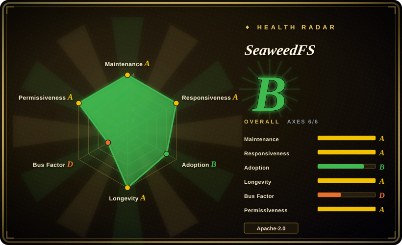
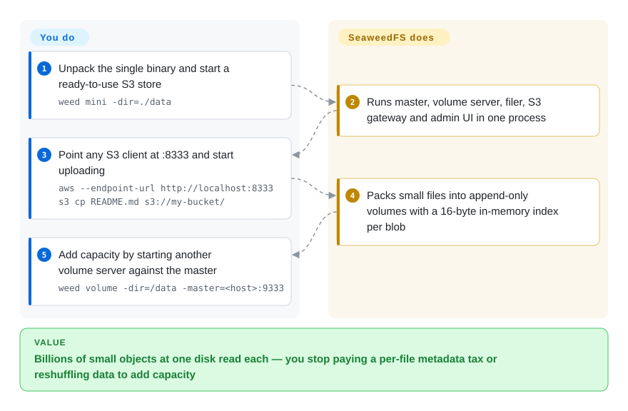

# SeaweedFS

One `weed` binary that serves an S3 gateway, a POSIX-ish filesystem and a table/lakehouse layer over append-only volume files — designed to hold billions of objects with one disk read per blob and to grow capacity by adding a volume server.

## When to use

You need an S3 endpoint, but the number that actually hurts is *object count*: hundreds of millions to billions of small files, where per-file metadata and inode overhead make other stores expensive or slow. You also want capacity to grow by starting another volume server rather than reshuffling data, and you may want the same data reachable as a filesystem (FUSE/WebDAV) or as Iceberg tables without deploying a separate catalog. SeaweedFS is built for exactly that: small files are packed into append-only volumes, each blob's location is a 16-byte entry in memory, and the master tracks volumes rather than files, so it stays small even at billions of objects. The deciding tradeoff against its closest substitutes is *architecture*: unlike [Silo](silo.md)/[MinIO](minio.md) it is not a single S3 server with a MinIO-compatible disk format — it is a master/volume/filer system whose S3 gateway is one face of a broader storage layer — and unlike [Garage](garage.md) its design center is object count and capacity within a cluster, not cross-site replication over unreliable links. Against [Ceph](ceph.md), you give up object+block+file under foundation governance in exchange for a much lighter Go deployment that is natively good at small files.

## How it works

You run one `weed` binary in different roles. For a single node, `weed mini` starts everything at once — master, volume server, filer, S3 gateway, WebDAV, catalog and admin UI — and the S3 endpoint is ready on `:8333`. At scale the roles separate: the **master** tracks which volumes exist and where (it is not in the read path, since clients cache the volume-to-server mapping), **volume servers** store blobs in append-only volume files, the **filer** keeps directory metadata in a store you already run (LevelDB, RocksDB, PostgreSQL, MySQL, Redis, Elasticsearch, and many others), and the S3 gateway is stateless so you scale it by running more behind a load balancer. Capacity grows by starting another volume server pointed at the master; balancing, vacuuming, erasure coding and repair are triggered on demand. What you own: choosing and running the filer's metadata store, and the cluster topology. What SeaweedFS owns: turning a byte to tens of TB into the right blobs, keeping one disk read between a request and the data, and the S3 IAM/STS/policy surface its gateway implements.

<!-- flow-steps:begin (generated from flows/seaweedfs.json by tools/flow_card.py — do not edit) -->

Text version of the flow

1. **You**: Unpack the single binary and start a ready-to-use S3 store — `weed mini -dir=./data`
2. **SeaweedFS**: Runs master, volume server, filer, S3 gateway and admin UI in one process
3. **You**: Point any S3 client at :8333 and start uploading — `aws --endpoint-url http://localhost:8333 s3 cp README.md s3://my-bucket/`
4. **SeaweedFS**: Packs small files into append-only volumes with a 16-byte in-memory index per blob
5. **You**: Add capacity by starting another volume server against the master — `weed volume -dir=/data -master=<host>:9333`

**Value**: Billions of small objects at one disk read each — you stop paying a per-file metadata tax or reshuffling data to add capacity

<!-- flow-steps:end -->

## When NOT to use

- **You want a drop-in MinIO replacement.** SeaweedFS has its own data model (master/volumes/filer) and its S3 semantics are the gateway's implementation, so an existing MinIO data disk cannot be mounted into it. To keep MinIO's protocol *and* format, use [Silo](silo.md); to move to SeaweedFS you migrate objects.
- **You want the smallest possible operational surface.** Scale-out SeaweedFS means running master, volume servers, a filer backed by an external metadata store, and stateless gateways — more moving parts than one binary. If you just want one process and one directory for an S3 endpoint, use [Silo](silo.md) or [Garage](garage.md).
- **You need cross-site replication over unreliable links with cheap heterogeneous nodes.** That is Garage's design center; SeaweedFS does have rack/DC-aware replication and cloud tiering, but its model assumes a cluster you can operate as a unit. For the "machines in different places, links flaky" case, pick [Garage](garage.md).
- **You need block storage (volumes/iSCSI) as a first-class product.** SeaweedFS's center is blobs and files. For block and a unified storage platform under foundation governance, use [Ceph](ceph.md) (RBD/CephFS/RGW).
- **You need an SLA, vendor support, or foundation governance.** SeaweedFS is a creator-led project (with a commercial SeaweedFS Enterprise offering) rather than a foundation project. For procurement-grade backing, choose [Ceph](ceph.md) or a commercial product.
- **You want a slow, conservative upgrade cadence.** SeaweedFS ships releases roughly weekly; you must be prepared to pin, read release notes and upgrade deliberately. If that tempo is a poor fit for your change control, a store with a slower cadence may suit better.

## Comparison

| Alternative | In index | Our verdict | Tradeoff |
|---|---|---|---|
| [Silo](silo.md) | ✅ | Choose Silo when you need MinIO's exact S3 behaviour, disk format and admin surface with a maintained release line; choose SeaweedFS when the workload is small-object count at scale and you accept a different architecture and a migration. | Silo buys drop-in compatibility and a tiny ops surface; SeaweedFS buys object-count scale, a filer/FUSE face and a lakehouse layer, paid for in moving parts. |
| [MinIO](minio.md) | ✅ | Do not choose MinIO for new storage — it is archived and unmaintained. SeaweedFS is the most direct *live* replacement when what you need is S3 plus filesystem semantics on your own hardware. | Both are Go, self-hosted and S3-first; MinIO is a single frozen server, SeaweedFS is an actively maintained multi-role system with a different data model. |
| [Garage](garage.md) | ✅ | Choose Garage when the cluster is a few heterogeneous machines across unreliable sites; choose SeaweedFS when the cluster is a pool of machines holding a very large number of objects. | Garage optimizes site tolerance and simplicity; SeaweedFS optimizes per-blob disk reads, object count and capacity growth. |
| [Ceph](ceph.md) | ✅ | Choose Ceph when you need object, block and file from one foundation-governed platform and can staff storage operations; choose SeaweedFS when you mostly need S3 and a filesystem face and want a lighter stack. | Ceph gives breadth, governance and enormous scale at high operational cost; SeaweedFS gives a smaller Go footprint and small-file efficiency without the foundation and unified-storage breadth. |
| AWS S3 / Cloudflare R2 | not indexed | Choose hosted S3 when you want no operations and global durability; choose SeaweedFS when the data must stay on your own disks or the recurring per-GB cost is the deciding factor. | Hosted removes ops and hardware and adds egress bills and lock-in; self-hosted SeaweedFS removes those but makes capacity planning and upgrades your job. |

## Tech stack

- **Language:** Go. A single `weed` binary that takes the role of master, volume server, filer, S3 gateway, WebDAV server, mount (FUSE) or shell — plus a Rust volume server that is a drop-in for the Go one on the same on-disk format.
- **Storage engine:** append-only volume files holding packed blobs, with a small in-memory index per blob on the volume server (16 bytes per index entry, ~40 bytes of metadata per file on disk); erasure coding is applied to warm data in the background, and volumes can be up to 8 TB with the large-disk build.
- **Metadata:** the master tracks volumes, not files; the filer keeps directory metadata in an external store you choose (LevelDB, RocksDB, SQLite, MySQL, PostgreSQL, Cassandra, HBase, MongoDB, Redis, Elasticsearch, etcd, TiKV, FoundationDB, YDB, ArangoDB, Tarantool, and MySQL/PostgreSQL-compatible databases).
- **S3 surface:** the gateway implements object/bucket operations (73 listed), S3 Tables (36), IAM (39) and STS (5), including versioning, Object Lock, lifecycle rules, tagging, CORS, checksums, presigned URLs, multipart and bucket policies; SSE-S3/KMS/C with OpenBao/Vault, AWS KMS, Azure Key Vault and GCP KMS.
- **Extras:** Iceberg/Lance table buckets with a built-in REST catalog, a Hadoop-compatible filesystem, tiered storage across disk types, transparent cloud tiering, and replication with rack/DC awareness.
- **Deployment:** binary releases, an install script, Docker/Compose and Helm for Kubernetes; clients are any S3 SDK/CLI, rclone, restic, Spark, Trino and more.

## Dependencies

- **A single machine for `weed mini`, or a set of machines with local disks for scale-out.** Volume servers are where capacity lives; masters and gateways are lightweight and can be few.
- **A metadata store for the filer** if you use the filesystem/S3 directory features — one of the many supported databases or embedded stores. `weed mini` bundles a local one for single-node use.
- **Network access between clients, masters, volume servers and filers.** Clients talk to volume servers directly after resolving the mapping, so those paths must be reachable.
- **Optional:** cloud credentials if you use S3/GCS/Azure tiering, a KMS/Vault instance for SSE-KMS, and a load balancer in front of multiple S3 gateways.
- **Client side:** any S3 SDK or CLI. No external control plane is required.

## Ops difficulty

**Medium.** A single-node deployment is genuinely one command, and even multi-node adds only three role types plus a metadata store, all in one binary — far lighter than Ceph. The complexity is in the topology: understanding that capacity is volume servers, that the filer's external metadata store is now a dependency you must back up, and that the master is a small but important component. Capacity growth is easy (start a volume server), but balancing/erasure-coding/repair are operations you trigger, and the very fast release cadence means upgrades should be pinned and staged. For teams that mainly want S3, the practical cost is smaller than Ceph's but larger than a single-binary MinIO-style server.

## Health & viability

- **Maintenance (2026-09-20).** Very active: releases `4.36` through `4.47` between 2026-06-25 and 2026-09-14 (roughly weekly), commits on the default branch on 2026-09-20, and a long continuous history since 2014-07-14. Not archived.
- **Governance / bus factor (2026-09-20).** Creator-led. The project is developed primarily by Chris Lu (`chrislusf`), who accounts for roughly three-quarters of recorded contributions; the repository is organization-owned (`seaweedfs`) with a modest set of recurring outside contributors and a commercial SeaweedFS Enterprise offering. There is no foundation or multi-vendor governance. The code is Apache-2.0 and contributions have no CLA requirement that this page could confirm [未验证].
- **Backing & Lindy (2026-09-20).** Created 2014, so the project is about 12 years old and has been active the entire time — the strongest form of the Lindy prior (age × still-active), with a large user base and no sign of abandonment. The counterweight is concentration: a long-lived project still largely steered by its creator.
- **Adoption & ecosystem (2026-09-20).** ~34.8k stars, ~3.0k forks, 526 watchers, ~25.1M Docker Hub pulls for `chrislusf/seaweedfs`, and integration coverage across S3 SDKs, Spark, Trino, Iceberg and Hadoop-compatible tooling. The documentation is unusually broad (a large wiki plus site docs), reflecting a long tail of features.
- **Risk flags (2026-09-20).** Creator-concentration risk; a large open backlog (770 open issues); a rapid release cadence that puts upgrade discipline on you; and a very wide feature surface (S3 + filesystem + tables + tiering) that can outrun what any one deployment needs. Licence is clean Apache-2.0, with no relicense history.

## Caveats (unverified)

- [未验证] The benchmark figures quoted by the project (e.g. tens of thousands of 1 KB writes per second and GiB/s-scale warp runs on one laptop) were not reproduced here; treat capacity and throughput claims as vendor/project measurements.
- [未验证] The claim that a Rust volume server is a drop-in on the same on-disk format comes from the README; which builds and versions ship it was not verified.
- [未验证] Whether contributions require a CLA could not be confirmed from the repository's contributing docs in this pass.
- [推断] Bus-factor statements use GitHub contributor counts (top contributor ≈ 10.5k of ≈ 14.1k contributions) and are a proxy: contributor statistics include bots and do not measure review, release or architectural ownership.
- [未验证] The exact set of S3 operations supported at the gateway is taken from the README's summary table (73 object/bucket, 36 S3 Tables, 39 IAM, 5 STS); no per-operation compatibility test was run.
- [推断] Docker pull counts and star/fork figures are point-in-time (2026-09-20) and include CI and evaluation traffic.
