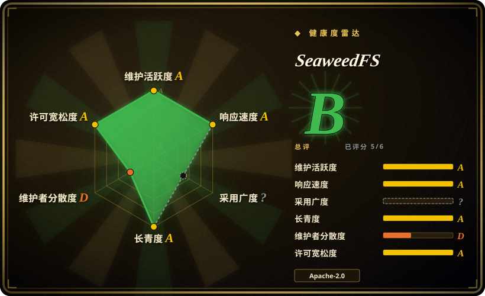
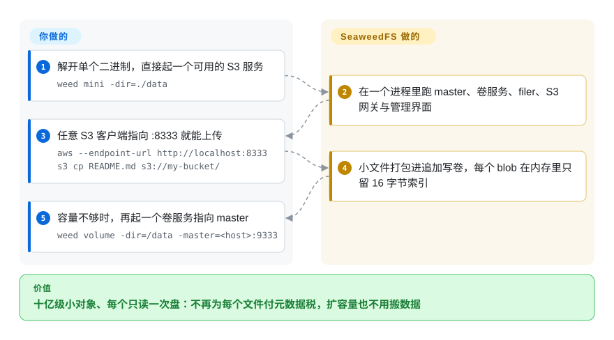

# SeaweedFS

一个 `weed` 二进制，在追加写的卷文件之上同时提供 S3 网关、类 POSIX 文件系统与表／湖仓层——为承载十亿级对象而设计，每个 blob 只需一次读盘，容量靠加一台卷服务就能扩。

## 何时使用

你需要一个 S3 端点，但真正让你痛的数字是**对象数量**：几亿到几十亿个小文件，逐文件元数据与 inode 开销会让别的存储又慢又贵。你还希望扩容量是再起一台卷服务，而不是搬数据；可能还想让同一份数据以文件系统形式（FUSE／WebDAV）或 Iceberg 表形式被访问，而不必另外部署一个 catalog。SeaweedFS 就是为这些而生的：小文件被打包进追加写卷，每个 blob 的位置只是内存里 16 字节的条目，master 管的是卷而不是文件，所以到十亿对象时它依然很小。相对最接近的替代品，决定性的取舍是**架构**：与 [Silo](silo.zh.md)／[MinIO](minio.zh.md) 不同，它不是一台格式与 MinIO 兼容的 S3 服务端——而是 master／卷／filer 体系，S3 网关只是这层更宽存储能力的一个面；与 [Garage](garage.zh.md) 不同，它的设计中心是集群内的对象数量与容量，而不是跨不可靠链路的站点复制。相对 [Ceph](ceph.zh.md)，你放弃的是基金会治理下的对象＋块＋文件，换来的是轻得多、且天生擅长小文件的 Go 部署。

## 怎么用起来

你跑的是同一个 `weed` 二进制的不同角色。单节点时，`weed mini` 一次把 master、卷服务、filer、S3 网关、WebDAV、catalog 与管理界面全起起来，`:8333` 上的 S3 端点直接可用。规模化时角色分开：**master** 记录有哪些卷、放在哪（它不在读路径上，因为客户端会缓存“卷→服务器”映射），**卷服务**把 blob 存进追加写的卷文件，**filer** 把目录元数据存进你已经在跑的某个存储（LevelDB、RocksDB、PostgreSQL、MySQL、Redis、Elasticsearch 等），S3 网关无状态，想扩就在负载均衡后面多起几个。容量增长靠再起一台卷服务指向 master；再平衡、压缩、纠删码与修复按需触发。你负责的是：选并运行 filer 的元数据存储，以及集群拓扑。SeaweedFS 负责的是：把从一字节到数十 TB 的对象切进正确的 blob、让一次请求到数据之间只隔一次读盘，以及它的网关所实现的 S3 IAM／STS／策略能力。

<!-- flow-steps:begin (generated from flows/seaweedfs.json by tools/flow_card.py — do not edit) -->

流程文字版

1. **你**：解开单个二进制，直接起一个可用的 S3 服务 — `weed mini -dir=./data`
2. **SeaweedFS**：在一个进程里跑 master、卷服务、filer、S3 网关与管理界面
3. **你**：任意 S3 客户端指向 :8333 就能上传 — `aws --endpoint-url http://localhost:8333 s3 cp README.md s3://my-bucket/`
4. **SeaweedFS**：小文件打包进追加写卷，每个 blob 在内存里只留 16 字节索引
5. **你**：容量不够时，再起一个卷服务指向 master — `weed volume -dir=/data -master=<host>:9333`

**价值**：十亿级小对象、每个只读一次盘：不再为每个文件付元数据税，扩容量也不用搬数据

<!-- flow-steps:end -->

## 何时不用

- **你想要 MinIO 的即插即用替代。** SeaweedFS 有自己的数据模型（master／卷／filer），S3 语义也是它网关自己的实现，因此现有的 MinIO 数据盘挂不进去。要连协议带格式保住，用 [Silo](silo.zh.md)；转到 SeaweedFS 就是迁移对象。
- **你想要尽可能小的运维面。** 规模化的 SeaweedFS 意味着要跑 master、卷服务、依赖外部元数据存储的 filer，以及无状态网关——比单二进制多不少活动部件。如果你只想要一个进程、一个目录的 S3 端点，用 [Silo](silo.zh.md) 或 [Garage](garage.zh.md)。
- **你需要跨不可靠链路、用便宜异构节点做站点复制。** 那是 Garage 的设计中心；SeaweedFS 确实有机架／数据中心感知的复制与云分层，但它的模型假定你能把集群当作一个整体来运维。遇到“机器分散各地、链路时好时坏”，请选 [Garage](garage.zh.md)。
- **你需要把块存储（卷／iSCSI）作为一等产品。** SeaweedFS 的中心是 blob 与文件。要块存储和基金会治理下的统一存储平台，用 [Ceph](ceph.zh.md)（RBD／CephFS／RGW）。
- **你需要 SLA、厂商支持或基金会治理。** SeaweedFS 是创建者主导的项目（另有商业版 SeaweedFS Enterprise），不是基金会项目。要采购级别的背书，请选 [Ceph](ceph.zh.md) 或商业产品。
- **你想要缓慢保守的升级节奏。** SeaweedFS 大致每周发一版；你必须准备好固定版本、读发布说明、有步骤地升级。如果这个节奏不适合你的变更管控，节奏更慢的存储可能更合适。

## 横向对比

| 替代品 | 是否收录 | 我们的评价 | 取舍 |
|---|---|---|---|
| [Silo](silo.zh.md) | ✅ | 你需要 MinIO 精确的 S3 行为、磁盘格式与管理面、并有一条在维护的发版线时选 Silo；负载是规模化的小对象、且能接受另一套架构与一次迁移时选 SeaweedFS。 | Silo 换到即插即用的兼容性与极小的运维面；SeaweedFS 换到对象数量规模、filer／FUSE 这个面和湖仓层，代价是多出来的活动部件。 |
| [MinIO](minio.zh.md) | ✅ | 新存储都别选 MinIO——它已归档、无人维护。当你的需求是“自有硬件上的 S3 加文件系统语义”时，SeaweedFS 是最直接的**活跃**替代。 | 两者都是 Go、自建、S3 优先；MinIO 是一台冻结的服务端，SeaweedFS 是一个活跃维护、数据模型不同的多角色系统。 |
| [Garage](garage.zh.md) | ✅ | 集群是几台分散在不可靠站点、型号各异的机器时选 Garage；集群是一池装下极大量对象的机器时选 SeaweedFS。 | Garage 优化站点容忍度与简单性；SeaweedFS 优化每 blob 读盘次数、对象数量与容量增长。 |
| [Ceph](ceph.zh.md) | ✅ | 你需要基金会治理的同一平台提供对象、块与文件、且养得起存储运维时选 Ceph；你主要需要 S3 加一个文件系统面、且想要更轻的栈时选 SeaweedFS。 | Ceph 用高运维成本换广度、治理与惊人规模；SeaweedFS 用没有基金会与统一存储广度，换更小的 Go 足迹与小文件效率。 |
| AWS S3／Cloudflare R2 | 未收录 | 想要零运维与全球持久性时选托管 S3；数据必须留在自有磁盘、或按 GB 的持续成本是决定因素时选 SeaweedFS。 | 托管方案省掉运维与硬件，加上出网费与锁定；自建 SeaweedFS 去掉这些，但容量规划与升级成了你的活。 |

## 技术栈

- **语言：** Go。单个 `weed` 二进制可担任 master、卷服务、filer、S3 网关、WebDAV、挂载（FUSE）或 shell；另有一个 Rust 卷服务，在同一落盘格式上与 Go 版可互换。
- **存储引擎：** 追加写的卷文件容纳打包后的 blob，卷服务为每个 blob 保留很小的内存索引（每个索引条目 16 字节、磁盘上每文件约 40 字节元数据）；温数据在后台做纠删码，大磁盘构建下卷可达 8 TB。
- **元数据：** master 管卷不管文件；filer 把目录元数据放进你选的外部存储（LevelDB、RocksDB、SQLite、MySQL、PostgreSQL、Cassandra、HBase、MongoDB、Redis、Elasticsearch、etcd、TiKV、FoundationDB、YDB、ArangoDB、Tarantool，以及兼容 MySQL／PostgreSQL 的数据库）。
- **S3 能力面：** 网关实现对象／桶操作（列出 73 个）、S3 Tables（36）、IAM（39）与 STS（5），含版本控制、Object Lock、生命周期、标签、CORS、校验和、预签名 URL、分片上传与桶策略；SSE-S3／KMS／C，密钥提供方支持 OpenBao／Vault、AWS KMS、Azure Key Vault 与 GCP KMS。
- **扩展能力：** Iceberg／Lance 表桶与内建 REST catalog、Hadoop 兼容文件系统、跨磁盘类型的分层存储、透明云分层，以及机架／数据中心感知的复制。
- **部署：** 二进制发布、安装脚本、Docker／Compose 与 Kubernetes Helm；客户端为任意 S3 SDK／CLI、rclone、restic、Spark、Trino 等。

## 依赖

- **单机可用 `weed mini`；规模化则需要一组带本地磁盘的机器。** 容量在卷服务上；master 与网关很轻，可以只跑少数几个。
- **若使用文件系统／S3 目录功能，filer 需要一个元数据存储**——从众多受支持的数据库或内嵌存储中选一个。`weed mini` 为单节点场景内置了一个。
- **客户端、master、卷服务与 filer 之间的网络可达。** 客户端在解析映射后直接与卷服务通信，这些路径必须通。
- **可选：** 使用 S3／GCS／Azure 分层时的云凭据，SSE-KMS 用的 KMS／Vault 实例，以及多 S3 网关前的负载均衡。
- **客户端侧：** 任意 S3 SDK 或 CLI。不需要外部控制面。

## 运维难度

**中等。** 单节点部署确实就一条命令，多节点也只是多出三类角色加一个元数据存储，而且都在同一个二进制里——比 Ceph 轻得多。复杂度在拓扑：要理解容量在卷服务上、filer 的外部元数据存储现在是你必须备份的依赖、以及 master 虽小但重要。扩容量很容易（起一台卷服务），但再平衡／纠删／修复是需要你触发的操作，而极快的发版节奏意味着升级应固定版本、分阶段进行。对主要只想要 S3 的团队，实际成本比 Ceph 小，但比单二进制的 MinIO 式服务端大。

## 健康度与可持续性

- **维护状态（2026-09-20）。** 非常活跃：`4.36` 到 `4.47` 各版本落在 2026-06-25 到 2026-09-14 之间（大致每周一版），默认分支在 2026-09-20 还有提交，且自 2014-07-14 起连续维护至今。未归档。
- **治理／巴士系数（2026-09-20）。** 创建者主导。项目主要由 Chris Lu（`chrislusf`）开发，他承担了已记录贡献的约四分之三；仓库归组织所有（`seaweedfs`），有少量长期外部贡献者，并有商业版 SeaweedFS Enterprise。没有基金会或多厂商治理。代码为 Apache-2.0，本页无法确认贡献是否需要签署 CLA [未验证]。
- **背书与 Lindy（2026-09-20）。** 创建于 2014 年，项目约 12 年且全程活跃——Lindy 先验的最强形态（年龄 × 仍在活跃），用户基数大，无任何被弃置迹象。对冲因素也很明显：一个长寿项目至今仍主要由其创建者掌舵。
- **采用与生态（2026-09-20）。** 约 3.48 万 stars、约 3.0 千 fork、526 个 watcher、`chrislusf/seaweedfs` 在 Docker Hub 上约 2,510 万次拉取；在 S3 SDK、Spark、Trino、Iceberg 与 Hadoop 兼容工具链上集成覆盖面广。文档异常丰富（大型 wiki 加站点文档），反映出很长的功能尾巴。
- **风险标记（2026-09-20）。** 创建者集中风险；公开积压较大（770 个 open issue）；发版节奏快，升级纪律落在你身上；功能面极宽（S3＋文件系统＋表＋分层），容易超出任何单个部署的实际需要。许可为干净的 Apache-2.0，无换证历史。

## 存疑（未验证）

- [未验证] 项目引用的基准数字（例如单台笔记本上每秒数万次 1 KB 写入、warp 跑出 GiB/s 级）本次未复现；容量与吞吐说法应视为项目／厂商自测。
- [未验证] “Rust 卷服务在同一落盘格式上可互换”来自 README；哪些构建与版本提供它未经验证。
- [未验证] 贡献是否需要签署 CLA，本次未能从仓库的贡献文档确认。
- [推断] 巴士系数结论使用 GitHub 贡献者计数（贡献最多者约占 10.5k／14.1k），只是代理指标：贡献者统计包含机器人，也不衡量评审、发版或架构层面的主导权。
- [未验证] 网关支持的 S3 操作集合取自 README 的汇总表（对象／桶 73、S3 Tables 36、IAM 39、STS 5）；未做逐操作兼容性测试。
- [推断] Docker 拉取数与 star／fork 数是 2026-09-20 的时点数据，包含 CI 与评估流量。
