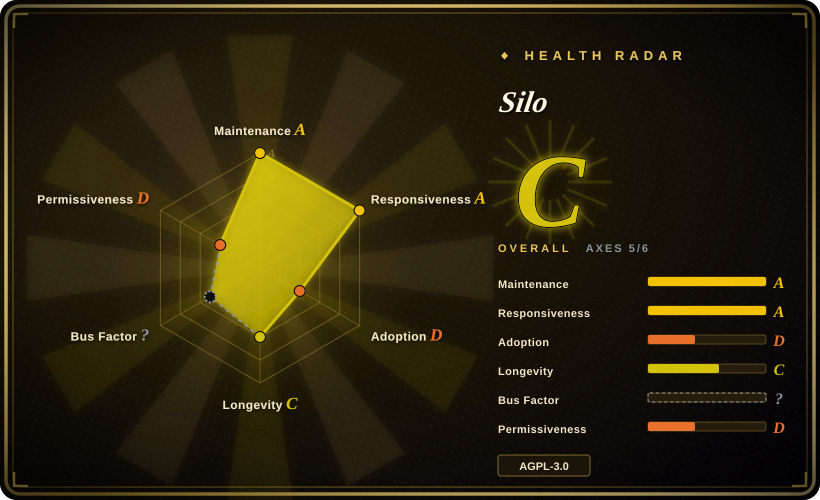
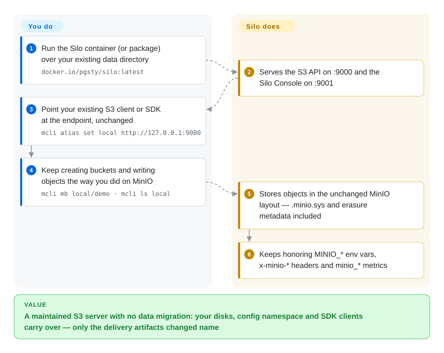

# Silo

A community-maintained continuation of the open-source MinIO server: same S3 API, same on-disk format, same `MINIO_*` / `minio_*` / `x-minio-*` compatibility names — with the binary, packages, service and image renamed to `silo` and MinIO's phone-home and in-place-update paths removed.

## When to use

You already run self-hosted MinIO — it is the S3 endpoint behind your PostgreSQL backups, your log archive, or your application's object writes — and you just learned that the upstream community edition is over: `minio/minio` is archived (last push 2026-04-24), prebuilt community binaries stopped, and the web console was reduced to a stub. You cannot simply stay put: the server holds your data, and no one is shipping it fixes. You are not looking for a new architecture; you are looking for someone to keep *this* server alive. You reach for Silo, point `docker.io/pgsty/silo` at the same data volume, and ordinary S3 applications usually need no code changes — the S3 wire API, `.minio.sys` layout, erasure metadata, `MINIO_*` configuration and `/minio/*` admin routes all remain the MinIO contract. The deciding tradeoff against the closest substitutes is *migration cost*: Garage and SeaweedFS are purpose-built stores with their own on-disk layouts, so adopting them is a data migration and a new operational model, while Silo is the same codebase with a maintained release line, so switching is an image/package swap and a deployment checklist.

That compatibility inheritance is exactly the reason to pick it over a from-scratch store — and the reason it is the wrong pick when you have no MinIO debt. If you are greenfield and nothing constrains you to MinIO's disk format, its `xl.meta`/erasure-set design, or its `MINIO_*` namespace, a store designed for your actual problem is a cleaner bet: Garage for small-to-medium geo-distributed clusters, SeaweedFS for many-small-object workloads, Ceph when you need foundation governance and object+block+file in one platform. Silo's whole value is continuity, not novelty.

## How it works

Silo is the MinIO server codebase, forked and kept buildable. You run one process — `silo server /data --console-address ":9001"`, or the multi-node form listing every node's drives — and it serves the S3 wire API on `:9000`, an embedded Silo Console on `:9001`, Prometheus metrics under `minio_*`, and admin routes under `/minio/*`. Because the storage format is untouched, an existing MinIO data disk can be mounted and read in place: no export, no import, no metadata rewrite. What the maintainers own is the release line — multi-arch images, RPM/DEB/APK packages, binaries, a Helm chart, security fixes, the forked Console and client, and a code-verified compatibility audit listing every intentional divergence. What you own is the deployment migration: the executable, package, systemd unit and image changed name, the default local config directory is now `~/.silo` (with a `~/.minio` fallback), in-place `mc admin update` and SUBNET/callhome are permanently disabled, and several authorization decisions are deliberately stricter than upstream's.

<!-- flow-steps:begin (generated from flows/silo.json by tools/flow_card.py — do not edit) -->

Text version of the flow

1. **You**: Run the Silo container (or package) over your existing data directory — `docker.io/pgsty/silo:latest`
2. **Silo**: Serves the S3 API on :9000 and the Silo Console on :9001
3. **You**: Point your existing S3 client or SDK at the endpoint, unchanged — `mcli alias set local http://127.0.0.1:9000`
4. **You**: Keep creating buckets and writing objects the way you did on MinIO — `mcli mb local/demo · mcli ls local`
5. **Silo**: Stores objects in the unchanged MinIO layout — .minio.sys and erasure metadata included
6. **Silo**: Keeps honoring MINIO_* env vars, x-minio-* headers and minio_* metrics

**Value**: A maintained S3 server with no data migration: your disks, config namespace and SDK clients carry over — only the delivery artifacts changed name

<!-- flow-steps:end -->

## When NOT to use

- **You need foundation governance or a commercial SLA.** Silo is published by one organization (Pigsty) and fork-side commits since 2026-06 are almost entirely by one maintainer (`Vonng`). If your risk model requires a foundation, a multi-vendor steering group, or a vendor who answers a pager, choose Ceph (broad vendor and foundation involvement, plus RBD/CephFS) or a hosted S3 service instead — Silo is explicitly a single-maintainer continuity bet.
- **You have no MinIO compatibility debt.** If nothing forces you to keep MinIO's on-disk format, choose the store built for your workload: Garage (Rust, AGPL, geo-distributed small/medium clusters) or SeaweedFS (Apache-2.0, Go, billions of small files with an S3 gateway). You would pay Silo's inherited design constraints — erasure sets, `xl.meta`, MinIO deployment shapes — for compatibility you do not need.
- **You need object + block + file in one platform, at multi-PB scale.** Use Ceph (RGW for S3, RBD for block, CephFS for file, usually via Rook on Kubernetes). Silo gives you object storage only, and Ceph's breadth is why it costs far more to operate.
- **You need a no-touch, mixed-version upgrade path.** Silo's own audit flags this: the 2026-08-06 transition removed a private storage-REST operation without bumping its version, and durable IAM revocation does not support rolling downgrade — every node must be upgraded as one build, with a tested recovery point. If you cannot schedule a coordinated single-build upgrade (or need mixed-version operation as a hard requirement), stay on your current version until you can, or pick a system with a documented mixed-version protocol.
- **You depend on MinIO's online services.** SUBNET registration, callhome, diagnostic uploads and in-place self-update are disabled by design; `MINIO_UPDATE` is parsed and ignored. If you bought MinIO SUBNET support or automate `mc admin update`, that workflow is gone — upgrade through packages, images or your orchestrator, or stay with a vendor that offers hosted support.
- **AGPL-3.0 network-service obligations are unacceptable to your legal team.** This applies equally to upstream MinIO. If AGPL is a blocker, look at Apache-2.0 or MIT stores (SeaweedFS, Apache Ozone) or a proprietary hosted service.
- **You need S3 in front of an existing POSIX filesystem.** Silo/MinIO is not a gateway to a mounted filesystem (the old filesystem/gateway modes were retired upstream); a purpose-built gateway such as VersityGW is the right tool when the bytes must stay as ordinary files.

## Comparison

| Alternative | In index | Our verdict | Tradeoff |
|---|---|---|---|
| [MinIO](minio.md) | ✅ | Treat archived MinIO as a frozen artifact, not a plan: the community repo is archived and no one is shipping it patches or a console. Pick Silo when you want that exact codebase and data format with an active release line; pick an archived tarball only if you are prepared to own every future CVE yourself. | Protocol and disk format are identical, so this is purely a question of who maintains it — a downstream org with a public advisory per fix, or nobody. |
| [Garage](garage.md) | ✅ | Choose Garage when you are standing up a *new* self-hosted S3 endpoint across a few sites or heterogeneous machines and want a compact Rust design that tolerates unreliable links; choose Silo when your disks, `MINIO_*` config, IAM policies and runbooks are already MinIO-shaped. | Garage's smaller multi-site-native design is not a drop-in — its own layout and consistency model mean adopting it is a migration, whereas Silo is an image swap plus a compatibility checklist. |
| [SeaweedFS](seaweedfs.md) | ✅ | Choose SeaweedFS when the pain is object *count* — billions of small files — and you want a master/volume/filer architecture with an S3 gateway; choose Silo when you want one MinIO-compatible S3 server with mature semantics rather than a filesystem-plus-gateway stack. | SeaweedFS optimizes its own topology and metadata scale; Silo optimizes protocol and format compatibility with the large existing MinIO deployment base. |
| [Ceph](ceph.md) | ✅ | Choose Ceph when you need one professionally governed platform for object, block and file and can staff storage operations; choose Silo when you only need object storage and prefer a single binary over a storage cluster. | Ceph buys scale, breadth and multi-vendor governance at a much higher operational cost; Silo buys a small operational surface and MinIO compatibility against single-org backing. |
| AWS S3 / Cloudflare R2 | not indexed | Choose hosted S3 when you do not want to operate storage at all and can accept egress bills, data residency and vendor lock-in; choose Silo when the data must stay on your own disks — air-gapped, on-prem, cost-sensitive per-GB, or a backup target on your own hardware, which is exactly how Pigsty runs it. | Hosted removes ops and capex but adds egress cost and a vendor you cannot leave cheaply; self-hosting removes those but makes you responsible for durability, upgrades and recovery. |

## Tech stack

- **Language:** Go 1.27 (`go.mod`), with the server module path deliberately left as `github.com/minio/minio` for source compatibility.
- **Storage engine:** MinIO's erasure-coded object store — pools, erasure sets, drives, `.minio.sys` metadata; single-node single-drive deployments use the same binary. Wire protocol is S3 with SigV4 plus MinIO's admin/S3 extensions.
- **Companion components (separate forks you track in lockstep):** `pgsty/silo-console` (embedded web console, shipped via a `replace` of `github.com/minio/console`), `pgsty/mc` (client, shipped as `mcli`, `replace` of `github.com/minio/mc`), and `pgsty/silo-pkg/v3` (shared package, consumed directly at its own module path). The upstream SDK `github.com/minio/minio-go/v7` is used directly.
- **Integrations carried over from MinIO:** bucket notifications to Kafka (Sarama), NATS, MQTT, AMQP, Elasticsearch, MySQL, PostgreSQL, Redis and webhooks; LDAP/Active Directory and OpenID Connect identity; KES/KMS for SSE; remote tiering to S3/GCS/Azure SDKs. The console is forked and (configurably) bilingual, with Metrics V3.
- **Delivery:** GoReleaser-built multi-arch container images (`docker.io/pgsty/silo`, plus `-distroless` variants), Linux binaries, RPM/DEB/APK packages, a Helm chart, checksums, SPDX SBOMs, Sigstore-signed manifests and build attestations.
- **Build/verification in-repo:** `make verifiers`, `make test`, `make build`, and a `rebrand-guard` that checks an explicit inventory of compatibility identifiers against a committed baseline.

## Dependencies

- **A machine or Kubernetes cluster with persistent storage.** Erasure coding needs multiple drives (and, for durability across failure domains, multiple nodes); a single-drive host works for evaluation and small deployments. Drive paths are passed on the `server` command line, as in MinIO.
- **TLS certificates** for production endpoints (`--certs-dir`; mounted at `/tmp/.silo/certs` in the distroless image). The built-in trust-any-proxy behavior can be tightened with `MINIO_API_TRUSTED_PROXIES`.
- **Optional but common:** an external KMS/KES for SSE-KMS, LDAP/OpenID for external identity, a notification broker/database, and a Prometheus-compatible scraper for `minio_*` metrics.
- **Client side:** any S3 SDK or the bundled `mcli` (the OCI image also aliases `/usr/bin/mc` to it). No separate control plane or database is required — MinIO's design keeps metadata on the drives.
- **Upgrade tooling:** package manager, container image rollout, or orchestrator. In-place self-update is disabled, so CI/CD or a deployment pipeline is effectively the upgrade mechanism.

## Ops difficulty

**Medium.** Day one is genuinely simple — one binary, drives as arguments, a shipped systemd unit, a container image and a Helm chart — and it inherits MinIO's operational model, which a lot of teams already know. The cost sits in two places. First, durability and scale: an erasure-coded deployment requires drive/node capacity planning, failure-domain layout and periodic healing/scanner awareness, and you are the backup and recovery story. Second, upgrade discipline: mixed-version clusters and rolling downgrade are not supported for the IAM-revocation and storage-REST changes, so upgrades are coordinated whole-cluster operations with a retained recovery point and a tested rollback. On top of that, as a downstream fork it expects you to read the compatibility audit and release notes for each release rather than assume upstream behavior — Silo documents its divergences unusually well, but the reading is on you.

## Health & viability

- **Maintenance (2026-09-20).** Active. Latest Server release `RELEASE.2026-09-16` (published 2026-09-16), the 11th release; the cadence since 2025-12 has been roughly monthly to bimonthly (2025-12-03, 2026-02-14, 03-14, 03-21, 03-25, 04-17, 06-18, 08-04, 08-06, 09-03, 09-16). The repo was pushed within the last day (2026-09-20) and is not archived. Every release ships checksums, SBOMs and Sigstore attestations.
- **Governance / bus factor (2026-09-20).** The load-bearing risk. The fork is published by a single organization, Pigsty, and fork-side commits since 2026-06-01 are 99 by `Vonng` and 1 by a second author (GitHub commits API). Raw contributor counts on the repo are inflated by inherited upstream MinIO history — `minio/minio` contributors are the top entries — so read activity, not contributor totals. No CLA; contributions are inbound=outbound under AGPL-3.0-or-later with DCO sign-off, and there is a published manifesto with an append-only "never" list (no paywalling, no registration wall, no telemetry, no CLA, no license change).
- **Backing & Lindy (2026-09-20).** The codebase is MinIO's, roughly a decade old and battle-tested; the *fork* was created 2025-10-25, so it is about 11 months old and Lindy gives the fork itself little credit — the maturity is inherited, the maintenance is not. The backing track record is Pigsty, the maintainer's PostgreSQL distribution (5.7k stars, created 2020, still active), which runs Silo as its own backup repository. Read this as a single-maintainer continuity bet with a credible operator, not as foundation-backed infrastructure.
- **Adoption & ecosystem (2026-09-20).** ~3.4k stars, 196 forks, 30 watchers; Docker Hub reports ~195k pulls for `pgsty/silo` and ~711k for the predecessor `pgsty/minio` image. All of these measure attention and CI/experimentation as much as production use [推断]. The ecosystem is inherited wholesale from MinIO (every S3 SDK, `mc`, backup tools, Kubernetes operators), which is exactly the point — and the compatibility audit is the best-available evidence that the fork tracks it deliberately.
- **Risk flags (2026-09-20).** AGPL-3.0-or-later network-service obligations; single-maintainer bus factor; conditional drop-in with an unsupported mixed-version upgrade for recent storage/IAM changes; the Console, client and shared package are separate forks that must stay in lockstep; a small public backlog (13 open issues, 2 open pull requests) that may reflect either focus or limited outside contribution. No relicense history — the fork remains AGPL on principle.

## Caveats (unverified)

- [未验证] The MinIO-is-dead framing ("console cut to a stub, community binaries stopped") is Silo's own background account; what is independently confirmed is that `minio/minio` is archived (last push 2026-04-24) and that Silo exists as a fork of it.
- [未验证] "Ordinary S3 applications usually need no code changes" is the project's compatibility claim, backed by a source audit (523 files / ~37k insertions / ~21k deletions across ~96 commits), not by an executed migration. I did not run a MinIO→Silo migration, and the audit itself documents intentional behavior changes on validation, authorization and error paths.
- [推断] Production adoption beyond Pigsty is inferred from stars, forks and Docker pull counts; no published production-user list was found.
- [未验证] The bus-factor assessment counts fork-side commits since 2026-06-01 via the GitHub API (`Vonng` 99, one other 1); it cannot see unmerged review work or contributions that arrive under a different account, and inherited upstream history makes contributor totals a misleading signal.
- [推断] The console's stack (a React app) is inferred, not read from `pgsty/silo-console` in this pass.
- [未验证] No performance or scale benchmark was run here; Silo's docs describe MinIO's erasure-coded architecture rather than publishing new throughput numbers, so any sizing claim should come from your own benchmark.
- [未验证] "No telemetry" rests on the compatibility audit (callhome, SUBNET registration/upload and the updater are disabled, and inspect no longer falls back to MinIO's built-in key); the binary was not audited for other outbound calls.
- [未验证] The compatibility-audit figures (523 files, 96 commits, 137 imports, 436 environment names) are the project's own published counts as of its 2026-08-06 snapshot and were not recomputed here.
