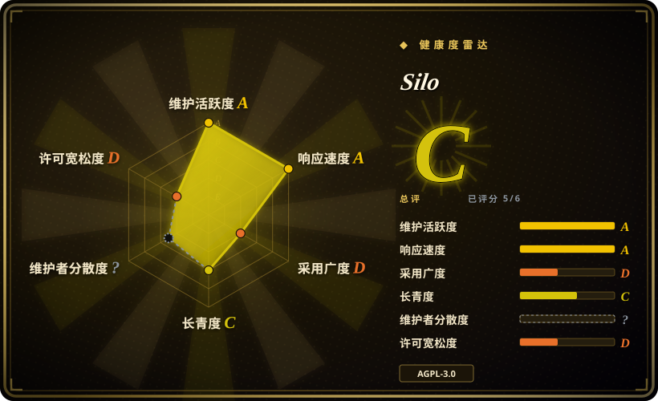
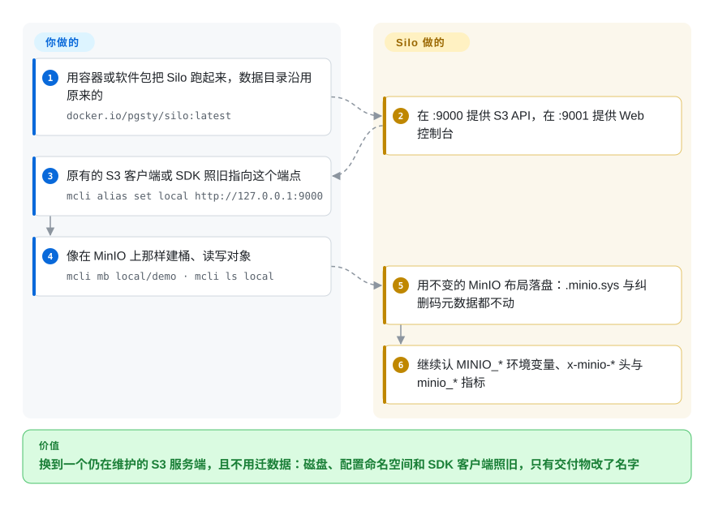

# Silo

开源 MinIO 服务端的社区延续版：同一套 S3 API、同一种落盘格式、同一批 `MINIO_*`／`minio_*`／`x-minio-*` 兼容名——但可执行文件、软件包、服务与镜像都改名为 `silo`，并移除了 MinIO 的联网回传与原地自更新路径。

## 何时使用

你已经在自建 MinIO——它是你 PostgreSQL 备份、日志归档或应用对象写入背后的 S3 端点——然后发现上游社区版已经终结：`minio/minio` 仓库已归档（最后推送 2026-04-24），社区预编译二进制停发，Web 控制台被砍成残桩。你不能就这么放着不管：服务端里装着你的数据，却没人再给它发修复。你要的不是一套新架构，而是有人把**这个**服务端继续维护下去。你换上 Silo，把 `docker.io/pgsty/silo` 指向同一个数据卷，普通 S3 应用通常不需要改代码——S3 线协议、`.minio.sys` 布局、纠删码元数据、`MINIO_*` 配置与 `/minio/*` 管理路由都保持 MinIO 契约。相对最接近的替代品，决定性的取舍是**迁移成本**：Garage 和 SeaweedFS 是另起炉灶的存储，各有自己的落盘布局，采用它们等于做一次数据迁移并换一套运维模型；而 Silo 是同一份代码加上一条在维护的发版线，切换是换镜像／换包加一张部署检查表。

“继承兼容性”正是它相对从零设计的存储更该被选中的原因，也正是你**没有** MinIO 历史包袱时不该选它的原因。如果你是全新起步、没有任何东西把你绑在 MinIO 的磁盘格式、`xl.meta`／纠删组设计或 `MINIO_*` 命名空间上，那么为你的实际问题设计的存储是更干净的赌注：少量到中等规模、跨站点部署选 Garage，海量小对象选 SeaweedFS，需要基金会治理和对象＋块＋文件一体则选 Ceph。Silo 的全部价值是延续，不是创新。

## 怎么用起来

Silo 就是 MinIO 服务端的代码库，被 fork 出来并保持可构建。你跑一个进程——`silo server /data --console-address ":9001"`，或者多节点形态、在命令行列出每个节点的盘——它就在 `:9000` 提供 S3 线协议，在 `:9001` 提供内嵌的 Silo 控制台，并以 `minio_*` 暴露 Prometheus 指标、以 `/minio/*` 提供管理路由。因为落盘格式原封不动，原有的 MinIO 数据盘可以直接挂载读取：不用导出、不用导入、不用重写元数据。维护方负责的是发版线——多架构镜像、RPM／DEB／APK 软件包、二进制、Helm Chart、安全修复、fork 出来的控制台与客户端，以及一份逐条列出有意差异、经过代码核对的兼容性审计。你负责的是部署迁移：可执行文件、软件包、systemd 单元与镜像都改了名，默认本地配置目录变成 `~/.silo`（保留 `~/.minio` 回退），原地 `mc admin update` 与 SUBNET／callhome 被永久禁用，另外有几处鉴权判定刻意比上游更严格。

<!-- flow-steps:begin (generated from flows/silo.json by tools/flow_card.py — do not edit) -->

流程文字版

1. **你**：用容器或软件包把 Silo 跑起来，数据目录沿用原来的 — `docker.io/pgsty/silo:latest`
2. **Silo**：在 :9000 提供 S3 API，在 :9001 提供 Web 控制台
3. **你**：原有的 S3 客户端或 SDK 照旧指向这个端点 — `mcli alias set local http://127.0.0.1:9000`
4. **你**：像在 MinIO 上那样建桶、读写对象 — `mcli mb local/demo · mcli ls local`
5. **Silo**：用不变的 MinIO 布局落盘：.minio.sys 与纠删码元数据都不动
6. **Silo**：继续认 MINIO_* 环境变量、x-minio-* 头与 minio_* 指标

**价值**：换到一个仍在维护的 S3 服务端，且不用迁数据：磁盘、配置命名空间和 SDK 客户端照旧，只有交付物改了名字

<!-- flow-steps:end -->

## 何时不用

- **你需要基金会治理或商业 SLA。** Silo 由单一组织（Pigsty）发布，2026-06 以来的 fork 侧提交几乎全部出自一位维护者（`Vonng`）。如果你的风险模型要求基金会、多厂商指导委员会，或者出事时有人按 SLA 响应，请改选 Ceph（厂商与基金会参与面广，另有 RBD／CephFS）或托管 S3——Silo 明摆着是单维护者的延续性赌注。
- **你没有 MinIO 兼容包袱。** 如果没有东西逼你保留 MinIO 的落盘格式，就选为你的负载而生的存储：Garage（Rust、AGPL、适合中小规模跨站点集群）或 SeaweedFS（Apache-2.0、Go、带 S3 网关、面向十亿级小文件）。否则你会为一份并不需要的兼容性，去承担 Silo 继承来的设计约束——纠删组、`xl.meta`、MinIO 的部署形态。
- **你需要在同一个平台里同时要对象、块和文件，且到多 PB 规模。** 用 Ceph（RGW 提供 S3、RBD 提供块、CephFS 提供文件，Kubernetes 上通常走 Rook）。Silo 只给你对象存储；Ceph 的广度正是它运维代价高得多的原因。
- **你需要无需人工介入、可混版本升级的路径。** Silo 自己的审计已标出这一点：2026-08-06 那次切换删掉了一个私有 storage-REST 操作却没有升版本号，而持久化 IAM 撤销不支持滚动降级——所有节点必须作为同一个构建整体升级，并事先保留可验证的恢复点。如果你排不出一次协调好的整体升级（或者把混版本运行当作硬需求），就先留在当前版本，或改选有文档化混版本协议的系统。
- **你依赖 MinIO 的在线服务。** SUBNET 注册、callhome、诊断上传与原地自更新都被有意禁用，`MINIO_UPDATE` 会被解析并忽略。如果你买过 MinIO SUBNET 支持、或把 `mc admin update` 写进了自动化，这条路径已经消失——请改用软件包、镜像或编排器升级，或留在仍提供托管支持的厂商那里。
- **法务不接受 AGPL-3.0 的网络服务义务。** 这一条对上游 MinIO 同样成立。如果 AGPL 是硬阻塞，请看 Apache-2.0 或 MIT 的存储（SeaweedFS、Apache Ozone），或选择专有托管服务。
- **你要的是给已有 POSIX 文件系统套一层 S3。** Silo／MinIO 不是挂载文件系统的网关（旧的 filesystem／gateway 模式已被上游退役）；当字节必须保持为普通文件时，VersityGW 这类专门的网关才是对的工具。

## 横向对比

| 替代品 | 是否收录 | 我们的评价 | 取舍 |
|---|---|---|---|
| [MinIO](minio.zh.md) | ✅ | 把归档的 MinIO 当作冻结的产物，而不是方案：社区仓库已归档，没人再给它发补丁或控制台。想要同一份代码与数据格式但有人持续发版时选 Silo；只有在准备自己扛下未来每一个 CVE 时，才去拿一个归档快照。 | 协议与磁盘格式完全一致，所以这纯粹是“谁来维护”的问题——一个有公开安全公告、每个修复都发版的下游组织，还是没有人。 |
| [Garage](garage.zh.md) | ✅ | 你要在几个站点或一群异构机器间**新起**一个自建 S3 端点、且希望用紧凑的 Rust 设计容忍不可靠链路时选 Garage；现有磁盘、`MINIO_*` 配置、IAM 策略与运维手册都已是 MinIO 形态时选 Silo。 | Garage 面向多站点的小巧原生设计不是即插即用——它自有的布局与一致性模型意味着采用它是一场迁移；Silo 则是换镜像加一张兼容性检查表。 |
| [SeaweedFS](seaweedfs.zh.md) | ✅ | 当痛点是对象**数量**——十亿级小文件——且你想要 master／volume／filer 架构加 S3 网关时选 SeaweedFS；想要一台语义成熟、兼容 MinIO 的 S3 服务端，而不是一套文件系统加网关的栈时选 Silo。 | SeaweedFS 优化的是自己的拓扑与元数据规模；Silo 优化的是与庞大 MinIO 存量部署之间的协议与格式兼容。 |
| [Ceph](ceph.zh.md) | ✅ | 你需要一个治理专业、同时提供对象、块与文件的平台、且养得起存储运维团队时选 Ceph；只需要对象存储、更愿意用一个二进制而不是一整个存储集群时选 Silo。 | Ceph 用高得多的运维成本换取规模、广度与多厂商治理；Silo 用单组织背书换取更小的运维面和 MinIO 兼容性。 |
| AWS S3／Cloudflare R2 | 未收录 | 完全不想自己运维存储、且能接受流量费、数据驻留与厂商锁定时就选托管 S3；数据必须留在自己的盘上——离线、内网、按 GB 成本敏感，或者就是同机备份目标——时选 Silo，Pigsty 自己就是这么把它当 PostgreSQL 备份库用的。 | 托管方案省掉运维与资本开支，但加上出网费和一个你没法便宜离开的厂商；自建方案去掉这些，代价是持久性、升级与恢复全由你负责。 |

## 技术栈

- **语言：** Go 1.27（`go.mod`），并且有意把服务端模块路径保留为 `github.com/minio/minio` 以维持源码兼容。
- **存储引擎：** MinIO 的纠删码对象存储——池、纠删组、磁盘、`.minio.sys` 元数据；单机单盘部署用的是同一个二进制。线协议是带 SigV4 的 S3，外加 MinIO 的管理／S3 扩展。
- **配套组件（需要同步跟进的独立 fork）：** `pgsty/silo-console`（内嵌 Web 控制台，通过 `replace` 顶替 `github.com/minio/console`）、`pgsty/mc`（客户端，以 `mcli` 交付，`replace` 顶替 `github.com/minio/mc`）、以及 `pgsty/silo-pkg/v3`（共享包，直接以自己的模块路径被消费）。上游 SDK `github.com/minio/minio-go/v7` 直接使用。
- **沿用自 MinIO 的集成：** 桶事件通知投递到 Kafka（Sarama）、NATS、MQTT、AMQP、Elasticsearch、MySQL、PostgreSQL、Redis 与 webhook；LDAP／Active Directory 与 OpenID Connect 身份；KES／KMS 做 SSE；通过 S3／GCS／Azure 的 SDK 做远端分层。控制台是 fork 版，可选中英文界面，带 Metrics V3。
- **交付方式：** GoReleaser 构建的多架构容器镜像（`docker.io/pgsty/silo`，另有 `-distroless` 变体）、Linux 二进制、RPM／DEB／APK 软件包、Helm Chart、校验和、SPDX SBOM、Sigstore 签名清单与构建证明。
- **仓库内构建／校验：** `make verifiers`、`make test`、`make build`，以及 `rebrand-guard`——对照提交进仓库的基线清单，检查一组显式登记的兼容性标识。

## 依赖

- **一台机器或一个 Kubernetes 集群，加上持久存储。** 纠删码需要多块盘（跨故障域要多个节点）；单盘主机可用于评估和小规模部署。磁盘路径像 MinIO 一样写在 `server` 命令行上。
- **生产端点需要 TLS 证书**（`--certs-dir`；distroless 镜像挂在 `/tmp/.silo/certs`）。内建的“信任任意代理”行为可用 `MINIO_API_TRUSTED_PROXIES` 收紧。
- **可选但常见：** 外部 KMS／KES 做 SSE-KMS，LDAP／OpenID 做外部身份，一个通知代理或数据库，以及兼容 Prometheus 的抓取器来采集 `minio_*` 指标。
- **客户端侧：** 任意 S3 SDK，或自带的 `mcli`（OCI 镜像里还把 `/usr/bin/mc` 别名指向它）。不需要额外的控制面或数据库——MinIO 的设计把元数据留在磁盘上。
- **升级工具：** 软件包管理器、容器镜像发布或编排器。原地自更新已禁用，所以 CI／CD 或部署流水线实际上就是升级机制。

## 运维难度

**中等。** 第一天确实简单——一个二进制、磁盘路径当参数、自带 systemd 单元、容器镜像与 Helm Chart——而且沿用 MinIO 那套很多团队已经熟悉的运维模型。成本在两端。第一是持久性与规模：纠删码部署需要磁盘／节点容量规划、故障域布局，以及对修复（heal）与扫描器状态的持续关注，备份与恢复全部由你负责。第二是升级纪律：混版本集群与滚动降级在 IAM 撤销与 storage-REST 变更上都不被支持，所以升级是整集群协调操作，要保留恢复点并验证过回滚。除此之外，作为下游 fork，它期望你逐版阅读兼容性审计与发布说明，而不是假设行为与上游一致——Silo 把自己的差异记录得相当好，但这份阅读量是你的。

## 健康度与可持续性

- **维护状态（2026-09-20）。** 活跃。最新 Server 版本为 `RELEASE.2026-09-16`（2026-09-16 发布），第 11 个版本；自 2025-12 起大体保持每月到每两月一发（2025-12-03、2026-02-14、03-14、03-21、03-25、04-17、06-18、08-04、08-06、09-03、09-16）。仓库在一天内还有推送（2026-09-20），未归档。每个版本都附带校验和、SBOM 与 Sigstore 证明。
- **治理／巴士系数（2026-09-20）。** 这是承重风险。fork 由单一组织 Pigsty 发布，2026-06-01 以来的 fork 侧提交中，`Vonng` 有 99 次、第二作者 1 次（GitHub commits API）。仓库上原始的贡献者计数被继承来的上游 MinIO 历史抬高——排最前的就是 `minio/minio` 的贡献者——所以要看活动而不是贡献者总数。无 CLA；贡献按 inbound=outbound 以 AGPL-3.0-or-later 接收，只需 DCO 签署；并有一份公开宣言，含一份只增不改的“绝不”清单（不把既有功能收费、不设下载注册墙、不做遥测、不引入 CLA、不换许可证）。
- **背书与 Lindy（2026-09-20）。** 代码库来自 MinIO，约十年、久经考验；但 **fork** 创建于 2025-10-25，至今约 11 个月，所以 Lindy 对 fork 本身几乎不给信用——成熟度是继承的，维护不是。背书方的过往记录是 Pigsty，即维护者的 PostgreSQL 发行版（5.7k stars，创建于 2020，仍在活跃），它自己就用 Silo 当备份仓库。请把它读作“一个有可信操盘手的单维护者延续性赌注”，而不是基金会支撑的基础设施。
- **采用与生态（2026-09-20）。** 约 3.4k stars、196 个 fork、30 个 watcher；Docker Hub 上 `pgsty/silo` 约 19.5 万次拉取，前身 `pgsty/minio` 镜像约 71.1 万次。这些数字同样反映关注度与 CI／试验，不等于生产使用量 [推断]。生态整体继承自 MinIO（所有 S3 SDK、`mc`、备份工具、Kubernetes operator），这正是重点所在——而兼容性审计是“fork 在刻意跟进上游”最好的现成证据。
- **风险标记（2026-09-20）。** AGPL-3.0-or-later 的网络服务义务；单维护者巴士系数；条件式即插即用，且近期的存储／IAM 变更不支持混版本升级；控制台、客户端与共享包是必须同步跟进的独立 fork；公开积压很小（13 个 open issue、2 个 open PR），这既可能是专注，也可能说明外部贡献有限。无换证历史——该项目原则上保持 AGPL。

## 存疑（未验证）

- [未验证] “MinIO 已死”（控制台被砍成残桩、社区二进制停发）是 Silo 自己的背景叙述；可独立核实的是 `minio/minio` 已归档（最后推送 2026-04-24）、Silo 是它的一个 fork。
- [未验证] “普通 S3 应用通常不需要改代码”是项目的兼容性主张，依据是一份源码审计（约 96 个提交、523 个文件、约 3.7 万行新增／2.1 万行删除），而非一次实际执行过的迁移。我没有跑过 MinIO→Silo 迁移；该审计本身也记录了对校验、鉴权与错误路径的有意行为变更。
- [推断] 除 Pigsty 之外的生产采用情况是从 stars、fork 数与 Docker 拉取量推断的；没有找到公开的生产用户名单。
- [未验证] 巴士系数评估统计的是 2026-06-01 以来经 GitHub API 看到的 fork 侧提交（`Vonng` 99、另一作者 1），看不到未合并的评审工作或以其他账号提交的贡献，且继承的上游历史会让贡献者总量成为误导性信号。
- [推断] 控制台的技术栈（React 应用）是推断，本次没有从 `pgsty/silo-console` 读取确认。
- [未验证] 本次没有跑性能或规模基准；Silo 的文档描述的是 MinIO 的纠删码架构，并未发布新的吞吐数字，任何容量估算都应来自你自己的压测。
- [未验证] “无遥测”依据是兼容性审计（callhome、SUBNET 注册／上传与自更新均已禁用，inspect 不再回退到 MinIO 内建密钥）；本次没有审计二进制中的其他外连行为。
- [未验证] 兼容性审计中的数字（523 个文件、96 个提交、137 个 import、436 个环境变量名）是项目自身发布的、以 2026-08-06 快照为准的计数，本次没有重新核算。
