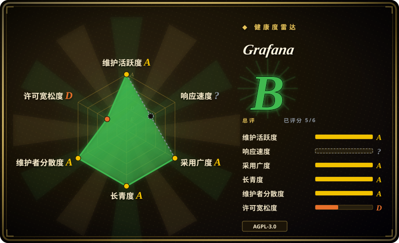
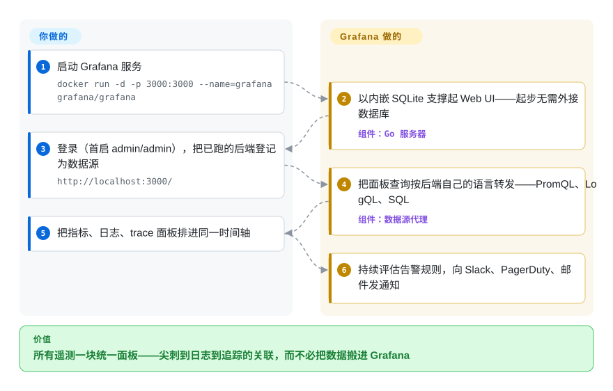

# Grafana

Prometheus 带一套 UI，Loki 又一套，追踪再来一套——凌晨三点，值班的人在四个控制台之间切标签页，只为把一次延迟尖刺、一行日志和一次发布对上号。Grafana 是坐在你已在跑的那些存储前面的查询与可视化面板：它说每个后端自己的查询语言，把指标、日志、追踪并排画在同一个时间范围上，并在上面叠告警——而它自己几乎不存数据。

## 何时使用

你是 SRE 或平台工程师，手上的技术栈已经散落到一堆存储里：指标在 Prometheus、日志在 Loki、追踪在 Tempo 或 Jaeger、业务数据在某个 Postgres，可能旁边还有云厂商的指标。每个都自带一套 UI，值班轮到你时，凌晨三点你在四个控制台之间切标签页，试图把一次延迟尖刺、一行日志和一次发布对上号。你架一个 Grafana，把每个后端加成一个数据源，搭几张看板——一个指标面板、一个日志面板、一个 trace 视图并排压在同一个时间范围上：点一下尖刺，跳到那个时间窗的日志，顺着 trace ID 追下去。采集和存储原地不动，Grafana 是这一切前面那块统一的查询与可视化窗口。

当你希望看板和告警规则进版本库、而不是靠手点出来时，你也会选它。看板是 JSON，数据源和告警规则可以从文件 provision，整套东西还能用变量做模板，一张看板服务所有环境。它是采集器（如 [Telegraf](../dev-utilities/ops-infra/telegraf.zh.md)）或抓取器（如 Prometheus）下游事实上的可视化层——那些负责把数据送进存储，Grafana 是你团队真正盯着看的那块。

## 怎么用起来

Grafana 是一个 Go 服务器加 React 前端，自己几乎不存数据：看板、用户和告警规则活在一个内嵌的 SQLite 小库里（生产规模可换成外接 Postgres/MySQL）。你把自己已经在跑的每个后端登记成**数据源**，之后 Grafana 就在查询时刻干活：你在面板里写的 PromQL、LogQL 或 SQL 会*用那个后端自己的语言*转发过去——它不自造查询语言——返回的序列、日志行或 span 由面板插件画在共享时间轴上。所谓「把尖刺和日志对上」，就是在同一页里从指标点进那个时间窗的日志查询，不用换工具。你负责的部分：跑好存储后端、搭看板（看板是 JSON，可从文件 provision，做看板即代码）、接好告警的通知渠道。Grafana **不**负责的：采集、抓取和存储你的遥测——那些归上游的 Prometheus、Alloy 或 OTel 采集器管。

<!-- flow-steps:begin (generated from flows/grafana.json by tools/flow_card.py — do not edit) -->

流程文字版

1. **你**：启动 Grafana 服务 — `docker run -d -p 3000:3000 --name=grafana grafana/grafana`
2. **Grafana**：以内嵌 SQLite 支撑起 Web UI——起步无需外接数据库 — 组件：`Go 服务器`
3. **你**：登录（首启 admin/admin），把已跑的后端登记为数据源 — `http://localhost:3000/`
4. **Grafana**：把面板查询按后端自己的语言转发——PromQL、LogQL、SQL — 组件：`数据源代理`
5. **你**：把指标、日志、trace 面板排进同一时间轴
6. **Grafana**：持续评估告警规则，向 Slack、PagerDuty、邮件发通知

**价值**：所有遥测一块统一面板——尖刺到日志到追踪的关联，而不必把数据搬进 Grafana

<!-- flow-steps:end -->

## 何时不用

- **你以为它是数据库。** 不是。Grafana 只在一个小型关系库（SQLite/Postgres/MySQL）里存看板、用户和告警配置——你真正的时序、日志、追踪数据活在 Prometheus/Loki/Elasticsearch 等里，那些你还得自己跑、自己付钱。上 Grafana 不会缩小你的存储开销，只会在上面再加一层查询层。
- **你想要开箱即用的一体化监控产品。** Datadog、New Relic 或 Grafana 自家的 Grafana Cloud 这类托管 SaaS 把采集+存储+UI+告警打包成一张账单、零基础设施；自托管 Grafana 只是前端，默认这些后端由你来运维。
- **你的活是 BI / SQL 分析与报表。** Grafana 是时序与运维看板形状的；要做即席 SQL 探索、交叉表报表、业务看板，[Apache Superset](../data-visualization/superset.zh.md) 或 Metabase 这类 BI 工具更合适。
- **你需要一个指标采集器或 agent。** Grafana 不抓主机、不 tail 日志——那是 [Telegraf](../dev-utilities/ops-infra/telegraf.zh.md)、Prometheus exporter、Grafana Alloy 或 OTel Collector 的活。Grafana 处在送数据那一环的下游。
- **AGPL-3.0 和 Enterprise 功能闸门对你是问题。** Grafana 2021 年从 Apache-2.0 改成 AGPL-3.0。[推断] 如果你把改过的 Grafana 作为网络服务的一部分嵌入或对外暴露，AGPL 的 copyleft 可能波及你的改动——放进 SaaS 前先走法务。若干企业功能（细粒度 RBAC、报表、企业版数据源插件、某些配置下的 SSO/SAML）被圈在商业版 Grafana Enterprise / Cloud 里，不在 OSS 构建中——具体范围见技术栈小节里「版本」那条目前文档能证实的部分。

## 横向对比

| 替代品 | 是否收录 | 我们的评价 | 取舍 |
|---|---|---|---|
| [Telegraf](../dev-utilities/ops-infra/telegraf.zh.md) | ✅ | 缺的是指标采集/路由，而不是看板可视化时，选 Telegraf。 | 是*采集/路由 agent*，不是可视化层——它把指标送进存储，Grafana 把它们读出来。互补而非互替，常一起用。 |
| Kibana | 未收录 | 技术栈明确围绕 Elasticsearch/OpenSearch 时，选 Kibana。 | 与 Elasticsearch/OpenSearch 紧耦合；做日志搜索和 Elastic 栈极强，但作为多后端看板工具，比 Grafana 数据源中立的模型窄。 |
| Datadog / Grafana Cloud | 非仓库 | 想让采集、存储、看板和告警都由托管套件代管时，选托管方案。 | 托管一体化（采集+存储+看板+告警），是闭源 SaaS 而非仓库；零基础设施，但按主机/按指标计费且厂商绑定，对比自托管 Grafana 自己跑后端。 |
| [Apache Superset](../data-visualization/superset.zh.md) | ✅ | 任务是面向数仓和关系库的 BI/SQL 分析时，选 Superset。 | 面向数仓和 SQL 库的 BI/SQL 分析看板；探索式报表和图表更强，运维时序、日志/追踪关联和值班告警更弱。 |
| [Metabase](../data-visualization/metabase.zh.md) | ✅ | 业务用户需要友好的自助 SQL BI，而不是运维遥测时，选 Metabase。 | 给业务用户用的自助 BI，查 SQL 源很友好；不是为运维时序、日志/追踪关联或 PromQL/LogQL 类后端设计的。 |

## 技术栈

- **前端：** TypeScript + React（看板 UI、面板，以及基于 Scenes 的看板能力）。
- **后端：** Go（数据源代理、鉴权、告警引擎、provisioning、插件宿主）。
- **插件模型：** 数据源、面板、app 均可插拔；许多后端以核心或签名插件形式提供。看板是 JSON，数据源和告警规则可从配置文件 provision。
- **查询语言（透传）：** Grafana 不自造查询语言——它说每个后端各自的语言（Prometheus 用 PromQL、Loki 用 LogQL、关系库用 SQL、Elasticsearch DSL、InfluxQL/Flux 等）。
- **版本：** 一个 OSS/AGPL 构建（Docker 镜像 `grafana/grafana`），外加一个 Grafana Enterprise 构建——官方文档现在把它作为免费默认可用镜像分发（`grafana/grafana-enterprise`，2026-09 文档），付费层再圈上企业功能。[未验证：具体功能闸门范围]

## 依赖

- **存 Grafana 自身状态的关系库：** 默认 SQLite（单节点够用），或外接 Postgres/MySQL 做 HA / 共享状态。
- **数据源要你自己跑：** 没有后端 Grafana 就没用——Prometheus、Loki、Tempo/Jaeger、Elasticsearch/OpenSearch、InfluxDB、Postgres、云厂商数据源等。这些才是重基础设施，Grafana 是轻的那部分。
- **运行时：** 以单个 Go 二进制、官方 Docker 镜像和 RPM/DEB/Helm chart 分发。两个官方镜像是 `grafana/grafana`（OSS）与 `grafana/grafana-enterprise`——官方文档把免费的 Enterprise 镜像设为推荐默认（2026-09）。服务端本身不需要外部语言运行时。
- **完整告警所需的可选服务：** 要把告警送出去，你得接好通知渠道（邮件/SMTP、Slack、PagerDuty、webhook）；Grafana 的统一告警也能配合外部 Alertmanager。

## 运维难度

**单节点低，规模化中到高。** 把 Grafana 跑起来确实容易：`docker run`、指向一个 Prometheus、导入一张社区看板，完事——SQLite 意味着快速起步不用 provision 数据库。成本上升发生在你把它做成生产级时：换外接 Postgres 做 HA、多副本挂负载均衡共享会话/状态、接 SSO/LDAP/SAML（其中部分被 Enterprise 圈起来）、跨环境做看板即代码与 provisioning、把数据源插件和告警配置理顺、跨偶尔会改看板/告警 schema 的版本升级。反复出现的真相是：Grafana 本身很少是难点——它查询的那些**后端**（扩 Prometheus、分片 Loki、给 Elasticsearch 定容量）才是真正的运维重量所在。

## 健康度与可持续性

- **响应速度**：无法计算——no_traffic。
- **维护（截至 2026-09）：** 最后 push 在 2026-09-28，最新发布 v13.2.2（2026-09-15）——**在持续维护**，补丁/次版本节奏稳定。它是可观测性领域开发最活跃的项目之一；无废弃风险。
- **治理 / 背书：** 由组织持有、由风险投资支持的公司 **Grafana Labs** 驱动；这是一个**单厂商开源**项目，而非基金会治理。路线图与商业版 Enterprise/Cloud 层级都由一家公司掌控——资源充足，但方向由厂商定、功能由厂商圈。
- **年龄与 Lindy 判定（创建于 2013-12，约 13 年）：** 既老*又*仍活跃——**强 Lindy** 信号。它是可观测性生态事实上的看板层，挺过了十多年的技术栈更替；押注其长寿很稳。
- **采用度 / 生态：** 在 SRE / 平台栈中无处不在，插件 / 数据源生态庞大，看板即代码，社区看板库巨大——根基深、集成面广。
- **风险标记：** **2021 年从 Apache-2.0 改为 AGPL-3.0**——copyleft 可能波及通过网络提供的改动版 Grafana，放进 SaaS 前先走法务。**开放核心的功能闸门**：细粒度 RBAC、报表、企业版数据源插件，以及部分 SSO/SAML 配置都在商业层，而不在 OSS 构建里。[未验证]

## 存疑（未验证）

- [未验证] star 数与版本号随版本变动——2026-09-28 经 GitHub API 核实：76,963 star、最新发布 v13.2.2（2026-09-15）、最后 push 2026-09-28；按该日期理解即可。
- [未验证] 哪些功能属 OSS、哪些属 Grafana Enterprise/Cloud（细粒度 RBAC、报表、企业版数据源插件、某些 SSO/SAML 配置）在版本和层级间会移动——别假设某功能在免费构建里，先核对当前版本矩阵。
- [推断] AGPL-3.0 的 copyleft 波及“通过网络提供的改动”是 AGPL 的一般性质；实际义务取决于你改了什么、如何分发/提供——这不是法律意见，请走审查。
- [推断] 默认与支持的状态库、告警/Alertmanager 接法、最低运行时版本由当前发布文档决定且随时间变化；此处不钉死具体细节。
- [未验证] “Prometheus、Loki、Elasticsearch、InfluxDB、Postgres 等等”是项目 README 自己的表述；完整且当前的数据源列表及其核心/插件归属随时间变动——你需要哪个源就查当前文档。
