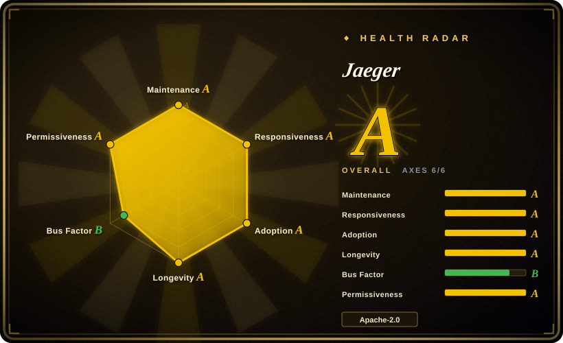
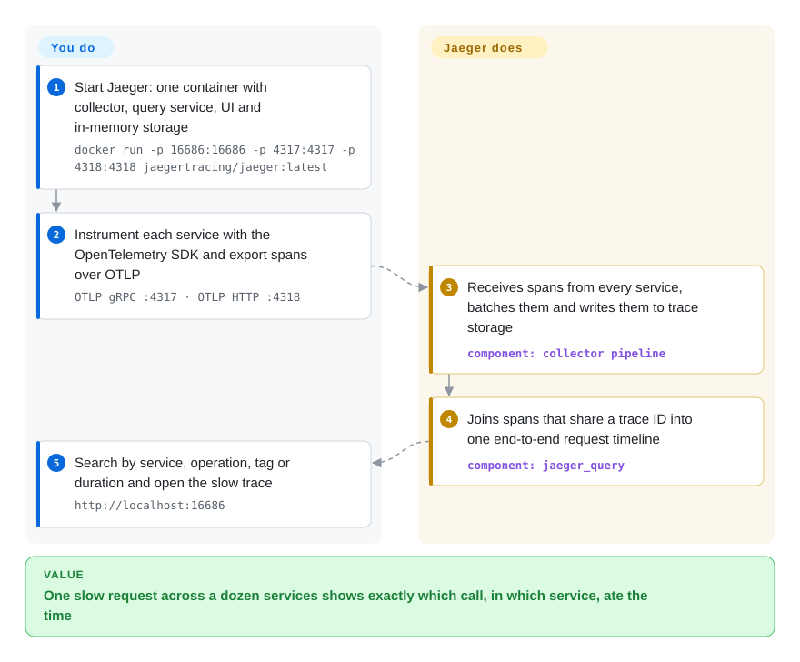

# Jaeger

A checkout request takes 4 seconds, it touched twelve microservices, and each service's logs say it was fast. Jaeger collects a timed record of every hop that one request made across your services and shows them as a single timeline, so you can see which call in which service ate the time.

## When to use

You're a backend or platform engineer on a system that has grown into a few dozen services talking over HTTP, gRPC and queues. A latency alert fires on checkout: p99 went from 300 ms to 4 s. Every team's dashboard looks green, and grepping logs across twelve services for one request ID is an afternoon of guesswork. You instrument the services with the OpenTelemetry SDK, point them at Jaeger, and the next slow checkout shows up as one trace: a waterfall in which the `inventory` service's call to a pricing API sits at 3.6 s while everything else is tens of milliseconds.

Reach for Jaeger when you want a **self-hosted, tracing-only backend with its own UI**, built on OpenTelemetry and governed by the CNCF, and you can provide (or already run) Elasticsearch/OpenSearch, Cassandra or ClickHouse to store traces. Pick Grafana Tempo instead when you want traces in cheap object storage inside a Grafana stack, and SigNoz when you want traces, metrics and logs in one product.

## How it works

Distributed tracing gives each incoming request a **trace ID** and has every service record **spans** — one timed unit of work, like "handled `/checkout`" or "queried Postgres" — stamped with that ID and with which span called it. Your services produce spans through the OpenTelemetry SDK (Jaeger's own client libraries were retired); **you choose** what to instrument, the sampling rate, and where traces are stored. **Jaeger does the rest**: it receives spans over OTLP (also the older Jaeger and Zipkin formats), batches and writes them to the storage backend, can serve sampling policies back to the SDKs, and its query service and UI reassemble spans by trace ID into a timeline you can search by service, operation, tag or duration. Since v2 (November 2024), Jaeger is itself built as a distribution of the OpenTelemetry Collector, so it is configured with the same YAML of receivers, processors, exporters and extensions; the all-in-one container keeps traces in memory for trying it out, and production swaps in Elasticsearch, OpenSearch, Cassandra or ClickHouse, optionally with Kafka as a buffer. Think of a parcel tracking number stamped at every depot: no single depot knows the whole route, but the tracking page does.

<!-- flow-steps:begin (generated from flows/jaeger.json by tools/flow_card.py — do not edit) -->

Text version of the flow

1. **You**: Start Jaeger: one container with collector, query service, UI and in-memory storage — `docker run -p 16686:16686 -p 4317:4317 -p 4318:4318 jaegertracing/jaeger:latest`
2. **You**: Instrument each service with the OpenTelemetry SDK and export spans over OTLP — `OTLP gRPC :4317 · OTLP HTTP :4318`
3. **Jaeger**: Receives spans from every service, batches them and writes them to trace storage — component: `collector pipeline`
4. **Jaeger**: Joins spans that share a trace ID into one end-to-end request timeline — component: `jaeger_query`
5. **You**: Search by service, operation, tag or duration and open the slow trace — `http://localhost:16686`

**Value**: One slow request across a dozen services shows exactly which call, in which service, ate the time

<!-- flow-steps:end -->

## When NOT to use

- **You're still on Jaeger v1 binaries or `jaeger-client` libraries.** Jaeger v1 reached end of life on 2025-12-31 (last v1 release v1.76.0, 2025-12-03) and the Jaeger client libraries are archived. Do not start new work on `jaeger-agent`/`jaeger-collector` v1 or `jaeger-client-*`: run the v2 `jaeger` binary and instrument with the OpenTelemetry SDK; plan v1 migrations with the upstream migration guide.
- **You want traces stored cheaply in object storage, inside Grafana.** Jaeger's production backends are databases you must size and run (Elasticsearch/OpenSearch, Cassandra, ClickHouse). If you already run Grafana and want traces in S3/GCS with no index cluster, use Grafana Tempo (not indexed) and view it in [Grafana](grafana.md) — accepting Tempo's AGPL-3.0 license.
- **You want metrics, logs and traces in one product.** Jaeger is tracing-only (its Monitor tab derives RED metrics — request rate, errors, duration — from spans, but needs a metrics store such as [Prometheus](prometheus.md) behind it). For one integrated observability app, use SigNoz (not indexed); for a composed stack, Grafana + Tempo + [Loki](loki.md) + Prometheus.
- **You only need to route or transform telemetry.** If the job is receiving OTLP and forwarding it to a vendor or several backends, run the [OpenTelemetry Collector](opentelemetry-collector.md) alone; Jaeger adds storage and a UI you would not use.
- **You need agent-based, auto-instrumented APM for a Java estate.** Apache SkyWalking (not indexed) ships language agents, topology maps and alerting in one platform; Jaeger expects you to instrument with OpenTelemetry and brings no alerting.
- **You have a monolith or two services.** Tracing pays off when a request crosses many process boundaries; for a single service, a profiler and structured logs answer "why is it slow" with less setup.
- **The in-memory all-in-one is not a production deployment.** It loses every trace on restart and holds them in RAM; Badger (embedded disk storage) is single-node only. Plan a real storage backend before relying on it.

## Comparison

| Alternative | In index | Our verdict | Tradeoff |
|---|---|---|---|
| Grafana Tempo | not indexed | When you already run Grafana and want traces in object storage with no database to operate, pick Tempo; pick Jaeger when you want a standalone tracing UI and Apache-2.0 licensing. | Much cheaper storage at scale, but AGPL-3.0, and search depends on TraceQL and Grafana rather than a dedicated UI. |
| Zipkin | not indexed | When you have existing Zipkin instrumentation or want the simplest JVM tracing server, keep Zipkin; for new OpenTelemetry-based work pick Jaeger. | Older and simpler, with a long Java/Brave history, but a smaller project with less OpenTelemetry-native design. |
| SigNoz | not indexed | When you want traces, metrics and logs in one OpenTelemetry-native app, pick SigNoz; pick Jaeger when you only need tracing and prefer CNCF governance. | One product and one ClickHouse store, but an open-core vendor project rather than a foundation project. |
| Apache SkyWalking | not indexed | When you run a largely Java estate and want auto-instrumenting agents, topology and alerting out of the box, pick SkyWalking; pick Jaeger for vendor-neutral OpenTelemetry tracing. | More batteries included, but its own agent ecosystem and a heavier platform to run. |
| [OpenTelemetry Collector](opentelemetry-collector.md) | ✅ | Use the Collector to receive and route telemetry; add Jaeger when you also need to store traces and search them in a UI. | Jaeger v2 is built on the Collector, so they compose: the Collector alone has no trace storage or UI. |
| [Grafana](grafana.md) | ✅ | Use Grafana as the single pane when dashboards for metrics and logs already live there — it can query Jaeger as a data source; use Jaeger's own UI when tracing is the only need. | One place for all signals, but Grafana is a viewer, so Jaeger (or Tempo) still stores the traces. |

## Tech stack

- **Language:** Go (backend); the UI is a separate TypeScript app (`jaeger-ui`) bundled into the binary.
- **Architecture (v2):** a single `jaeger` binary built as an OpenTelemetry Collector distribution — `otlp`, `jaeger` and `zipkin` receivers, `batch` and `adaptive_sampling` processors, a `jaeger_storage_exporter`, and `jaeger_storage` / `jaeger_query` / `remote_sampling` extensions, configured in Collector YAML. The same binary runs as all-in-one, collector, query or Kafka ingester depending on config.
- **Storage backends:** in-memory, Badger (embedded), Elasticsearch, OpenSearch, Cassandra, ClickHouse, a gRPC remote-storage API for custom backends, and Kafka as an ingestion buffer.
- **Protocols:** OTLP gRPC (4317) and HTTP (4318) in; UI and query API on 16686.
- **Extras:** Service Performance Monitoring (RED metrics from spans, stored in Prometheus-compatible, Elasticsearch/OpenSearch or ClickHouse backends) and, in recent releases, an MCP endpoint on the query service for AI agents.

## Dependencies

- **Instrumentation:** the OpenTelemetry SDK (or auto-instrumentation) in each service.
- **Trace storage for production:** an Elasticsearch/OpenSearch cluster, Cassandra, or ClickHouse — within the versions in Jaeger's storage support policy (e.g. Elasticsearch 9.x/8.19, OpenSearch 3.x/2.19, Cassandra 5.0/4.x, ClickHouse current and previous LTS).
- **Optional:** Kafka for buffering under high or bursty volume; a Prometheus-compatible store for the Monitor tab.
- **Runtime:** a container platform or VM; for Kubernetes, the Helm chart in the separate `jaegertracing/helm-charts` repo (the v1 `jaeger-operator` is archived and deprecated).

## Ops difficulty

**Low to try, medium to high in production.** All-in-one is a single `docker run` with nothing else to install. Production cost is dominated by the storage backend: sizing and running an Elasticsearch/OpenSearch or Cassandra cluster, setting index rollover or TTLs so trace data does not grow forever, and keeping that backend inside Jaeger's supported versions. On top of that you pick a sampling strategy — keeping every span is rarely affordable, while too little sampling hides the slow requests you wanted to see — and you may add Kafka between collectors and storage to absorb spikes. Because v2 reuses OpenTelemetry Collector configuration, teams already running the Collector will find the config model familiar.

## Health & viability

- **Maintenance (2026-10) — very active.** Commits in all of the last 13 weeks and a minor release roughly every three to eight weeks (v2.20.0 on 2026-07-20, v2.21.0 on 2026-09-14, v2.22.0 on 2026-10-06). Issues get a first response in about 10 hours (median). A published deprecation policy promises at least three months or two minor versions before a config option is removed.
- **Governance / bus factor (grade B).** 30 people committed in the last 12 months; the top contributor holds ~57% of commits and the top three ~72% — the project's creator, yurishkuro, remains the most active. Six maintainers from different employers (Airbnb, Red Hat, Grafana Labs, Bloomberg, Spacelift, PackSmith) share decisions under CNCF governance.
- **Backing & longevity.** Created at Uber (repository since April 2016, ~10.5 years), a CNCF graduated project since October 2019, and successfully re-platformed onto OpenTelemetry with v2 — a strong Lindy prior for a still-active project.
- **Adoption & ecosystem.** ~13.5M release-asset downloads, ~10.3M pulls of the `jaegertracing/jaeger` image, and 1,141 dependent Go repos; Grafana ships a built-in Jaeger data source, and the OpenTelemetry ecosystem treats it as a standard tracing backend.
- **Risk flags.** Apache-2.0, no relicense history, no open-core split. The main risk is the v1 → v2 transition for existing deployments, not the project's future.

## Caveats (unverified)

- [未验证] ~23.3k stars / ~3.1k forks / 555 open issues as of 2026-10-08 — volatile.
- [推断] The release-cadence range (three to eight weeks) is read from the last six releases; it is not a published schedule.
- [未验证] The MCP / AI endpoint in `jaeger_query` was seen in the default config and not exercised; treat it as experimental.
- [未验证] Maintainer employers are as listed in `MAINTAINERS.md` on 2026-10-08 and can change.
- [推断] The comparison claims about Tempo, Zipkin, SigNoz and SkyWalking (storage model, license, scope) come from their repositories' metadata and general knowledge, not from pages in this index.
