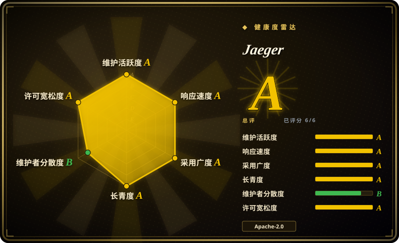
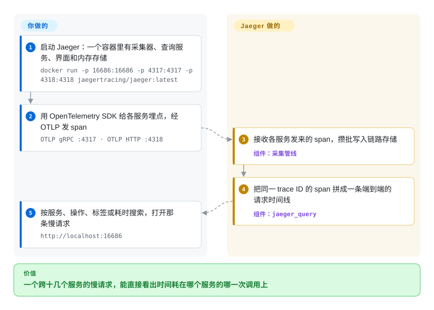

# Jaeger

一次下单请求要 4 秒，途经十二个微服务，可每个服务的日志都说自己很快。Jaeger 把这一个请求在各服务间走过的每一跳都记下耗时，拼成一条时间线给你看，一眼就能找出时间耗在哪个服务的哪一次调用上。

## 何时使用

你是后端或平台工程师，手上的系统已经长成几十个服务，彼此走 HTTP、gRPC 和消息队列。下单接口的延迟告警响了：p99 从 300 ms 涨到 4 s。每个团队的看板都是绿的，拿一个请求 ID 去十二个服务的日志里 grep，就是一下午的瞎猜。你用 OpenTelemetry SDK 给这些服务埋点，指向 Jaeger；下一次慢下单就变成一条 trace：一张瀑布图里，`inventory` 服务调定价 API 那一段占了 3.6 s，其余都是几十毫秒。

当你要的是一个**自托管、只做链路追踪、自带界面的后端**，基于 OpenTelemetry、由 CNCF 治理，并且你能提供（或已经在运行）Elasticsearch/OpenSearch、Cassandra 或 ClickHouse 来存 trace 时，选 Jaeger。想把 trace 放进便宜的对象存储、整合在 Grafana 体系里，选 Grafana Tempo；想要 trace、指标、日志合在一个产品里，选 SigNoz。

## 怎么用起来

分布式追踪给每个进来的请求分配一个 **trace ID**，让每个服务记录 **span**——一段计时的工作单元，比如“处理了 `/checkout`”或“查了一次 Postgres”——每个 span 都带着这个 ID，以及是哪个 span 调用了它。服务通过 OpenTelemetry SDK 产出 span（Jaeger 自己的客户端库已经退役）；**你决定**给什么埋点、采样率多少、trace 存在哪。**其余由 Jaeger 来做**：经 OTLP 接收 span（也兼容老的 Jaeger 和 Zipkin 格式），攒批写入存储后端，可以把采样策略下发回 SDK；它的查询服务和界面按 trace ID 把 span 重新拼成时间线，供你按服务、操作、标签或耗时搜索。从 v2（2024 年 11 月）起，Jaeger 本身就是 OpenTelemetry Collector 的一个发行版，所以配置用的是同一套 receivers、processors、exporters、extensions 的 YAML；all-in-one 容器把 trace 放在内存里，供试用，生产环境换成 Elasticsearch、OpenSearch、Cassandra 或 ClickHouse，可选用 Kafka 做缓冲。打个比方：就像快递单号，每个中转站都盖一次戳，没有哪个站知道全程，但查询页知道。

<!-- flow-steps:begin (generated from flows/jaeger.json by tools/flow_card.py — do not edit) -->

流程文字版

1. **你**：启动 Jaeger：一个容器里有采集器、查询服务、界面和内存存储 — `docker run -p 16686:16686 -p 4317:4317 -p 4318:4318 jaegertracing/jaeger:latest`
2. **你**：用 OpenTelemetry SDK 给各服务埋点，经 OTLP 发 span — `OTLP gRPC :4317 · OTLP HTTP :4318`
3. **Jaeger**：接收各服务发来的 span，攒批写入链路存储 — 组件：`采集管线`
4. **Jaeger**：把同一 trace ID 的 span 拼成一条端到端的请求时间线 — 组件：`jaeger_query`
5. **你**：按服务、操作、标签或耗时搜索，打开那条慢请求 — `http://localhost:16686`

**价值**：一个跨十几个服务的慢请求，能直接看出时间耗在哪个服务的哪一次调用上

<!-- flow-steps:end -->

## 何时不用

- **你还在用 Jaeger v1 二进制或 `jaeger-client` 库。** Jaeger v1 已于 2025-12-31 停止维护（最后一个 v1 版本 v1.76.0，2025-12-03），Jaeger 客户端库也已归档。新工作不要再基于 v1 的 `jaeger-agent`/`jaeger-collector` 或 `jaeger-client-*`：跑 v2 的 `jaeger` 二进制，用 OpenTelemetry SDK 埋点；v1 的存量部署按上游迁移指南规划升级。
- **你想把 trace 便宜地存进对象存储、放在 Grafana 里看。** Jaeger 的生产存储都是要你自己规划容量、自己运维的数据库（Elasticsearch/OpenSearch、Cassandra、ClickHouse）。如果你已经在跑 Grafana，想把 trace 存进 S3/GCS、不要索引集群，用 Grafana Tempo（未收录），在 [Grafana](grafana.zh.md) 里看——同时接受 Tempo 的 AGPL-3.0 许可证。
- **你想要指标、日志、trace 在一个产品里。** Jaeger 只做追踪（它的 Monitor 页从 span 推导 RED 指标——请求速率、错误、耗时——但背后需要 [Prometheus](prometheus.zh.md) 之类的指标存储）。要一个一体化的可观测性应用，用 SigNoz（未收录）；要拼装方案，用 Grafana + Tempo + [Loki](loki.zh.md) + Prometheus。
- **你只需要转发或加工遥测数据。** 如果任务是接收 OTLP 再转发给某个厂商或多个后端，单跑 [OpenTelemetry Collector](opentelemetry-collector.zh.md) 就够；Jaeger 多出来的存储和界面你用不上。
- **你要的是给 Java 体系用的、带探针自动埋点的 APM。** Apache SkyWalking（未收录）在一个平台里自带各语言探针、拓扑图和告警；Jaeger 要你自己用 OpenTelemetry 埋点，也不带告警。
- **你只有一个单体或两个服务。** 追踪的价值在请求跨越很多进程边界时才体现；单个服务要回答“为什么慢”，profiler 加结构化日志更省事。
- **内存版 all-in-one 不是生产部署。** 它把 trace 放在内存里，一重启全丢；Badger（嵌入式磁盘存储）只能单节点。依赖它之前先规划好正式的存储后端。

## 横向对比

| 替代品 | 是否收录 | 我们的评价 | 取舍 |
|---|---|---|---|
| Grafana Tempo | 未收录 | 已经在用 Grafana、想把 trace 存进对象存储、不想运维数据库时，选 Tempo；想要独立的追踪界面和 Apache-2.0 许可证时，选 Jaeger。 | 大规模下存储便宜得多，但是 AGPL-3.0，搜索依赖 TraceQL 和 Grafana，没有专门的界面。 |
| Zipkin | 未收录 | 已有 Zipkin 埋点、或者只要最简单的 JVM 追踪服务器时，继续用 Zipkin；基于 OpenTelemetry 的新项目选 Jaeger。 | 更老更简单，Java/Brave 积累深，但项目规模更小，设计上也不是围绕 OpenTelemetry。 |
| SigNoz | 未收录 | 想在一个 OpenTelemetry 原生应用里同时看 trace、指标和日志，选 SigNoz；只需要追踪、并且看重 CNCF 治理时，选 Jaeger。 | 一个产品、一个 ClickHouse 存储，但它是厂商主导的 open-core 项目，不是基金会项目。 |
| Apache SkyWalking | 未收录 | 以 Java 为主、想要开箱即用的自动埋点探针、拓扑和告警时，选 SkyWalking；要厂商中立的 OpenTelemetry 追踪，选 Jaeger。 | 功能更全，但有自己的一套探针生态，平台运维也更重。 |
| [OpenTelemetry Collector](opentelemetry-collector.zh.md) | ✅ | 用 Collector 接收和路由遥测数据；还需要存储 trace、在界面里搜索时，再加上 Jaeger。 | Jaeger v2 本身就建在 Collector 上，两者可以组合：单独的 Collector 没有 trace 存储，也没有界面。 |
| [Grafana](grafana.zh.md) | ✅ | 指标和日志的看板已经在 Grafana 里时，把它当统一入口——它可以把 Jaeger 当数据源查询；只需要追踪时，用 Jaeger 自带的界面。 | 所有信号一个入口，但 Grafana 只是查看器，trace 还得由 Jaeger（或 Tempo）来存。 |

## 技术栈

- **语言：** 后端是 Go；界面是单独的 TypeScript 应用（`jaeger-ui`），打包进二进制。
- **架构（v2）：** 单个 `jaeger` 二进制，作为 OpenTelemetry Collector 发行版构建——`otlp`、`jaeger`、`zipkin` 三种 receiver，`batch` 和 `adaptive_sampling` processor，`jaeger_storage_exporter`，以及 `jaeger_storage` / `jaeger_query` / `remote_sampling` 扩展，用 Collector 的 YAML 配置。同一个二进制按配置可以跑成 all-in-one、collector、query 或 Kafka ingester。
- **存储后端：** 内存、Badger（嵌入式）、Elasticsearch、OpenSearch、Cassandra、ClickHouse，自定义后端用 gRPC remote-storage API 接入，Kafka 作为写入缓冲。
- **协议：** 入口是 OTLP gRPC（4317）和 HTTP（4318）；界面和查询 API 在 16686。
- **附加功能：** 服务性能监控（从 span 推导 RED 指标，存进 Prometheus 兼容、Elasticsearch/OpenSearch 或 ClickHouse 后端）；近期版本还在查询服务上提供了面向 AI agent 的 MCP 端点。

## 依赖

- **埋点：** 每个服务里的 OpenTelemetry SDK（或自动埋点）。
- **生产用的 trace 存储：** Elasticsearch/OpenSearch 集群、Cassandra 或 ClickHouse——版本要在 Jaeger 存储支持策略范围内（如 Elasticsearch 9.x/8.19、OpenSearch 3.x/2.19、Cassandra 5.0/4.x、ClickHouse 当前和上一个 LTS）。
- **可选：** 流量大或有突发时用 Kafka 缓冲；Monitor 页需要一个 Prometheus 兼容的存储。
- **运行环境：** 容器平台或虚拟机；Kubernetes 上用单独仓库 `jaegertracing/helm-charts` 里的 Helm chart（v1 的 `jaeger-operator` 已归档、标记弃用）。

## 运维难度

**试用很低，生产中到高。** all-in-one 就是一条 `docker run`，别的都不用装。生产成本主要在存储后端：规划并运维 Elasticsearch/OpenSearch 或 Cassandra 集群，配置索引滚动或 TTL，免得 trace 数据无限增长，还要让后端版本留在 Jaeger 支持的范围内。此外你得选采样策略——全量保留几乎负担不起，采得太少又会漏掉你想看的那些慢请求——必要时在采集器和存储之间加 Kafka 吸收峰值。v2 复用了 OpenTelemetry Collector 的配置方式，已经在跑 Collector 的团队会觉得配置模型很熟悉。

## 健康度与可持续性

- **维护（2026-10）——非常活跃。** 最近 13 周每周都有提交，大约每三到八周发一个小版本（v2.20.0 于 2026-07-20，v2.21.0 于 2026-09-14，v2.22.0 于 2026-10-06）。issue 首次响应中位数约 10 小时。公开的弃用策略承诺：配置项至少保留三个月或两个小版本才会删除。
- **治理与 bus factor（B 级）。** 过去 12 个月有 30 人提交；第一名约占 57%，前三名约 72%——项目创始人 yurishkuro 仍是最活跃的贡献者。六位维护者来自不同雇主（Airbnb、Red Hat、Grafana Labs、Bloomberg、Spacelift、PackSmith），在 CNCF 治理框架下共同决策。
- **背书与长期性。** 诞生于 Uber（仓库建于 2016 年 4 月，约 10.5 年），2019 年 10 月成为 CNCF 毕业项目，又在 v2 成功迁到 OpenTelemetry 底座上——一个仍然活跃的老项目，Lindy 先验很强。
- **采用与生态。** 发布资产下载约 1350 万次，`jaegertracing/jaeger` 镜像拉取约 1030 万次，1,141 个依赖它的 Go 仓库；Grafana 内置 Jaeger 数据源，OpenTelemetry 生态也把它当作标准的追踪后端。
- **风险标记。** Apache-2.0，没有改许可证的历史，没有 open-core 拆分。主要风险是已有部署从 v1 迁到 v2，而不是项目本身的前途。

## 存疑（未验证）

- [未验证] 截至 2026-10-08 约 23.3k star、约 3.1k fork、555 个 open issue——易变。
- [推断] 发布节奏“三到八周”是从最近六个版本读出来的，不是公开承诺的日程。
- [未验证] `jaeger_query` 里的 MCP / AI 端点只在默认配置中看到，没有实际运行，当作实验功能看待。
- [未验证] 维护者雇主取自 2026-10-08 的 `MAINTAINERS.md`，可能变动。
- [推断] 横向对比里关于 Tempo、Zipkin、SigNoz、SkyWalking 的说法（存储模型、许可证、范围）来自它们仓库的元数据和一般认知，不是来自本索引的页面。
