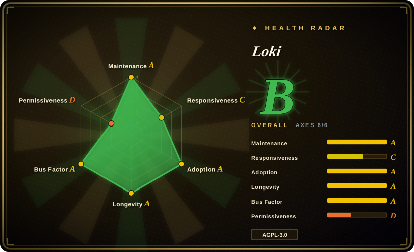
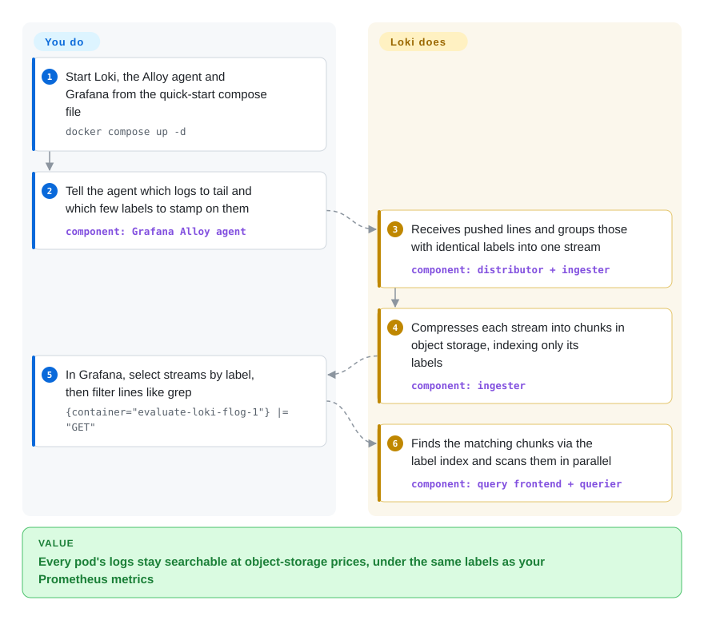

# Loki

Your log bill grows faster than your traffic, because the log store indexes every word of every line — and almost all of those lines are never searched. Loki indexes only a handful of labels per log stream (app, namespace, pod), keeps the text itself compressed in cheap object storage such as S3, and greps through it only when you ask.

## When to use

You're the SRE for a Kubernetes platform that already runs Prometheus and Grafana. Logs go to an Elasticsearch cluster whose hot tier has become one of the largest lines on the infra bill, yet the queries people actually run are narrow: "errors from `checkout` in `prod` in the last hour", "everything pod `api-7f9c` printed before it crashed". You are paying to full-text-index terabytes so that a few hundred such queries a day return in milliseconds instead of seconds.

You reach for Loki when that trade feels wrong. It indexes only the label set of each stream — the same `app` / `namespace` / `pod` labels your Prometheus metrics already carry — and stores the lines as compressed chunks in S3, GCS, Azure Blob or (for small setups) local disk, so a metric spike in Grafana jumps straight to the logs for that pod and window. You pick it over Elasticsearch/OpenSearch because storage and ops get much cheaper when you rarely need ad-hoc full-text search across everything; over ClickHouse-based log stacks because you want Grafana-native querying with Prometheus-style labels rather than SQL tables you design yourself.

## How it works

Loki splits logs into two very different halves. The **labels** — a few key/value tags like `{app="checkout", namespace="prod"}` stamped on by the collection agent — form a small index; every line that shares exactly the same labels belongs to one **stream**. The **text** of those lines is batched, compressed into chunks and written to object storage, where nothing inside it is indexed. A query in LogQL (Loki's PromQL-flavoured query language) first selects streams by label using that small index, then scans only those chunks with grep-like filters such as `|= "error"` or a JSON parser — many queriers in parallel. It is a filing cabinet labelled only by drawer: finding the right drawer is instant, reading inside it is brute force. The whole system is one Go binary whose `-target` flag decides which components a process runs, so the same code runs as a single process or as a Kubernetes microservice fleet. **What Loki does for you:** ingest, compress, store, index labels, run queries, alert via its ruler. **What you do:** run an agent (Grafana Alloy; Promtail reached end-of-life on 2026-03-02) or send OTLP from an OpenTelemetry Collector, choose a small set of low-cardinality labels, provide the object store, and put Grafana on top.

<!-- flow-steps:begin (generated from flows/loki.json by tools/flow_card.py — do not edit) -->

Text version of the flow

1. **You**: Start Loki, the Alloy agent and Grafana from the quick-start compose file — `docker compose up -d`
2. **You**: Tell the agent which logs to tail and which few labels to stamp on them — component: `Grafana Alloy agent`
3. **Loki**: Receives pushed lines and groups those with identical labels into one stream — component: `distributor + ingester`
4. **Loki**: Compresses each stream into chunks in object storage, indexing only its labels — component: `ingester`
5. **You**: In Grafana, select streams by label, then filter lines like grep — `{container="evaluate-loki-flog-1"} |= "GET"`
6. **Loki**: Finds the matching chunks via the label index and scans them in parallel — component: `query frontend + querier`

**Value**: Every pod's logs stay searchable at object-storage prices, under the same labels as your Prometheus metrics

<!-- flow-steps:end -->

## When NOT to use

- **You need fast full-text search over everything.** "Find this request ID across all services for the last 30 days" means Loki scans every chunk in range, because the text is not indexed. If that query shape is your daily workload (security investigations, support search), use Elasticsearch or OpenSearch, whose inverted index answers it directly — at a much higher storage and memory cost.
- **Your log fields are high-cardinality and you want them as labels.** Loki's docs are blunt: it "was not designed or built to support high cardinality label values"; labelling by user ID, trace ID or order ID explodes the stream count, bloats the index, and flushes thousands of tiny chunks (there is a default limit of 15 index labels). Put such fields in structured metadata or parse them at query time — or, if you need SQL-style aggregation over many high-cardinality columns, use a columnar store such as [ClickHouse](../databases/database-engines/clickhouse.md) instead.
- **AGPL-3.0 is a problem for your product.** Loki is AGPL-3.0-only (with Apache-2.0 carve-outs for clients and some packages, per `LICENSING.md`). If you will modify Loki and offer it as a network service, get legal review — or pick an Apache-2.0 store such as OpenSearch or VictoriaLogs.
- **You want a turnkey logging product, not a backend.** Loki has no collection agent of its own any more (Promtail is end-of-life), and its UI is Grafana. If you want collection, storage, UI and alerting as one integrated product, a log-management suite such as Graylog or a hosted service fits better.
- **You need HA but cannot run object storage or Kubernetes.** Monolithic mode on local disk is single-node and the docs size it at roughly 20 GB/day; HA monolithic and microservices modes both require a shared S3-compatible bucket, and microservices mode is designed for Kubernetes. If a single box with a local disk is your ceiling, a simpler single-node store like VictoriaLogs is less to operate.
- **You are planning a new Simple Scalable Deployment.** SSD mode is deprecated and will be removed in Loki 4.0; start with HA monolithic or microservices mode instead.

## Comparison

| Alternative | In index | Our verdict | Tradeoff |
|---|---|---|---|
| Elasticsearch / OpenSearch | 未收录 | When ad-hoc full-text search across all logs is the main workload, pick Elasticsearch or OpenSearch; pick Loki when most queries start from known labels and storage cost dominates. | The inverted index makes any-word search fast but multiplies storage, memory and shard-management work; Loki is far cheaper to keep but brute-forces text inside the selected streams. |
| [ClickHouse](../databases/database-engines/clickhouse.md) | ✅ | When you want SQL aggregation over high-cardinality log fields (per-user, per-request analytics), pick a ClickHouse-based log store; pick Loki when Prometheus-style labels and Grafana Explore are how your team already works. | ClickHouse handles high-cardinality columns and analytical queries well but you design schemas and run a database cluster; Loki needs no schema but punishes high-cardinality labels. |
| VictoriaLogs | 未收录 | For a single-node or small cluster where you want fewer moving parts and an Apache-2.0 license, try VictoriaLogs; pick Loki for the larger ecosystem, multi-tenancy and the Grafana Labs stack integration. | VictoriaLogs is younger and has a smaller adoption base; Loki has many more deployments and integrations but heavier HA requirements (object store, memberlist, replication factor 3). |
| [Grafana](grafana.md) | ✅ | Not a substitute: Grafana is the UI you query Loki from; deploy both. | Grafana renders LogQL results next to Prometheus metrics; it stores no logs itself. |
| [OpenTelemetry Collector](opentelemetry-collector.md) | ✅ | Complementary: use the Collector (or Alloy) to ship logs into Loki over native OTLP; it does not store or query logs. | Choosing the Collector keeps your pipeline vendor-neutral; Loki still decides how OTLP attributes map to labels vs structured metadata. |

## Tech stack

- **Language:** Go; a single binary/Docker image (`grafana/loki`) containing every component, selected with `-target` (`all` for monolithic).
- **Components:** distributor, ingester, query frontend, query scheduler, querier, index gateway, compactor, ruler; experimental bloom components.
- **Storage format:** TSDB label index (`schema: v13` in the bundled configs) plus compressed chunks in object storage; WAL on local disk.
- **Query language:** LogQL — label selector + line filters/parsers, plus metric queries such as `rate(...)` over log streams.
- **Ingestion APIs:** Loki push API over HTTP and native OTLP ingestion.

## Dependencies

- **Object storage** for any durable or HA deployment: S3-compatible, GCS or Azure Blob; filesystem storage is for development, proofs of concept, and single-node monolithic mode.
- **A collection agent:** Grafana Alloy (the documented default), the OpenTelemetry Collector, or third-party clients; Promtail is end-of-life since 2026-03-02.
- **Grafana** (or LogCLI / the HTTP API) for querying — Loki has no end-user UI of its own.
- **For HA:** memberlist ring configuration, replication factor 3 with at least three instances, a designated compactor, and a load balancer; Kubernetes for microservices mode.
- **Optional:** an Alertmanager (Prometheus or Grafana's) for ruler alerts; caches (embedded or memcached) for query performance.

## Ops difficulty

**Low for a single binary, medium-to-high at scale.** Monolithic mode with the bundled local config runs on a laptop or a small VM and is fine up to roughly 20 GB/day. Production HA adds object storage, memberlist, replication and compactor roles; microservices mode on Kubernetes adds a dozen independently scaled components, cache tuning, and per-tenant limits. The recurring operational trap is **label cardinality**: one dynamic label (pod hash, request path, user ID) can multiply streams, inflate the index, and stall ingestion, so label policy has to be reviewed like a schema. Upgrades also need attention — schema config changes, the SSD-mode deprecation, and the Helm chart moving to `grafana-community/helm-charts` on 2026-03-16 all landed in the 3.x line.

## Health & viability

- **Maintenance (as of 2026-10-08):** very active — commits every week of the last quarter, latest releases v3.7.8 and v3.6.17 (both 2026-09-17), with two minor lines patched in parallel.
- **Governance / backing:** owned by **Grafana Labs**; a single-vendor project, but with a broad contributor base (85 active maintainers in the trailing 12 months, top-3 share ~27%). The vendor's commercial GEL/Grafana Cloud Logs products sit on the same code, which funds development and also sets the roadmap.
- **Age & Lindy (created 2018-04, ~8.5 years):** old *and* still active, and the default log backend of the Grafana stack — a solid Lindy prior.
- **Adoption:** billions of Docker pulls of `grafana/loki` and a large ADOPTERS list; widely deployed in Kubernetes platforms.
- **Responsiveness:** slower than its peers — the median first response on new issues is 191.8 hours (about 8 days).
- **Risk flags:** **AGPL-3.0** since the 2021 relicense from Apache-2.0 (the radar's license axis scores D for that reason); frequent deprecations inside 3.x (Promtail EOL, SSD mode slated for removal in 4.0, Helm chart moved to a community repo for non-GEL users).

## Caveats (unverified)

- [未验证] Star count (~29.0k), release versions and dates were read from the GitHub API on 2026-10-08; they change with every release.
- [推断] The "roughly 20 GB/day" monolithic ceiling and the 15-label default limit are quoted from the upstream docs; real limits depend on hardware, query load and configured limits.
- [推断] Cost comparisons with Elasticsearch/OpenSearch are qualitative (label-only index vs full inverted index); actual savings depend on query patterns, retention and cluster sizing — benchmark with your own data.
- [未验证] The 2021 Apache-2.0 → AGPL-3.0 relicense date is from public Grafana Labs announcements, not re-read during this sync; `LICENSING.md` (read 2026-10-08) confirms the current AGPL-3.0-only default with Apache-2.0 carve-outs.
- [未验证] VictoriaLogs' maturity and feature parity with Loki (multi-tenancy, OTLP, HA) were not verified in depth for this page.
