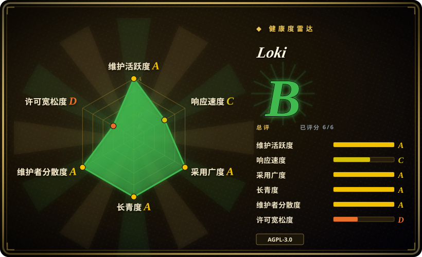
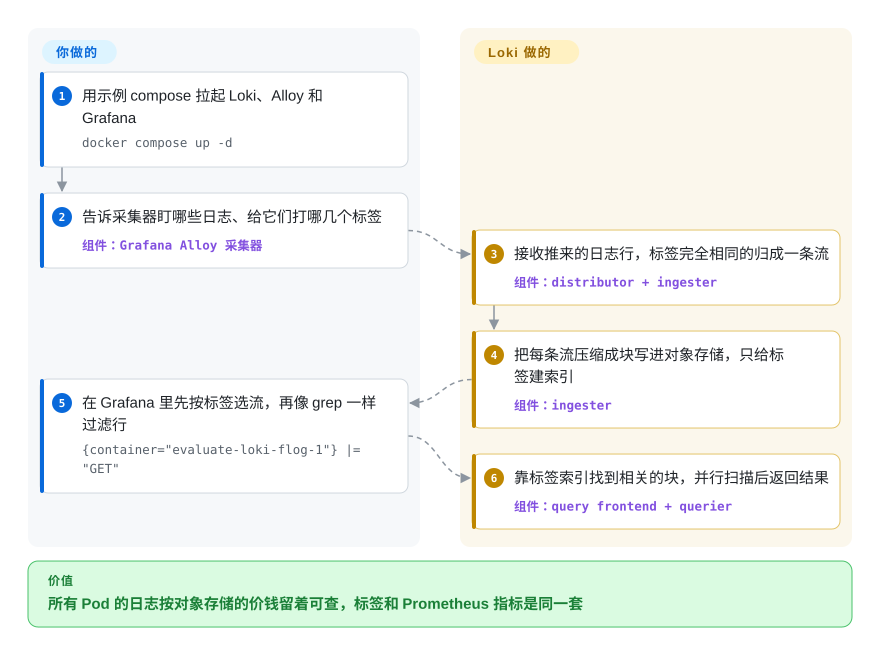

# Loki

日志账单涨得比业务流量还快，因为日志库给每一行的每个词都建了索引，而其中绝大多数行从来没人搜过。Loki 只给每条日志流打的几个标签（应用、命名空间、Pod）建索引，正文压缩后扔进 S3 这类便宜的对象存储，等你真查的时候再像 grep 一样扫。

## 何时使用

你是一个 Kubernetes 平台的 SRE，Prometheus 和 Grafana 早就在跑。日志进的是一套 Elasticsearch，它的热数据层已经成了基础设施账单上最大的几项之一，可大家真正在查的东西很窄：“`prod` 里 `checkout` 过去一小时的报错”“`api-7f9c` 这个 Pod 崩溃前打印了什么”。为了让每天几百条这样的查询在毫秒级返回，你在给几个 TB 的日志做全文索引。

觉得这笔账不划算的时候，就该想到 Loki。它只索引每条流的标签——正是你 Prometheus 指标上已经带着的 `app` / `namespace` / `pod`——日志行本身压缩成块存进 S3、GCS、Azure Blob，小规模时也可以放本地盘；于是在 Grafana 里看到指标尖刺，能直接跳到那个 Pod、那个时间窗的日志。你选它而不选 Elasticsearch/OpenSearch，是因为你很少需要对全部日志做临时全文检索，换来的是存储和运维便宜得多；不选基于 ClickHouse 的日志方案，是因为你要的是 Grafana 原生的查询体验和 Prometheus 式标签，而不是自己设计 SQL 表结构。

## 怎么用起来

Loki 把日志拆成截然不同的两半。**标签**是采集端打上的几个键值对，比如 `{app="checkout", namespace="prod"}`，它们组成一个很小的索引；标签完全相同的所有日志行属于同一条**流**。这些行的**正文**被攒批、压缩成块（chunk），写进对象存储，块里的内容一个字也不建索引。用 LogQL（Loki 的查询语言，长得像 PromQL）查询时，先靠那个小索引按标签选出流，再只对这些流的块做类似 grep 的过滤，比如 `|= "error"`，或者先按 JSON 解析——由多个查询进程并行去扫。它像一个只在抽屉外面贴标签的文件柜：找到抽屉是瞬间的事，翻抽屉里的内容靠蛮力。整个系统是一个 Go 二进制，`-target` 参数决定这个进程跑哪些组件，所以同一份代码既能单进程跑，也能拆成 Kubernetes 上的一组微服务。**Loki 替你做的**：接收、压缩、存储、给标签建索引、执行查询、通过 ruler 组件告警。**你要做的**：跑一个采集器（Grafana Alloy；Promtail 已于 2026-03-02 停止支持），或者让 OpenTelemetry Collector 用 OTLP 推过来；挑一小组低基数的标签；准备对象存储；在上面接 Grafana。

<!-- flow-steps:begin (generated from flows/loki.json by tools/flow_card.py — do not edit) -->

流程文字版

1. **你**：用示例 compose 拉起 Loki、Alloy 和 Grafana — `docker compose up -d`
2. **你**：告诉采集器盯哪些日志、给它们打哪几个标签 — 组件：`Grafana Alloy 采集器`
3. **Loki**：接收推来的日志行，标签完全相同的归成一条流 — 组件：`distributor + ingester`
4. **Loki**：把每条流压缩成块写进对象存储，只给标签建索引 — 组件：`ingester`
5. **你**：在 Grafana 里先按标签选流，再像 grep 一样过滤行 — `{container="evaluate-loki-flog-1"} |= "GET"`
6. **Loki**：靠标签索引找到相关的块，并行扫描后返回结果 — 组件：`query frontend + querier`

**价值**：所有 Pod 的日志按对象存储的价钱留着可查，标签和 Prometheus 指标是同一套

<!-- flow-steps:end -->

## 何时不用

- **你需要对所有日志做快速全文检索。**“过去 30 天所有服务里找这个请求 ID”意味着 Loki 要扫时间范围内的每一个块，因为正文没有索引。如果这就是你的日常查询形态（安全调查、客服检索），请改用 Elasticsearch 或 OpenSearch，它们的倒排索引能直接回答，代价是高得多的存储和内存开销。
- **你的日志字段基数很高，还想把它们当标签。**Loki 文档说得很直接：它“不是为高基数标签值设计的”；按用户 ID、trace ID、订单 ID 打标签会让流的数量爆炸、索引膨胀、往对象存储刷出成千上万的小块（默认最多 15 个索引标签）。这类字段应该放进 structured metadata 或在查询时解析；如果你需要对大量高基数列做 SQL 式聚合，请改用 [ClickHouse](../databases/database-engines/clickhouse.zh.md) 这类列式库。
- **AGPL-3.0 对你的产品是问题。**Loki 是 AGPL-3.0-only（按 `LICENSING.md`，客户端和部分包另以 Apache-2.0 授权）。如果你要改 Loki 并作为网络服务对外提供，先过法务；或者选 Apache-2.0 许可的存储，比如 OpenSearch 或 VictoriaLogs。
- **你想要一个开箱即用的日志产品，而不是一个后端。**Loki 已经没有自己的采集器了（Promtail 已停止支持），界面靠 Grafana。如果你要采集、存储、界面、告警打包成一个产品，Graylog 这类日志管理套件或托管服务更合适。
- **你需要高可用，却跑不了对象存储或 Kubernetes。**本地盘上的单体模式只有一个节点，文档给它的定位大约是每天 20 GB；高可用单体模式和微服务模式都要求共享的 S3 兼容存储桶，微服务模式更是为 Kubernetes 设计的。如果你的上限就是一台带本地盘的机器，VictoriaLogs 这类更简单的单节点存储运维负担更小。
- **你打算新上 Simple Scalable Deployment（SSD）模式。**SSD 模式已被弃用，将在 Loki 4.0 移除；新部署请直接选高可用单体模式或微服务模式。

## 横向对比

| 替代品 | 是否收录 | 我们的评价 | 取舍 |
|---|---|---|---|
| Elasticsearch / OpenSearch | 未收录 | 如果主要工作是对全部日志做临时全文检索，选 Elasticsearch 或 OpenSearch；如果大多数查询都从已知标签出发、存储成本是大头，选 Loki。 | 倒排索引让任意词检索很快，但存储、内存和分片管理成倍增加；Loki 保存成本低得多，代价是在选中的流里蛮力扫正文。 |
| [ClickHouse](../databases/database-engines/clickhouse.zh.md) | ✅ | 如果你要对高基数日志字段做 SQL 聚合（按用户、按请求的分析），选基于 ClickHouse 的日志方案；如果团队本来就用 Prometheus 式标签和 Grafana Explore 干活，选 Loki。 | ClickHouse 擅长高基数列和分析型查询，但表结构要你设计、数据库集群要你运维；Loki 不需要表结构，但会惩罚高基数标签。 |
| VictoriaLogs | 未收录 | 单节点或小集群、想少几个组件、又要 Apache-2.0 许可时，可以试 VictoriaLogs；看重更大的生态、多租户和 Grafana Labs 全家桶集成时，选 Loki。 | VictoriaLogs 更年轻、用户基数更小；Loki 部署量和集成多得多，但高可用要求更重（对象存储、memberlist、三副本）。 |
| [Grafana](grafana.zh.md) | ✅ | 不是替代品：Grafana 是你查询 Loki 的界面，两者一起部署。 | Grafana 把 LogQL 结果和 Prometheus 指标画在一起，自己不存日志。 |
| [OpenTelemetry Collector](opentelemetry-collector.zh.md) | ✅ | 互补关系：用 Collector（或 Alloy）通过原生 OTLP 把日志送进 Loki；它本身不存也不查日志。 | 选 Collector 让采集管线不绑厂商；OTLP 属性哪些变标签、哪些变 structured metadata，仍由 Loki 的配置决定。 |

## 技术栈

- **语言：**Go；一个二进制 / Docker 镜像（`grafana/loki`）里包含全部组件，用 `-target` 选择（单体模式用 `all`）。
- **组件：**distributor、ingester、query frontend、query scheduler、querier、index gateway、compactor、ruler；另有实验性的 bloom 组件。
- **存储格式：**TSDB 标签索引（自带配置里是 `schema: v13`）加对象存储中的压缩块；本地盘上有 WAL（预写日志）。
- **查询语言：**LogQL——标签选择器加行过滤 / 解析器，也能对日志流做 `rate(...)` 这样的指标查询。
- **写入接口：**基于 HTTP 的 Loki push API，以及原生 OTLP 接收。

## 依赖

- **对象存储：**任何需要持久或高可用的部署都要：S3 兼容存储、GCS 或 Azure Blob；文件系统存储只适合开发、概念验证和单节点单体模式。
- **采集器：**Grafana Alloy（文档默认推荐）、OpenTelemetry Collector 或第三方客户端；Promtail 自 2026-03-02 起停止支持。
- **Grafana**（或 LogCLI / HTTP API）用于查询——Loki 自己没有面向用户的界面。
- **高可用还需要：**memberlist 环配置、复制因子 3 且至少三个实例、指定一个 compactor、前面放负载均衡；微服务模式需要 Kubernetes。
- **可选：**给 ruler 告警用的 Alertmanager（Prometheus 的或 Grafana 的）；提升查询性能的缓存（内嵌或 memcached）。

## 运维难度

**单二进制时低，规模上来后中到高。**单体模式配上自带的本地配置，笔记本或一台小虚拟机就能跑，每天 20 GB 左右以内没问题。生产高可用要加对象存储、memberlist、复制和 compactor 角色；Kubernetes 上的微服务模式则是十几个独立扩缩的组件，外加缓存调优和按租户的限额。最常见的坑是**标签基数**：一个动态标签（Pod 哈希、请求路径、用户 ID）就能让流的数量翻倍、索引膨胀、写入卡住，所以标签策略要像表结构一样评审。升级也要留心——schema 配置变更、SSD 模式弃用、Helm chart 在 2026-03-16 迁到 `grafana-community/helm-charts`，都发生在 3.x 系列里。

## 健康度与可持续性

- **维护（截至 2026-10-08）：**非常活跃——上个季度每周都有提交，最新版本是 v3.7.8 和 v3.6.17（都在 2026-09-17 发布），两条小版本线并行打补丁。
- **治理与背书：**归 **Grafana Labs** 所有，是单一厂商项目，但贡献者面很广（过去 12 个月 85 位活跃维护者，前三名占比约 27%）。厂商的商业版 GEL 和 Grafana Cloud Logs 用的是同一套代码，这既给开发供血，也意味着路线图由厂商定。
- **年龄与 Lindy（2018-04 创建，约 8.5 年）：**又老又活跃，还是 Grafana 全家桶的默认日志后端——Lindy 先验相当稳。
- **采用：**`grafana/loki` 镜像拉取量以十亿计，ADOPTERS 名单很长；在 Kubernetes 平台里部署广泛。
- **响应速度：**比同类慢——新 issue 的首次响应中位数是 191.8 小时（约 8 天）。
- **风险信号：**2021 年从 Apache-2.0 改为 **AGPL-3.0**（雷达的许可轴因此是 D）；3.x 系列内弃用频繁（Promtail 停止支持、SSD 模式将在 4.0 移除、Helm chart 对非 GEL 用户迁到社区仓库）。

## 存疑（未验证）

- [未验证] Star 数（约 29.0k）、版本号和发布日期取自 2026-10-08 的 GitHub API；每次发版都会变。
- [推断] “每天约 20 GB”的单体模式上限和默认 15 个标签的限制引自上游文档；实际上限取决于硬件、查询负载和配置的限额。
- [推断] 与 Elasticsearch/OpenSearch 的成本对比是定性的（只索引标签 vs 完整倒排索引）；实际能省多少取决于查询模式、保留期和集群规模——请用自己的数据压测。
- [未验证] 2021 年 Apache-2.0 → AGPL-3.0 的改许可时间来自 Grafana Labs 的公开公告，这次同步没有重读；`LICENSING.md`（2026-10-08 读过）确认当前默认是 AGPL-3.0-only，并有 Apache-2.0 例外目录。
- [未验证] VictoriaLogs 的成熟度以及与 Loki 的功能对等（多租户、OTLP、高可用）本页没有深入核实。
