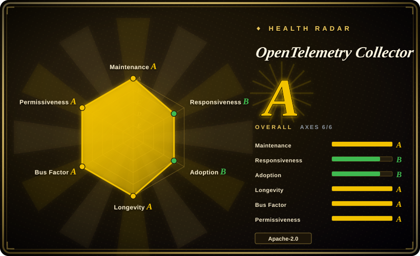
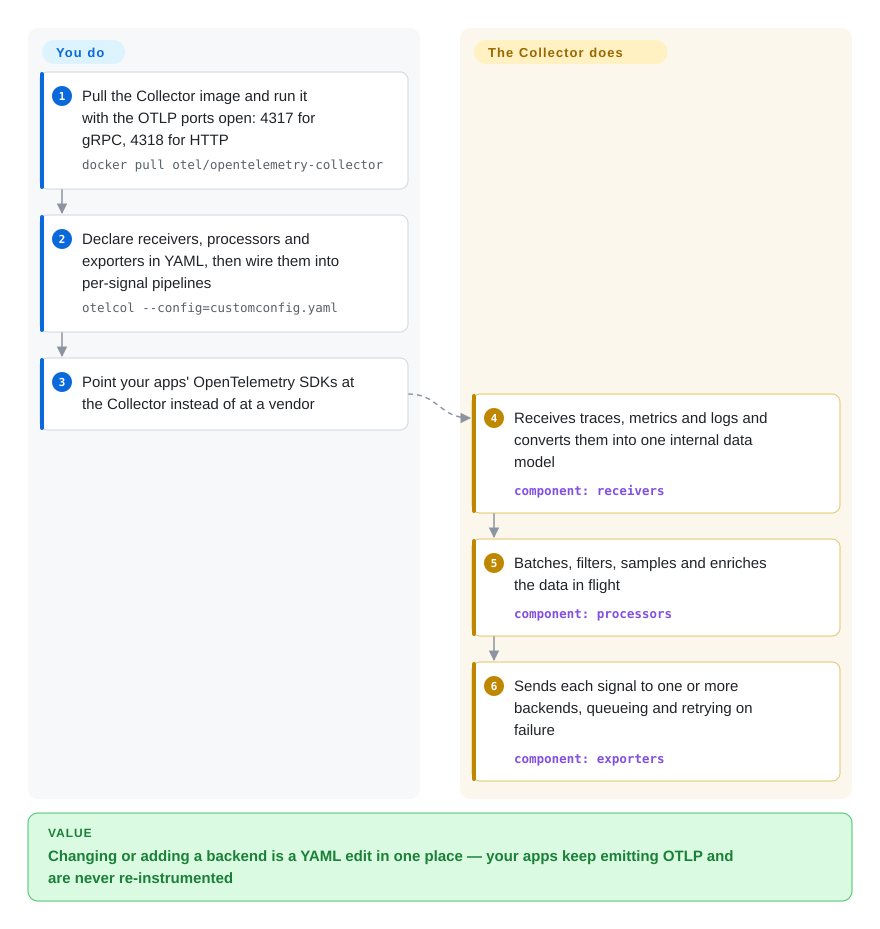

# OpenTelemetry Collector

Every observability vendor wants its own agent on your hosts and its own SDK in your code, so switching from one backend to another — or sending the same traces to two — means redeploying agents and re-instrumenting services. The Collector is one vendor-neutral relay that sits between your apps and your backends: apps send standard OpenTelemetry data to it, and a YAML file decides what gets filtered, enriched, and forwarded where.

## When to use

You run the platform team for a few dozen services. Traces go to Jaeger, metrics to Prometheus, logs to Loki — and finance now wants a commercial APM trial on top for the payment services, with production traces only, PII stripped. Today that means a second agent per node and a second exporter wired into every service's code, and when the trial ends someone has to undo it all. Meanwhile each team configures sampling and retry behaviour slightly differently.

You reach for the OpenTelemetry Collector to put one hop in between. Services emit OTLP — the OpenTelemetry wire protocol — to a local Collector; the Collector's YAML decides which spans to drop, which attributes to delete, which Kubernetes metadata to add, and which backends receive which signals. Adding the APM trial becomes one more exporter in one config file. You pick it over vendor agents because the pipeline stays vendor-neutral and CNCF-governed; over Telegraf, Fluent Bit or Vector because it handles traces, metrics and logs in the OpenTelemetry data model natively rather than as an add-on.

## How it works

The Collector is a Go binary assembled from three kinds of plug-in components. **Receivers** accept data — OTLP over gRPC (port 4317) or HTTP (4318), plus, in the contrib distribution, Prometheus scrapes, Jaeger, Kafka, log files and about a hundred other sources — and convert it into one internal data model. **Processors** act on data in flight: batching, filtering, sampling, attribute redaction, memory limiting, adding Kubernetes pod metadata. **Exporters** send the result to one or more backends, with a sending queue that buffers and retries when a backend is down. You wire these together per signal (traces, metrics, logs) in the `service.pipelines` section of a YAML file — think of a mail-sorting room where you only write the routing rules. The same binary runs as an **agent** next to each app or as a central **gateway** tier. **What the Collector does for you:** protocol translation, buffering, retry, fan-out. **What you do:** choose a distribution (core, contrib, k8s, or a custom build made with the `ocb` builder), write the pipeline config, and run the storage backends — the Collector stores and queries nothing.

<!-- flow-steps:begin (generated from flows/opentelemetry-collector.json by tools/flow_card.py — do not edit) -->

Text version of the flow

1. **You**: Pull the Collector image and run it with the OTLP ports open: 4317 for gRPC, 4318 for HTTP — `docker pull otel/opentelemetry-collector`
2. **You**: Declare receivers, processors and exporters in YAML, then wire them into per-signal pipelines — `otelcol --config=customconfig.yaml`
3. **You**: Point your apps' OpenTelemetry SDKs at the Collector instead of at a vendor
4. **OpenTelemetry Collector**: Receives traces, metrics and logs and converts them into one internal data model — component: `receivers`
5. **OpenTelemetry Collector**: Batches, filters, samples and enriches the data in flight — component: `processors`
6. **OpenTelemetry Collector**: Sends each signal to one or more backends, queueing and retrying on failure — component: `exporters`

**Value**: Changing or adding a backend is a YAML edit in one place — your apps keep emitting OTLP and are never re-instrumented

<!-- flow-steps:end -->

## When NOT to use

- **You have one service and one backend that already accepts OTLP.** The SDK can export straight to the backend; a Collector adds a process to deploy, monitor and upgrade for no routing benefit. Add it later, when a second backend, central sampling or redaction shows up.
- **You are looking for somewhere to store, query or graph telemetry.** The Collector only moves data. Pair it with [Prometheus](prometheus.md) for metrics, [Loki](loki.md) for logs, [Jaeger](jaeger.md) for traces and [Grafana](grafana.md) for dashboards.
- **You need stable config and Go APIs across every upgrade.** The binary is still versioned 0.x (v0.162.0 as of 2026-09-28) with a release about every two weeks; components move through alpha/beta/stable levels, and config keys get renamed — the core OTLP gRPC exporter's type changed from `otlp` to `otlp_grpc`, with the old name kept as a deprecated alias. If you cannot absorb that churn, pin a version and upgrade deliberately, or use a vendor-supported distribution (for example Grafana Alloy) that tracks it for you.
- **Your pipeline is metrics-only from heterogeneous devices and protocols.** For SNMP, Modbus/OPC UA, or InfluxDB line-protocol sources feeding a single time-series store, [Telegraf](../dev-utilities/ops-infra/telegraf.md)'s plugin catalog is broader there and the TOML config is simpler.
- **You want a programmable log-transformation language.** If your work is mostly parsing and reshaping log lines with complex logic, Vector's VRL language is purpose-built for that; the Collector's transform processor (OTTL) covers common cases but is younger.
- **You expect "core" to include the components you need.** The core repository ships only OTLP receivers/exporters, the debug exporter, and batch and memory-limiter processors. Prometheus scraping, file logs, Kubernetes attributes and almost every vendor exporter live in `opentelemetry-collector-contrib`, whose components have their own, often lower, stability levels.

## Comparison

| Alternative | In index | Our verdict | Tradeoff |
|---|---|---|---|
| Grafana Alloy | 未收录 | If your backends are the Grafana stack and you want one vendor-supported agent with a programmable config language, pick Alloy; pick the upstream Collector when vendor neutrality and the plain OpenTelemetry YAML matter more. | Alloy embeds Collector components and adds Grafana-specific features and support, but ties you to Grafana Labs' release train and config syntax. |
| Vector | 未收录 | If the job is mostly high-volume log routing with heavy per-event transformation, pick Vector; pick the Collector when traces and the OpenTelemetry data model are first-class requirements. | Vector's VRL language is strong for log reshaping; its OpenTelemetry trace support is narrower than the Collector's native pipeline. |
| Fluent Bit | 未收录 | On constrained nodes that mainly forward container logs, pick Fluent Bit; pick the Collector when one pipeline must carry traces, metrics and logs with OpenTelemetry semantics. | Fluent Bit is a small C binary with a long log-forwarding track record; OpenTelemetry signals other than logs are a newer addition there. |
| [Telegraf](../dev-utilities/ops-infra/telegraf.md) | ✅ | For metrics from many heterogeneous systems (SNMP, industrial protocols, databases) into one store, pick Telegraf; pick the Collector for application telemetry from OpenTelemetry SDKs. | Telegraf has the broader input-plugin catalog and simpler TOML; it is metrics-first and has no tracing pipeline. |
| Vendor agents (e.g. Datadog Agent) | 未收录 | If you are committed to one commercial backend and want its full feature set, use its agent; use the Collector to keep the option of switching or dual-shipping. | Vendor agents unlock proprietary features with zero glue; the Collector keeps you portable at the cost of running and configuring it yourself. |

## Tech stack

- **Language:** Go; built from Go modules, with core libraries such as `pdata`, `component` and `confmap` released as stable v1.x (v1.68.0) while the Collector binary and many components are still 0.x.
- **Protocol:** OTLP v1.10.0 (stable) over gRPC and HTTP; the internal data model mirrors OTLP for traces, metrics, logs, and (alpha) profiles.
- **Configuration:** YAML with `receivers`, `processors`, `exporters`, `connectors`, `extensions`, wired in `service.pipelines`; config can be merged from files, environment variables, or HTTP(S) URLs.
- **Distributions:** official builds `otelcol` (core), `otelcol-contrib`, `otelcol-k8s`, `otelcol-otlp`, `otelcol-prometheus`, `otelcol-ebpf-profiler`; custom builds with the OpenTelemetry Collector Builder (`ocb`). Release images are signed with cosign.

## Dependencies

- **Runtime:** none beyond the binary or container image; runs on Linux, Windows and macOS, as a sidecar, DaemonSet, or Deployment.
- **Backends:** whatever you export to (Prometheus, Loki, Jaeger, a commercial APM…) — they are yours to run or pay for.
- **Optional:** the OpenTelemetry Operator or Helm charts for Kubernetes; a `file_storage` extension for a persistent on-disk queue; Kubernetes API access for metadata enrichment (contrib `k8sattributes` processor).
- **Instrumentation:** applications need an OpenTelemetry SDK or auto-instrumentation agent (or another protocol a receiver understands) to send data in.

## Ops difficulty

**Low to start, medium in production.** A single container with the default config accepts OTLP in minutes. Production work is mostly about the pipeline: choosing agent vs gateway topology, sizing memory limits and sending queues so a slow backend does not cause dropped data or OOM kills, tail sampling (which needs all spans of a trace to reach the same gateway instance, usually via a load-balancing exporter tier), and monitoring the Collector's own metrics. Upgrades every few weeks are routine, but read the changelog: renamed config keys, deprecated components, and contrib components with alpha/beta stability can break a pipeline. Binding receivers to `0.0.0.0` exposes them to the network — the docs default to `localhost` for that reason.

## Health & viability

- **Maintenance (as of 2026-10-08):** very active — commits every week of the last quarter and a minor release roughly every two weeks (v0.162.0 on 2026-09-28).
- **Governance / backing:** an OpenTelemetry project under the **CNCF**, run by the Collector SIG with maintainers and approvers from Grafana Labs, Snowflake, Splunk, Dynatrace, Datadog, Elastic and Microsoft — multi-vendor governance, no single company owns the roadmap.
- **Age & Lindy (created 2019-05, ~7.4 years):** mature and still active; the default telemetry pipeline that most observability vendors now accept or ship as their own distribution — a strong prior.
- **Responsiveness:** now scored B — a median first response of 64.2 hours on new issues (previously unscored because GitHub data was unavailable).
- **Adoption:** the radar's adoption axis is only C because it counts Go-module dependents and GitHub release downloads; most users pull the `otel/*` container images or vendor distributions instead, so this underestimates real use.
- **Risk flags:** Apache-2.0, no relicense history. The main risk is churn: pre-1.0 binary versioning and frequent config/component deprecations.

## Caveats (unverified)

- [未验证] Star count (~7.6k for the core repo, ~5.0k for contrib), versions and dates were read from the GitHub API on 2026-10-08.
- [未验证] The exact CNCF maturity level of OpenTelemetry (incubating vs graduated) was not re-checked during this sync.
- [推断] "About a hundred" contrib receivers is an approximation from the contrib repository's `receiver/` directory listing; component counts and stability levels change every release.
- [推断] The comparisons with Vector, Fluent Bit and Grafana Alloy are based on their general positioning, not on a fresh reading of their repositories for this page.
- [推断] The radar's adoption grade C reflects what the scorer can measure (Go-module dependents, release downloads), not container-image pulls; real adoption is likely much higher.
