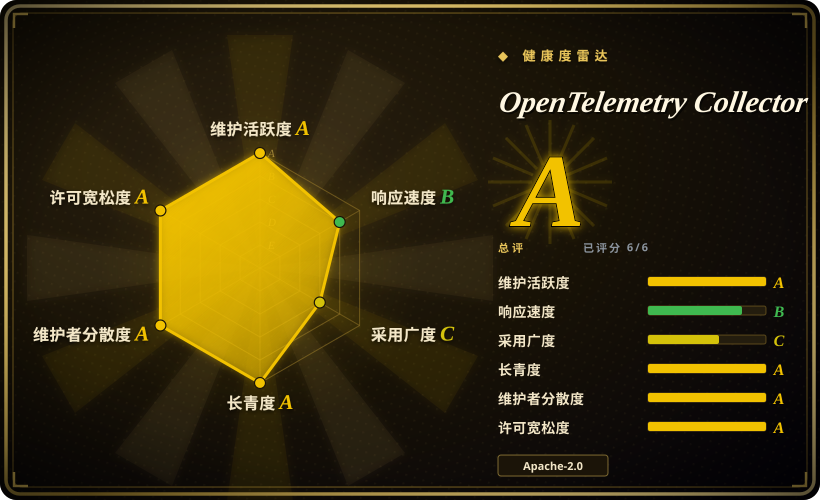
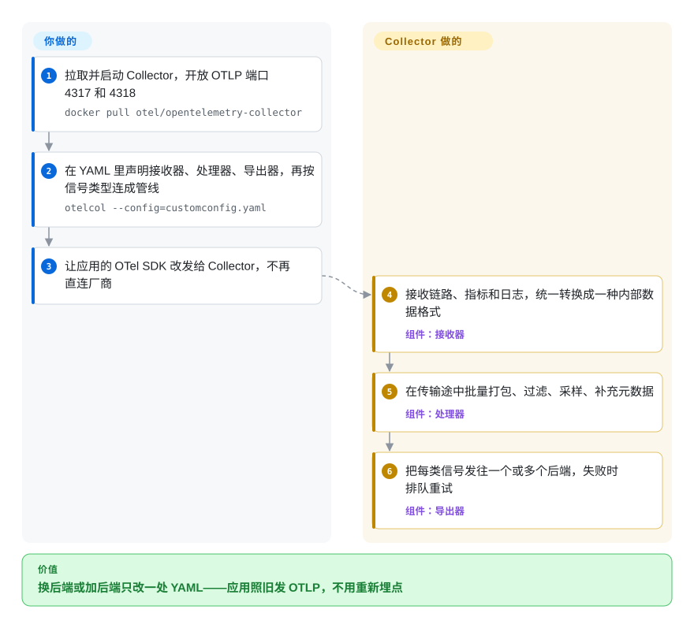

# OpenTelemetry Collector

每家可观测性厂商都想在你的机器上装它自己的 agent、在你的代码里埋它自己的 SDK，于是想换一家后端、或者把同一份链路数据同时发给两家，就得重新部署 agent、挨个服务改埋点。Collector 是夹在应用和后端之间的一个不绑厂商的中转站：应用只管把标准的 OpenTelemetry 数据发给它，过滤什么、补充什么、转发到哪，全由一个 YAML 文件决定。

## 何时使用

你带着平台团队，管几十个服务。链路进 Jaeger，指标进 Prometheus，日志进 Loki——现在财务要给支付服务试用一个商业 APM，只要生产环境的链路，还得先抹掉个人信息。照现在的做法，这意味着每个节点再装一个 agent、每个服务的代码里再接一个导出器，试用结束还得有人一个个拆掉。与此同时，各团队的采样和重试配置也都略有不同。

这时就该想到 OpenTelemetry Collector：在中间加一跳。服务把 OTLP（OpenTelemetry 的传输协议）发给本地的 Collector，由 Collector 的 YAML 决定丢哪些 span、删哪些属性、补哪些 Kubernetes 元数据、哪类信号发给哪些后端。接入 APM 试用，就是在一个配置文件里多加一个导出器。你选它而不选厂商 agent，是因为管线不绑厂商、由 CNCF 治理；不选 Telegraf、Fluent Bit 或 Vector，是因为它原生按 OpenTelemetry 数据模型处理链路、指标和日志，而不是后来补上的附加功能。

## 怎么用起来

Collector 是一个 Go 二进制，由三类可插拔组件拼成。**接收器（receiver）**负责收数据——OTLP 走 gRPC（4317 端口）或 HTTP（4318 端口），contrib 发行版里还有 Prometheus 抓取、Jaeger、Kafka、日志文件等一百来种来源——并把它们统一转换成一种内部数据格式。**处理器（processor）**在数据传输途中动手：批量打包、过滤、采样、抹掉敏感属性、限制内存、补充 Kubernetes Pod 元数据。**导出器（exporter）**把结果发往一个或多个后端，并带一个发送队列，后端挂了就先缓冲、再重试。你在 YAML 的 `service.pipelines` 段里按信号类型（链路、指标、日志）把这些组件连起来——就像邮件分拣室，你只写分拣规则。同一个二进制既可以作为 **agent** 跑在每个应用旁边，也可以作为集中的 **gateway** 层。**Collector 替你做的**：协议转换、缓冲、重试、一份数据分发多处。**你要做的**：挑一个发行版（core、contrib、k8s，或用 `ocb` 构建器自己定制）、写管线配置、运维存储后端——Collector 自己不存也不查任何数据。

<!-- flow-steps:begin (generated from flows/opentelemetry-collector.json by tools/flow_card.py — do not edit) -->

流程文字版

1. **你**：拉取并启动 Collector，开放 OTLP 端口 4317 和 4318 — `docker pull otel/opentelemetry-collector`
2. **你**：在 YAML 里声明接收器、处理器、导出器，再按信号类型连成管线 — `otelcol --config=customconfig.yaml`
3. **你**：让应用的 OTel SDK 改发给 Collector，不再直连厂商
4. **OpenTelemetry Collector**：接收链路、指标和日志，统一转换成一种内部数据格式 — 组件：`接收器`
5. **OpenTelemetry Collector**：在传输途中批量打包、过滤、采样、补充元数据 — 组件：`处理器`
6. **OpenTelemetry Collector**：把每类信号发往一个或多个后端，失败时排队重试 — 组件：`导出器`

**价值**：换后端或加后端只改一处 YAML——应用照旧发 OTLP，不用重新埋点

<!-- flow-steps:end -->

## 何时不用

- **你只有一个服务、一个本来就收 OTLP 的后端。**SDK 可以直接导出到后端；加一个 Collector 只是多一个要部署、监控、升级的进程，却没有任何路由收益。等出现第二个后端、集中采样或脱敏需求时再加。
- **你要找的是存储、查询或画图的地方。**Collector 只搬运数据。指标配 [Prometheus](prometheus.zh.md)，日志配 [Loki](loki.zh.md)，链路配 [Jaeger](jaeger.zh.md)，看板配 [Grafana](grafana.zh.md)。
- **你需要每次升级配置和 Go API 都稳定不变。**二进制仍是 0.x 版本号（截至 2026-09-28 为 v0.162.0），大约每两周一个版本；组件在 alpha/beta/stable 等级之间流转，配置键也会改名——核心的 OTLP gRPC 导出器类型名就从 `otlp` 改成了 `otlp_grpc`，旧名作为弃用别名保留。如果承受不了这种变动，就锁定版本、有计划地升级，或者用一个有厂商支持、替你跟进上游的发行版（比如 Grafana Alloy）。
- **你的管线只采指标，而且来源是五花八门的设备和协议。**SNMP、Modbus/OPC UA、InfluxDB 行协议这类来源汇到一个时序库时，[Telegraf](../dev-utilities/ops-infra/telegraf.zh.md) 在这方面的插件更全，TOML 配置也更简单。
- **你想要一门可编程的日志改写语言。**如果你的活主要是用复杂逻辑解析、改写日志行，Vector 的 VRL 语言就是为此设计的；Collector 的 transform 处理器（OTTL）能覆盖常见情况，但更年轻。
- **你以为 “core” 里就有你要的组件。**核心仓库只带 OTLP 接收器/导出器、debug 导出器，以及 batch 和 memory-limiter 两个处理器。Prometheus 抓取、日志文件、Kubernetes 属性和几乎所有厂商导出器都在 `opentelemetry-collector-contrib` 里，这些组件有各自的稳定性等级，往往更低。

## 横向对比

| 替代品 | 是否收录 | 我们的评价 | 取舍 |
|---|---|---|---|
| Grafana Alloy | 未收录 | 如果后端就是 Grafana 全家桶、又想要一个有厂商支持且配置语言可编程的 agent，选 Alloy；如果更看重不绑厂商和原汁原味的 OpenTelemetry YAML，选上游 Collector。 | Alloy 内嵌了 Collector 组件，又加了 Grafana 专属功能和支持，但会把你绑在 Grafana Labs 的发版节奏和配置语法上。 |
| Vector | 未收录 | 如果活主要是大流量日志路由、每条事件都要重度改写，选 Vector；如果链路和 OpenTelemetry 数据模型是硬需求，选 Collector。 | Vector 的 VRL 改写日志很强；它对 OpenTelemetry 链路的支持比 Collector 的原生管线窄。 |
| Fluent Bit | 未收录 | 在资源紧张、主要转发容器日志的节点上，选 Fluent Bit；如果一条管线要同时承载链路、指标和日志并保持 OpenTelemetry 语义，选 Collector。 | Fluent Bit 是一个小巧的 C 二进制，转发日志的履历很长；日志以外的 OpenTelemetry 信号在它那里是较新的能力。 |
| [Telegraf](../dev-utilities/ops-infra/telegraf.zh.md) | ✅ | 要把大量异构系统（SNMP、工业协议、数据库）的指标汇进一个库，选 Telegraf；要接 OpenTelemetry SDK 发出的应用遥测，选 Collector。 | Telegraf 的输入插件目录更全、TOML 更简单；它以指标为主，没有链路管线。 |
| 厂商 agent（如 Datadog Agent） | 未收录 | 如果已经认定一家商业后端、想用满它的功能，就用它的 agent；如果想保留换厂商或双发的余地，用 Collector。 | 厂商 agent 零胶水就能解锁专有功能；Collector 让你保持可迁移，代价是自己运行和配置它。 |

## 技术栈

- **语言：**Go；由多个 Go 模块构成，`pdata`、`component`、`confmap` 等核心库已作为稳定的 v1.x（v1.68.0）发布，而 Collector 二进制和许多组件仍是 0.x。
- **协议：**OTLP v1.10.0（稳定），走 gRPC 和 HTTP；内部数据模型与 OTLP 对应，覆盖链路、指标、日志和（alpha 阶段的）profiles。
- **配置：**YAML，包含 `receivers`、`processors`、`exporters`、`connectors`、`extensions`，在 `service.pipelines` 里连线；配置可以从文件、环境变量或 HTTP(S) 地址合并而来。
- **发行版：**官方构建有 `otelcol`（core）、`otelcol-contrib`、`otelcol-k8s`、`otelcol-otlp`、`otelcol-prometheus`、`otelcol-ebpf-profiler`；也可以用 OpenTelemetry Collector Builder（`ocb`）定制构建。发布镜像用 cosign 签名。

## 依赖

- **运行时：**除了二进制或容器镜像没有别的；可跑在 Linux、Windows 和 macOS 上，以 sidecar、DaemonSet 或 Deployment 形式部署。
- **后端：**你导出到哪里（Prometheus、Loki、Jaeger、商业 APM……），那些就得你自己运维或付费。
- **可选：**Kubernetes 上的 OpenTelemetry Operator 或 Helm chart；用于磁盘持久队列的 `file_storage` 扩展；补充元数据所需的 Kubernetes API 访问权限（contrib 的 `k8sattributes` 处理器）。
- **埋点：**应用需要 OpenTelemetry SDK 或自动埋点 agent（或者某个接收器认识的其他协议）把数据发进来。

## 运维难度

**起步低，生产中等。**一个容器加默认配置，几分钟就能收 OTLP。生产上的功夫主要花在管线上：选 agent 还是 gateway 拓扑；调好内存上限和发送队列，免得后端一慢就丢数据或被 OOM 杀掉；尾部采样要求一条链路的所有 span 都落到同一个 gateway 实例，通常得前置一层负载均衡导出器；还要监控 Collector 自己的指标。每隔几周升级一次是常态，但要读变更日志：配置键改名、组件弃用、contrib 里 alpha/beta 等级的组件，都可能弄坏一条管线。把接收器绑到 `0.0.0.0` 会把它暴露到网络上——所以文档的默认值是 `localhost`。

## 健康度与可持续性

- **维护（截至 2026-10-08）：**非常活跃——上个季度每周都有提交，大约每两周发一个小版本（2026-09-28 发布 v0.162.0）。
- **治理与背书：**OpenTelemetry 旗下项目，归 **CNCF**，由 Collector SIG 运作，维护者和审批者来自 Grafana Labs、Snowflake、Splunk、Dynatrace、Datadog、Elastic、Microsoft——多厂商共治，没有哪一家公司独掌路线图。
- **年龄与 Lindy（2019-05 创建，约 7.4 年）：**成熟且仍活跃；如今大多数可观测性厂商要么直接接收它的数据，要么把它打包成自己的发行版——先验很强。
- **响应速度：**这次评为 B——新 issue 首次响应中位数 64.2 小时（之前因 GitHub 数据不可用而未评分）。
- **采用：**雷达的采用轴只有 C，因为它统计的是 Go 模块依赖方和 GitHub release 下载量；大多数用户拉的是 `otel/*` 容器镜像或厂商发行版，所以这个分数低估了实际使用量。
- **风险信号：**Apache-2.0，没有改许可的历史。主要风险是变动频繁：二进制还没到 1.0，配置和组件经常弃用。

## 存疑（未验证）

- [未验证] Star 数（核心仓库约 7.6k，contrib 约 5.0k）、版本号和日期取自 2026-10-08 的 GitHub API。
- [未验证] OpenTelemetry 在 CNCF 的确切成熟度等级（孵化还是毕业）这次同步没有重新核对。
- [推断] contrib 里“一百来种”接收器是按 contrib 仓库 `receiver/` 目录列表估算的；组件数量和稳定性等级每个版本都在变。
- [推断] 与 Vector、Fluent Bit、Grafana Alloy 的对比基于它们的一般定位，没有为本页重新读它们的仓库。
- [推断] 雷达采用轴的 C 反映的是评分器能测到的东西（Go 模块依赖方、release 下载量），不含容器镜像拉取量；实际采用度很可能高得多。
