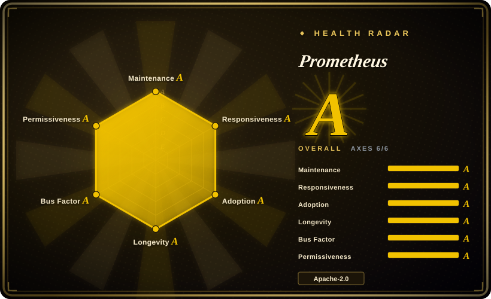
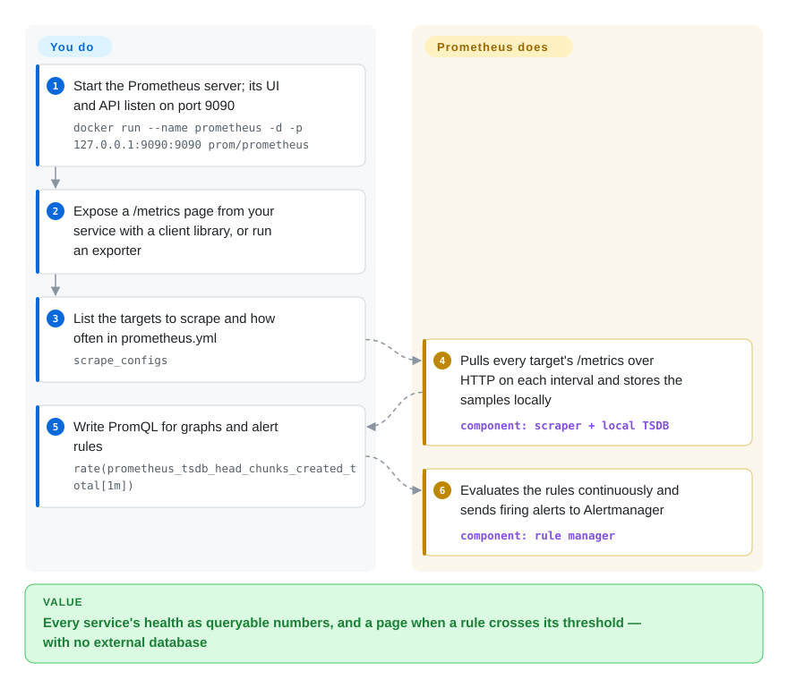

# Prometheus

You find out the checkout service was slow because a customer tweets about it, not because anything told you — and when you go looking, nobody can say whether error rates rose before or after the deploy. Prometheus polls every service's `/metrics` page every few seconds, keeps the numbers in its own time-series database, and lets you graph them and alert on them with one query language.

## When to use

You're the engineer who just inherited on-call for a Kubernetes cluster running a dozen services. There is no metrics system yet — just `kubectl top` and log grepping — and the first postmortem asks a question you cannot answer: "what was the p99 latency of `/checkout` in the ten minutes before the outage, and did it move with the deploy at 14:02?" You need request rates, error ratios and latency histograms per service, per pod, per endpoint, retained for weeks, and alerts that page someone when the error ratio crosses 2% for five minutes.

You reach for Prometheus because it is the de-facto standard for exactly this: Kubernetes components, databases and most cloud-native software already expose metrics in its text format, client libraries exist for every major language, and one server with a local disk scrapes and stores them — no external database to run. You pick it over InfluxDB or Graphite because labels (`service`, `pod`, `status`) plus PromQL make "error ratio by service" a one-line query, and over a hosted SaaS because the data, the alert rules and the cost stay under your control.

## How it works

Prometheus works by **pulling**. Each service exposes a plain-text `/metrics` page listing its current counters and gauges, each tagged with labels such as `{service="checkout", status="500"}`; every scrape interval (15 seconds in the example config), the Prometheus server fetches those pages over HTTP and appends the values as time-stamped samples to its built-in **TSDB** — a time-series database on local disk that keeps 15 days by default. Targets come from a static list in `prometheus.yml` or from service discovery (Kubernetes, Consul, cloud APIs), so new pods are picked up automatically. You ask questions in **PromQL**, a query language over those labelled series (`rate(...)`, `sum by (service)`, `histogram_quantile(...)`), both in the built-in UI and in Grafana; the same expressions written as rules are evaluated continuously, and firing alerts are handed to a separate **Alertmanager**, which deduplicates and routes them to Slack, PagerDuty or email. It is like a meter reader who visits every house on schedule rather than waiting for houses to phone in. **What Prometheus does for you:** discovery, scraping, storage, querying, rule evaluation. **What you do:** instrument your code (or deploy exporters such as node_exporter for hosts), write scrape configs, alert rules and dashboards, and run Alertmanager.

<!-- flow-steps:begin (generated from flows/prometheus.json by tools/flow_card.py — do not edit) -->

Text version of the flow

1. **You**: Start the Prometheus server; its UI and API listen on port 9090 — `docker run --name prometheus -d -p 127.0.0.1:9090:9090 prom/prometheus`
2. **You**: Expose a /metrics page from your service with a client library, or run an exporter
3. **You**: List the targets to scrape and how often in prometheus.yml — `scrape_configs`
4. **Prometheus**: Pulls every target's /metrics over HTTP on each interval and stores the samples locally — component: `scraper + local TSDB`
5. **You**: Write PromQL for graphs and alert rules — `rate(prometheus_tsdb_head_chunks_created_total[1m])`
6. **Prometheus**: Evaluates the rules continuously and sends firing alerts to Alertmanager — component: `rule manager`

**Value**: Every service's health as queryable numbers, and a page when a rule crosses its threshold — with no external database

<!-- flow-steps:end -->

## When NOT to use

- **You need long-term, highly available, or global storage out of the box.** The upstream docs state that local storage "is not clustered or replicated" and is limited to one node's scalability and durability. For months-to-years of retention, HA, or a global query view across clusters, add a remote-write backend such as Thanos, Grafana Mimir or VictoriaMetrics — or use one of those as the primary store.
- **Your data is events or high-cardinality identifiers, not aggregates.** Every unique label combination is a new series held in memory; labelling by user ID, request ID or full URL path can exhaust RAM. Per-request detail belongs in logs ([Loki](loki.md)) or traces ([Jaeger](jaeger.md)); for analytical queries over raw events use a columnar store such as [ClickHouse](../databases/database-engines/clickhouse.md).
- **You need exact, per-event accuracy — billing, audit counts.** Scraping samples state at intervals and `rate()` extrapolates; a counter increment between a crash and the next scrape can be lost. Use a transactional database or an event log for numbers that must reconcile to the cent.
- **Your sources cannot be scraped.** Short-lived batch jobs, devices behind NAT, or serverless functions do not have a stable `/metrics` endpoint to pull. Pushgateway covers batch jobs; otherwise push via OTLP/remote-write (Prometheus can receive both with `--web.enable-otlp-receiver` / `--web.enable-remote-write-receiver`), or use a push-oriented collector such as the [OpenTelemetry Collector](opentelemetry-collector.md) or [Telegraf](../dev-utilities/ops-infra/telegraf.md) feeding a push-native store.
- **You only want logs, dashboards, or a turnkey product.** Prometheus has a basic query UI, no log storage, and alert *delivery* lives in the separate Alertmanager. For dashboards use [Grafana](grafana.md); for a single bill covering metrics, logs and traces, a hosted observability SaaS is less to run.

## Comparison

| Alternative | In index | Our verdict | Tradeoff |
|---|---|---|---|
| VictoriaMetrics | 未收录 | When a single Prometheus runs out of RAM or disk and you want a drop-in, more resource-efficient store that still speaks PromQL-style queries and remote-write, pick VictoriaMetrics; stay on Prometheus while one node and 15–90 days of retention suffice. | Lower memory and disk per series and built-in clustering, but a single-vendor project whose MetricsQL differs subtly from PromQL. |
| Thanos / Grafana Mimir | 未收录 | When you need HA, years of retention in object storage, or one query across many clusters, put Thanos or Mimir behind Prometheus; skip them while a single server meets your retention and availability needs. | They add object storage and several extra services to operate in exchange for durability and global view; Prometheus alone stays one binary. |
| InfluxDB | 未收录 | When your data is pushed from devices or apps and you want SQL or line-protocol ingestion, pick InfluxDB; pick Prometheus for pull-based monitoring of cloud-native services and the Kubernetes exporter ecosystem. | InfluxDB handles push and higher-cardinality data more naturally; Prometheus has the larger exporter ecosystem and the alerting model most Kubernetes tooling assumes. |
| [OpenTelemetry Collector](opentelemetry-collector.md) | ✅ | Complementary, not a store: use the Collector to receive OTLP metrics from apps and forward them into Prometheus (or elsewhere); it cannot query or alert. | Keeps instrumentation vendor-neutral, at the cost of one more pipeline component; Prometheus still does storage, PromQL and rules. |
| [Grafana](grafana.md) | ✅ | Complementary: Grafana is the dashboard layer most Prometheus users put on top; it does not replace scraping or the TSDB. | Far richer dashboards and cross-source correlation than Prometheus's built-in UI; one more service to run. |

## Tech stack

- **Language:** Go server and `promtool` CLI; the web UI is a React app compiled into the binary (building from source also needs Node.js/npm).
- **Storage:** an embedded local TSDB with a write-ahead log and compacted 2-hour blocks; default retention 15 days (`--storage.tsdb.retention.time`).
- **Query language:** PromQL; recording and alerting rules are PromQL expressions in YAML rule files.
- **Interfaces:** pull scraping in the Prometheus/OpenMetrics text format; Remote Write (1.0 stable spec, 2.0 spec) sender and optional receiver; optional OTLP receiver; HTTP query API.
- **Modes:** full server, or **agent mode** (scrape and remote-write only, no local querying) for edge clusters.

## Dependencies

- **Runtime:** a single static binary or the `prom/prometheus` image; no external database. Needs a local POSIX filesystem (the docs say NFS, including AWS EFS, is not supported) sized to retention × ingest rate.
- **Alertmanager** (separate repository and process) to deliver alerts; without it rules still evaluate but nobody is paged.
- **Exporters / instrumentation:** client libraries in your code, plus exporters such as node_exporter, blackbox_exporter or database exporters for things you cannot instrument.
- **Optional:** Grafana for dashboards; a remote-write backend (Thanos, Mimir, VictoriaMetrics, a SaaS) for long-term or HA storage; the Prometheus Operator / kube-prometheus-stack on Kubernetes (separate projects).

## Ops difficulty

**Low for one server, rising with scale.** Running one Prometheus with a config file is easy, and it keeps working when the network to everything else is down — by design. The work appears later: capacity planning (memory grows with the number of active series, so cardinality reviews become routine), retention vs disk sizing, running two identical servers for alerting HA because there is no built-in replication, sharding scrape load across servers, and adding a remote-write backend once you want long retention or a global view. The release train is a minor version every 6 weeks with an LTS line (v3.5) for teams that upgrade slowly; the 2.x → 3.0 jump carried backwards-incompatible changes (PromQL range-selector semantics, UTF-8 metric names, removed feature flags, a new UI), so read the migration guide before skipping majors.

## Health & viability

- **Maintenance (as of 2026-10-08):** very active — commits every week of the last quarter, v3.15.0 on 2026-09-25 and v3.13.4 on 2026-10-02, on a documented 6-week minor-release schedule with named release shepherds.
- **Governance / backing:** a **CNCF graduated** project with a large, multi-company maintainer group (114 active maintainers in the trailing 12 months, top-3 share ~45%); no single vendor owns it.
- **Age & Lindy (created 2012-11, ~13.9 years):** one of the oldest cloud-native projects and still shipping every few weeks — the strongest Lindy prior in this category.
- **Responsiveness:** fast — median first response on new issues 24.3 hours.
- **Adoption:** the reference metrics format that Kubernetes and most cloud-native software expose; huge exporter and client-library ecosystem; also consumed as a library (the radar's adoption axis counts 742,640 module downloads last month plus Homebrew and release downloads).
- **Risk flags:** Apache-2.0, no relicense history. The practical risk is scale, not viability: single-node storage means you will eventually add a second system for long-term or HA metrics.

## Caveats (unverified)

- [未验证] Star count (~66.4k), versions and dates were read from the GitHub API on 2026-10-08.
- [未验证] Why v3.13.4 shipped after v3.15.0 (a still-supported older line) was not checked; the release schedule only marks v3.5 as LTS.
- [未验证] "CNCF graduated" is from the project's well-known CNCF history, not re-checked on the CNCF site during this sync; the README only says "a Cloud Native Computing Foundation project".
- [推断] Memory-per-series and the point at which one server "runs out" depend heavily on scrape interval, churn and query load; there is no single published ceiling.
- [推断] VictoriaMetrics/Thanos/Mimir/InfluxDB characteristics in the comparison come from their general positioning, not from a fresh reading of their repositories for this page.
