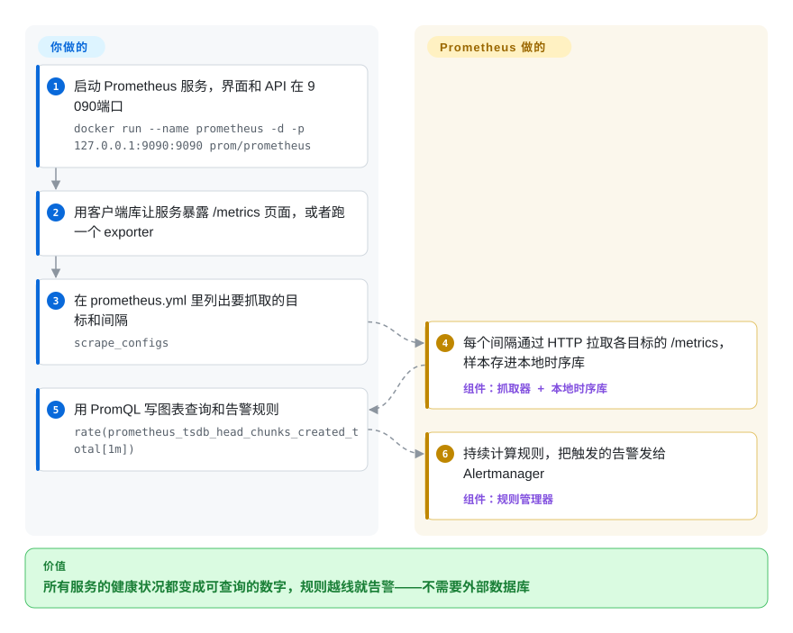

# Prometheus

结账服务变慢，你是从客户的吐槽里知道的，而不是有什么东西提醒你；回头去查，也没人说得清错误率是在发版之前还是之后涨起来的。Prometheus 每隔几秒去拉一遍每个服务的 `/metrics` 页面，把数字存进自带的时序数据库，让你用同一门查询语言画图、设告警。

## 何时使用

你刚接手一个 Kubernetes 集群的值班，上面跑着十来个服务。还没有任何指标系统——只有 `kubectl top` 和翻日志——第一份事故复盘就抛来一个你答不上的问题：“故障前十分钟 `/checkout` 的 p99 延迟是多少？它跟 14:02 那次发版有没有关系？”你需要按服务、按 Pod、按接口的请求速率、错误比例和延迟分布，保留几周，并且在错误比例连续五分钟超过 2% 时把人叫起来。

这正是 Prometheus 的主场，它是这件事的事实标准：Kubernetes 组件、数据库和大多数云原生软件本来就以它的文本格式暴露指标，主流语言都有客户端库，一台带本地盘的服务器就能抓取并存储——不用另外跑数据库。你选它而不选 InfluxDB 或 Graphite，是因为标签（`service`、`pod`、`status`）加上 PromQL，让“按服务算错误比例”变成一行查询；不选托管 SaaS，是因为数据、告警规则和成本都留在你自己手里。

## 怎么用起来

Prometheus 靠**拉取**干活。每个服务暴露一个纯文本的 `/metrics` 页面，列出当前的计数器和仪表值，每个值都带着标签，比如 `{service="checkout", status="500"}`；每个抓取间隔（示例配置里是 15 秒），Prometheus 服务器通过 HTTP 把这些页面取回来，把数值作为带时间戳的样本追加进内置的 **TSDB**——一个放在本地盘上的时序数据库，默认保留 15 天。抓取目标来自 `prometheus.yml` 里的静态列表，或者来自服务发现（Kubernetes、Consul、云厂商 API），所以新起的 Pod 会被自动纳入。你用 **PromQL** 提问——一门针对这些带标签序列的查询语言（`rate(...)`、`sum by (service)`、`histogram_quantile(...)`），在自带界面或 Grafana 里都能用；同样的表达式写成规则就会被持续计算，触发的告警交给独立的 **Alertmanager**，由它去重并路由到 Slack、PagerDuty 或邮件。它就像按时挨家挨户抄表的抄表员，而不是坐等各家打电话报数。**Prometheus 替你做的**：发现目标、抓取、存储、查询、计算规则。**你要做的**：给代码埋点（主机这类改不了代码的东西就部署 node_exporter 等 exporter）、写抓取配置、告警规则和看板，以及运行 Alertmanager。

<!-- flow-steps:begin (generated from flows/prometheus.json by tools/flow_card.py — do not edit) -->

流程文字版

1. **你**：启动 Prometheus 服务，界面和 API 在 9090 端口 — `docker run --name prometheus -d -p 127.0.0.1:9090:9090 prom/prometheus`
2. **你**：用客户端库让服务暴露 /metrics 页面，或者跑一个 exporter
3. **你**：在 prometheus.yml 里列出要抓取的目标和间隔 — `scrape_configs`
4. **Prometheus**：每个间隔通过 HTTP 拉取各目标的 /metrics，样本存进本地时序库 — 组件：`抓取器 + 本地时序库`
5. **你**：用 PromQL 写图表查询和告警规则 — `rate(prometheus_tsdb_head_chunks_created_total[1m])`
6. **Prometheus**：持续计算规则，把触发的告警发给 Alertmanager — 组件：`规则管理器`

**价值**：所有服务的健康状况都变成可查询的数字，规则越线就告警——不需要外部数据库

<!-- flow-steps:end -->

## 何时不用

- **你开箱就需要长期、高可用或全局的存储。**上游文档写明本地存储“没有集群也没有副本”，可扩展性和持久性都受限于单个节点。需要几个月到几年的保留期、高可用，或者跨集群的全局查询时，请加一个 remote-write 后端，比如 Thanos、Grafana Mimir 或 VictoriaMetrics——或者直接把它们当主存储。
- **你的数据是事件或高基数标识，而不是聚合值。**每一种不同的标签组合都是一条新序列，常驻内存；按用户 ID、请求 ID 或完整 URL 路径打标签会把内存吃光。逐请求的细节应该进日志（[Loki](loki.zh.md)）或链路（[Jaeger](jaeger.zh.md)）；要对原始事件做分析查询，请用 [ClickHouse](../databases/database-engines/clickhouse.zh.md) 这类列式库。
- **你需要逐条精确的数字——计费、审计计数。**抓取是按间隔采样当时的状态，`rate()` 还会做外推；进程崩溃和下一次抓取之间的计数增量可能丢失。必须精确对账的数字请用事务型数据库或事件日志。
- **你的数据源没法被抓取。**短命的批处理任务、NAT 后面的设备、Serverless 函数都没有一个稳定的 `/metrics` 地址可拉。批处理任务可以用 Pushgateway；其他情况就推送 OTLP 或 remote-write（Prometheus 可以用 `--web.enable-otlp-receiver` / `--web.enable-remote-write-receiver` 接收），或者用 [OpenTelemetry Collector](opentelemetry-collector.zh.md)、[Telegraf](../dev-utilities/ops-infra/telegraf.zh.md) 这类面向推送的采集器，接一个原生支持推送的存储。
- **你只要日志、看板或一个开箱即用的产品。**Prometheus 只有一个简单的查询界面，不存日志，告警*投递*在独立的 Alertmanager 里。看板请用 [Grafana](grafana.zh.md)；想要指标、日志、链路一张账单全包，托管的可观测性 SaaS 运维更省事。

## 横向对比

| 替代品 | 是否收录 | 我们的评价 | 取舍 |
|---|---|---|---|
| VictoriaMetrics | 未收录 | 单个 Prometheus 内存或磁盘不够用、又想要一个资源更省、仍兼容 PromQL 风格查询和 remote-write 的直接替换时，选 VictoriaMetrics；一个节点加 15–90 天保留期还够用时，留在 Prometheus。 | 每条序列占的内存和磁盘更少，自带集群模式；但它是单一厂商项目，MetricsQL 和 PromQL 有细微差别。 |
| Thanos / Grafana Mimir | 未收录 | 需要高可用、在对象存储里保留数年、或跨多个集群统一查询时，在 Prometheus 后面接 Thanos 或 Mimir；单台服务器能满足保留期和可用性要求时就别加。 | 它们用对象存储和好几个额外服务换来持久性和全局视图；只用 Prometheus 则始终是一个二进制。 |
| InfluxDB | 未收录 | 数据是设备或应用主动推送、想要 SQL 或行协议写入时，选 InfluxDB；监控云原生服务、依赖 Kubernetes 的 exporter 生态时，选 Prometheus。 | InfluxDB 更自然地处理推送和较高基数的数据；Prometheus 的 exporter 生态更大，也是大多数 Kubernetes 工具默认假设的告警模型。 |
| [OpenTelemetry Collector](opentelemetry-collector.zh.md) | ✅ | 互补关系，不是存储：用 Collector 接收应用发来的 OTLP 指标再转给 Prometheus（或别处）；它不能查询也不能告警。 | 让埋点不绑厂商，代价是多一个管线组件；存储、PromQL 和规则仍由 Prometheus 负责。 |
| [Grafana](grafana.zh.md) | ✅ | 互补关系：Grafana 是大多数 Prometheus 用户加在上面的看板层；它替代不了抓取和 TSDB。 | 看板和跨数据源关联远比 Prometheus 自带界面丰富；代价是多运维一个服务。 |

## 技术栈

- **语言：**Go 写的服务器和 `promtool` 命令行工具；网页界面是编进二进制的 React 应用（从源码构建还需要 Node.js/npm）。
- **存储：**内嵌的本地 TSDB，带预写日志（WAL），按 2 小时一块压实；默认保留 15 天（`--storage.tsdb.retention.time`）。
- **查询语言：**PromQL；记录规则和告警规则都是写在 YAML 规则文件里的 PromQL 表达式。
- **接口：**按 Prometheus/OpenMetrics 文本格式拉取抓取；Remote Write（1.0 稳定规范和 2.0 规范）发送端，以及可选的接收端；可选的 OTLP 接收端；HTTP 查询 API。
- **运行模式：**完整服务器，或者**agent 模式**（只抓取和 remote-write，不能在本地查询），适合边缘集群。

## 依赖

- **运行时：**一个静态二进制或 `prom/prometheus` 镜像；不需要外部数据库。需要本地 POSIX 文件系统（文档明确不支持 NFS，包括 AWS EFS），容量按保留期 × 写入速率估算。
- **Alertmanager**（独立仓库、独立进程）负责投递告警；没有它，规则照样计算，但不会通知任何人。
- **Exporter 与埋点：**代码里用客户端库，加上 node_exporter、blackbox_exporter、各种数据库 exporter，覆盖你改不了代码的东西。
- **可选：**Grafana 做看板；remote-write 后端（Thanos、Mimir、VictoriaMetrics 或 SaaS）做长期或高可用存储；Kubernetes 上的 Prometheus Operator / kube-prometheus-stack（独立项目）。

## 运维难度

**单台服务器时低，随规模上升。**用一个配置文件跑一台 Prometheus 很容易，而且就算它和外界的网络断了也照常工作——这是刻意的设计。功夫在后面：容量规划（内存随活跃序列数增长，所以基数评审会变成例行工作）、保留期与磁盘的配比、告警高可用要跑两台一模一样的服务器（因为没有内置复制）、把抓取负载分片到多台服务器，以及在想要长期保留或全局视图时接一个 remote-write 后端。发版节奏是每 6 周一个小版本，另有给升级慢的团队准备的 LTS 线（v3.5）；从 2.x 到 3.0 有不向后兼容的改动（PromQL 范围选择器语义、UTF-8 指标名、移除的特性开关、新界面），跨大版本升级前先读迁移指南。

## 健康度与可持续性

- **维护（截至 2026-10-08）：**非常活跃——上个季度每周都有提交，2026-09-25 发布 v3.15.0，2026-10-02 发布 v3.13.4，按成文的 6 周小版本计划走，每个版本有指定的发版负责人。
- **治理与背书：****CNCF 毕业**项目，维护者来自多家公司、规模很大（过去 12 个月 114 位活跃维护者，前三名占比约 45%）；没有哪一家厂商拥有它。
- **年龄与 Lindy（2012-11 创建，约 13.9 年）：**最早的一批云原生项目之一，至今每隔几周就发版——是本类目里最强的 Lindy 先验。
- **响应速度：**快——新 issue 首次响应中位数 24.3 小时。
- **采用：**Kubernetes 和大多数云原生软件暴露指标用的就是它的格式；exporter 和客户端库生态极大；它也被当作库来引用（雷达的采用轴统计到上个月 742,640 次模块下载，外加 Homebrew 和 release 下载量）。
- **风险信号：**Apache-2.0，没有改许可的历史。实际风险在规模而不在存续：单节点存储意味着你迟早要为长期或高可用指标再加一套系统。

## 存疑（未验证）

- [未验证] Star 数（约 66.4k）、版本号和日期取自 2026-10-08 的 GitHub API。
- [未验证] v3.13.4 为什么在 v3.15.0 之后发布（一条仍受支持的旧版本线）没有核实；发版计划表里只把 v3.5 标为 LTS。
- [未验证] “CNCF 毕业”来自项目广为人知的 CNCF 历史，这次同步没有去 CNCF 网站复核；README 只写了“a Cloud Native Computing Foundation project”。
- [推断] 每条序列占多少内存、一台服务器在什么时候“不够用”，很大程度取决于抓取间隔、序列更替和查询负载；没有统一公布的上限。
- [推断] 对比表里 VictoriaMetrics、Thanos、Mimir、InfluxDB 的特点基于它们的一般定位，没有为本页重新读它们的仓库。
