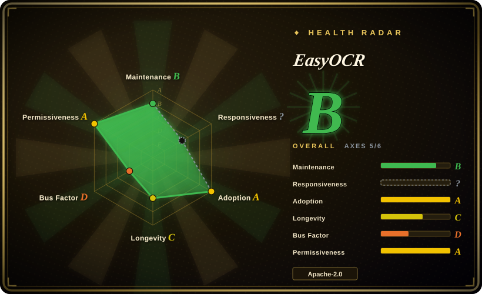
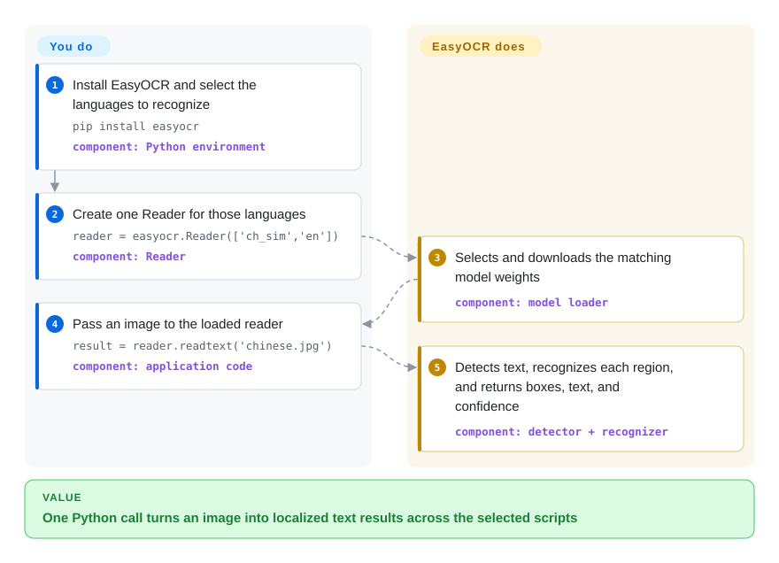

# EasyOCR

A ready-to-use Python OCR library that combines text detection and recognition for 80+ languages, returning text, confidence scores, and bounding boxes from images.

## When to use

You are adding OCR to a Python image-processing service and the inputs are phone photos, signs, labels, or other scene text rather than uniformly scanned pages. You want one importable API to locate text regions and recognize multiple writing systems, with downloadable pretrained models and optional GPU acceleration. Choose EasyOCR when this compact PyTorch detection-plus-recognition path matters more than Tesseract's lighter mature CPU stack or PaddleOCR's broader document-layout toolkit.

It is a practical fit for prototypes and bounded production workloads where bounding boxes and confidence values are enough downstream. The tradeoff is a larger ML runtime, model downloads, and an upstream that has drifted behind current dependency and contributor activity.

## How it works

You install the Python package and construct a `Reader` with the language codes your workload needs. On first use, EasyOCR downloads the matching detection and recognition weights unless you provide them locally, then keeps the loaded models in memory. Your code passes a file path, byte stream, URL, or NumPy image to `readtext`; EasyOCR detects text regions, recognizes each crop with the selected script model, and returns bounding boxes, text, and confidence values. You own input normalization, language selection, model storage, batching, process lifetime, and result validation; EasyOCR owns weight selection, detection, recognition, and output assembly.

<!-- flow-steps:begin (generated from flows/easyocr.json by tools/flow_card.py — do not edit) -->

Text version of the flow

1. **You**: Install EasyOCR and select the languages to recognize — `pip install easyocr` — component: `Python environment`
2. **You**: Create one Reader for those languages — `reader = easyocr.Reader(['ch_sim','en'])` — component: `Reader`
3. **EasyOCR**: Selects and downloads the matching model weights — component: `model loader`
4. **You**: Pass an image to the loaded reader — `result = reader.readtext('chinese.jpg')` — component: `application code`
5. **EasyOCR**: Detects text, recognizes each region, and returns boxes, text, and confidence — component: `detector + recognizer`

**Value**: One Python call turns an image into localized text results across the selected scripts

<!-- flow-steps:end -->

## When NOT to use

- **You need actively maintained document parsing, tables, formulas, or reading order.** Choose [PaddleOCR](paddleocr.md) or [Docling](../document-parsing/docling.md); EasyOCR returns OCR regions and text but is not a structured-document pipeline, and its upstream has not merged code since 2024-07.
- **You need a small, long-lived CPU dependency for clean printed scans.** Choose [Tesseract](tesseract.md); EasyOCR brings PyTorch, torchvision, OpenCV, SciPy, model weights, and materially more memory and packaging surface.
- **You need current framework compatibility and prompt upstream fixes.** Choose docTR or [PaddleOCR](paddleocr.md), both of which had default-branch activity in 2026; EasyOCR's v1.7.2 release dates to 2024-09 and compatibility PRs remained open in the 2026-09 snapshot.
- **You need forms, key-value pairs, or managed extraction without operating models.** Choose AWS Textract or Google Cloud Vision; they add service cost and data-boundary concerns but provide managed APIs beyond raw OCR tuples.
- **You need handwriting as a declared supported capability.** Choose a handwriting-focused recognizer or benchmark PaddleOCR; EasyOCR's README still lists handwritten-text support under its future roadmap.

## Comparison

| Alternative | In index | Our verdict | Tradeoff |
|---|---|---|---|
| [Tesseract](tesseract.md) | ✅ | Choose EasyOCR for Python-first scene-text detection across multiple scripts with GPU acceleration; choose Tesseract for clean document scans where mature CPU deployment and lower dependency weight decide the choice. | EasyOCR bundles pretrained neural detection and recognition, but pays with PyTorch/model overhead and weaker maintenance recency. |
| [PaddleOCR](paddleocr.md) | ✅ | Choose PaddleOCR when document layout, tables, a larger current model family, and active development matter; choose EasyOCR when a smaller `Reader.readtext` integration is the main constraint and its existing models pass your benchmark. | PaddleOCR offers a broader end-to-end document toolkit but introduces the PaddlePaddle ecosystem and a larger configuration surface. |
| docTR | not indexed | Choose docTR when you want a currently maintained Python detection-plus-recognition library with PyTorch or TensorFlow model choices; choose EasyOCR when its language/script coverage and minimal API fit better. | docTR is active and document-oriented; EasyOCR has a simpler entry point and broad packaged language data, but its upstream is drifting. |
| Google Cloud Vision | not a repo | Choose Cloud Vision when a managed API and provider-operated models outweigh data residency, recurring cost, and vendor dependence; choose EasyOCR for offline self-hosting and inspectable Apache-2.0 code. | Cloud Vision is a hosted Google Cloud service, not an open-source repository; it removes model operations but sends inputs across a service boundary. |
| AWS Textract | not a repo | Choose Textract for managed forms, tables, queries, and document-centric extraction; choose EasyOCR when local image-to-text regions are enough and AWS coupling is unacceptable. | Textract is a hosted AWS service, not an open-source repository; richer document semantics come with per-use pricing and an external data boundary. |

## Tech stack

- **Language and API:** Python package centered on `easyocr.Reader`, with `readtext`, separate detection/recognition calls, batched input support, and an `easyocr` CLI.
- **Execution:** PyTorch and torchvision, using CUDA when available, Apple MPS when available, and CPU fallback with dynamic quantization enabled by default.
- **Detection:** CRAFT is the default text detector; DBNet18 is an alternative detector exposed by the reader.
- **Recognition:** CRNN-style recognition combines ResNet or VGG feature extraction, LSTM sequence modeling, and CTC decoding; script-specific generation-one and generation-two weight sets are selected from requested languages.
- **Image geometry:** OpenCV, Pillow, NumPy, scikit-image, Shapely, and pyclipper handle image input and text-region transformations.

## Dependencies

- **Python packages:** `torch`, `torchvision>=0.5`, `opencv-python-headless`, SciPy, NumPy, Pillow, scikit-image, `python-bidi`, PyYAML, Shapely, pyclipper, and Ninja, as declared in `requirements.txt` on 2026-09-22.
- **Model artifacts:** detection and recognition weights are downloaded from GitHub Releases into the EasyOCR model directory by default; locked-down deployments must pre-stage them and can disable downloads.
- **Hardware:** CPU inference is supported; CUDA or Apple MPS can accelerate inference, while GPU deployment adds the corresponding PyTorch/CUDA compatibility surface.
- **No service or datastore:** inference can run locally after package and model installation, without a database or per-call network API.

## Ops difficulty

**Low-to-medium for a single process; medium at production scale.** [推断] There is no server or datastore to operate, but images, PyTorch, native image libraries, downloadable weights, and optional CUDA make packaging heavier than Tesseract. Long-lived services should load each `Reader` once, bound image dimensions and batch sizes, cache/version model artifacts, monitor latency and memory, and validate confidence thresholds against their own corpus. The maintenance gap raises the chance that teams must carry dependency-compatibility patches themselves.

## Health & viability

- **Maintenance:** Grade B only after the scorer's mature-library Lindy carve-out lifted raw C: the last default-branch commit was 291 days old and activity covered 0 of the prior 13 weeks. That commit was a README edit on 2025-12-05; the last merged code PR was 2024-07-25 and the latest release was v1.7.2 on 2024-09-24. This is drifting rather than quiet-but-stable because open 2025–2026 compatibility and device-support PRs have not reached a release. [推断]
- **Responsiveness:** Cannot be scored — traffic existed, but the sampled window contained no qualifying issue or PR response (`no_window_signal`). This unknown is not evidence of good responsiveness; 55 PRs were open in the 2026-09-22 API snapshot.
- **Adoption:** Grade A — the `easyocr` PyPI package measured 2,090,951 downloads in the last month and 671 dependent repositories; the GitHub repository also had 30,017 stars on 2026-09-22.
- **Longevity:** Grade C — the repository was 2,383 days old with its last commit 291 days old. Six years of survival is real, but age without current code integration is a weak Lindy signal. [推断]
- **Governance:** Grade D — the scorer found 1 active maintainer in the prior 12 months, responsible for 100% of measured contributions; organization ownership does not remove this current bus-factor concentration.
- **Risk / License:** Grade A — the repository ships an Apache-2.0 license, GitHub reports the same SPDX identifier, and the scorer found no relicense in the prior 36 months. The main selection risk is technical drift, not license restriction.

## Caveats (unverified)

- [推断] “Low-to-medium” single-process and “medium” production operations difficulty is an architectural judgment from the dependency, model, memory, and hardware surface, not a measured deployment benchmark.
- [推断] “Drifting” is the maintenance verdict from commit, release, and PR-integration history; it does not prove that the existing v1.7.2 models are unusable.
- [推断] The weak Lindy verdict combines repository age with the lack of recent merged code and releases; it is a selection prior, not a prediction of future maintenance.
- [未验证] OCR accuracy, latency, confidence calibration, memory use, and language quality were not benchmarked on a target corpus; compare EasyOCR, PaddleOCR, docTR, and Tesseract on representative inputs.
