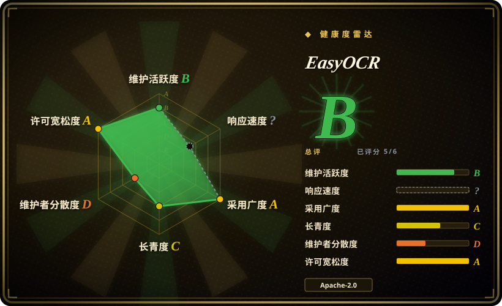
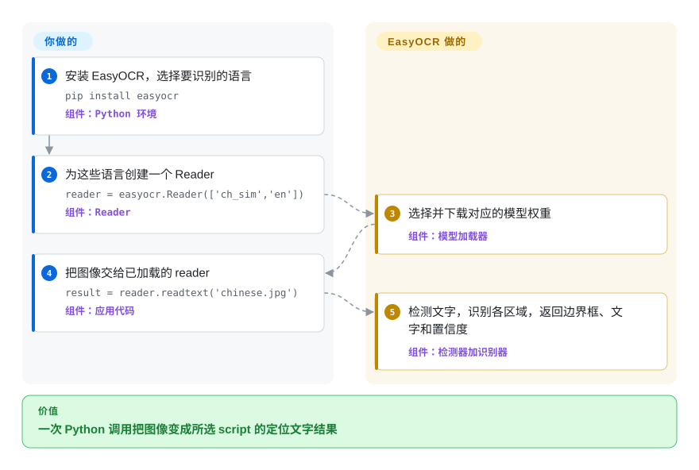

# EasyOCR

一个开箱即用的 Python OCR library：组合文字检测与识别，覆盖 80 多种语言，并从图像返回文字、置信度和边界框。

## 何时使用

你在给 Python 图像处理服务增加 OCR，输入是手机照片、招牌、标签或其他场景文字，而不是格式统一的扫描页。你想用一套可导入 API 定位文字区域并识别多种书写系统，同时使用可下载的预训练模型和可选 GPU 加速。当紧凑的 PyTorch 检测加识别路径比 Tesseract 更轻、更成熟的 CPU 栈，或 PaddleOCR 更广的文档布局工具链更重要时，选 EasyOCR。

它适合原型和边界明确的生产负载，下游只需边界框与置信度即可。代价是更大的机器学习运行时、模型下载，以及已经落后于当前依赖与贡献活动的上游。

## 怎么用起来

你安装 Python package，再用工作负载所需的语言代码构造 `Reader`。首次使用时，除非你已在本地提供模型，EasyOCR 会下载对应的检测与识别权重，并把加载后的模型留在内存中。你的代码把文件路径、字节流、URL 或 NumPy 图像交给 `readtext`；EasyOCR 检测文字区域，用所选 script model 识别每个裁剪块，再返回边界框、文字和置信度。输入归一化、语言选择、模型存储、batch、进程生命周期和结果验证由你负责；权重选择、检测、识别和输出组装由 EasyOCR 负责。

<!-- flow-steps:begin (generated from flows/easyocr.json by tools/flow_card.py — do not edit) -->

流程文字版

1. **你**：安装 EasyOCR，选择要识别的语言 — `pip install easyocr` — 组件：`Python 环境`
2. **你**：为这些语言创建一个 Reader — `reader = easyocr.Reader(['ch_sim','en'])` — 组件：`Reader`
3. **EasyOCR**：选择并下载对应的模型权重 — 组件：`模型加载器`
4. **你**：把图像交给已加载的 reader — `result = reader.readtext('chinese.jpg')` — 组件：`应用代码`
5. **EasyOCR**：检测文字，识别各区域，返回边界框、文字和置信度 — 组件：`检测器加识别器`

**价值**：一次 Python 调用把图像变成所选 script 的定位文字结果

<!-- flow-steps:end -->

## 何时不用

- **你需要仍在活跃维护的文档解析、表格、公式或阅读顺序能力。** 选 [PaddleOCR](paddleocr.zh.md) 或 [Docling](../document-parsing/docling.zh.md)；EasyOCR 返回 OCR 区域和文字，不是结构化文档流水线，而且上游从 2024-07 后没有再合并代码。
- **你需要适合干净印刷扫描件的小型、长寿命 CPU 依赖。** 选 [Tesseract](tesseract.zh.md)；EasyOCR 带来 PyTorch、torchvision、OpenCV、SciPy、模型权重，以及明显更大的内存与打包表面。
- **你需要当前 framework 兼容性和及时的上游修复。** 选 docTR 或 [PaddleOCR](paddleocr.zh.md)，两者在 2026 年仍有默认分支活动；EasyOCR 最新 v1.7.2 发布于 2024-09，兼容性 PR 在 2026-09 快照中仍未合并。
- **你需要表单、键值对或无需自行运维模型的托管抽取。** 选 AWS Textract 或 Google Cloud Vision；它们增加服务成本和数据边界顾虑，但提供了超出原始 OCR tuple 的托管 API。
- **你需要明确声明支持手写文字。** 选专门的手写识别器，或实测 PaddleOCR；EasyOCR README 仍把手写文字支持列在未来 roadmap 中。

## 横向对比

| 替代品 | 是否收录 | 我们的评价 | 取舍 |
|---|---|---|---|
| [Tesseract](tesseract.zh.md) | ✅ | Python-first 场景文字检测、多 script 和 GPU 加速更重要时选 EasyOCR；干净文档扫描更看重成熟 CPU 部署和更轻依赖时选 Tesseract。 | EasyOCR 自带预训练神经网络检测与识别，但代价是 PyTorch 与模型开销，以及更弱的维护新鲜度。 |
| [PaddleOCR](paddleocr.zh.md) | ✅ | 文档布局、表格、更大的当前模型族和活跃开发更重要时选 PaddleOCR；主要约束是更小的 `Reader.readtext` 集成，且既有模型通过你的基准时选 EasyOCR。 | PaddleOCR 提供更广的端到端文档工具链，但引入 PaddlePaddle 生态和更大的配置表面。 |
| docTR | 未收录 | 需要当前仍维护、可选 PyTorch 或 TensorFlow 模型的 Python 检测加识别 library 时选 docTR；更看重 EasyOCR 的语言、script 覆盖和极简 API 时选 EasyOCR。 | docTR 活跃且面向文档；EasyOCR 入口更简单，打包的语言数据更广，但上游正在漂移。 |
| Google Cloud Vision | 非仓库 | 托管 API 与 provider 运维模型的收益大于数据驻留、持续费用和 vendor 依赖时选 Cloud Vision；需要离线自托管和可检查的 Apache-2.0 代码时选 EasyOCR。 | Cloud Vision 是 Google Cloud 托管服务，不是开源仓库；它移除模型运维，却让输入跨越服务边界。 |
| AWS Textract | 非仓库 | 需要托管表单、表格、query 和面向文档的抽取时选 Textract；本地图像转文字区域已足够，且不能接受 AWS 耦合时选 EasyOCR。 | Textract 是 AWS 托管服务，不是开源仓库；更丰富的文档语义伴随按量计费和外部数据边界。 |

## 技术栈

- **语言与 API：** Python package，以 `easyocr.Reader` 为中心，提供 `readtext`、独立检测与识别调用、batch 输入支持，以及 `easyocr` CLI。
- **执行：** PyTorch 与 torchvision；有 CUDA 时用 CUDA，有 Apple MPS 时用 MPS，否则回退到 CPU，CPU 默认启用动态量化。
- **检测：** CRAFT 是默认文字检测器；reader 也暴露 DBNet18 作为替代检测器。
- **识别：** CRNN 风格识别组合 ResNet 或 VGG 特征抽取、LSTM 序列建模与 CTC decoding；根据请求语言选择各 script 的第一代或第二代权重。
- **图像几何：** OpenCV、Pillow、NumPy、scikit-image、Shapely 和 pyclipper 处理图像输入与文字区域变换。

## 依赖

- **Python package：** 截至 2026-09-22，`requirements.txt` 声明 `torch`、`torchvision>=0.5`、`opencv-python-headless`、SciPy、NumPy、Pillow、scikit-image、`python-bidi`、PyYAML、Shapely、pyclipper 和 Ninja。
- **模型产物：** 检测与识别权重默认从 GitHub Releases 下载到 EasyOCR 模型目录；封闭网络部署必须提前放置权重，并可关闭下载。
- **硬件：** 支持 CPU inference；CUDA 或 Apple MPS 可加速 inference，而 GPU 部署会增加对应的 PyTorch/CUDA 兼容性表面。
- **无需服务或数据存储：** package 与模型安装完成后可本地 inference，不需要数据库或逐次调用网络 API。

## 运维难度

**单进程低到中，生产规模为中等。** [推断] 无需运维 server 或数据存储，但图像、PyTorch、native image library、可下载权重和可选 CUDA 让打包比 Tesseract 更重。长驻服务应只加载一次每个 `Reader`，限制图像尺寸与 batch，缓存并版本化模型产物，监控延迟与内存，并用自己的语料验证置信度阈值。维护缺口也提高了团队自行携带依赖兼容性补丁的概率。

## 健康度与可持续性

- **维护：** Grade B 只来自 scorer 的成熟 library Lindy carve-out 把原始 C 上调：最近一次默认分支提交距评分 291 天，之前 13 周的活跃周数为 0。该提交是 2025-12-05 的 README 修改；最近一次合并代码 PR 是 2024-07-25，最新 release 是 2024-09-24 的 v1.7.2。它是在漂移，而不是安静但稳定，因为 2025 至 2026 年提交的兼容性和设备支持 PR 尚未进入 release。[推断]
- **响应速度：** 无法评分——存在 traffic，但抽样窗口没有可计分的 issue 或 PR 响应（`no_window_signal`）。未知不代表响应良好；2026-09-22 的 API 快照中有 55 个 open PR。
- **采用广度：** Grade A——`easyocr` PyPI package 上月下载量为 2,090,951，依赖仓库数为 671；2026-09-22 时 GitHub 仓库另有 30,017 stars。
- **长青度：** Grade C——仓库已创建 2,383 天，最近提交距评分 291 天。六年存续是真实信号，但缺少当前代码整合时，年龄只能提供较弱 Lindy 信号。[推断]
- **治理集中度：** Grade D——scorer 在过去 12 个月测得 1 名活跃维护者，承担 100% 的所测贡献；organization ownership 没有消除当前 bus factor 集中。
- **风险与许可：** Grade A——仓库附带 Apache-2.0 license，GitHub 报告相同 SPDX identifier，scorer 在过去 36 个月未发现 relicense。主要选型风险是技术漂移，而不是许可限制。

## 存疑（未验证）

- [推断]“单进程低到中，生产规模为中等”的运维难度来自依赖、模型、内存和硬件表面的架构判断，并非部署实测。
- [推断]“漂移”是基于 commit、release 与 PR 整合历史的维护判断；它不等于现有 v1.7.2 模型不可用。
- [推断] 较弱 Lindy 判断结合了仓库年龄与近期没有代码合并、没有 release 的情况；它是选型先验，不是未来维护预测。
- [未验证] 未在目标语料上实测 OCR 准确率、延迟、置信度校准、内存占用和各语言质量；应使用代表性输入对比 EasyOCR、PaddleOCR、docTR 与 Tesseract。
