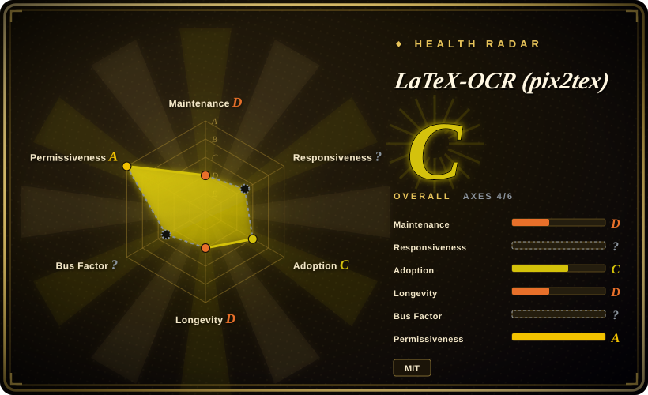
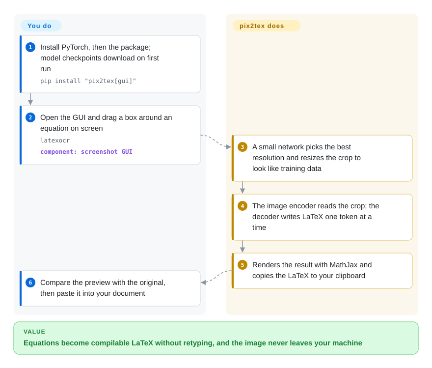

# LaTeX-OCR (pix2tex)

A ViT-encoder + Transformer-decoder model that turns an image of a math equation into the LaTeX source that produces it — shipped as a Python library plus a CLI (`pix2tex`), a screenshot GUI (`latexocr`), and a small REST/Streamlit API.

## When to use

You're a grad student or researcher writing up a paper in LaTeX, and your reference material is full of equations trapped in PDFs, lecture-slide screenshots, and scanned textbook pages. Re-typing a three-line aligned derivation or a messy summation by hand is slow and error-prone, and a general OCR engine just gives you garbled text because it has no idea what `\frac` or `\sum_{i=1}^{n}` mean. You install `pix2tex`, launch the GUI, drag a selection box over the equation on screen, and it hands you back compilable LaTeX you paste straight into your document — with a live MathJax preview so you can eyeball the result before trusting it. For a batch of cropped equation images you skip the GUI and call the `pix2tex` CLI or the Python API from a script.

You reach for it specifically when the unit of work is *a math equation, already cropped or croppable*, and the output you want is *LaTeX source*, not prose. It runs locally on your own machine (CPU or GPU), so equations from unpublished or sensitive material never leave your laptop, and the MIT license means you can wire the library into your own note-taking or document tooling without a per-call cloud bill.

## How it works

pix2tex is a trained model plus thin front-ends around it, not a rules-based parser. When you hand it a picture, a small preprocessing network first guesses the best resolution and rescales the crop so it resembles the rendered equations the model was trained on; then a ViT encoder (a Transformer that reads an image as a grid of patches) turns the picture into features, and a Transformer decoder writes the LaTeX out one token — one piece of LaTeX syntax such as `\frac` or `{` — at a time, picking the most likely next piece. **The model, the weights download and the resizing are done for you; you supply a tight crop of one equation and check the answer** against the MathJax preview, because the output is a best guess, not a guarantee. The GUI (`latexocr`) is the screenshot-and-paste path; the same model is reachable as the `pix2tex` CLI for files and clipboard images, as `LatexOCR()` from Python, or as a small HTTP API for scripted batches.

<!-- flow-steps:begin (generated from flows/latex-ocr.json by tools/flow_card.py — do not edit) -->

Text version of the flow

1. **You**: Install PyTorch, then the package; model checkpoints download on first run — `pip install "pix2tex[gui]"`
2. **You**: Open the GUI and drag a box around an equation on screen — `latexocr` — component: `screenshot GUI`
3. **LaTeX-OCR (pix2tex)**: A small network picks the best resolution and resizes the crop to look like training data
4. **LaTeX-OCR (pix2tex)**: The image encoder reads the crop; the decoder writes LaTeX one token at a time
5. **LaTeX-OCR (pix2tex)**: Renders the result with MathJax and copies the LaTeX to your clipboard
6. **You**: Compare the preview with the original, then paste it into your document

**Value**: Equations become compilable LaTeX without retyping, and the image never leaves your machine

<!-- flow-steps:end -->

## When NOT to use

- **You need general document OCR, not just math.** This is the sharp edge: pix2tex recognizes *equations only*. For body text, scanned pages, tables, or mixed documents use a general OCR engine like [Tesseract](tesseract.md) or a cloud OCR/Vision service — pix2tex will not transcribe ordinary prose for you.
- **Handwriting, complex multiline blocks, or large matrices.** It is trained primarily on rendered/printed math; handwritten equations, big `align`/`cases` blocks, and dense matrices are where accuracy falls off and you'll spend more time fixing output than typing it.
- **You can't tolerate an accuracy ceiling / always-verify workflow.** It is a model, not a parser: it produces a *most-likely* LaTeX string, not a guaranteed-correct one (the project's own reported token accuracy is ~0.60, BLEU ~0.88). [未验证] Subtly wrong subscripts, delimiters, or operators are common — every output needs a human glance against a rendered preview.
- **You're betting on long-term maintenance.** It is a single-author project that has been **coasting** (last commit 2025-01-18 — about 1.7 years idle as of 2026-10-08). Issues and PRs accumulate; don't assume new features or active triage.
- **A modern VLM may already beat it.** General multimodal models (GPT-4o, Qwen-VL, Gemini, and similar) can transcribe equations to LaTeX zero-shot and often handle messier input and surrounding context better; if you already pay for one, a dedicated model may not be worth the extra dependency.

## Comparison

| Alternative | In index | Our verdict | Tradeoff |
|---|---|---|---|
| [Tesseract](tesseract.md) | ✅ | Treat Tesseract as complementary: use it for general printed-text OCR in documents, and pix2tex only for cropped math equations that must become LaTeX. | General-purpose printed-text OCR — the opposite job: great for prose/documents, but has **no math notation understanding** and won't emit LaTeX. Pair them (Tesseract for text, pix2tex for the equations), don't substitute one for the other. |
| Mathpix | 未收录 | Choose Mathpix when accuracy on handwriting, multiline equations, mobile capture, or document export outweighs SaaS cost and data residency; choose pix2tex when local MIT-licensed equation OCR is the constraint. | Commercial math-OCR service/API; generally the accuracy leader for math + handwriting + multiline, with mobile apps and document export — but it's a paid SaaS (per-call cost, data leaves your machine), not an MIT self-hostable repo. |
| texify | 未收录 | Choose texify when you want a more recently maintained open-source equation-to-LaTeX model; choose pix2tex only after benchmarking accuracy and accepting its coasting maintenance state. | Open-source equation-to-LaTeX model (VikParuchuri); a more recently-maintained direct alternative aimed at the same task — worth comparing on your data and on maintenance recency. |
| GPT-4o / Qwen-VL / Gemini (VLMs) | 未收录 | Choose a VLM when messy screenshots, surrounding context, or rapid model improvement matter more than a lightweight purpose-built local tool; choose pix2tex for offline, small-scope equation crops. | General vision-language models that transcribe equations to LaTeX zero-shot; stronger on messy/contextual input and actively improving, but heavier (API cost or large local weights) and not a purpose-built, lightweight equation tool. |

## Tech stack

- **Language:** Python (~97%), built on **PyTorch**.
- **Model:** a Vision Transformer (ViT) image encoder (with a ResNet-style backbone) feeding a Transformer **decoder** that autoregressively generates the LaTeX token sequence — an image-to-sequence ("pix2tex") architecture.
- **Interfaces:** `pix2tex` CLI for batch/scripted image→LaTeX; a Qt-based screenshot **GUI** (`latexocr`) with on-screen region capture and MathJax rendering; a small **REST API** plus a Streamlit demo; and the importable Python library for embedding.
- **Tokenizer / training:** ships a LaTeX tokenizer and training/evaluation scripts (dataset generation, BLEU / edit-distance / token-accuracy metrics) so the model can be retrained or fine-tuned.

## Dependencies

- **PyTorch** — the core runtime dependency; CPU works, a CUDA GPU is faster for inference and effectively required for (re)training.
- **Pretrained model weights** — downloaded separately on first run; you need the checkpoint, not just the code, to get predictions.
- **GUI extras** — the screenshot GUI pulls in Qt/PyQt plus a LaTeX/MathJax rendering path for the live preview; these are optional install extras you can skip for headless/CLI use.
- **No external service or datastore** — runs fully local once weights are present; no network call per inference, no DB.

## Ops difficulty

**Low-to-medium for use; medium for anything beyond.** As a library/CLI on one machine it's a `pip install` plus a one-time weights download — no service to run, no datastore, no cluster. It runs on CPU; a GPU mainly helps latency. The friction is elsewhere: input must be a reasonably tight crop of a single equation (you build or do the cropping), every result wants a human check against the rendered preview, and because the project is coasting you may hit dependency-pinning / install-rot issues over time on newer Python or PyTorch versions and have to resolve them yourself rather than wait for an upstream fix. [推断] Retraining or fine-tuning the model is a separate, GPU-bound, higher-effort exercise.

## Health & viability

- **Responsiveness**: Cannot be scored — no_traffic.
- **Maintenance (as of 2026-10-08):** **coasting.** Last commit 2025-01-18 — about 1.7 years idle; last release v0.0.31 in 2023-04; not archived, but no recent commits, and open issues (~158) accumulate without active triage. [未验证] Treat it as "works as-is," not "actively developed."
- **Governance / bus factor:** a **single-author** project (owner `lukas-blecher`, a personal User account, not an org or foundation). One-person bus factor — if the author stays away, there is no team or sponsor to pick it up. [推断]
- **Age & Lindy verdict:** created 2020-12 (~6 years old). The age gives it some Lindy weight *and* it's a genuinely useful, well-known tool in its niche — but Lindy only counts with **age × still-active**, and the "still-active" half is weak here. A long-lived but now-idle single-author repo is a *usable* bet, not a *durable* one.
- **Adoption / ecosystem:** ~16.5k stars and broad recognition as the go-to open-source equation-OCR repo; MIT license makes embedding it frictionless. [未验证] Real adoption in note-taking and academic tooling.
- **Risk flags:** the dominant risk is **relevance, not licensing** — general VLMs (GPT-4o/Qwen-VL/Gemini) and more actively-maintained alternatives (texify, Mathpix) are improving fast while this repo sits idle; the model's accuracy ceiling plus the maintenance gap is the real reason to re-evaluate before committing. No relicense history or open-core gating (clean MIT). [推断]

## Caveats (unverified)

- [未验证] ~16.6k GitHub stars, last commit 2025-01-18, ~158 open issues, latest release v0.0.31 (2023-04-13), created 2020-12-11 — per the repo/GitHub API as of 2026-10-08; star/issue counts are date-sensitive and indicative only.
- [未验证] "Coasting / ~1.7 yr idle" is inferred from the last-commit date; re-check the repo's recent commit and release activity before relying on it — a maintainer could resume.
- [未验证] Reported metrics (token accuracy ~0.60, BLEU ~0.88, normalized edit distance ~0.10) are the project's own self-reported numbers on its own test set, not a measurement on your inputs — benchmark on your real equations.
- [推断] The accuracy fall-off on handwriting, large multiline blocks, and matrices is inferred from the training-data emphasis on rendered/printed math and common reports, not a measured claim for your documents.
- [推断] ViT-encoder + ResNet backbone + Transformer-decoder architecture and the GUI/CLI/API/training-script feature set are described from the project's README and conventions; verify exact components and install extras against the current repo.
- [未验证] That modern VLMs (GPT-4o/Qwen-VL/Gemini) and texify outperform pix2tex on equation→LaTeX is a general expectation from their trajectory, not a head-to-head benchmark — compare on your own data.
