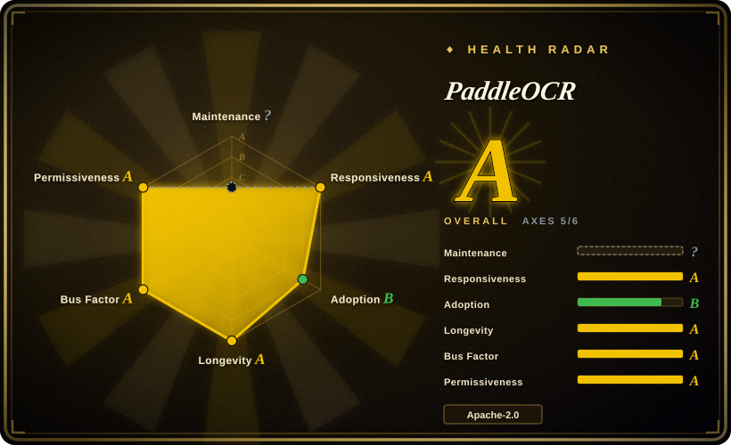
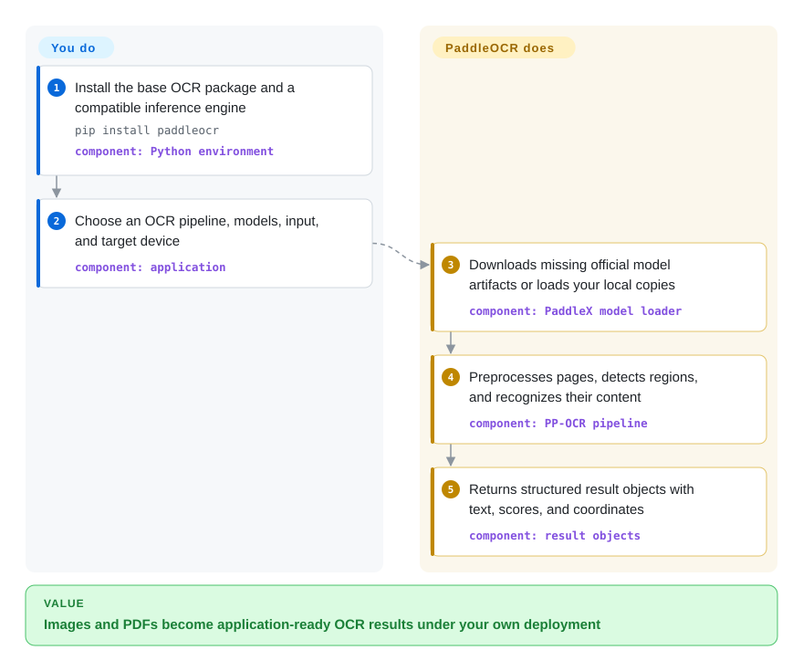

# PaddleOCR

A Python OCR and document-parsing toolkit whose PP-OCR pipelines detect and recognize text while PP-Structure and PaddleOCR-VL turn complex pages into structured outputs.

## When to use

You are building a self-hosted document ingestion or scene-text pipeline and need more than clean-page transcription: phone photos, multilingual text, rotated or warped pages, tables, formulas, seals, or reading order must feed coordinates, JSON, or Markdown into an application. Choose PaddleOCR when that broad, composable OCR-and-layout surface matters more than Tesseract's small CPU-native runtime or EasyOCR's simpler PyTorch detection-and-recognition API.

It is especially relevant when you want one project family for lightweight PP-OCR text spotting and heavier PP-Structure or vision-language document parsing. The deciding cost is the ML deployment surface: PaddleX and an inference engine, downloaded model artifacts, hardware/backend compatibility, and more pipeline configuration than a classic OCR engine.

## How it works

You install the base package for general OCR or an optional dependency group for document parsing, then choose a local inference engine and pipeline. On first use, PaddleOCR resolves the selected pretrained modules unless you point it at local model directories. The pipeline preprocesses the page, detects text or layout regions, runs the corresponding recognition modules, and returns structured result objects that your code can print or save. You own model choice, artifact caching, device/backend configuration, capacity, and result validation; PaddleOCR owns the packaged pipeline graph and module handoffs.

<!-- flow-steps:begin (generated from flows/paddleocr.json by tools/flow_card.py — do not edit) -->

Text version of the flow

1. **You**: Install the base OCR package and a compatible inference engine — `pip install paddleocr` — component: `Python environment`
2. **You**: Choose an OCR pipeline, models, input, and target device — component: `application`
3. **PaddleOCR**: Downloads missing official model artifacts or loads your local copies — component: `PaddleX model loader`
4. **PaddleOCR**: Preprocesses pages, detects regions, and recognizes their content — component: `PP-OCR pipeline`
5. **PaddleOCR**: Returns structured result objects with text, scores, and coordinates — component: `result objects`

**Value**: Images and PDFs become application-ready OCR results under your own deployment

<!-- flow-steps:end -->

## When NOT to use

- **You only need clean printed text with a small, stable CPU footprint.** Choose [Tesseract](tesseract.md); it avoids PaddleX, neural-model downloads, and inference-backend compatibility work.
- **You want the shortest PyTorch-first route to detection plus recognition.** Choose [EasyOCR](easyocr.md); its narrower API is easier to adopt when document layout, tables, formulas, and PaddleOCR's pipeline catalogue are unnecessary.
- **You need a transformer recognizer for already-cropped text lines or handwriting research.** Choose TrOCR; PaddleOCR is the better end-to-end pipeline, while TrOCR keeps the task at sequence recognition rather than page detection and structure parsing.
- **You cannot operate model artifacts or accelerator/runtime compatibility.** Choose Google Cloud Vision or AWS Textract if sending documents to a hosted API, recurring usage fees, and provider data-handling terms are acceptable.
- **You need accuracy claims you can accept without testing your own corpus.** Benchmark PaddleOCR against the actual languages, layouts, scan defects, and hardware; the repository's performance tables include project-run and in-house datasets and are not an independent guarantee.

## Comparison

| Alternative | In index | Our verdict | Tradeoff |
|---|---|---|---|
| [Tesseract](tesseract.md) | ✅ | Choose PaddleOCR for scene text, CJK-heavy inputs, or layout-aware document parsing; choose Tesseract for predictable clean print when a mature C++ CPU library and minimal runtime matter more. | PaddleOCR adds detection, recognition, preprocessing, and document-structure pipelines, but pays with Python/ML dependencies, model artifacts, and backend tuning. |
| [EasyOCR](easyocr.md) | ✅ | Choose EasyOCR for a compact PyTorch-first OCR API; choose PaddleOCR when tables, formulas, reading order, structured document output, or broader deployment paths justify the larger system. | EasyOCR is narrower and easier to explain; PaddleOCR covers more of the document pipeline but brings more packages, models, and configuration. |
| TrOCR | 未收录 | Choose TrOCR for transformer-based recognition of cropped text lines, especially handwriting experiments; choose PaddleOCR when the input is a full image or PDF that also needs detection and layout handling. | TrOCR offers a focused encoder-decoder model interface; PaddleOCR supplies an end-to-end pipeline and document modules at higher integration cost. |
| Google Cloud Vision | 非仓库 | Choose the hosted service when managed scaling and a cloud API outweigh self-hosting and data-residency control; choose PaddleOCR when models and document data must remain under your operation. | Cloud Vision is a hosted commercial API, not an open-source repository; it removes model serving work but adds network dependency, provider terms, and usage pricing. |
| AWS Textract | 非仓库 | Choose Textract for managed forms, tables, and AWS integration; choose PaddleOCR when open-source local execution and model-level control matter more than a managed service boundary. | Textract is a hosted AWS service, not a repository; it exchanges local control and portable deployment for managed document extraction. |

## Tech stack

- **Primary interface:** Python 3.8+ package and `paddleocr` CLI; optional capability groups cover document parsing, information extraction, translation, and office-document conversion.
- **Pipeline layer:** the package depends on PaddleX, with PP-OCR for detection and recognition and PP-StructureV3 for layout, tables, formulas, seals, charts, reading order, and Markdown/JSON-oriented results.
- **Inference engines:** local backends include Paddle static/dynamic inference, Transformers, and ONNX Runtime where supported; high-performance paths can involve OpenVINO or TensorRT.
- **Training and export:** repository training code and model export use PaddlePaddle and a broader computer-vision dependency set.
- **Deployment surface:** Python and CLI locally, plus C++ and service-oriented paths documented for other application languages and hardware targets.

## Dependencies

- **Base package:** `paddleocr` depends on `paddlex[ocr-core]`, PyYAML, Requests, aiohttp, and typing extensions; `doc-parser`, `ie`, `trans`, and `all` install larger PaddleX extras.
- **Inference engine:** the default local `paddle_static` route requires a compatible PaddlePaddle build. Transformers and ONNX Runtime are supported alternatives for applicable models, so PaddlePaddle is not mandatory for every inference path; training and export do require it.
- **Model artifacts:** official pretrained modules download when model directories are not supplied. Offline or reproducible deployments must fetch, cache, version, and mount the chosen detection, recognition, preprocessing, and structure models themselves.
- **Hardware:** CPU execution is supported, while GPU and other accelerator paths require backend-specific packages, drivers, and compatible model/engine combinations. Larger document pipelines can load several models rather than one recognizer.
- **Source-training environment:** `requirements.txt` adds OpenCV, scikit-image, Shapely, pyclipper, LMDB, NumPy, Pillow, Albumentations, Cython, and related packages.

## Ops difficulty

**Medium for basic OCR; high for full document parsing at production scale.** A CPU-only PP-OCR path can remain a local library call, but it still needs an inference engine and model downloads. PP-Structure, vision-language parsing, GPU acceleration, parallel inference, or service deployment adds multiple model artifacts, memory and throughput sizing, driver/backend version matching, warm-up and cache behavior, and output-quality regression tests. [推断] The broad backend and hardware matrix is useful, but every additional choice increases compatibility combinations compared with Tesseract or a hosted API.

## Health & viability

- **Maintenance:** Grade unknown because the scorer could not place the latest commit date into its activity band; the repository is not archived, and the upstream snapshot records a 2026-09-16 default-branch commit. v3.7.0 was published on 2026-06-11.
- **Responsiveness:** Grade A — median first-response time was 8.8 hours across 37 qualifying issues in the scored sample.
- **Adoption:** Grade B — the scorer measured 1,274,369 monthly PyPI downloads and 549 dependent repositories for the `paddleocr` package.
- **Longevity:** Grade A — 2,328 repository-age days and a commit 6 days before scoring; age plus current activity is a positive Lindy signal. [推断]
- **Governance:** Grade A — 20 active maintainers in the last 12 months, with the top contributor at 37.4% and the top three at 63.9% of measured contributions; the repository belongs to the PaddlePaddle organization.
- **Risk / License:** Grade A — GitHub and the repository LICENSE identify Apache-2.0, and the scorer found no relicense in the last 36 months. Operational risk centers on the wide PaddleX/model/backend compatibility surface rather than an identified license restriction.

## Caveats (unverified)

- [推断] The medium-to-high operations rating is an architectural judgment from the documented engines, optional pipelines, model artifacts, and hardware paths, not a measured deployment benchmark.
- [推断] The positive Lindy verdict combines repository age, current commits, releases, and adoption signals; it is a selection prior, not a prediction of future maintenance.
