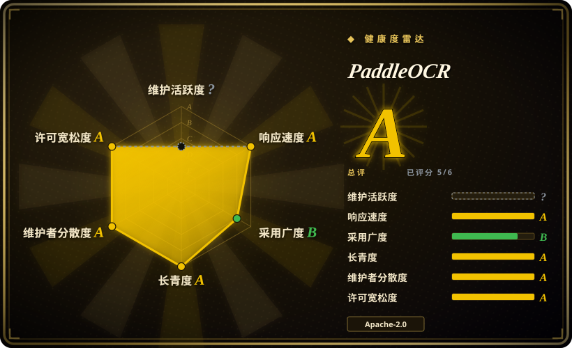
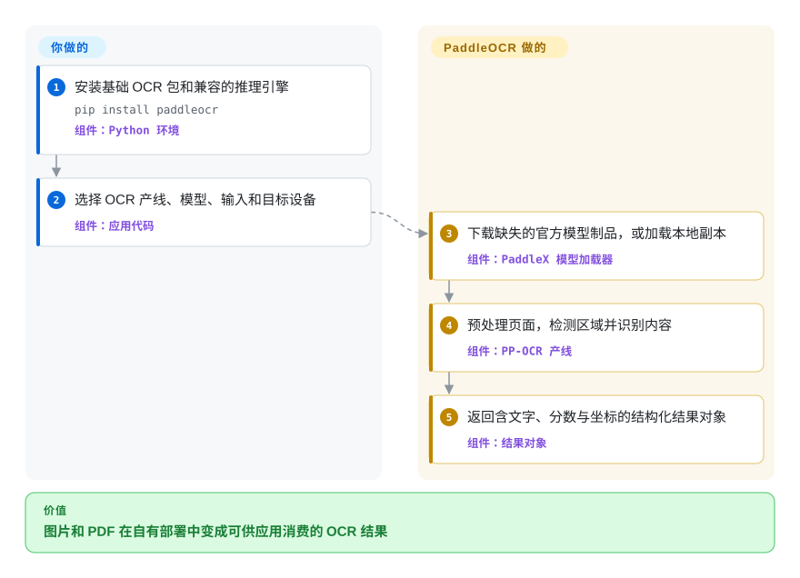

# PaddleOCR

一个 Python OCR 与文档解析工具包：PP-OCR 产线负责文字检测和识别，PP-Structure 与 PaddleOCR-VL 把复杂页面转成结构化结果。

## 何时使用

你在构建自托管的文档摄取或场景文字产线，需要的不只是干净页面转录：手机照片、多语言文字、旋转或弯曲页面、表格、公式、印章或阅读顺序都要以坐标、JSON 或 Markdown 进入应用。当宽广且可组合的 OCR 加版面能力比 Tesseract 的小型 CPU-native 运行时或 EasyOCR 更简单的 PyTorch 检测识别 API 更重要时，选 PaddleOCR。

如果你希望用同一项目家族覆盖轻量 PP-OCR 文字定位与更重的 PP-Structure 或视觉语言文档解析，它尤其合适。决定性代价是机器学习部署面：PaddleX 与推理引擎、下载的模型制品、硬件与后端兼容性，以及比传统 OCR 引擎更多的产线配置。

## 怎么用起来

你为通用 OCR 安装基础包，或为文档解析安装可选依赖组，再选择本地推理引擎和产线。首次使用时，除非你指定本地模型目录，否则 PaddleOCR 会解析并下载所选的预训练模块。产线对页面做预处理，检测文字或版面区域，运行相应识别模块，再返回可由代码打印或保存的结构化结果对象。模型选择、制品缓存、设备与后端配置、容量和结果验证由你负责；打包好的产线图与模块交接由 PaddleOCR 负责。

<!-- flow-steps:begin (generated from flows/paddleocr.json by tools/flow_card.py — do not edit) -->

流程文字版

1. **你**：安装基础 OCR 包和兼容的推理引擎 — `pip install paddleocr` — 组件：`Python 环境`
2. **你**：选择 OCR 产线、模型、输入和目标设备 — 组件：`应用代码`
3. **PaddleOCR**：下载缺失的官方模型制品，或加载本地副本 — 组件：`PaddleX 模型加载器`
4. **PaddleOCR**：预处理页面，检测区域并识别内容 — 组件：`PP-OCR 产线`
5. **PaddleOCR**：返回含文字、分数与坐标的结构化结果对象 — 组件：`结果对象`

**价值**：图片和 PDF 在自有部署中变成可供应用消费的 OCR 结果

<!-- flow-steps:end -->

## 何时不用

- **你只识别干净印刷文字，并要求小而稳定的 CPU 占用。** 选 [Tesseract](tesseract.zh.md)；它不需要 PaddleX、神经网络模型下载和推理后端兼容工作。
- **你想用最短的 PyTorch-first 路径完成检测加识别。** 选 [EasyOCR](easyocr.zh.md)；不需要文档版面、表格、公式和 PaddleOCR 产线目录时，它更窄的 API 更容易采用。
- **你需要对已裁剪文字行或手写内容做 transformer 识别研究。** 选 TrOCR；PaddleOCR 更适合端到端产线，TrOCR 则把任务保持在序列识别层，不负责整页检测与结构解析。
- **你不能运维模型制品或加速器与运行时兼容性。** 如果可以接受把文档发往托管 API、持续用量费用和供应商数据处理条款，选 Google Cloud Vision 或 AWS Textract。
- **你需要无需自有语料测试即可接受的准确率结论。** 必须用真实语言、版面、扫描缺陷和硬件对 PaddleOCR 做 benchmark；仓库性能表含项目方测试及内部数据集，并非独立保证。

## 横向对比

| 替代品 | 是否收录 | 我们的评价 | 取舍 |
|---|---|---|---|
| [Tesseract](tesseract.zh.md) | ✅ | 场景文字、CJK-heavy 输入或版面感知文档解析选 PaddleOCR；干净印刷文字更看重成熟 C++ CPU library 和最小运行时时选 Tesseract。 | PaddleOCR 增加检测、识别、预处理和文档结构产线，代价是 Python/ML 依赖、模型制品和后端调优。 |
| [EasyOCR](easyocr.zh.md) | ✅ | 需要紧凑 PyTorch-first OCR API 时选 EasyOCR；表格、公式、阅读顺序、结构化文档输出或更广部署路径值得更大系统时选 PaddleOCR。 | EasyOCR 更窄也更容易解释；PaddleOCR 覆盖更多文档产线，但带来更多包、模型与配置。 |
| TrOCR | 未收录 | 对已裁剪文字行做 transformer 识别，尤其是手写实验时选 TrOCR；输入是整张图片或 PDF，还要检测和版面处理时选 PaddleOCR。 | TrOCR 提供聚焦的 encoder-decoder 模型接口；PaddleOCR 以更高集成成本提供端到端产线和文档模块。 |
| Google Cloud Vision | 非仓库 | 托管扩缩容与云 API 比自托管和数据驻留控制更重要时选该服务；模型和文档数据必须由自己运营时选 PaddleOCR。 | Cloud Vision 是托管商业 API，不是开源仓库；它省去模型服务工作，但增加网络依赖、供应商条款和用量计费。 |
| AWS Textract | 非仓库 | 需要托管表单、表格和 AWS 集成时选 Textract；开源本地执行和模型级控制更重要时选 PaddleOCR。 | Textract 是 AWS 托管服务，不是仓库；它用本地控制和可移植部署换取托管文档抽取。 |

## 技术栈

- **主要接口：** Python 3.8+ package 与 `paddleocr` CLI；可选能力组覆盖文档解析、信息抽取、翻译和 Office 文档转换。
- **产线层：** package 依赖 PaddleX，以 PP-OCR 做检测识别，以 PP-StructureV3 处理版面、表格、公式、印章、图表、阅读顺序及面向 Markdown/JSON 的结果。
- **推理引擎：** 支持范围内的本地后端包括 Paddle 静态图或动态图推理、Transformers 和 ONNX Runtime；高性能路径还可能涉及 OpenVINO 或 TensorRT。
- **训练与导出：** 仓库训练代码和模型导出使用 PaddlePaddle 与更宽的计算机视觉依赖集。
- **部署面：** 本地提供 Python 与 CLI，也记录了面向其他应用语言和硬件目标的 C++ 与服务化路径。

## 依赖

- **基础包：** `paddleocr` 依赖 `paddlex[ocr-core]`、PyYAML、Requests、aiohttp 和 typing extensions；`doc-parser`、`ie`、`trans` 与 `all` 会安装更大的 PaddleX extras。
- **推理引擎：** 默认本地 `paddle_static` 路径需要兼容的 PaddlePaddle build。适用模型也支持 Transformers 和 ONNX Runtime，因此并非每条推理路径都强制 PaddlePaddle；训练与导出则需要它。
- **模型制品：** 未指定模型目录时会下载官方预训练模块。离线或可复现部署需要自行获取、缓存、版本化并挂载所选检测、识别、预处理和结构模型。
- **硬件：** 支持 CPU 执行，GPU 与其他加速器路径需要后端专用 package、driver 及兼容的模型与引擎组合。较大的文档产线可能同时加载多个模型，而非单个 recognizer。
- **源码训练环境：** `requirements.txt` 还加入 OpenCV、scikit-image、Shapely、pyclipper、LMDB、NumPy、Pillow、Albumentations、Cython 等 package。

## 运维难度

**基础 OCR 为中等，完整文档解析在生产规模下为高。** CPU-only PP-OCR 路径可以保持为本地 library call，但仍需要推理引擎和模型下载。PP-Structure、视觉语言解析、GPU 加速、并行推理或服务化部署会增加多个模型制品、内存与吞吐量定容、driver 与 backend 版本匹配、预热与缓存行为，以及输出质量回归测试。[推断] 宽广的后端和硬件矩阵很有用，但相比 Tesseract 或托管 API，每增加一种选择也增加了兼容组合。

## 健康度与可持续性

- **维护：** Grade 未知，因为评分器无法把最近提交日期归入活动区间；仓库未归档，上游快照记录默认分支在 2026-09-16 有提交。v3.7.0 发布于 2026-06-11。
- **响应速度：** Grade A——评分样本含 37 个 qualifying issues，中位首次响应时间为 8.8 小时。
- **采用广度：** Grade B——评分器测得 `paddleocr` package 的 PyPI 月下载量为 1,274,369，依赖仓库数为 549。
- **长青度：** Grade A——仓库年龄为 2,328 天，最近提交距评分 6 天；年龄与当前活跃度形成正向 Lindy 信号。[推断]
- **治理集中度：** Grade A——过去 12 个月有 20 名活跃维护者，头部一人占评分所测贡献的 37.4%，前三人占 63.9%；仓库属于 PaddlePaddle 组织。
- **许可风险：** Grade A——GitHub 与仓库 LICENSE 均标识 Apache-2.0，评分器未发现过去 36 个月内有重新许可。运维风险主要来自宽广的 PaddleX、模型与后端兼容面，而不是已发现的许可限制。

## 存疑（未验证）

- [推断] 中到高的运维评级来自文档列出的引擎、可选产线、模型制品与硬件路径，是架构判断而非部署实测 benchmark。
- [推断] 正向 Lindy 判断结合仓库年龄、当前提交、发版和采用信号；它是选型先验，不是对未来维护的预测。
