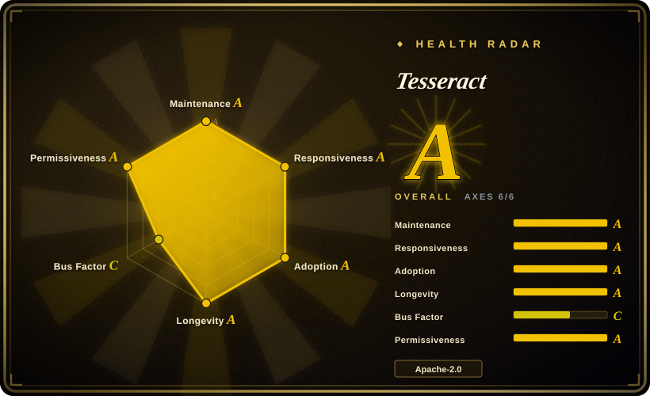
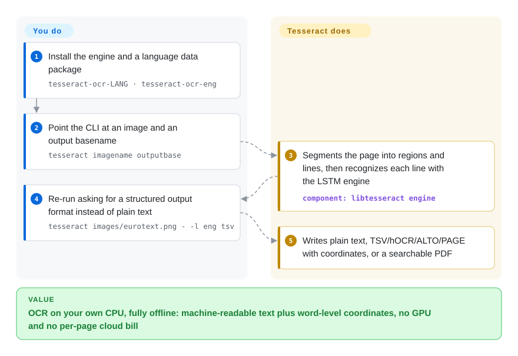

# Tesseract

A folder of scans is full of text your software cannot read, and every cloud OCR option means a per-page bill and data leaving your network. Tesseract is a free OCR engine that runs on your own CPU: hand it an image plus a downloaded language model file and it writes back plain text — or hOCR, TSV, ALTO/PAGE, searchable PDF with word positions — offline, no GPU, no network.

## When to use

You're a backend developer wiring OCR into a document pipeline — a stream of scanned PDFs, faxes, and TIFFs from a records system, mostly clean printed text in a handful of known languages. You need the text extracted on your own servers (no data leaving the building, no per-page cloud bill), and you need it as a library call you can embed, not a SaaS you POST to. You install the `tesseract` binary (or link `libtesseract`), pull the `tessdata` trained models for the languages you expect, and call it through a thin wrapper like `pytesseract` from your worker. For clean, deskewed, high-DPI scans of printed text it does the job with no GPU, no network, and a permissive Apache-2.0 license — and it emits not just plain text but hOCR, ALTO, PAGE, TSV, and searchable-PDF, so you can keep word-level bounding boxes for downstream indexing.

You also reach for it when you control the input quality. Tesseract rewards preprocessing: binarize, deskew, denoise, and feed it 300 DPI line images and the LSTM line recognizer (default since v4) is accurate and cheap to run at scale across a fleet of CPU workers. When a language or font isn't covered well, it is trainable — you can fine-tune or build new `tessdata` — so a long-lived, in-house pipeline over predictable document types is its sweet spot.

## How it works

Tesseract runs inside your own process, in two stages: a page-segmentation pass splits the image into text regions and lines, then an **LSTM line recognizer** — a neural network that reads a whole line of pixels at once, rather than matching character templates — maps each line to Unicode text. The language knowledge is not bundled: each language or script is a separate `*.traineddata` model file you download (from the `tessdata`, `tessdata_fast`, or `tessdata_best` repos) and the engine errors if the one you ask for is missing. What stays yours: getting the binary onto the machine (or linking `libtesseract`'s C/C++ API), placing the model files, and — for usable accuracy — feeding it clean input (binarized, deskewed, ~300 DPI). What it does for you: layout detection, line recognition, and the output — a plain-text file by default, or a position-aware format (`tsv`, `hocr`, `alto`, `page`) or a searchable PDF (`pdf`) that lays invisible text over the scan for downstream indexing.

<!-- flow-steps:begin (generated from flows/tesseract.json by tools/flow_card.py — do not edit) -->

Text version of the flow

1. **You**: Install the engine and a language data package — `tesseract-ocr-LANG · tesseract-ocr-eng`
2. **You**: Point the CLI at an image and an output basename — `tesseract imagename outputbase`
3. **Tesseract**: Segments the page into regions and lines, then recognizes each line with the LSTM engine — component: `libtesseract engine`
4. **You**: Re-run asking for a structured output format instead of plain text — `tesseract images/eurotext.png - -l eng tsv`
5. **Tesseract**: Writes plain text, TSV/hOCR/ALTO/PAGE with coordinates, or a searchable PDF

**Value**: OCR on your own CPU, fully offline: machine-readable text plus word-level coordinates, no GPU and no per-page cloud bill

<!-- flow-steps:end -->

## When NOT to use

- **Photos in the wild, complex layouts, or handwriting.** This is the sharp edge: Tesseract expects clean, mostly-printed, mostly-deskewed text. On phone photos with perspective and uneven lighting, on magazine/newspaper multi-column layouts, or on any handwriting, modern deep-learning OCR — PaddleOCR, EasyOCR, cloud Vision/Textract, or TrOCR — typically wins by a wide margin. [推断]
- **You don't want a preprocessing burden.** Accuracy is highly sensitive to input quality; the README itself says you'll often need to *improve the image* first. If you can't invest in binarization/deskew/DPI normalization, expect disappointing results.
- **You need document layout, tables, or reading order.** Tesseract's page segmentation is basic — it is a text *recognizer*, not a layout/table/structure extractor. For parsing document structure (tables, columns, reading order, key-value), reach for a document-parsing layer like [docling](../document-parsing/docling.md) on top of, or instead of, raw OCR.
- **You need LaTeX / math / equation recognition.** Tesseract does not understand math notation; use a dedicated tool such as [LaTeX-OCR](latex-ocr.md).
- **You want a turnkey GUI or end-to-end app.** It ships no GUI — it is an engine and CLI. Pair it with a frontend (e.g. an OCRmyPDF-style wrapper) yourself.

## Comparison

| Alternative | In index | Our verdict | Tradeoff |
|---|---|---|---|
| [PaddleOCR](paddleocr.md) | ✅ | Choose PaddleOCR for complex layouts, photos, CJK-heavy workloads, or table/layout structure; choose Tesseract for clean printed text where offline CPU deployment and mature bindings matter more. | Deep-learning OCR + layout/table/structure models; far stronger on complex layouts, photos, and CJK, but heavier deps (PaddlePaddle), Apache-2.0, GPU-helpful — a fuller pipeline vs Tesseract's single recognizer. |
| [EasyOCR](easyocr.md) | ✅ | Choose EasyOCR when a Python/PyTorch OCR stack with good scene-text defaults is easier than image preprocessing; choose Tesseract for mature C++ CPU throughput and long-lived document pipelines. | PyTorch-based, 80+ languages, easy install, good on scene/photo text out of the box; bigger runtime and GPU-friendly, less battle-tested at extreme scale than Tesseract's C++ core. |
| Google Cloud Vision / AWS Textract | 未收录 | Choose cloud OCR when messy-input accuracy, tables, forms, and managed operations outweigh per-page cost and data residency; choose Tesseract when offline self-hosting is non-negotiable. | Managed cloud OCR; best-in-class accuracy on messy input plus Textract's table/form extraction, but per-page cost, data leaves your network, and no offline/self-host — the opposite of Tesseract's deployment model. |
| TrOCR | 未收录 | Choose TrOCR for transformer-based line recognition, handwriting, or hard single-line cases; choose Tesseract when page-level formats, language packs, and CPU-only operation are the core requirement. | Transformer (encoder-decoder) OCR from Microsoft; strong on handwriting and hard lines, but model-heavy and GPU-oriented, and it is line-level recognition without Tesseract's full page/format tooling. |
| docTR | 未收录 | Choose docTR for a clean Python deep-learning detection-plus-recognition pipeline on varied layouts; choose Tesseract for lighter dependencies, broad language data, and stable offline CLI/library use. | Deep-learning OCR (detection + recognition) in TF/PyTorch with a clean Python API; better on varied layouts than Tesseract, heavier deps, smaller language coverage. |

## Tech stack

- **Language:** C++ (the `libtesseract` engine and `tesseract` CLI); widely consumed from Python via `pytesseract`, and from many other languages through bindings.
- **Recognition engine:** LSTM-based line recognizer (default since Tesseract 4), with the older character-pattern "legacy" engine still available for backward compatibility.
- **Trained data:** language/script models live in separate `tessdata` files (variants: `tessdata`, `tessdata_fast`, `tessdata_best`); models are not bundled with the engine and must be downloaded per language.
- **Output formats:** plain text, hOCR (HTML), searchable/invisible-text PDF, TSV, ALTO, and PAGE — word/line bounding boxes available, not just flat text.
- **Trainable:** supports training/fine-tuning to add languages or fonts via the Tesseract training tools.

## Dependencies

- **`libtesseract`:** the core engine you link against (or invoke via the CLI).
- **Leptonica:** required image-processing library — Tesseract uses it to open and manipulate input images. This is the key build/runtime dependency.
- **`tessdata` models:** trained-data files per language/script, downloaded separately; pick `tessdata_fast` (integerized, speed-first; the two repos' READMEs state both work only with the LSTM engine of Tesseract 4/5) or `tessdata_best` ("best trained models", accuracy-first) per your need.
- **Language packs:** one `*.traineddata` file per language you intend to recognize (e.g. `eng.traineddata`); the engine errors if the requested language's data isn't installed.
- **No GPU, no network, no datastore:** runs CPU-only and fully offline once models are present.

## Ops difficulty

**Low-to-medium.** The engine itself is easy to operate: a static-ish CPU binary, no service to run, no GPU, no network, distributed as OS packages and Docker images. The cost is in two places. First, **input preprocessing** — to get usable accuracy you typically build a binarize/deskew/denoise/DPI-normalize stage in front of it, and that pipeline (not Tesseract) is where most engineering and tuning goes. Second, **model management** — you must fetch and version the right `tessdata` files for each language and decide between the `fast`/`best` variants, which is a deployment-artifact concern. Scaling is embarrassingly parallel across CPU workers, so throughput is a fan-out problem, not a clustering one. The hard part is rarely running Tesseract; it's getting the images clean enough that Tesseract does well.

## Health & viability

- **Maintenance (as of 2026-09):** last commit 2026-09-28, active in 11 of the last 13 weeks, latest release 5.5.3 (2026-07-24, GitHub releases API) — **actively maintained**, with regular point releases on the 5.x line. Cadence is steady but mature/incremental rather than fast-moving; it's a stable engine, not a churning one. Issue responsiveness is strong too (median time-to-first-response ~8h in the scorer's recent window).
- **Governance / bus factor:** organization-owned (`tesseract-ocr`) and **community-maintained** after a long institutional lineage — the README's Brief history records HP development (1985–1994), HP open-sourcing in 2005, and Google development from 2006 until August 2017; the README names Stefan Weil as current lead developer and Zdenko Podobny as maintainer. But today's commit flow is **concentrated**: the health scorer measured 9 active committers in the last 12 months with ~75% of commits from the top one — a volunteer/community engine, not vendor-resourced, and the radar grades this axis C accordingly. [推断：占比来自近 12 个月提交统计，历史贡献者未必消失，只是不再常提交]
- **Age & Lindy verdict (created 2014-08 on GitHub, ~12 yr there; codebase lineage to the 1980s):** old *and* still active and shipping releases — a **very strong Lindy** signal. This is one of the longest-lived OCR engines in existence; for clean printed text it is a safe, durable bet.
- **Adoption / ecosystem:** the default offline OCR engine across countless pipelines, OS packages, and language bindings (`pytesseract` and many others); ~76.7k stars (GitHub API, 2026-09-28), ~122k Homebrew installs/90d and ~4.36M release downloads (health scorer, 2026-09-28). The README claims 100+ language models, multiple output formats, and trainable `tessdata` — deeply entrenched.
- **Risk flags:** none of the usual ones — permissive Apache-2.0, no relicense history, no open-core gating. The real ceiling is *capability*, not viability: it trails modern deep-learning OCR on messy input. [推断]

## Caveats (unverified)

- [未验证] "100+ languages out of the box" and the list of output formats (hOCR/PDF/TSV/ALTO/PAGE) are the README's own framing (re-read 2026-09-28); the exact language count and per-language model quality vary.
- [推断] The accuracy gap vs modern deep-learning OCR (PaddleOCR/EasyOCR/cloud Vision/TrOCR/docTR) on complex layouts, photos, and handwriting is an inference from architecture and common benchmarks, not a measured claim for your specific documents — benchmark on your own data.
- [推断] Page-segmentation / layout capability is characterized as "basic" relative to dedicated document-parsing tools; this is a relative judgment, not a measurement of any specific PSM mode.
- [推断] The named "lead developer / maintainer" roles are today's documented roles in the README, not a verified governance process (no formal charter was read).
