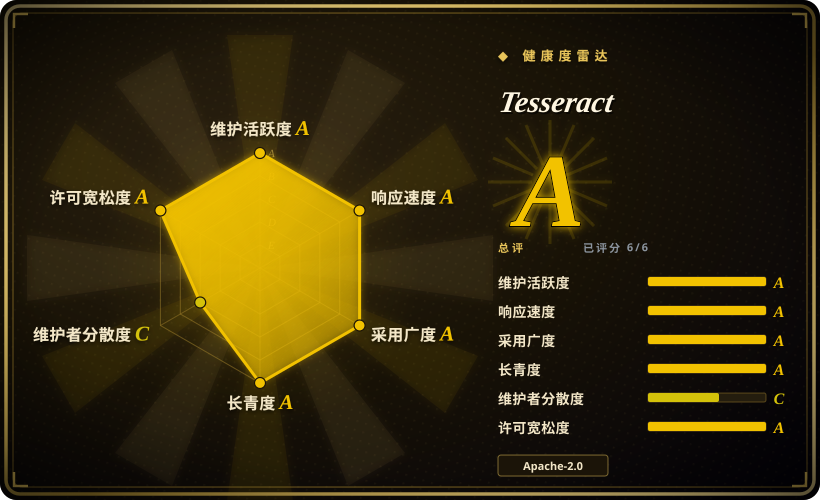
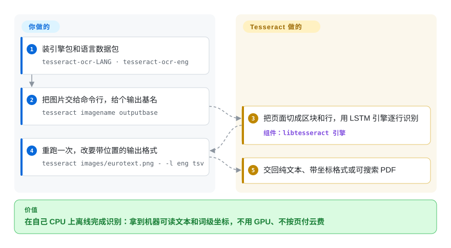

# Tesseract

一摞扫描件里全是软件读不出来的文字，而云端 OCR 意味着按页付费、数据出内网。Tesseract 在你自己的 CPU 上离线做识别：给它一张图和一个单独下载的语言模型文件，它交回纯文本——或 hOCR、TSV、ALTO/PAGE、带词位置的可搜索 PDF，不用 GPU、不联网。

## 何时使用

你是后端开发者，要给文档管线接上 OCR——一批来自档案系统的扫描 PDF、传真和 TIFF，大多是几种已知语言的清晰印刷体。你需要在自己的服务器上把文字抽出来（数据不出内网、不按页给云厂商付费），而且要的是一个能嵌进代码的库调用，而不是一个要 POST 过去的 SaaS。你装上 `tesseract` 二进制（或链接 `libtesseract`），拉下你预期那几种语言的 `tessdata` 训练模型，再在 worker 里用 `pytesseract` 这种薄封装调它。对清晰、去倾斜、高 DPI 的印刷体扫描件，它无需 GPU、无需联网、Apache-2.0 宽松许可，就能干好这活——而且它输出的不只是纯文本，还有 hOCR、ALTO、PAGE、TSV 和可搜索 PDF，词级 bounding box 也留得住，方便下游建索引。

当你能掌控输入质量时，你也会选它。Tesseract 吃预处理这一套：二值化、去倾斜、去噪，喂给它 300 DPI 的行图，默认（v4 起）的 LSTM 行识别器既准又便宜，能在一群 CPU worker 上规模化跑。某种语言或字体覆盖不好时，它可训练——你可以微调或自建 `tessdata`——所以一条长期存在、面向可预测文档类型的内部管线，正是它的甜区。

## 怎么用起来

Tesseract 在你自己的进程里分两步工作：先做版面切分，把图片拆成文字区块和行；再由 **LSTM 行识别器**——一种一次读一整行像素的神经网络，而不是按字符模板匹配——把每行像素映射成 Unicode 文本。语言知识不随引擎打包：每种语言或字符集都是一个单独的 `*.traineddata` 模型文件，要从 `tessdata`、`tessdata_fast` 或 `tessdata_best` 仓库自行下载，缺了你要的那个引擎就报错。留在你这边的：把二进制装上机器（或链接 `libtesseract` 的 C/C++ API）、放好模型文件，以及——想要可用准确率的话——把输入弄干净（二值化、去倾斜、约 300 DPI）。它替你做的：版面检测、行识别，和输出——默认一个纯文本文件，或带位置信息的格式（`tsv`、`hocr`、`alto`、`page`），或可搜索 PDF（`pdf`，在扫描件上盖一层隐形文字）供下游建索引。

<!-- flow-steps:begin (generated from flows/tesseract.json by tools/flow_card.py — do not edit) -->

流程文字版

1. **你**：装引擎包和语言数据包 — `tesseract-ocr-LANG · tesseract-ocr-eng`
2. **你**：把图片交给命令行，给个输出基名 — `tesseract imagename outputbase`
3. **Tesseract**：把页面切成区块和行，用 LSTM 引擎逐行识别 — 组件：`libtesseract 引擎`
4. **你**：重跑一次，改要带位置的输出格式 — `tesseract images/eurotext.png - -l eng tsv`
5. **Tesseract**：交回纯文本、带坐标格式或可搜索 PDF

**价值**：在自己 CPU 上离线完成识别：拿到机器可读文本和词级坐标，不用 GPU、不按页付云费

<!-- flow-steps:end -->

## 何时不用

- **野外照片、复杂版式或手写体。** 这是最锋利的边界：Tesseract 假定输入是清晰、以印刷体为主、大致去倾斜的文本。面对带透视和不均匀光照的手机照片、报刊那种多栏版式、或任何手写，现代深度学习 OCR——PaddleOCR、EasyOCR、云端 Vision/Textract、TrOCR——通常大幅胜出。[推断]
- **你不想背预处理负担。** 准确率高度依赖输入质量；README 自己就说你常常得先*改善图像*。如果你没法投入二值化/去倾斜/DPI 归一化，结果会让你失望。
- **你需要文档版式、表格或阅读顺序。** Tesseract 的页面切分很基础——它是文字*识别器*，不是版式/表格/结构抽取器。要解析文档结构（表格、分栏、阅读顺序、键值），请在 OCR 之上（或替代它）加一层文档解析，比如 [docling](../document-parsing/docling.zh.md)。
- **你需要 LaTeX / 数学公式识别。** Tesseract 不懂数学记号；请用专门工具，比如 [LaTeX-OCR](latex-ocr.zh.md)。
- **你想要开箱即用的 GUI 或端到端应用。** 它不带 GUI——它是引擎加 CLI。前端（比如 OCRmyPDF 那类封装）得你自己配。

## 横向对比

| 替代品 | 是否收录 | 我们的评价 | 取舍 |
|---|---|---|---|
| [PaddleOCR](paddleocr.zh.md) | ✅ | 当任务是复杂版式、照片、中日韩重负载或表格/版式结构时，选 PaddleOCR；当输入是清晰印刷体且离线 CPU 部署和成熟绑定更重要时，选 Tesseract。 | 深度学习 OCR + 版式/表格/结构模型；在复杂版式、照片和中日韩上强得多，但依赖更重（PaddlePaddle）、Apache-2.0、有 GPU 更好——是完整管线，而非 Tesseract 的单一识别器。 |
| [EasyOCR](easyocr.zh.md) | ✅ | 当 Python/PyTorch OCR 栈和场景文字默认效果比图像预处理更省事时，选 EasyOCR；当你要成熟 C++ CPU 吞吐和长期文档管线时，选 Tesseract。 | 基于 PyTorch，80+ 语言，安装简单，对场景/照片文字开箱即用效果不错；运行时更大、偏 GPU，在极端规模下不如 Tesseract 的 C++ 内核久经考验。 |
| Google Cloud Vision / AWS Textract | 未收录 | 当脏输入准确率、表格、表单和托管运维收益大于按页成本和数据出域代价时，选云 OCR；当必须离线自托管时，选 Tesseract。 | 托管云 OCR；对脏输入准确率一流，Textract 还能抽表格/表单，但按页计费、数据出内网、不能离线/自托管——和 Tesseract 的部署模型正相反。 |
| TrOCR | 未收录 | 当你要基于 Transformer 的行识别、手写或困难单行文本能力时，选 TrOCR；当页面级格式、语言包和纯 CPU 运行是核心要求时，选 Tesseract。 | 微软的 Transformer（编码器-解码器）OCR；在手写和难行上很强，但模型重、偏 GPU，且是行级识别，没有 Tesseract 那套完整的页面/格式工具。 |
| docTR | 未收录 | 当你要干净的 Python 深度学习检测加识别管线来处理多样版式时，选 docTR；当你更看重轻依赖、广语言数据和稳定离线 CLI/库时，选 Tesseract。 | TF/PyTorch 的深度学习 OCR（检测+识别），Python API 干净；对多样版式比 Tesseract 好，但依赖更重、语言覆盖更小。 |

## 技术栈

- **语言：** C++（`libtesseract` 引擎与 `tesseract` CLI）；常通过 `pytesseract` 在 Python 里调用，也有多语言绑定。
- **识别引擎：** 基于 LSTM 的行识别器（Tesseract 4 起为默认），同时保留较旧的字符模式“legacy”引擎以向后兼容。
- **训练数据：** 语言/字符集模型放在单独的 `tessdata` 文件里（有 `tessdata`、`tessdata_fast`、`tessdata_best` 几种）；模型不随引擎打包，需按语言单独下载。
- **输出格式：** 纯文本、hOCR（HTML）、可搜索/隐藏文字 PDF、TSV、ALTO、PAGE——可拿到词/行 bounding box，不只是扁平文本。
- **可训练：** 通过 Tesseract 训练工具支持训练/微调，以增加语言或字体。

## 依赖

- **`libtesseract`:** 你链接（或经 CLI 调用）的核心引擎。
- **Leptonica:** 必需的图像处理库——Tesseract 用它打开和处理输入图像。这是关键的构建/运行时依赖。
- **`tessdata` 模型：** 各语言/字符集的训练数据文件，单独下载；按需在 `tessdata_fast`（整数化、求快）和 `tessdata_best`（求准）之间选——两个仓库的 README 都写明这些模型只支持 Tesseract 4/5 的 LSTM 引擎。
- **语言包：** 每种要识别的语言一个 `*.traineddata` 文件（如 `eng.traineddata`）；所请求语言的数据没装好时引擎会报错。
- **无 GPU、无网络、无数据存储：** 模型就位后纯 CPU、完全离线运行。

## 运维难度

**低到中。** 引擎本身好运维：一个 CPU 二进制，没有常驻服务、没有 GPU、没有网络，以 OS 包和 Docker 镜像分发。成本在两处。其一是**输入预处理**——要拿到可用准确率，你通常得在它前面搭一段二值化/去倾斜/去噪/DPI 归一化的处理，而大部分工程量和调参都落在这条管线（而非 Tesseract）上。其二是**模型管理**——你得为每种语言取来并版本化对应的 `tessdata`，还要在 `fast`/`best` 变体间做取舍，这是个部署产物层面的事。扩展是 CPU worker 间的尴尬并行，所以吞吐是扇出问题，不是集群问题。难的很少是跑 Tesseract；难的是把图像弄得够干净，让 Tesseract 跑得好。

## 健康度与可持续性

- **维护（截至 2026-09）：** 最后一次提交在 2026-09-28，近 13 周里有 11 周活跃，最新发布 5.5.3（2026-07-24，GitHub releases API）——**在持续维护**，5.x 线上定期出小版本。节奏稳定但属成熟 / 增量式，而非快速演进；它是个稳定引擎，不是个频繁变动的引擎。issue 响应也强（评分器近期窗口内首次响应中位数约 8 小时）。
- **治理 / bus factor：** 由组织持有（`tesseract-ocr`），在一段悠长的机构血脉之后由**社区维护**——README 的 Brief history 记载：HP 于 1985–1994 开发、2005 年由 HP 开源、2006 年至 2017 年 8 月由 Google 主导；README 现写明 Stefan Weil 为当前主开发、Zdenko Podobny 为维护者。但今日的提交流**高度集中**：健康度评分器量到近 12 个月只有 9 名活跃提交者、约 75% 的提交来自头一名——这是志愿者/社区引擎，不是厂商资源托底，健康雷达在治理轴上显示 `C`。[推断：占比来自近 12 个月提交统计，历史贡献者未必消失，只是不再常提交]
- **年龄与 Lindy 判定（GitHub 上创建于 2014-08，约 12 年；代码血脉可追溯到 1980 年代）：** 既老*又*仍活跃、仍在发版——**极强 Lindy** 信号。它是现存最长寿的 OCR 引擎之一；对清晰印刷体而言是稳妥、耐久的押注。
- **采用度 / 生态：** 无数管线、OS 包和多语言绑定（`pytesseract` 及其他众多）里默认的离线 OCR 引擎；约 76.7k star（GitHub API，2026-09-28）、约 12.2 万次 Homebrew 安装/90 天、约 436 万次 release 下载（健康度评分器，2026-09-28）。README 自称 100+ 语言模型、多种输出格式、可训练的 `tessdata`——根基极深。
- **风险标记：** 常见风险一个都没有——宽松的 Apache-2.0，无 relicense 历史，无开放核心闸门。真正的天花板是*能力*而非可持续性：在脏输入上它落后于现代深度学习 OCR。[推断]

## 存疑（未验证）

- [未验证] “开箱 100+ 语言”和输出格式列表（hOCR/PDF/TSV/ALTO/PAGE）是 README 自己的表述（2026-09-28 重读）；确切语言数量和各语言模型质量各有差异。
- [推断] 在复杂版式、照片和手写上与现代深度学习 OCR（PaddleOCR/EasyOCR/云端 Vision/TrOCR/docTR）的准确率差距，是从架构和常见基准做出的推断，不是对你具体文档的实测——请在你自己的数据上跑基准。
- [推断] 页面切分/版式能力相对专门的文档解析工具被表述为“基础”；这是相对判断，不是对某个具体 PSM 模式的实测。
- [推断] README 写名的“主开发者 / 维护者”角色是当下文档记载的分工，不是经核实的治理流程（没有读正式章程）。
