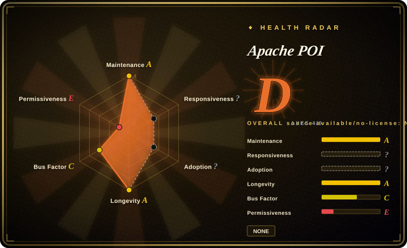
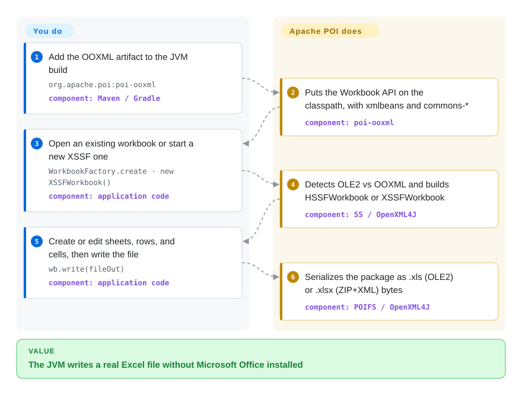

# Apache POI

Your JVM service has to produce or edit Excel, Word, or PowerPoint files on a machine that will never run Microsoft Office. Apache POI speaks those file formats in Java — both the old binary ones and the 2007+ XML ones — so the container writes a real `.xlsx` without launching Excel.

## When to use

You ship a Java or Kotlin service that must read or write Office files in-process: fill an `.xlsx` template from a query, ingest an uploaded `.xls`, or emit a `.docx` report from a Linux container where installing Microsoft Office is not an option. The failure mode you are avoiding is a sidecar that shells out to LibreOffice or a Python library you do not otherwise run. You reach for Apache POI because it is the **ASF-backed JVM library** that reads *and* writes both OLE2 (`.xls` / `.doc` / `.ppt`) and OOXML (`.xlsx` / `.docx` / `.pptx`) through a shared Excel API (`Workbook` / `Sheet` / `Row` / `Cell`). Versus [XlsxWriter](xlsxwriter.md), [python-docx](python-docx.md), and [python-pptx](python-pptx.md) you stay on the JVM — no interpreter, no extra process. Versus LibreOffice headless you get an object model rather than a conversion subprocess. Versus Aspose you get Apache-2.0 without a commercial license. The deciding cost is the artifact graph: `poi-ooxml` pulls `poi-ooxml-lite`, XMLBeans, and several Apache Commons jars.

## How it works

POI is a pure-Java port of two Office storage formats, not a wrapper around Excel. The old binary files (Excel 97–2003 and friends) sit in an OLE2 compound document; POI's POIFS layer is that filesystem, and HSSF / HWPF / HSLF speak the application records on top of it. The 2007+ files are ZIP packages of XML (OOXML); OpenXML4J is the package layer, and XSSF / XWPF / XSLF speak SpreadsheetML / WordprocessingML / PresentationML. For Excel, a common SS facade lets you write against `Workbook` without choosing HSSF or XSSF up front — `WorkbookFactory.create` sniffs OLE2 vs OOXML and returns the matching implementation. Your job is the object model: create or open a workbook, mutate sheets and cells, call `write`. POI's job is to emit a file Excel will open. Analogy: you are filling out a paper form in the file's own handwriting, not dictating to a clerk who runs Excel. Large `.xlsx` writes that cannot fit in heap switch to `SXSSFWorkbook`, which streams rows out instead of holding the whole sheet.

<!-- flow-steps:begin (generated from flows/apache-poi.json by tools/flow_card.py — do not edit) -->

Text version of the flow

1. **You**: Add the OOXML artifact to the JVM build — `org.apache.poi:poi-ooxml` — component: `Maven / Gradle`
2. **Apache POI**: Puts the Workbook API on the classpath, with xmlbeans and commons-* — component: `poi-ooxml`
3. **You**: Open an existing workbook or start a new XSSF one — `WorkbookFactory.create · new XSSFWorkbook()` — component: `application code`
4. **Apache POI**: Detects OLE2 vs OOXML and builds HSSFWorkbook or XSSFWorkbook — component: `SS / OpenXML4J`
5. **You**: Create or edit sheets, rows, and cells, then write the file — `wb.write(fileOut)` — component: `application code`
6. **Apache POI**: Serializes the package as .xls (OLE2) or .xlsx (ZIP+XML) bytes — component: `POIFS / OpenXML4J`

**Value**: The JVM writes a real Excel file without Microsoft Office installed

<!-- flow-steps:end -->

## When NOT to use

- **The code path is Python, not a JVM service** → use [XlsxWriter](xlsxwriter.md) to create new `.xlsx` from scratch, openpyxl (`未收录`) to read or edit an existing `.xlsx`, [python-docx](python-docx.md) for Word, [python-pptx](python-pptx.md) for decks. POI's Maven graph is the wrong dependency for a Python agent or script.
- **The consumer is an LLM agent, not your Java process** → use [OfficeCLI](officecli.md). An agent cannot `new XSSFWorkbook()`; it needs a CLI or MCP surface. POI belongs *inside* a tool you build, not as the agent's interface.
- **You only need conversion** (Office → PDF, raster, or another format) → LibreOffice headless (`未收录`). POI is an object-model library, not a layout engine; it will not paginate a Word file into PDF for you.
- **You cannot carry the OOXML stack** → `poi-ooxml` requires `poi-ooxml-lite` (or `poi-ooxml-full`), XMLBeans, Commons Compress / Codec / Collections4 / Math3 / IO, SparseBitSet, and `log4j-api` (component map, verified 2026-09-23). If the constraint is a zero-dependency writer, that is [XlsxWriter](xlsxwriter.md) in Python, not POI.
- **The files are from untrusted users and you have no sandbox** → POI's own security page tells you not to parse untrusted documents in-process: expect `OutOfMemoryError`, unbounded CPU, and temp files. Sandbox the parser in another process with a timeout, or refuse the file. CVE-2025-31672 (duplicate ZIP entries in OOXML, `poi-ooxml` before 5.4.0) is the current dated reminder to stay on 5.4.0+.
- **You need to create macros, or full Excel charts / pivot tables** → macros are preserved on rewrite but cannot be created (limitations page). HSSF chart and pivot support is largely missing; XSSF has limited create/change. Use Excel itself, or a commercial engine, if those are load-bearing.
- **Word or PowerPoint binary (`.doc` / `.ppt`) is the deliverable** → HWPF is documented as early-stage with limited write; HSLF is stronger but still the older format. Prefer OOXML (`.docx` / `.pptx`) or a Python library if you only need the new formats and already run Python.

## Comparison

| Alternative | In index | Our verdict | Tradeoff |
| --- | --- | --- | --- |
| [XlsxWriter](xlsxwriter.md) | ✅ | Pick Apache POI when a JVM service must read *and* write `.xls`/`.xlsx` (and often Word/PowerPoint too) without leaving Java; pick XlsxWriter when the job is Python data → new `.xlsx` and you want zero dependencies. | POI buys read+write, binary Excel, and formula evaluation APIs at the cost of a heavy Maven graph and JVM residency; XlsxWriter buys speed and no deps at the cost of being write-only and Python-only. |
| [python-docx](python-docx.md) | ✅ | Pick POI when Word is one format among several inside an existing Java service; pick python-docx when the service is already Python and the file is `.docx` only. | POI covers OLE2 `.doc` plus OOXML `.docx` on the JVM with a fatter classpath; python-docx is a pinnable MIT library with two runtime deps and no `.doc` path. |
| [python-pptx](python-pptx.md) | ✅ | Pick POI when the deck must be produced from Java (or you already depend on POI for Excel/Word); pick python-pptx when Python is the runtime and a native `.pptx` is enough — knowing it has not shipped since 2024-08-07. | POI's XSLF lives in `poi-ooxml` next to Excel/Word; python-pptx is the Python-native deck library but is feature-frozen on animations and SmartArt. |
| [OfficeCLI](officecli.md) | ✅ | Pick POI when Office I/O is a library call inside a JVM service you pin and test; pick OfficeCLI when an agent must read, edit, or preview files through a CLI on a machine with no JDK. | POI is a 20-year ASF library with no agent surface and no render-back loop; OfficeCLI is a 6-month solo binary that speaks all three formats and can show HTML/PNG, with default-on auto-update. |
| LibreOffice (headless) | 未收录 | Pick LibreOffice when the job is *convert or print* (PDF, raster, another format) and you can afford a subprocess; pick POI when you must mutate cells, paragraphs, or slides in place from Java. | LibreOffice is a full office suite used as a conversion engine; POI is an embeddable parser/writer with no layout/PDF pipeline. |

## Tech stack

Java library (`org.apache.poi`), Java 8 or newer for the 5.x line (project news: "POI requires Java 8 or newer since version 4.0.1"); `trunk` is 6.0.0 development and the README requires Java 11+. Build is Gradle (`./gradlew jar`) plus a retained Ant `build.xml`. Default branch is `trunk`. Modules: `poi` (POIFS, HSSF, shared SS interfaces), `poi-ooxml` (XSSF / XWPF / XSLF / XDGF plus OpenXML4J), `poi-ooxml-lite` or `poi-ooxml-full` (XMLBeans-generated schemas), `poi-scratchpad` (HWPF / HSLF / HDGF / HPBF / HSMF — the binary non-Excel formats), `poi-examples`. OOXML schemas are compiled with Apache XMLBeans (component map cites xmlbeans 5.3.0). GitHub `apache/poi` is the official git tree as of the 2025-07-07 project-news switch from Subversion; the GitHub description still says "Mirror of Apache POI gitbox".

## Dependencies

A JDK, plus the Maven artifacts for the formats you touch. Spreadsheet OOXML (the common case) is `poi-ooxml` → `poi` + `poi-ooxml-lite` + XMLBeans + Commons Compress, Codec, Collections4, Math3, IO + SparseBitSet + `log4j-api` (component map, verified 2026-09-23). Binary Word/PowerPoint add `poi-scratchpad`. Optional: Batik / xmlgraphics for SVG, PDFBox for PDF bits, Bouncy Castle + xmlsec for signing via `poi-ooxml-full`. No Microsoft Office, no LibreOffice. Runtime extras the security page names: a temp-file directory POI will write into, and enough heap for XSSF to hold the workbook — or `SXSSFWorkbook` / the event usermodel for huge `.xlsx`. `Sheet.autoSizeColumn` needs a graphics environment or `-Djava.awt.headless=true` plus the fonts you use.

## Ops difficulty

**Medium for a library.** There is no service to deploy, but the classpath is load-bearing: mix `poi` / `poi-ooxml` / XMLBeans versions and you get method-not-found at parse time. Pin every `org.apache.poi` artifact to the same version (project news repeats this). Stay on **5.4.0+** for CVE-2025-31672. Treat untrusted uploads as a process-isolation problem, not a library flag — timeout, memory cap, separate JVM. For large `.xlsx`, decide SXSSF (write) or the event usermodel (read) before the first OOM, not after. GitHub Issues (44 open) is not the full tracker; Bugzilla remains listed on the README.

## Health & viability

- **Radar overall D (4/6 scored, capped) is a tooling miss, not a viability miss.** Maintenance A (last commit 1 day, 13/13 weeks active) and longevity A (repo age 6334 days and still active). Responsiveness is `?` (`no_window_signal`) — GitHub Issues are not the project's main tracker. Adoption is `?` (`ambiguous`) — the scorer did not bind a Maven package. Risk/license is E (`spdx_id: NONE`) because GitHub's license API is null; that CAP'd the aggregate. Do not read overall D as "this project is dying."
- **Maintenance: active, verified 2026-09-23** — Maven Central `poi-ooxml` latest/release is 5.5.1, `lastUpdated` 2025-11-30; project news dated 30 November 2025. Default-branch commit on `trunk` 2026-09-22 (`b1494b9a`). README: `trunk` is 6.0.0 development. GitHub Releases is empty (0); version tags are `REL_5_5_1` and earlier — Apache ships on the download page and Maven, not the GitHub Releases UI.
- **Governance: ASF PMC, radar C on 12-month concentration** — 36 active maintainers in the scoring window, but `top1_share` 0.619 / `top3_share` 0.853. Lifetime contributors API (2026-09-23): `pjfanning` 3091, `Gagravarr` 2348, `centic9` 1953, `kiwiwings` 1334, `onealj` 962. Foundation-backed, not a solo hobby; recent commits still cluster.
- **Backing & Lindy: both halves hold** — site copyright 2001–2026; `legal/NOTICE` "Copyright 2003-2026 The Apache Software Foundation". GitHub `created_at` is 2009-05-21 (the gitbox mirror). The 2025-07-07 news post made GitHub the official source after years as a read-only mirror — do not read the leftover "Mirror of Apache POI gitbox" description as archival.
- **Adoption: Maven Central is the distribution; the radar did not score it** — group `org.apache.poi`, artifacts `poi` / `poi-ooxml` / `poi-scratchpad` (Maven Central metadata for `poi-ooxml` fetched 2026-09-23). 2,273 stars / 847 forks (API-verified) under-count a library that lived on SVN + the ASF download page for most of its life. [推断] The homepage names Tika/Lucene as related text-extraction consumers.
- **Risk flags** — Apache-2.0 in `legal/LICENSE` (verified 2026-09-23); GitHub's license API is null because there is no root `LICENSE` file, which is why the radar grades permissiveness E. No relicense. Dated CVEs on the homepage: CVE-2025-31672 (poi-ooxml < 5.4.0, duplicate ZIP names), CVE-2022-26336 (poi-scratchpad TNEF OOM, < 5.2.1), CVE-2019-12415 (XXE in `XSSFExportToXml`, < 4.1.1), plus XMLBeans XXE CVE-2021-23926 on old XMLBeans. The live operational risk is parsing untrusted Office files in-process, which the project itself discourages.

## Caveats (unverified)

- [未验证] Formula-evaluation coverage versus Excel — POI documents a formula evaluator; this review did not run it against a workbook or compare function-by-function with Excel.
- [未验证] Whether HWPF (`.doc`) write support has moved past the "early stages" sentence still on the components page as of 2026-09-23; the sentence was taken as the project's own current claim, not re-tested on files.
- [推断] GitHub star count understates adoption because the repo was a read-only gitbox mirror until 2025-07-07. The health radar did not bind a Maven package (`adoption: ?`, reason `ambiguous`), so download/dependent counts are not on this page.
- [未验证] Whether `tools/health.py` would grade `risk_license` A if it read `legal/LICENSE` instead of the GitHub license API — this review did not re-run the scorer with a patched detector.
- [未验证] Bugzilla open-bug count — README still lists Bugzilla as a tracker; this review counted GitHub issues (44) only.
- [未验证] Exact XMLBeans / Commons versions pulled by `poi-ooxml` 5.5.1 on Maven Central — the component map cites versions (xmlbeans 5.3.0, commons-io 2.20.0, …); a POM resolution was not run here.
- [未验证] `SXSSFWorkbook` feature exclusions versus XSSF (which operations fail once rows are flushed) — existence is documented; the interaction matrix was not executed.
