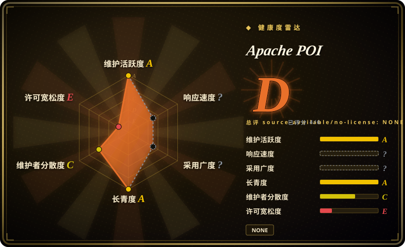
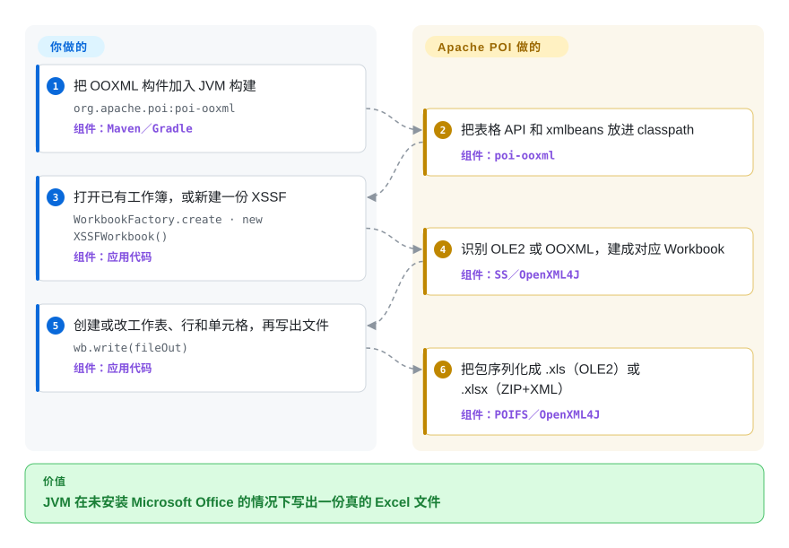

# Apache POI

你的 JVM 服务必须在一台永远不会装 Microsoft Office 的机器上生成或改 Excel、Word 或 PowerPoint 文件。Apache POI 用 Java 直接读写这些格式——既包括老的二进制，也包括 2007 以后的 XML——容器里就能写出一份真的 `.xlsx`，不必启动 Excel。

## 何时使用

你在交付一个 Java 或 Kotlin 服务，必须在进程内读写 Office 文件：用查询结果填一份 `.xlsx` 模板、接收上传的 `.xls`，或从 Linux 容器里发出一份 `.docx` 报表，而安装 Microsoft Office 根本不是选项。你要避开的失败模式是再开一个 sidecar 去调 LibreOffice，或再拖进一个你本来并不运行的 Python 库。你选 Apache POI，因为它是**阿帕奇软件基金会背书的 JVM 库**，既能读也能写 OLE2（`.xls`／`.doc`／`.ppt`）和 OOXML（`.xlsx`／`.docx`／`.pptx`），Excel 还走一套共用 API（`Workbook`／`Sheet`／`Row`／`Cell`）。相对 [XlsxWriter](xlsxwriter.zh.md)、[python-docx](python-docx.zh.md) 和 [python-pptx](python-pptx.zh.md)，你留在 JVM 上——没有解释器，没有额外进程。相对 LibreOffice 无界面模式，你拿到的是对象模型，不是转换子进程。相对 Aspose，你拿到 Apache-2.0，不用商业许可。决定性代价是构件图：`poi-ooxml` 会拖进 `poi-ooxml-lite`、XMLBeans 和若干 Apache Commons 包。

## 怎么用起来

POI 是两个 Office 存储格式的纯 Java 实现，不是对 Excel 的封装。老的二进制文件（Excel 97–2003 及其同类）坐在 OLE2 复合文档里；POI 的 POIFS 层就是那个文件系统，HSSF／HWPF／HSLF 在上面说各应用的记录。2007 以后的文件是 XML 的 ZIP 包（OOXML）；OpenXML4J 是包层，XSSF／XWPF／XSLF 分别说 SpreadsheetML／WordprocessingML／PresentationML。对 Excel，一层共用的 SS 门面让你对着 `Workbook` 写，不必事先选定 HSSF 还是 XSSF——`WorkbookFactory.create` 会嗅探 OLE2 还是 OOXML，再返回对应实现。你的工作是对象模型：创建或打开工作簿，改表和单元格，调用 `write`。POI 的工作是吐出一份 Excel 打得开的文件。类比：你是用文件自己的笔迹填表，不是口述给一个会开 Excel 的文员。堆里放不下的大 `.xlsx` 写入改用 `SXSSFWorkbook`，按行往外流，而不是整张表留在内存。

<!-- flow-steps:begin (generated from flows/apache-poi.json by tools/flow_card.py — do not edit) -->

流程文字版

1. **你**：把 OOXML 构件加入 JVM 构建 — `org.apache.poi:poi-ooxml` — 组件：`Maven／Gradle`
2. **Apache POI**：把表格 API 和 xmlbeans 放进 classpath — 组件：`poi-ooxml`
3. **你**：打开已有工作簿，或新建一份 XSSF — `WorkbookFactory.create · new XSSFWorkbook()` — 组件：`应用代码`
4. **Apache POI**：识别 OLE2 或 OOXML，建成对应 Workbook — 组件：`SS／OpenXML4J`
5. **你**：创建或改工作表、行和单元格，再写出文件 — `wb.write(fileOut)` — 组件：`应用代码`
6. **Apache POI**：把包序列化成 .xls（OLE2）或 .xlsx（ZIP+XML） — 组件：`POIFS／OpenXML4J`

**价值**：JVM 在未安装 Microsoft Office 的情况下写出一份真的 Excel 文件

<!-- flow-steps:end -->

## 何时不用

- **代码路径是 Python，不是 JVM 服务** → 从零创建新 `.xlsx` 用 [XlsxWriter](xlsxwriter.zh.md)，读写已有 `.xlsx` 用 openpyxl（`未收录`），Word 用 [python-docx](python-docx.zh.md)，幻灯片用 [python-pptx](python-pptx.zh.md)。POI 的 Maven 图不该出现在 Python agent 或脚本里。
- **消费方是 LLM agent，不是你的 Java 进程** → 用 [OfficeCLI](officecli.zh.md)。agent 没法 `new XSSFWorkbook()`；它需要 CLI 或 MCP 接口。POI 适合放在**你为 agent 构建的工具内部**，不适合当 agent 的接口。
- **你只需要转换**（Office → PDF、栅格或其他格式） → LibreOffice 无界面模式（`未收录`）。POI 是对象模型库，不是排版引擎；它不会把 Word 文件分页打成 PDF。
- **你扛不起 OOXML 那一串依赖** → `poi-ooxml` 需要 `poi-ooxml-lite`（或 `poi-ooxml-full`）、XMLBeans、Commons Compress／Codec／Collections4／Math3／IO、SparseBitSet 和 `log4j-api`（构件表，2026-09-23 验证）。如果约束是零依赖写入器，那是 Python 里的 [XlsxWriter](xlsxwriter.zh.md)，不是 POI。
- **文件来自不可信用户，而你没有沙箱** → POI 自己的安全页写明：不要在进程内解析不可信文档，要预期 `OutOfMemoryError`、失控 CPU 和临时文件。把解析器放进带超时的另一进程，或直接拒绝文件。CVE-2025-31672（OOXML 里重复的 ZIP 条目，`poi-ooxml` 5.4.0 之前）是当前有日期的提醒：留在 5.4.0 以上。
- **你需要创建宏，或完整的 Excel 图表／数据透视表** → 宏在回写时会保留，但不能创建（限制页）。HSSF 的图表和透视表基本没有；XSSF 只有有限的创建／修改。这些是硬需求时用 Excel 本身，或商业引擎。
- **交付物是 Word 或 PowerPoint 的二进制（`.doc`／`.ppt`）** → HWPF 被文档写成早期阶段、写入有限；HSLF 更强，但仍是旧格式。能用 OOXML（`.docx`／`.pptx`）就用，或在已经跑 Python 时改用对应的 Python 库。

## 横向对比

| 替代品 | 是否收录 | 我们的评价 | 取舍 |
| --- | --- | --- | --- |
| [XlsxWriter](xlsxwriter.zh.md) | ✅ | 当 JVM 服务必须读**且**写 `.xls`／`.xlsx`（常常还要带上 Word／PowerPoint）、又不能离开 Java 时，选 Apache POI；当任务是 Python 数据 → 新 `.xlsx`、且你要零依赖时，选 XlsxWriter。 | POI 用沉重的 Maven 图和 JVM 驻留换来读写、二进制 Excel 和公式求值 API；XlsxWriter 用“只写、只 Python”换来速度和零依赖。 |
| [python-docx](python-docx.zh.md) | ✅ | Word 只是现有 Java 服务里若干格式之一时选 POI；服务已经是 Python、文件只是 `.docx` 时选 python-docx。 | POI 在 JVM 上覆盖 OLE2 `.doc` 加 OOXML `.docx`，classpath 更肥；python-docx 是可锁版本的 MIT 库，两个运行时依赖，没有 `.doc` 路径。 |
| [python-pptx](python-pptx.zh.md) | ✅ | 必须从 Java 产出幻灯片（或你已经为 Excel／Word 依赖了 POI）时选 POI；运行时是 Python、原生 `.pptx` 就够——并接受它自 2024-08-07 起未再发版——时选 python-pptx。 | POI 的 XSLF 和 Excel／Word 同住 `poi-ooxml`；python-pptx 是 Python 原生的幻灯片库，但动画和 SmartArt 已冻结。 |
| [OfficeCLI](officecli.zh.md) | ✅ | Office 读写是 JVM 服务里一次你能锁版本、能写单测的库调用时选 POI；agent 必须通过 CLI 读、改或预览文件、且机器上没有 JDK 时选 OfficeCLI。 | POI 是二十年的阿帕奇库，没有 agent 接口，也没有渲染回看；OfficeCLI 是 6 个月的单人二进制，三种格式都能说，还能出 HTML／PNG，默认开启自动更新。 |
| LibreOffice（无界面） | 未收录 | 任务是**转换或打印**（PDF、栅格、另一种格式）且你扛得起子进程时选 LibreOffice；必须从 Java 原地改单元格、段落或幻灯片时选 POI。 | LibreOffice 是被拿来当转换引擎的完整办公套件；POI 是可嵌入的解析／写入器，没有排版／PDF 流水线。 |

## 技术栈

Java 库（`org.apache.poi`），5.x 线需要 Java 8 或更新（项目新闻：“POI requires Java 8 or newer since version 4.0.1”）；`trunk` 在做 6.0.0，README 要求 Java 11+。构建是 Gradle（`./gradlew jar`）外加保留的 Ant `build.xml`。默认分支是 `trunk`。模块：`poi`（POIFS、HSSF、共用 SS 接口），`poi-ooxml`（XSSF／XWPF／XSLF／XDGF 加 OpenXML4J），`poi-ooxml-lite` 或 `poi-ooxml-full`（XMLBeans 生成的 schema），`poi-scratchpad`（HWPF／HSLF／HDGF／HPBF／HSMF——非 Excel 的二进制格式），`poi-examples`。OOXML schema 用 Apache XMLBeans 编译（构件表引用 xmlbeans 5.3.0）。GitHub `apache/poi` 自 2025-07-07 项目新闻从 Subversion 切过来后是官方 git 树；GitHub 描述仍写着 “Mirror of Apache POI gitbox”。

## 依赖

一个 JDK，再加上你用到的格式对应的 Maven 构件。电子表格 OOXML（最常见）是 `poi-ooxml` → `poi` + `poi-ooxml-lite` + XMLBeans + Commons Compress、Codec、Collections4、Math3、IO + SparseBitSet + `log4j-api`（构件表，2026-09-23 验证）。二进制 Word／PowerPoint 再加 `poi-scratchpad`。可选：Batik／xmlgraphics 做 SVG，PDFBox 做 PDF 相关，Bouncy Castle + xmlsec 经 `poi-ooxml-full` 做签名。不需要 Microsoft Office，不需要 LibreOffice。安全页点名的运行时额外项：POI 会写入的临时文件目录，以及 XSSF 放下整本工作簿所需的堆——或者对超大 `.xlsx` 改用 `SXSSFWorkbook`／事件用户模型。`Sheet.autoSizeColumn` 需要图形环境，或 `-Djava.awt.headless=true` 加上你用到的字体。

## 运维难度

**对一个库来说是中等。** 没有服务要部署，但 classpath 是承重的：`poi`／`poi-ooxml`／XMLBeans 版本混了，解析时就会 method-not-found。把每个 `org.apache.poi` 构件钉在同一版本（项目新闻反复强调这一点）。为 CVE-2025-31672 留在 **5.4.0 以上**。把不可信上传当成进程隔离问题，不是库的某个开关——超时、内存上限、单独 JVM。对大 `.xlsx`，在第一次 OOM 之前就决定 SXSSF（写）或事件用户模型（读），不要事后再改。GitHub Issues（44 个未关闭）不是完整跟踪器；README 仍列出 Bugzilla。

## 健康度与可持续性

- **有两轴是 `?`，原因是工具够不着，不是项目有问题。** 维护 A（上次提交 1 天，13／13 周活跃），长青 A（仓库年龄 6334 天且仍活跃）。响应是 `?`（`no_window_signal`）——GitHub Issues 不是主跟踪器。采用度是 `?`（`ambiguous`）——打分器只看到这个仓库的一个 Go 伪模块；真正的构件 `org.apache.poi:poi` 在 Maven Central 上有 75,041 个依赖仓库，但它没有能回指本仓库的 `repository_url`，所以按设计不被采纳为 canonical。
- **许可轴是 `?`，而许可证确实是 Apache-2.0。** GitHub 的 license API 对这个仓库返回 null，因为许可证文件在 `legal/LICENSE` 而不是根目录，打分器无法自动判定。它以前把这个 null 读成“没有许可证”并判 E，把整页封顶到 D——那是打分器的缺陷，已修复。现在的 `?` 才是诚实的说法：许可证存在且下面写明了，只是机器没有断言它是哪一种。
- **维护：活跃，2026-09-23 验证** —— Maven Central 上 `poi-ooxml` 的 latest／release 是 5.5.1，`lastUpdated` 2025-11-30；项目新闻日期 2025 年 11 月 30 日。默认分支 `trunk` 上 2026-09-22 的提交（`b1494b9a`）。README：`trunk` 在做 6.0.0。GitHub Releases 为空（0）；版本标签是 `REL_5_5_1` 及更早——阿帕奇在下载页和 Maven 上发版，不用 GitHub Releases 界面。
- **治理：阿帕奇 PMC，雷达 C 来自近 12 个月集中度** —— 评分窗口里有 36 个活跃维护者，但 `top1_share` 0.619／`top3_share` 0.853。生命周期 contributors API（2026-09-23）：`pjfanning` 3091、`Gagravarr` 2348、`centic9` 1953、`kiwiwings` 1334、`onealj` 962。有基金会，不是单人业余项目；近期提交仍集中。
- **背书与 Lindy：两半都成立** —— 站点版权 2001–2026；`legal/NOTICE` 写 “Copyright 2003-2026 The Apache Software Foundation”。GitHub `created_at` 是 2009-05-21（gitbox 镜像）。2025-07-07 的新闻把 GitHub 定为官方源，此前多年只是只读镜像——不要把残留的 “Mirror of Apache POI gitbox” 描述读成归档。
- **采用度：分发面是 Maven Central；雷达没打上分** —— group `org.apache.poi`，构件 `poi`／`poi-ooxml`／`poi-scratchpad`（2026-09-23 拉取了 `poi-ooxml` 的 Maven Central 元数据）。2,273 star／847 fork（API 已验证）低估了一个大半生活在 SVN 和阿帕奇下载页上的库。[推断] 主页点名 Tika／Lucene 为相关的文本抽取消费方。
- **风险标记** —— `legal/LICENSE` 是 Apache-2.0（2026-09-23 验证）；GitHub 的 license API 为 null，因为根目录没有 `LICENSE` 文件，所以雷达把许可宽松度打成 E。无 relicense。主页上有日期的 CVE：CVE-2025-31672（poi-ooxml < 5.4.0，重复 ZIP 名）、CVE-2022-26336（poi-scratchpad TNEF 内存耗尽，< 5.2.1）、CVE-2019-12415（`XSSFExportToXml` 的 XXE，< 4.1.1），以及旧 XMLBeans 的 XXE CVE-2021-23926。现存运维风险是在进程内解析不可信 Office 文件，项目自己也劝你别这么做。

## 存疑（未验证）

- [未验证] 公式求值相对 Excel 的覆盖面——POI 文档化了公式求值器；本次未对真实工作簿运行，也未按函数与 Excel 逐项对比。
- [未验证] HWPF（`.doc`）写入是否已经越过构件页截至 2026-09-23 仍写着的 “early stages”；该句被当作项目自己的当前声明，未用文件复测。
- [推断] GitHub star 数低估采用度，因为仓库在 2025-07-07 之前是只读 gitbox 镜像。健康度雷达没有绑上 Maven 包（`adoption: ?`，原因 `ambiguous`），所以本页没有下载／依赖仓库计数。
- [未验证] 若 `tools/health.py` 读的是 `legal/LICENSE` 而不是 GitHub license API，`risk_license` 会不会打成 A——本次未用打过补丁的检测器重跑打分器。
- [未验证] Bugzilla 未关闭 bug 数——README 仍把 Bugzilla 列为跟踪器；本次只数了 GitHub issues（44）。
- [未验证] `poi-ooxml` 5.5.1 在 Maven Central 上精确拉到的 XMLBeans／Commons 版本——构件表引用了版本（xmlbeans 5.3.0、commons-io 2.20.0 等）；此处未跑 POM 解析。
- [未验证] `SXSSFWorkbook` 相对 XSSF 的特性排除（行被 flush 之后哪些操作会失败）——该模式的存在有文档；交互矩阵未执行。
