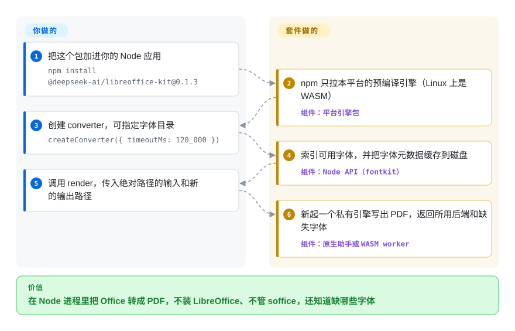

# dsh-libreoffice-kit

你的 Node 服务要把用户传来的 `.docx` / `.xlsx` / `.pptx` 变成 PDF 或页面截图，常规做法是每台机器装一套 LibreOffice 再调 `soffice --headless`：系统依赖很重，进程要你自己看管，宋体合同还会悄悄换成别的字体、换行全变。这个套件把裁剪过的预编译 LibreOffice 引擎做成 npm 依赖，给你一个 `render` 调用：用哪些字体由你定，文档要了却没拿到的字体会列给你。

## 何时使用

你维护一个 Node.js 应用——桌面客户端、文档预览后端或批处理任务——它收到 Office 文件后要显示成 PDF 或 PNG。现在要么让用户自己装 LibreOffice，要么把它塞进容器镜像、每个文件起一次 `soffice --headless --convert-to pdf`；结果一份用宋体写的合同被换成后备字体，换行和分页都变了，你也没法告诉用户“这份文档要 SimSun，而你的机器上没有”。你想让转换器跟着 `npm install` 一起到位，离线运行、不依赖系统 LibreOffice，并且对字体说清楚。

这时就该想到它。npm 只为你的平台装一个预编译引擎（macOS/Windows 用原生版，Linux 用 WebAssembly 版）；`createConverter()` 索引你指定的字体目录，`render` / `convert` / `recalculate` / `renderImages` 每次都在一个全新的私有引擎进程里跑，带超时、取消和字节上限，结果里附 `missingFonts` 清单。不想多跑一个 HTTP 容器时，选它而不是 [Gotenberg](https://github.com/gotenberg/gotenberg)；不能假设主机装了 LibreOffice 时，选它而不是 `libreoffice-convert` 这类包装或 [unoserver](https://github.com/unoconv/unoserver)。

## 怎么用起来

这个仓库本身是围绕上游 LibreOffice 的一套构建与打包配方（原生助手用 git 子模块钉住 `LibreOffice/core` 的某个提交，WASM 版用 Emscripten 编译 LibreOffice 26.8），外加一层 TypeScript 写的 Node API。配方关掉转换用不到的部分——Java/Python 脚本、数据库连接、PDF 导入、帮助、图库、在线更新和 WebDAV/LDAP 集成——把剩下的静态链接，再按平台各发一个引擎包，作为 npm 的“可选依赖”（optional dependency：npm 只下载和你的系统、CPU 匹配的那一个）。运行时，Node API 接手 LibreOffice 留给你的那些活：用 `fontkit`（一个读字体文件的 JS 库）扫描字体目录，把选中的原始字体文件交给引擎；每一次转换都新起一个原生进程或 Node worker，配一个用完即弃的配置目录；执行输入/输出大小上限和超时；失败时删掉半成品。可以把它想成随包附赠的一间封闭打印房：你递进去文件路径、说好 PDF 放哪；架子上摆哪些字体，仍由你决定。鉴权、存储和预览界面依然归你的应用。

<!-- flow-steps:begin (generated from flows/dsh-libreoffice-kit.json by tools/flow_card.py — do not edit) -->

流程文字版

1. **你**：把这个包加进你的 Node 应用 — `npm install @deepseek-ai/libreoffice-kit@0.1.3`
2. **dsh-libreoffice-kit**：npm 只拉本平台的预编译引擎（Linux 上是 WASM） — 组件：`平台引擎包`
3. **你**：创建 converter，可指定字体目录 — `createConverter({ timeoutMs: 120_000 })`
4. **dsh-libreoffice-kit**：索引可用字体，并把字体元数据缓存到磁盘 — 组件：`Node API（fontkit）`
5. **你**：调用 render，传入绝对路径的输入和新的输出路径
6. **dsh-libreoffice-kit**：新起一个私有引擎写出 PDF，返回所用后端和缺失字体 — 组件：`原生助手或 WASM worker`

**价值**：在 Node 进程里把 Office 转成 PDF，不装 LibreOffice、不管 soffice，还知道缺哪些字体

<!-- flow-steps:end -->

## 何时不用

- **需要原生速度的 Linux 服务器。** Linux 上正式发布的只有 WebAssembly 引擎——仓库里有 Linux 原生配方，但 npm 上没有发布 Linux 原生包（只发了 macOS 和 Windows 原生版）。WASM 的排版和 PDF 导出都在 Node worker 里用 CPU 跑，而且每次渲染都新起引擎；要做高吞吐的 Linux 转换服务，改用 [Gotenberg](https://github.com/gotenberg/gotenberg)（容器里的原生 LibreOffice，前面是 HTTP API）或 [unoserver](https://github.com/unoconv/unoserver)（常驻预热的 LibreOffice 监听进程）。
- **调用方是 Python、Go、Java 或 shell。** 它是 Node ≥ 22.19 的库加一个 Node CLI（`dsoffice`）。其他运行时直接调 LibreOffice 无头模式（`soffice --headless --convert-to pdf`），Python 里用 unoserver，或者在 HTTP 后面放 Gotenberg。
- **没有字体的极简容器。** 套件不内置也不下载任何字体；WASM 引擎只用它导入的字体，一个都找不到就以 `unavailable` 拒绝。如果你没法随部署带一套字体（尤其是中日韩覆盖），用自带字体的 [Gotenberg](https://github.com/gotenberg/gotenberg) 镜像更省事。
- **要求和 Microsoft Office 像素级一致。** README 明说不保证与 Microsoft Office 或不同引擎之间输出一致；保真度只在一台主机上用六个合成样例验证过。法律文书或印刷级输出，用真正的 Office 渲染（例如 [Office-Word-MCP-Server](office-word-mcp-server.zh.md) 包装的 Word 自动化 PDF 路径）或商业引擎。
- **你要改 Office 文件而不是渲染它。** 除了 `recalculate`（刷新表格公式结果再保存），它不修改文档。写文档用 [python-docx](python-docx.zh.md)、[XlsxWriter](xlsxwriter.zh.md) 或 [Apache POI](apache-poi.zh.md)；需要智能体边改边看渲染结果，用 [OfficeCLI](officecli.zh.md)。
- **输入格式超出支持范围。** `.wps`、改名成 `.doc` 的 RTF/HTML，以及 Word 2003 XML、SpreadsheetML、DocBook（这些 XSLT 过滤器被裁掉了）都会被拒；PDF 只能作为 PNG 渲染的输入，不能当转换源。长尾格式请用完整版 LibreOffice。
- **你需要公开、可复现的发布记录。** 这个 GitHub 仓库是内部仓库的公开镜像：没有 Releases、没有 tag、没有 CI 工作流，也没有 issue 区，引擎归档发布在“内部”仓库的 Releases 里；2026-10-01 当天 npm 已经发到 0.1.5（新增了 `koffi` 依赖），镜像里的源码还停在 0.1.3。如果你必须自己构建出正在运行的那份代码，就钉一个能从镜像重建的版本，或者直接用上游 LibreOffice。
- **没装 VC++ 运行库的 Windows 主机。** Windows 引擎需要对应架构的 Microsoft Visual C++ v14 Redistributable，套件不附带；在锁死的 Windows 机群上，要么预先装好，要么改用服务端转换。

## 横向对比

| 替代品 | 是否收录 | 我们的评价 | 取舍 |
|---|---|---|---|
| LibreOffice 无头模式（`LibreOffice/core`，`soffice --headless --convert-to pdf`） | 未收录 | 主机上已经装了 LibreOffice、或调用方不是 Node 时，直接调 LibreOffice；转换器必须随 `npm install` 到位、不能依赖系统办公套件时，选本页套件。 | 格式覆盖最全、所有过滤器都在，但系统安装体积大、每次调用都要启动进程，字体替换也看不见。本批次未收录。 |
| Gotenberg（`gotenberg/gotenberg`） | 未收录 | 要在 Linux 上搭一个与语言无关的转换服务，尤其还要用 Chromium 做 HTML/URL → PDF 时，选 Gotenberg；要在 Node 进程内转换、不多跑容器时，选本页套件。 | 一边是带原生 LibreOffice 和 Chromium 的 Docker HTTP API、八年历史；一边是嵌入式库，Linux 走 WASM，历史只有几周。本批次未收录。 |
| unoserver（`unoconv/unoserver`） | 未收录 | Python 技术栈里已有 LibreOffice、想用常驻监听进程省掉每个文件的启动开销，选 unoserver；不能指望主机装有 LibreOffice 时，选本页套件。 | 复用一个在跑的 LibreOffice（重复调用更快，但共享状态和进程守护归你），对比每次渲染一个隔离的新引擎（更安全，但每次都付启动成本）。本批次未收录。 |
| libreoffice-convert（`elwerene/libreoffice-convert`） | 未收录 | 主机上已有 `soffice`、只想写几行 Node 胶水时用它；还需要内置引擎、字体控制、超时和大小上限时，用本页套件。 | 很小的 MIT 包装，调用已安装的二进制，可移植性取决于你的 LibreOffice 安装，也没有缺字体报告。本批次未收录。 |
| [OfficeCLI](officecli.zh.md) | ✅ | 智能体要创建或编辑 Office 文件、并查看自己产出的 HTML/PNG 渲染时，选 OfficeCLI；要对任意传入文档做 LibreOffice 级别的 PDF 导出时，选本页套件。 | OfficeCLI 的渲染器是自研 HTML（PNG 靠外部浏览器）；本页套件用的是 LibreOffice 的排版引擎，但不能写或改文档。 |

## 技术栈

- **Node API：** TypeScript（ESM），用 `tsdown` 构建；测试是 `vitest`（`packages/entry/tests` 下 29 个 spec 文件），外加 `test/` 下的 Node 测试脚本。0.1.3 源码的运行时依赖：`fontkit` 2.0.4（字体元数据与字形覆盖）、`fflate`（检查 OOXML 的 ZIP 包）、`saxes`（为 `missingFonts` 扫描解析 XML）；npm 0.1.5 另加了 `koffi`（一个 Node FFI 库）。
- **引擎：** 以子模块钉住 LibreOffice core（提交 `bce0998`），带 63 个原生补丁（静态链接、关闭更新/curl/数据库对话框、确定性字体匹配、PDFium 栅格化）；C++ 助手（`engine/native/worker.cxx`）驱动 LibreOfficeKit。WASM：用 Emscripten 4.0.10 编译 LibreOffice 26.8，另有一套补丁；构建后再裁剪 `soffice.data` 里的资源。
- **打包：** pnpm workspace；按平台分包 `darwin-arm64`、`darwin-x64`、`win32-arm64`、`win32-x64`、`wasm`（Linux），每个包都带 `prebuilds.json` 完整性清单、源码配方和许可证声明。

## 依赖

- Node.js **≥ 22.19.0**。
- 一个引擎包，作为 npm 可选依赖自动安装：`darwin-arm64` 解压后约 153 MB，`wasm` 约 152 MB（npm 0.1.5）。如果包管理器或安装参数跳过了可选依赖，API 会在 `createConverter` 时以 `unavailable` 拒绝。
- 字体由你提供（系统/用户字体目录，或显式的 `fontDirectories`），套件一个都不带。
- Windows：Microsoft Visual C++ v14 Redistributable（x64 或 ARM64，与 Node 架构一致）。
- 除 npm 本身外，安装和运行都不联网；不需要系统 LibreOffice。

## 运维难度

**低到中。** 接入只是一个 npm 依赖加一对 `createConverter` / `dispose`，没有守护进程也不占端口。麻烦在周边：给每台主机配齐字体；为“每次渲染都启动一次引擎”预留 CPU 和内存（同一个 converter 上的渲染是串行的，要并发就开多个 converter，最好都从一个 `createConverterFactory` 里出）；确认打包器或安装器保留了可选的平台包以及其中的 `sources/` 和 `licenses/` 目录（MPL-2.0 再分发要求）；还要跟上一个 16 天发了 16 个 npm 版本的 0.x API。自己重建引擎是另一回事：每个平台都要完整编译一次 LibreOffice，步骤见 `docs/building.md`。

## 健康度与可持续性

- **维护（2026-10-01）：** 非常活跃——镜像里 2026-09-11 到 2026-09-29 有 190 个提交，npm 几乎每天发版（两天内从 0.1.3 到 0.1.5）。但公开镜像只是快照：这里没有 Releases、tag 和 CI，核查当天还落后 npm 两个版本。
- **治理 / 巴士因子：** 仓库属于 DeepSeek 组织，但所有提交都来自同一位工程师（`yudshj`）；npm 列了三位维护者，其中两位从邮箱看与 DeepSeek 相关。路线图由 DeepSeek Harness 的需要决定——该仓库里一份 2026-09-14 的架构笔记把这个套件从 Harness 单体仓库拆出来，让引擎构建按自己的节奏发布。
- **背书与寿命：** 由 DeepSeek 支持，被 DeepSeek Harness（`deepseek-ai/deepseek-harness`，约 24.2 万星）以精确版本钉住使用。项目只有几周大，Lindy 先验给不出任何加分；它的未来取决于 Harness 是否继续用这个组件、以及镜像是否继续公开。仓库描述自己就写着“DeepSeek Harness 使用的内部组件”。
- **采用情况：** 截至 2026-09-29 的一个月 npm 下载 538002 次（其中最后一周约 37.9 万），最可能是随 Harness 安装被拉下来的，而不是独立用户 [推断：包才两周大，仓库只有 53 星]。镜像关闭了 issue、讨论区和 wiki，PR 接口也返回 404，外部用户没有任何公开渠道报 bug 或提问。
- **风险信号：** MPL-2.0（文件级 copyleft——嵌入没问题，但改过的套件/引擎文件必须开源，附带的声明也必须随包分发）。1.0 之前、API 变化快，镜像落后 npm，又自称“内部组件”，对外部用户没有任何支持承诺。

## 存疑（未验证）

- [推断] npm 下载大部分来自 DeepSeek Harness 的安装，而非直接采用者——依据是包龄和 53 星；npm 不按下载公开依赖方。
- [未验证] Linux 上 WASM 转换相对原生 LibreOffice 的速度——仓库附带基准测试工具，但没公布结果；这里没有跑（需要 Linux 主机和样例集）。
- [未验证] README 报告的保真度只覆盖一台 macOS ARM64 主机上的六个合成 DOCX/XLSX/PPTX 样例；真实文档未测。
- [未验证] npm 0.1.4/0.1.5 的源码是否会推到公开镜像，以及为何加入 `koffi`——截至 2026-10-01 镜像里看不到。
- [未验证] 每次渲染的峰值内存——README 说字体和输出上限并不约束原生内存或临时磁盘占用；没有公布数字。
- [推断] npm 第三位维护者（`imccyu`）的归属——查到的资料里都没写。
