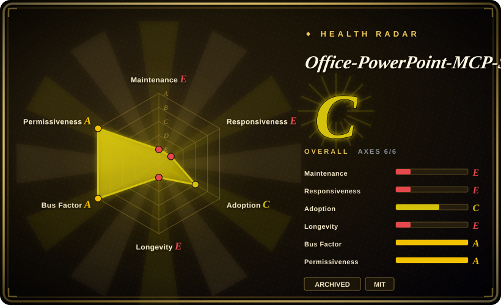
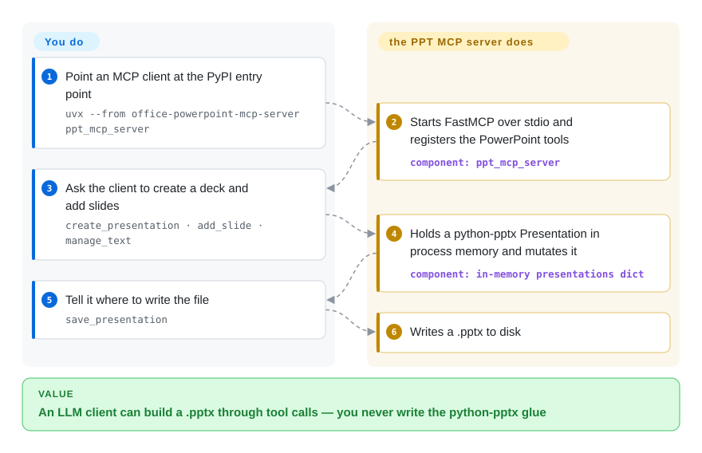

# Office-PowerPoint-MCP-Server

An MCP server that lets an LLM create and edit `.pptx` files through 34 tools — the most-starred PowerPoint MCP server, and **archived by its author on 2026-03-03**. Treat it as a pattern source, not a dependency.

## When to use

Your agent's system prompt already lists `create_presentation`, `add_slide`, and `save_presentation` by name, and last week's run wrote forty `.pptx` files through that schema. Unplugging the server turns every one of those names into a missing tool. Keep the process alive only for that bind.

Do not add it to a blank MCP config. GongRzhe flipped GitHub's archive bit on 2026-03-03; the 34 `@app.tool` functions in `tools/` (counted 2026-09-23) sit on [python-pptx](python-pptx.md) with no `tests/` directory, and `manage_slide_transitions` returns a placeholder string instead of writing transition XML. The 25 layouts in `slide_layout_templates.json` are JSON recipes, not `.potx` files. Reach for [OfficeCLI](officecli.md) when the agent must look at the slide, set a real animation, or touch Word and Excel in the same run; call [python-pptx](python-pptx.md) from your own code when the deliverable is a `.pptx` you already know how to unit-test.

## How it works

The server is a FastMCP process wrapping [python-pptx](python-pptx.md). You never import that library: an MCP client starts the `ppt_mcp_server` entry point (the README's recommended path is `uvx --from office-powerpoint-mcp-server ppt_mcp_server`), and the process keeps a dictionary of `Presentation` objects in memory. Each tool call looks up the current `presentation_id` and mutates that object; nothing hits disk until `save_presentation`. The 25 "slide templates" are JSON recipes in `slide_layout_templates.json` that place shapes and pick one of four colour schemes — they are not PowerPoint `.potx` files. `manage_slide_transitions` is advertised as a tool; its implementation returns a "placeholder for future enhancement" string and does not write transition XML (verified in `tools/transition_tools.py`, 2026-09-23). Think of it as a waiter who takes orders in the restaurant's language and walks them to a kitchen that closed months ago — the menu is still on the table.

<!-- flow-steps:begin (generated from flows/office-powerpoint-mcp-server.json by tools/flow_card.py — do not edit) -->

Text version of the flow

1. **You**: Point an MCP client at the PyPI entry point — `uvx --from office-powerpoint-mcp-server ppt_mcp_server`
2. **Office-PowerPoint-MCP-Server**: Starts FastMCP over stdio and registers the PowerPoint tools — component: `ppt_mcp_server`
3. **You**: Ask the client to create a deck and add slides — `create_presentation · add_slide · manage_text`
4. **Office-PowerPoint-MCP-Server**: Holds a python-pptx Presentation in process memory and mutates it — component: `in-memory presentations dict`
5. **You**: Tell it where to write the file — `save_presentation`
6. **Office-PowerPoint-MCP-Server**: Writes a .pptx to disk

**Value**: An LLM client can build a .pptx through tool calls — you never write the python-pptx glue

<!-- flow-steps:end -->

## When NOT to use

- **Any new project** → GitHub GraphQL `isArchived: true`, `archivedAt: 2026-03-03T14:28:43Z`; last push 2025-12-31 (API-verified 2026-09-23). No fixes, no dependency bumps, no security response. Use [OfficeCLI](officecli.md) for a maintained agent-facing CLI, or wrap [python-pptx](python-pptx.md) yourself.
- **Animations, morph, or slide transitions** → `manage_slide_transitions` is a stub that reports limited python-pptx support and does not set transitions. The library it wraps has had no animation API since a 2017 feature request (see [python-pptx](python-pptx.md)). Use [OfficeCLI](officecli.md), which documents animation presets, effect chains, and morph/p14/p15 transitions.
- **Anything the agent must *see*** → no HTML/PNG preview, no rasterization, no watch loop. For generate → inspect → fix, use [OfficeCLI](officecli.md) (`view … html|png`).
- **Word or Excel** → PowerPoint only. The author's Word sibling [Office-Word-MCP-Server](office-word-mcp-server.md) was archived 15 seconds earlier in the same 2026-03-03 wave; no Excel equivalent existed. Use [OfficeCLI](officecli.md) for all three formats.
- **You need audited behaviour** → the repo root listing has no `tests/` directory (API-verified 2026-09-23) against 34 tools and a 14.8 KB `ppt_mcp_server.py`. Prefer calling [python-pptx](python-pptx.md) from code you test yourself.
- **You believed `auto_generate_presentation` was a model** → README v2.0 lists it under "AI-powered presentation generation". The function interpolates the topic string into hardcoded business/academic/creative template sequences (`tools/template_tools.py`); no model is called.
- **You need a small, honest dependency floor** → `requires-python = ">=3.6"` in `pyproject.toml` while `mcp[cli]>=1.8.0` is declared; the Smithery Dockerfile already pins `python:3.10-alpine`. That floor will not be reconciled. Calling [python-pptx](python-pptx.md) directly needs four deps and Python 3.8+.

## Comparison

| Alternative | In index | Our verdict | Tradeoff |
| --- | --- | --- | --- |
| [OfficeCLI](officecli.md) | ✅ | Pick OfficeCLI for anything new: it is maintained, covers Word plus Excel plus PowerPoint, needs no MS Office install, and adds a render-back loop plus animation/transition APIs this server only advertised; pick this server only when an existing integration is already bound to its tool names. | OfficeCLI is a CLI (MCP clients use a wrapper or its built-in MCP mode) in a 6-month-old solo-authored binary; this server was MCP-native from day one but is archived, PowerPoint-only, and its transition tool is a stub. |
| [python-pptx](python-pptx.md) | ✅ | Pick python-pptx and write your own thin MCP layer — this server *is* that pattern, frozen at v2.0.7, and python-pptx is its live upstream (`python-pptx>=0.6.21`). | You gain a pinnable library and full control of the tool schema; you lose the 34 ready-made tools and the 25 JSON layouts, which you would have to port from `tools/` and `slide_layout_templates.json`. |
| [Office-Word-MCP-Server](office-word-mcp-server.md) | ✅ | Do not pick either sibling for new work — both were archived by GongRzhe on 2026-03-03, 15 seconds apart. Reach for this page only if the bound schema is PowerPoint; reach for the Word page only if it is Word. | Same author, same mass-archive, same "MCP wrapper over an OOXML library" shape; Word wrapped python-docx (~55 tools, including footnotes), this one wrapped python-pptx (34 tools, including a transition stub). |
| [Pandoc](../markdown-tools/pandoc.md) | ✅ | Pick Pandoc when the deck is a one-way export from Markdown and a reference deck supplies the styling; pick a PowerPoint MCP server only when the LLM must iteratively edit an existing `.pptx` in place — which Pandoc cannot do. | Pandoc is one call, actively maintained, and has no object model; this server offered in-place editing through tool calls but is now unmaintained. |

## Tech stack

Python, built on FastMCP (`from mcp.server.fastmcp import FastMCP`) and `python-pptx>=0.6.21` for all OOXML manipulation (verified in `pyproject.toml` and `ppt_mcp_server.py`, 2026-09-23). `Pillow>=8.0.0` handles image enhance-on-insert; `fonttools>=4.0.0` feeds `manage_fonts`. Declared `requires-python = ">=3.6"`; `mcp[cli]>=1.8.0` is the protocol layer. Code layout: `ppt_mcp_server.py` (14.8 KB, process-global `presentations` dict, stdio/http/sse transports) plus `tools/` — `presentation_tools.py` (7 tools), `content_tools.py` (8), `template_tools.py` (7), `structural_tools.py` (4), `professional_tools.py` (3), and one tool each in `hyperlink_tools.py`, `chart_tools.py`, `connector_tools.py`, `master_tools.py`, `transition_tools.py` (34 `@app.tool` registrations). Three extra session tools live in the server file (`list_presentations`, `switch_presentation`, `get_server_info`). Packaged with hatchling; entry point `ppt_mcp_server`. Distribution via `uvx` or `pip`; a Smithery-generated `Dockerfile` (`python:3.10-alpine`) and `smithery.yaml`. Default branch `main`.

## Dependencies

A Python runtime and an MCP-capable client (Claude Desktop, Cursor, or your own). No Microsoft PowerPoint install — unlike the Word sibling's PDF tool, this wrapper never shells out to Office. Optional: `PPT_TEMPLATE_PATH` for extra `.pptx`/`.potx` search dirs. In-memory decks vanish when the process exits; `save_presentation` is the only persistence. Default transport is stdio (no port, no auth). `--transport http --port 8000` and SSE are implemented in `main()` with no authentication in the argparse path (verified in `ppt_mcp_server.py`, 2026-09-23). Because the repo is archived, every dependency is now unpinned against future upstream breakage: a `mcp` or `python-pptx` major release can break it with no upstream fix available.

## Ops difficulty

**Low to run, high to own.** Running is `uvx --from office-powerpoint-mcp-server ppt_mcp_server` in an MCP client config, or `python ppt_mcp_server.py`; stdio means no port and no supervision. Owning it is the problem. The repo is archived, so there is no patch path for a CVE in `mcp`, `python-pptx`, Pillow, or fonttools; 27 GitHub `open_issues_count` will stay open; `get_server_info` still reports `total_tools: 32` while 34 tools are registered; and `pyproject.toml`'s wheel `only-include` lists `enhanced_slide_templates.json`, which is not in the repo root (only `slide_layout_templates.json` is). If you adopt it anyway, fork it, pin every dependency, drop the HTTP transport, and treat the fork as yours permanently. For a maintained path with comparable agent ergonomics, use [OfficeCLI](officecli.md) (built-in MCP mode) or wrap [python-pptx](python-pptx.md) in your own FastMCP server.

## Health & viability

- **Maintenance: dead, verified** — GitHub GraphQL `isArchived: true`, `archivedAt: 2026-03-03T14:28:43Z`; last push 2025-12-31T13:23:39Z (`chore: bump version to 2.0.7`, tag v2.0.7, PyPI upload the same minute); 41 default-branch commits over a ~9-month active life (created 2025-03-25). 27 open issues with no path to closure (API-verified 2026-09-23).
- **Governance: author-driven, then abandoned** — `GongRzhe` 24 of 41 contributor-API commits (59%), `KaliGong` 6, `calclavia` 3, then a long tail of 1–2. More community patches than a pure solo repo, not enough to survive the author leaving.
- **Backing & longevity: the decisive signal** — GongRzhe **mass-archived the MCP portfolio on 2026-03-03 between 14:28 and 14:33 UTC** (GraphQL `archivedAt`, verified 2026-09-23): this repo at 14:28:43, [Office-Word-MCP-Server](office-word-mcp-server.md) 15 seconds earlier at 14:28:28, then `Gmail-MCP-Server`, `Quickchart-MCP-Server`, `Human-In-the-Loop-MCP-Server`, `A2A-MCP-Server`, `terminal-controller-mcp`, `opencv-mcp-server`, `JSON-MCP-Server`, `TRAVEL-PLANNER-MCP-Server`, `Office-Visio-MCP-Server`, `APIWeaver`, `Image-Generation-MCP-Server`, `REDIS-MCP-Server`, `YOLO-MCP-Server`, and others — 15 sampled MCP repos in a five-minute window. Last *code* on the two Office servers was 2025-12-31; the archive button was pressed later, together. [推断] This is an exit from the space, not a per-project decision, so no revival should be planned for.
- **Age / Lindy: fails both halves** — ~18 months old at verification and not active. The prior offers nothing here; compare [python-pptx](python-pptx.md) (13 years, still the library this server wrapped).
- **Adoption: real but stranded** — 1,854 stars / 247 forks made it the most-starred PowerPoint MCP server, and it is still what an agent will surface when asked for "PowerPoint MCP". That is why it is indexed: the star count outruns the maintenance state, and an agent choosing on stars alone would pick a dead project.
- **Risk flags** — archived with open issues; transition tool is a documented stub; README "AI-powered" generation is template fill; `requires-python >=3.6` vs `mcp[cli]>=1.8.0`; optional HTTP/SSE with no auth; MIT licensed with no relicense history. The archive itself is the risk flag: no security response is forthcoming for any transitive dependency.

## Caveats (unverified)

- [未验证] Runtime tool count as seen by an MCP client — 34 `@app.tool` functions were counted in `tools/`, plus 3 session tools in `ppt_mcp_server.py`; README says both 32 and 34; `get_server_info` hard-codes 32. The live registration list was not enumerated by starting the server.
- [未验证] Whether the 25 JSON layouts round-trip cleanly in real PowerPoint — `slide_layout_templates.json` is 107 KB and the README lists template ids, but no fixture deck was opened in PowerPoint here.
- [未验证] Whether README claims of "professional animations" and "interactive hover effects" on those templates write any animation XML, or are copy left over from the JSON recipes. `manage_slide_transitions` is a stub; python-pptx has no animation API.
- [未验证] That `--transport http` really binds with no auth — argparse and `app.run(transport='streamable-http')` were read; the process was not started.
- [未验证] Whether `enhanced_slide_templates.json` (named in hatch `only-include`) ever existed on another branch, or is a packaging typo for `slide_layout_templates.json`.
- [推断] The author's exit from the MCP space is inferred from GraphQL `archivedAt` clustering of 15 sibling repositories on 2026-03-03; no public statement of intent was located.
- [未验证] Whether any maintained community fork exists that would be a better adoption target than the archived original — none was searched for systematically during this review.
- [未验证] Compatibility of `mcp[cli]>=1.8.0` / FastMCP against current MCP client versions; the range is open-ended and the repo is archived, so drift is unmeasured.
- [未验证] PyPI download volume for `office-powerpoint-mcp-server` — pypistats returned HTTP 429 during this review; the health scorer's registry figure is the source if present.
