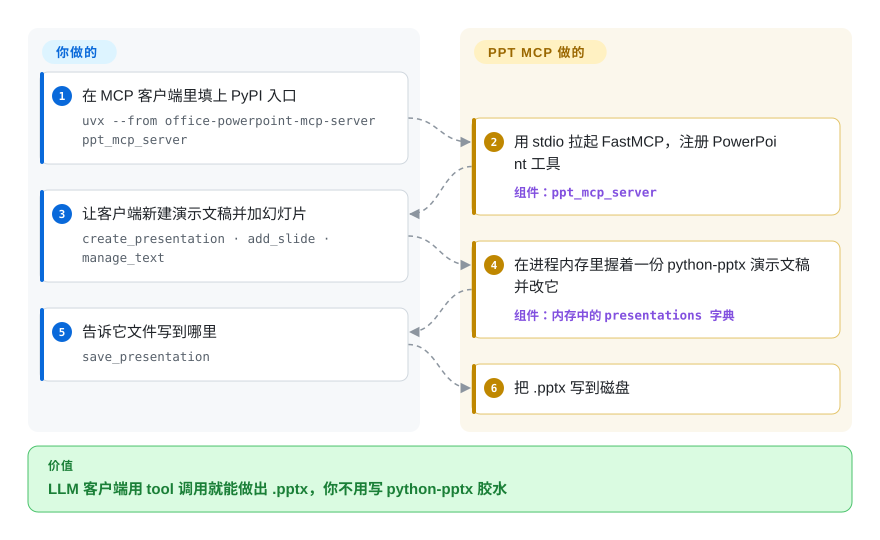

# Office-PowerPoint-MCP-Server

一个 MCP server，让 LLM 通过 34 个工具创建和编辑 `.pptx`——star 数最高的 PowerPoint MCP server，且已**被作者于 2026-03-03 归档**。把它当设计参考，不要当依赖。

## 何时使用

你的 agent 系统提示里已经点名了 `create_presentation`、`add_slide` 和 `save_presentation`，上周那次运行顺着这套 schema 写出了四十份 `.pptx`。拔掉这个 server，那些名字会全部变成找不到的工具。只有这种绑定还值得把进程留着。

空白的 MCP 配置不要加它。GongRzhe 在 2026-03-03 按下了 GitHub 归档键；`tools/` 里 34 个 `@app.tool`（2026-09-23 清点）坐在 [python-pptx](python-pptx.zh.md) 上面，仓库没有 `tests/` 目录，而且 `manage_slide_transitions` 返回的是占位字符串，并不写切换动画 XML。`slide_layout_templates.json` 里那 25 套布局是 JSON 配方，不是 `.potx` 文件。agent 必须看见幻灯片、设置真正的动画，或同一次运行里还要碰 Word 和 Excel，就选 [OfficeCLI](officecli.zh.md)；交付物只是一份你已经会单测的 `.pptx`，就在自己的代码里调 [python-pptx](python-pptx.zh.md)。

## 怎么用起来

这个 server 是包着 [python-pptx](python-pptx.zh.md) 的 FastMCP 进程。你不用 import 那个库：MCP 客户端拉起 `ppt_mcp_server` 入口（README 推荐的路径是 `uvx --from office-powerpoint-mcp-server ppt_mcp_server`），进程在内存里握着一份 `Presentation` 对象字典。每次 tool 调用按当前 `presentation_id` 改那个对象；在 `save_presentation` 之前磁盘上什么都没有。那 25 套「幻灯片模板」是 `slide_layout_templates.json` 里的 JSON 配方，负责摆形状、挑四种配色之一——它们不是 PowerPoint 的 `.potx` 文件。`manage_slide_transitions` 被当成工具宣传；实现只返回一句 “placeholder for future enhancement”，并不写切换动画的 XML（2026-09-23 在 `tools/transition_tools.py` 中验证）。可以把它想成一个仍用餐厅黑话点单的服务员，厨房几个月前就打烊了——菜单还摊在桌上。

<!-- flow-steps:begin (generated from flows/office-powerpoint-mcp-server.json by tools/flow_card.py — do not edit) -->

流程文字版

1. **你**：在 MCP 客户端里填上 PyPI 入口 — `uvx --from office-powerpoint-mcp-server ppt_mcp_server`
2. **Office-PowerPoint-MCP-Server**：用 stdio 拉起 FastMCP，注册 PowerPoint 工具 — 组件：`ppt_mcp_server`
3. **你**：让客户端新建演示文稿并加幻灯片 — `create_presentation · add_slide · manage_text`
4. **Office-PowerPoint-MCP-Server**：在进程内存里握着一份 python-pptx 演示文稿并改它 — 组件：`内存中的 presentations 字典`
5. **你**：告诉它文件写到哪里 — `save_presentation`
6. **Office-PowerPoint-MCP-Server**：把 .pptx 写到磁盘

**价值**：LLM 客户端用 tool 调用就能做出 .pptx，你不用写 python-pptx 胶水

<!-- flow-steps:end -->

## 何时不用

- **任何新项目** → GitHub GraphQL `isArchived: true`，`archivedAt: 2026-03-03T14:28:43Z`；最后一次 push 是 2025-12-31（API 2026-09-23 验证）。没有修复、没有依赖升级、没有安全响应。要维护中的、面向 agent 的 CLI 请用 [OfficeCLI](officecli.zh.md)，或者自己封装 [python-pptx](python-pptx.zh.md)。
- **动画、Morph 或幻灯片切换** → `manage_slide_transitions` 是桩，报告 python-pptx 支持有限，并不真正设置切换。它包装的库从 2017 年的功能请求起就没有动画 API（见 [python-pptx](python-pptx.zh.md)）。改用 [OfficeCLI](officecli.zh.md)，它文档里写了动画预设、效果链和 morph／p14／p15 切换。
- **agent 必须「看见」幻灯片** → 没有 HTML／PNG 预览，没有栅格化，没有 watch 循环。要生成 → 检查 → 修改，用 [OfficeCLI](officecli.zh.md)（`view … html|png`）。
- **Word 或 Excel** → 只有 PowerPoint。作者的 Word 姊妹项目 [Office-Word-MCP-Server](office-word-mcp-server.zh.md) 在同一波 2026-03-03 归档里早 15 秒被按下按钮；从未有过 Excel 等价物。三个格式都要请用 [OfficeCLI](officecli.zh.md)。
- **你需要经过审计的行为** → 仓库根目录列表里没有 `tests/` 目录（API 2026-09-23 验证），却对着 34 个工具和一个 14.8 KB 的 `ppt_mcp_server.py`。优先在你自己能测的代码里调 [python-pptx](python-pptx.zh.md)。
- **你以为 `auto_generate_presentation` 会调模型** → README v2.0 把它写在「AI-powered presentation generation」下面。函数只是把主题字符串填进写死的 business／academic／creative 模板序列（`tools/template_tools.py`）；没有模型被调用。
- **你想要小而诚实的依赖地板** → `pyproject.toml` 写着 `requires-python = ">=3.6"`，同时又声明 `mcp[cli]>=1.8.0`；Smithery 的 Dockerfile 已经钉在 `python:3.10-alpine`。这层地板不会再被对齐。直接调 [python-pptx](python-pptx.zh.md) 只需四个依赖和 Python 3.8+。

## 横向对比

| 替代品 | 是否收录 | 我们的评价 | 取舍 |
| --- | --- | --- | --- |
| [OfficeCLI](officecli.zh.md) | ✅ | 任何新工作都选 OfficeCLI：它在维护中、覆盖 Word 加 Excel 加 PowerPoint、不需要安装 MS Office，还多一个渲染回看闭环，以及这个 server 只在宣传里出现的动画／切换 API；只有当既有集成已经绑定这个 server 的工具名时才选它。 | OfficeCLI 是 CLI（MCP 客户端需要一层封装或用它内置的 MCP 模式），而且是 6 个月大、几乎单作者的二进制；这个 server 从第一天起就是 MCP 原生的，但已归档、只有 PowerPoint，且切换工具是桩。 |
| [python-pptx](python-pptx.zh.md) | ✅ | 选 python-pptx 并自己写一层薄 MCP——这个 server **就是**那个模式，冻结在 v2.0.7，而 python-pptx 是它活着的上游依赖（`python-pptx>=0.6.21`）。 | 你得到一个可钉死的库和对 tool schema 的完全控制权；代价是失去 34 个现成工具和 25 套 JSON 布局——你得自己从 `tools/` 和 `slide_layout_templates.json` 移植。 |
| [Office-Word-MCP-Server](office-word-mcp-server.zh.md) | ✅ | 两个姊妹项目都不要拿来做新工作——GongRzhe 在 2026-03-03 把它们归档，间隔 15 秒。绑定的 schema 是 PowerPoint 才看本页；是 Word 才看那一页。 | 同一作者、同一波批量归档、同一种「MCP 包装一层 OOXML 库」的形状；Word 包装的是 python-docx（约 55 个工具，含脚注），本页包装的是 python-pptx（34 个工具，含一个切换桩）。 |
| [Pandoc](../markdown-tools/pandoc.zh.md) | ✅ | 源是 Markdown、幻灯片只是单向导出、样式靠参考文稿时选 Pandoc；只有 LLM 必须迭代式就地编辑一份已有 `.pptx` 时才选 PowerPoint MCP server——那是 Pandoc 完全做不到的。 | Pandoc 一次调用、维护活跃、没有对象模型；这个 server 曾提供通过工具调用做就地编辑的能力，但现已无人维护。 |

## 技术栈

Python，MCP 协议层走 FastMCP（`from mcp.server.fastmcp import FastMCP`），所有 OOXML 操作走 `python-pptx>=0.6.21`（2026-09-23 在 `pyproject.toml` 和 `ppt_mcp_server.py` 中验证）。`Pillow>=8.0.0` 负责插入时的图像增强；`fonttools>=4.0.0` 供给 `manage_fonts`。声明的 `requires-python = ">=3.6"`；协议层是 `mcp[cli]>=1.8.0`。代码结构：`ppt_mcp_server.py`（14.8 KB，进程级 `presentations` 字典，stdio／http／sse 传输），外加 `tools/`——`presentation_tools.py`（7 个工具）、`content_tools.py`（8）、`template_tools.py`（7）、`structural_tools.py`（4）、`professional_tools.py`（3），以及 `hyperlink_tools.py`、`chart_tools.py`、`connector_tools.py`、`master_tools.py`、`transition_tools.py` 各 1 个（共 34 处 `@app.tool` 注册）。server 文件里还有 3 个会话工具（`list_presentations`、`switch_presentation`、`get_server_info`）。用 hatchling 打包；入口点 `ppt_mcp_server`。分发走 `uvx` 或 `pip`；一个 Smithery 生成的 `Dockerfile`（`python:3.10-alpine`）和 `smithery.yaml`。默认分支 `main`。

## 依赖

一个 Python 运行时和一个支持 MCP 的客户端（Claude Desktop、Cursor，或你自己的）。不需要安装 Microsoft PowerPoint——和 Word 姊妹项目那个 PDF 工具不同，这个包装层从不把活甩给 Office。可选：`PPT_TEMPLATE_PATH` 用来加搜 `.pptx`／`.potx` 的目录。内存里的文稿在进程退出时消失；唯一的持久化是 `save_presentation`。默认传输是 stdio（没有端口、没有鉴权）。`--transport http --port 8000` 和 SSE 在 `main()` 里实现，argparse 路径上没有鉴权（2026-09-23 在 `ppt_mcp_server.py` 中验证）。因为仓库已归档，这些依赖现在全都失去了对未来上游破坏的锁定保护：`mcp` 或 `python-pptx` 发一个大版本就可能把它打断，且没有上游修复可用。

## 运维难度

**跑起来低，养起来高。** 运行是在 MCP 客户端配置里写 `uvx --from office-powerpoint-mcp-server ppt_mcp_server`，或 `python ppt_mcp_server.py`；stdio 意味着没有端口、不需要看护。养才是问题。仓库已归档，所以 `mcp`、`python-pptx`、Pillow 或 fonttools 里出 CVE 都没有补丁路径；GitHub `open_issues_count` 为 27 且会一直开着；`get_server_info` 仍报告 `total_tools: 32`，实际注册了 34 个工具；而 `pyproject.toml` 的 wheel `only-include` 点名了 `enhanced_slide_templates.json`，仓库根目录里却没有这个文件（只有 `slide_layout_templates.json`）。如果你还是要采用，请 fork 它、锁死每个依赖、关掉 HTTP 传输，并把那个 fork 当作永久属于你。要一条维护中的、agent 人机工程相当的路径，用 [OfficeCLI](officecli.zh.md)（内置 MCP 模式），或者用 [python-pptx](python-pptx.zh.md) 自己封一个 FastMCP server。

## 健康度与可持续性

- **维护：已死，已验证** —— GitHub GraphQL `isArchived: true`，`archivedAt: 2026-03-03T14:28:43Z`；最后 push 2025-12-31T13:23:39Z（`chore: bump version to 2.0.7`，tag v2.0.7，同一分钟上传 PyPI）；约 9 个月活跃生命周期里（创建于 2025-03-25）默认分支共 41 个 commit。27 个 open issue 且无关闭路径（API 2026-09-23 验证）。
- **治理：作者主导，随后弃置** —— `GongRzhe` 在 contributors API 的 41 个 commit 里占 24 个（59%），`KaliGong` 6 个，`calclavia` 3 个，之后是 1～2 的长尾。比纯单人仓库多一些社区补丁，但不够在作者离开后活下去。
- **背书与寿命：决定性信号** —— GongRzhe **在 2026-03-03 的 14:28 至 14:33 UTC 之间批量归档了整个 MCP 组合**（GraphQL `archivedAt`，2026-09-23 验证）：本仓库 14:28:43，[Office-Word-MCP-Server](office-word-mcp-server.zh.md) 早 15 秒在 14:28:28，随后是 `Gmail-MCP-Server`、`Quickchart-MCP-Server`、`Human-In-the-Loop-MCP-Server`、`A2A-MCP-Server`、`terminal-controller-mcp`、`opencv-mcp-server`、`JSON-MCP-Server`、`TRAVEL-PLANNER-MCP-Server`、`Office-Visio-MCP-Server`、`APIWeaver`、`Image-Generation-MCP-Server`、`REDIS-MCP-Server`、`YOLO-MCP-Server` 等——抽样的 15 个 MCP 仓库落在五分钟窗口里。两个 Office server 的最后一次**代码**停在 2025-12-31；归档按钮是后来一起按的。[推断] 这是退出这个领域，不是针对单个项目的决定，所以不应规划任何复活。
- **年龄／Lindy：两半都不成立** —— 验证时约 18 个月大且不活跃。先验在这里给不出任何东西；对照它仅仅包装了一下的 [python-pptx](python-pptx.zh.md)（13 年，仍是这个 server 底下的那层库）。
- **采用度：真实但搁浅** —— 1,854 star／247 fork 让它成为 star 数最高的 PowerPoint MCP server，而且当有人问「PowerPoint MCP」时，agent 依然会把它翻出来。这正是它被收录的原因：star 数跑在了维护状态前面，只按 star 选型的 agent 会选中一个死项目。
- **风险标记** —— 归档且有 open issue；切换工具是写明的桩；README 的「AI-powered」生成其实是填模板；`requires-python >=3.6` 对上 `mcp[cli]>=1.8.0`；可选的 HTTP／SSE 没有鉴权；MIT 许可，无 relicense 历史。归档本身就是那个风险标记：任何传递依赖都不会再得到安全响应。

## 存疑（未验证）

- [未验证] MCP 客户端实际看到的工具数量——`tools/` 里数到 34 个 `@app.tool` 函数，加上 `ppt_mcp_server.py` 里 3 个会话工具；README 同时写 32 和 34；`get_server_info` 写死 32。没有把 server 拉起来枚举注册列表。
- [未验证] 那 25 套 JSON 布局能否在真实 PowerPoint 里干净往返——`slide_layout_templates.json` 有 107 KB，README 列出了模板 id，但本次没有拿固定样本在 PowerPoint 里打开。
- [未验证] README 对那些模板宣称的「professional animations」和「interactive hover effects」是否真的写出了动画 XML，还是 JSON 配方里留下来的文案。`manage_slide_transitions` 是桩；python-pptx 没有动画 API。
- [未验证] `--transport http` 是否真的无鉴权绑定——读了 argparse 和 `app.run(transport='streamable-http')`；没有把进程跑起来。
- [未验证] hatch `only-include` 里的 `enhanced_slide_templates.json` 是否曾出现在别的分支，或者只是 `slide_layout_templates.json` 的打包笔误。
- [推断] 作者退出 MCP 领域是由 15 个姊妹仓库在 2026-03-03 的 GraphQL `archivedAt` 扎堆推断的；未找到公开的意图声明。
- [未验证] 是否存在某个维护中的社区 fork，会比归档的原仓库更适合采用——本次评审未系统检索。
- [未验证] `mcp[cli]>=1.8.0`／FastMCP 对当前 MCP 客户端版本的兼容性；这是一个开放区间且仓库已归档，所以漂移未被测量。
- [未验证] `office-powerpoint-mcp-server` 的 PyPI 下载量——本次评审 pypistats 返回 HTTP 429；若健康度打分器写出了 registry 数字，以它为准。
