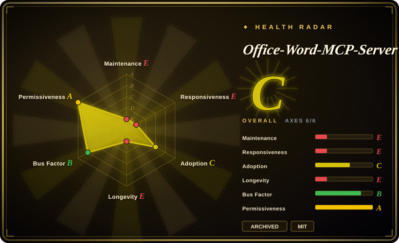

# Office-Word-MCP-Server

An MCP server exposing ~55 Word-document tools to LLM clients — the most-starred Word MCP server, and **archived by its author on 2025-12-31**. Treat it as a pattern source, not a dependency.

## When to use

You're maintaining an existing LLM integration that already speaks this server's tool schema, and ripping it out costs more than the risk of running unmaintained code. That is now the only reason to pick it. Historically the reason was different and worth recording: you wanted an LLM client (Claude Desktop, Cursor, anything MCP-capable) to create and edit `.docx` files through a standardized tool interface without writing glue code, and this server offered the broadest Word tool surface in the MCP lane — ~55 tools across document, content, format, comment, footnote, and protection modules (verified in `word_document_server/tools/`, 2026-09-18), including a substantial **footnote/endnote implementation** (`footnote_tools.py`, 25 KB) that [python-docx](python-docx.md) still lacks after a 2014 feature request. For a new build, pick [OfficeCLI](officecli.md) if the agent needs all three Office formats and a render-back loop, or call [python-docx](python-docx.md) directly from your own MCP server if you only need Word and want a live dependency underneath.

## When NOT to use

- **Any new project** → the repository is **archived** (GitHub `archived: true`, last push 2025-12-31, API-verified 2026-09-18). No fixes, no dependency bumps, no security response. Use [OfficeCLI](officecli.md) for a maintained agent-facing CLI, or wrap [python-docx](python-docx.md) yourself.
- **Linux or headless deployment needing Word→PDF** → the manifest declares `docx2pdf>=0.1.8`, whose own PyPI summary reads *"Convert docx to pdf on Windows or macOS directly using Microsoft Word (must be installed)"* — `win32com` on Windows, JXA/AppleScript on macOS (verified 2026-09-18). The server itself runs in the supplied `python:3.11-slim` Docker image, but that one tool cannot work there. Use LibreOffice headless or [OfficeCLI](officecli.md)'s HTML/PNG path instead.
- **Excel or PowerPoint** → Word only. The author's sibling `Office-PowerPoint-MCP-Server` (1,852 stars) is **also archived** (2025-12-31) and no Excel equivalent existed. Use [OfficeCLI](officecli.md) for all three formats, or [XlsxWriter](xlsxwriter.md) / [python-pptx](python-pptx.md) per format.
- **You need audited behaviour** → the repo ships two test files (`tests/test_convert_to_pdf.py`, 3.5 KB; `test_formatting.py`, 3.3 KB) against ~55 tools and a 30 KB `main.py`. Coverage is demonstrative, not a safety net. Prefer [python-docx](python-docx.md), which has 13 years of downstream production use behind it.
- **You want a small dependency surface** → it pulls `python-docx`, `fastmcp`, `msoffcrypto-tool`, `docx2pdf`, **and `pytest>=8.4.2` as a runtime dependency** (verified in `pyproject.toml`, 2026-09-18) — a packaging smell that will not be fixed, since the repo is archived. Calling [python-docx](python-docx.md) directly needs two deps.
- **You need document protection or digital signatures to be trustworthy** → the README advertises password protection, restricted editing, and "digital signatures … verify document authenticity and integrity". [未验证] OOXML digital signature *creation* is not something a Python library can do faithfully without a certificate chain and Word's own signature part semantics; verify against your compliance requirements before relying on it.

## Comparison

| Alternative | In index | Our verdict | Tradeoff |
| --- | --- | --- | --- |
| [OfficeCLI](officecli.md) | ✅ | Pick OfficeCLI for anything new: it is maintained, covers Word plus Excel plus PowerPoint, needs no MS Word install, and adds a render-back loop; pick this server only when an existing integration is already bound to its tool names. | OfficeCLI is a CLI, so an MCP client needs a wrapper or its built-in MCP mode; this server was MCP-native from day one but is archived, Word-only, and its PDF tool requires a real Word install. |
| [python-docx](python-docx.md) | ✅ | Pick python-docx and write your own thin MCP layer — this server *is* that pattern, frozen in time, and python-docx is its live upstream dependency (`python-docx>=1.1.2`). | You gain a maintained foundation and full control of the tool schema; you lose the ~55 ready-made tools including the footnote/endnote implementation, which you would have to port from `footnote_tools.py`. |
| [Pandoc](../markdown-tools/pandoc.md) | ✅ | Pick Pandoc when the source is Markdown and the docx is a one-way export; pick a Word MCP server when the LLM must iteratively edit an existing document in place — which Pandoc cannot do at all. | Pandoc is one call, actively maintained, and has no object model; this server offered in-place editing through natural-language tool calls but is now unmaintained. |
| [MarkItDown](../document-parsing/markitdown.md) | ✅ | Pick MarkItDown when the direction is .docx → Markdown for LLM ingestion; pick a Word editing server when the direction is LLM intent → .docx. Opposite directions, and MarkItDown is maintained. | MarkItDown is read-only and drops formatting by design; this server preserved the OOXML model and could write, but is archived. |

## Tech stack

Python `>=3.11`, built on `fastmcp>=2.8.1` for the MCP protocol layer and `python-docx>=1.1.2` for all OOXML manipulation (verified in `pyproject.toml`, 2026-09-18). `msoffcrypto-tool>=5.4.2` handles encrypted documents, `docx2pdf>=0.1.8` handles Word→PDF, and `pytest>=8.4.2` is declared as a **runtime** dependency. Code layout: `word_document_server/main.py` (30 KB, ~55 tool definitions, 49 footnote references) plus a `tools/` package split into `content_tools.py` (19.6 KB), `format_tools.py` (44.2 KB), `footnote_tools.py` (25 KB), `protection_tools.py` (10.6 KB), `extended_document_tools.py` (8.2 KB), `document_tools.py` (7.8 KB), and `comment_tools.py` (5 KB). Packaged with hatchling; entry point `word_mcp_server`. Distribution via `uvx` or `pip`; a Smithery-generated `Dockerfile` (`python:3.11-slim`) and `smithery.yaml` support hosted deployment, plus `RENDER_DEPLOYMENT.md`. Default branch `main`.

## Dependencies

A Python 3.11+ runtime and an MCP-capable client (Claude Desktop, Cursor, or your own). For the PDF-conversion tool specifically: **Microsoft Word installed**, on **Windows or macOS only** — `docx2pdf` drives Word via `win32com` on Windows and JXA on macOS, so that tool is unavailable in the Docker/Linux path. No database, no GPU, no network service of its own (stdio MCP transport). Because the repo is archived, every one of these dependencies is now unpinned against future upstream breakage: a `fastmcp` or `python-docx` major release can break it with no upstream fix available.

## Ops difficulty

**Low to run, high to own.** Running is trivial: `uvx --from office-word-mcp-server word_mcp_server` in an MCP client config, or build the supplied Docker image; stdio transport means no port, no auth, no supervision. Owning it is the problem. The repo is archived, so there is no patch path for a CVE in `fastmcp`, `python-docx`, `msoffcrypto-tool`, or `docx2pdf`; 66 issues are open and will stay open; and the `pytest`-as-runtime-dependency declaration means your production install pulls a test framework. If you adopt it anyway, fork it, pin every dependency with a lockfile (`uv.lock` is committed, 85 KB), and treat the fork as yours permanently. For a maintained path with comparable agent ergonomics, use [OfficeCLI](officecli.md) (which has a built-in MCP server mode) or wrap [python-docx](python-docx.md) in your own ~200-line fastmcp server.

## Health & viability

- **Maintenance: dead, verified** — GitHub `archived: true`; last push 2025-12-31; latest tag v1.1.11; 69 total default-branch commits over a ~9-month life (created 2025-03-25). 66 issues open with no path to closure (API-verified 2026-09-18).
- **Governance: author-driven, then abandoned** — `GongRzhe` 31 of 69 commits (45%), `KaliGong` 9, `jamesmehorter` 5, then a long tail. More community participation than [OfficeCLI](officecli.md) by share, but far less absolute work: 69 commits versus 6,128.
- **Backing & longevity: the decisive signal** — the author **mass-archived his entire MCP portfolio**: `Office-PowerPoint-MCP-Server` (1,852 stars, archived 2025-12-31), `Gmail-MCP-Server` (1,164 stars, archived 2025-08-06), `terminal-controller-mcp` (97), `Human-In-the-Loop-MCP-Server` (163), `Quickchart-MCP-Server` (159), `A2A-MCP-Server` (148), `opencv-mcp-server` (111), `Office-Visio-MCP-Server` (86), `APIWeaver` (49), and more — roughly 15 repositories archived between 2025-05 and 2025-12 (API-verified 2026-09-18). [推断] This is an exit from the space, not a per-project decision, so no revival should be planned for.
- **Age / Lindy: fails both halves** — 9 months old and not active. The prior offers nothing here; compare [python-docx](python-docx.md) (13 years, still shipping) which this server merely wrapped.
- **Adoption: real but stranded** — 2,106 stars / 286 forks made it the most-starred Word MCP server, and it is still what an agent will surface when asked for "Word MCP". That is precisely why it is indexed: the star count outruns the maintenance state, and an agent choosing on stars alone would pick a dead project.
- **Risk flags** — archived with open issues; `pytest` declared as a runtime dependency; `docx2pdf` imposes a hard Microsoft Word + Windows/macOS floor on one advertised feature; MIT licensed with no relicense history and no open-core gating. The archive itself is the risk flag: no security response is forthcoming for any transitive dependency.

## Caveats (unverified)

- [未验证] The exact tool count (~55) — derived by counting tool-definition patterns in `word_document_server/main.py`; the MCP registration list was not enumerated at runtime.
- [未验证] Whether the advertised "digital signatures … verify document authenticity and integrity" produces signatures Microsoft Word accepts as valid. OOXML signature creation needs a certificate chain and Word's signature part semantics; only the README claim and `protection_tools.py` (10.6 KB) were observed, not executed.
- [未验证] Whether the footnote/endnote implementation round-trips correctly in real Word — `footnote_tools.py` is substantial (25 KB) and the README documents footnote→endnote conversion and styling, but no fixture-based verification was run here.
- [未验证] That `docx2pdf` fails cleanly rather than hanging or corrupting output when invoked in the Docker/Linux path — the Windows/macOS-only requirement is verified from docx2pdf's own PyPI metadata, but the failure mode inside this server was not exercised.
- [推断] The author's exit from the MCP space is inferred from the archive dates and star counts of ~15 sibling repositories; no public statement of intent was located.
- [未验证] Whether any maintained community fork exists that would be a better adoption target than the archived original — none was searched for systematically during this review.
- [未验证] Runtime behaviour of the `fastmcp` protocol layer against current MCP client versions; `fastmcp>=2.8.1` is an open-ended range and the repo is archived, so compatibility drift is unmeasured.
