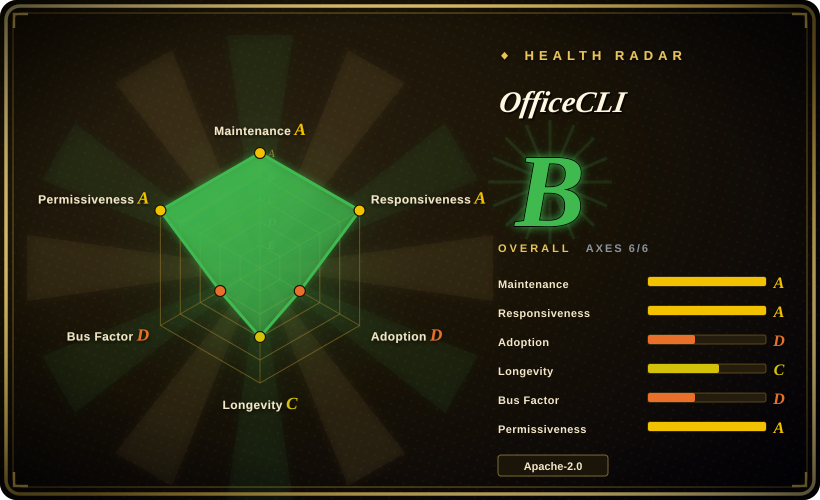

# OfficeCLI

A single-binary .NET CLI that lets an agent read, edit, and create `.docx` / `.xlsx` / `.pptx` through XPath-style paths and JSON output, with an in-house HTML renderer that closes the render → look → fix loop.

## When to use

You're building an agent workflow that must produce or modify **native** Office files — a pitch deck, a formatted report, a spreadsheet with live formulas — and the target machine has no Python environment and no Microsoft Office. You reach for OfficeCLI because it is the only indexed option that ships all three formats in one self-contained ~34 MB binary with zero runtime dependencies, addressed by a single path grammar (`/slide[1]/shape[2]`, `row[Salary>5000 and Region=EMEA]`) that returns structured JSON. Versus [python-docx](python-docx.md) / [python-pptx](python-pptx.md) / [XlsxWriter](xlsxwriter.md) you trade three Python APIs and an interpreter for one CLI an agent can call without writing code; versus [Office-Word-MCP-Server](office-word-mcp-server.md) you get all three formats instead of Word-only and no MS Word install. The deciding feature is the **render-back loop**: `officecli view deck.pptx html|png` lets a vision model inspect what it just built, which no library in this category offers. Choose it for one-shot and iterative document generation where a human will eyeball the result.

## When NOT to use

- **Reproducible document pipelines** → use [python-docx](python-docx.md) / [python-pptx](python-pptx.md) / [XlsxWriter](xlsxwriter.md) with pinned versions. OfficeCLI ships a release every ~1.58 days (100 releases spanning 2026-04-13 → 2026-09-16, API-verified) **and auto-update is on by default** (`UpdateChecker.cs:853` — `AutoUpdate { get; set; } = true`), so the same script can produce different output between two runs unless you disable it in `~/.officecli/config.json`.
- **Anything needing auditable regression evidence** → the public repo contains **no test project**: `officecli.slnx` references `tests/OfficeCli.Tests/OfficeCli.Tests.csproj`, which is absent from the 1,208 tracked files, and there are zero xunit/NUnit/MSTest references (verified 2026-09-18). `build.yml` runs only on `v*` tags and `workflow_dispatch`; PRs get only a SKILL.md diff check. For 278,904 lines of hand-written OOXML, prefer libraries with public test suites.
- **Air-gapped or offline environments** → PNG export shells out to an external browser (`Core/HtmlScreenshot.cs`: playwright CLI → Chrome/Edge/Chromium → Firefox; source comment: *"No embedded browser engine"*), mermaid-to-image needs `mmdc` or a headless browser and fetches `mermaid.min.js` from `cdn.jsdelivr.net`, and the daily update check reaches `d.officecli.ai`. The README's "No dependencies. Works everywhere." does not hold for the PNG half of the render loop. Use [python-pptx](python-pptx.md) + your own rasterizer, or [Pandoc](../markdown-tools/pandoc.md) for one-way conversion.
- **Harnesses with strict skill/prompt governance** → `officecli install` writes skill files into ~14 detected agent directories (`~/.claude/skills`, `~/.cursor/skills`, `~/.config/opencode/skills`, `~/.agents/skills`, `~/.openclaw/skills`, …), and `SkillInstaller.RefreshInstalled()` re-pushes them **automatically on every version change**. The root `SKILL.md` is 25,974 bytes of model context. If your agent config is version-controlled and reviewed, this bypasses that review. Use the libraries directly instead.
- **Long-lived infrastructure bets** → 98.2% of the 6,128 commits come from one author (`goworm` 6,017; second contributor 55, API-verified 2026-09-18), and the repo is ~6 months old. The value is in coverage breadth (tracked changes, pivot caches, slicers, morph transitions, 3D models, RTL/i18n) — exactly the part nobody else can pick up. For a dependency you must maintain for years, use the 13-year-old libraries.
- **Reading documents into RAG** → use [MarkItDown](../document-parsing/markitdown.md) or [Docling](../document-parsing/docling.md); OfficeCLI's read path returns OOXML-shaped JSON for editing, not clean Markdown for ingestion.

## Comparison

| Alternative | In index | Our verdict | Tradeoff |
| --- | --- | --- | --- |
| [python-docx](python-docx.md) | ✅ | Pick python-docx when you already run Python and need a Word dependency you can audit and pin for years; pick OfficeCLI when the agent must touch all three formats on a machine with no interpreter, or when it needs to *see* the rendered result. | OfficeCLI buys breadth + a render loop with a 6-month single-author binary and default-on auto-update; python-docx buys 13 years of MIT-licensed stability with Word-only scope and no rendering. |
| [python-pptx](python-pptx.md) | ✅ | Pick python-pptx for programmatic deck generation inside a Python service where you control the version; pick OfficeCLI when the deck is agent-driven and iterative, because python-pptx has no preview path and has not shipped since 2024-08-07. | OfficeCLI gives live `watch` + HTML/PNG feedback and animations/transitions python-pptx never implemented; python-pptx gives a stable, testable, dependency-light library you can freeze. |
| [XlsxWriter](xlsxwriter.md) | ✅ | Pick XlsxWriter for high-volume spreadsheet *generation* in Python — it is faster, has 30 open issues, and zero dependencies; pick OfficeCLI when you must **modify an existing** workbook or when the consumer is an agent rather than a script. | XlsxWriter is write-only and cannot read or edit a file it did not create; OfficeCLI reads, edits, and creates, but its formula engine has no public regression suite. |
| [Office-Word-MCP-Server](office-word-mcp-server.md) | ✅ | Pick OfficeCLI for any new work: the MCP server is **archived** (2025-12-31) and its PDF path requires a real MS Word install; pick it only if you are maintaining an existing integration that already depends on its tool schema. | The MCP server gives a standardized tool interface for Word only, with a hard Windows/macOS floor; OfficeCLI gives three formats headless, at the cost of a CLI-shaped rather than MCP-shaped integration. |
| [MarkItDown](../document-parsing/markitdown.md) | ✅ | Pick MarkItDown when the job is document → Markdown for LLM ingestion; pick OfficeCLI when the job is Markdown-shaped intent → native Office file, or editing one in place. They are opposite directions of the same pipe and compose well. | MarkItDown is read-only and loses formatting fidelity by design; OfficeCLI preserves OOXML structure but is not an ingestion tool. |

## Tech stack

C# on .NET 10, published self-contained + trimmed + single-file for 8 RIDs (osx/linux/win × x64/arm64, plus linux-musl), ~34 MB per binary (release assets, API-verified 2026-09-18). Exactly two NuGet dependencies: `DocumentFormat.OpenXml 3.4.1` (MIT) and `System.CommandLine 3.0.0-preview.2` (MIT, **preview**). 278,904 lines of C# across 360 files; the HTML renderer, formula evaluator (350+ functions claimed), font-metrics reader, KaTeX asset bundling, chart SVG renderer, and mermaid-to-shape converter are all in-house. Resident document sessions over named pipes; `watch` serves HTTP on port 26315 by default; an MCP server mode is built in (`McpServer.cs`, 32 KB). SDKs published separately for npm (`@officecli/sdk`) and PyPI (`officecli-sdk`).

## Dependencies

None for read/edit/create of `.docx`/`.xlsx`/`.pptx` and for HTML preview. **PNG export requires an external browser**: playwright CLI, or Chrome/Edge/Chromium, or Firefox on PATH. **Mermaid-to-image requires `mmdc` (mermaid-cli) or a headless browser**, and downloads `mermaid.min.js` / `layout-elk` from `cdn.jsdelivr.net` (cached; refreshed on the daily background pass). Network egress by default: `d.officecli.ai` (project-controlled Cloudflare-fronted nginx on a VPS) with `github.com` as fallback, once per 24 h, for the auto-update check. No database, no GPU, no Office installation. Env knobs include `OFFICECLI_SKIP_UPDATE`, `OFFICECLI_NO_AUTO_INSTALL`, `OFFICECLI_NO_AUTO_RESIDENT`, `OFFICECLI_MMDC`, `OFFICECLI_WATCH_ALLOWED_HOSTS`.

## Ops difficulty

**Low** to install and run: download a binary or `brew install officecli` / `npm install -g @officecli/officecli`, then `officecli install`. No service to supervise — the resident session is a per-document named-pipe process that idles out. **Medium-to-high** to operate *predictably*, for three reasons: (1) auto-update is on by default and self-replaces the binary; integrity is SHA256SUMS + magic bytes + a smoke run, but there is **no signature against a pinned key** (the source comment acknowledges this), so the trust root is the project's own VPS; (2) the same update pass rewrites skill files inside your agent directories, which is a change to model context you did not review; (3) with no public test suite and a ~1.58-day release cadence, pinning and verifying output yourself is the only way to get reproducibility. For CI, disable auto-update, pin the version, and pre-install a headless browser if you need PNG.

## Health & viability

- **Maintenance: exceptional tempo, verified** — v1.0.151 released 2026-09-16; 151 releases since 2026-04-13 (≈1 per 1.58 days, API-verified); last push 2026-09-16, two days before verification; 6,128 commits.
- **Governance: effectively solo** — `goworm` authored 6,017 of 6,128 commits (98.2%); the second contributor has 55, the third 14 (API-verified 2026-09-18). `NOTICE` states "Created and maintained by goworm". No foundation, no CLA, no RFC process.
- **Backing & longevity** — the owning org `iOfficeAI` is the AionUi team (aionui.com); AionUi, a desktop agent-cowork app, is at 32.9k stars and uses OfficeCLI as its document engine. [推断] The roadmap therefore serves AionUi's product needs first. No open-core feature gating was found: a grep of README and source for paid/cloud/license-key tiers returned only false positives (2026-09-18).
- **Age / Lindy: the radar says `C`, the prior says discount** — created 2026-03-15, 187 days old at verification, last commit 2 days prior. The machine grades longevity `C` because the repo is young but demonstrably active; the Lindy prior still discounts it, because expected remaining life is what age × still-active predicts, and 6 months of history predicts nothing. Compare python-docx (2013), python-pptx (2012), XlsxWriter (2013, longevity `A`).
- **Adoption: the decisive negative, and it is measured** — the health radar records **16,081 npm downloads last month and 0 dependent repositories** (2026-09-18). In this same category, [python-docx](python-docx.md) measures 94,383,978 downloads and 3,530 dependents, and [XlsxWriter](xlsxwriter.md) 87,471,871 and 3,828 — a gap of roughly **5,000×** in download volume against tools doing narrower jobs. Meanwhile the repo shows 30,797 stars / 2,099 forks (star-to-fork 14.7, a normal ratio, so not obviously inflated) and 48 open / 175 closed issues with 179 PRs, i.e. real user interaction. [推断] Stars and issue traffic measure interest; dependents and downloads measure embedding. OfficeCLI has the first and almost none of the second, and the same org produced two 30k-star repos in 13 months while its other four sit at 30–125 stars — that reads as strong distribution skill rather than proportional production use.
- **Reading the `B (6/6)` radar against this page's verdict** — the card aggregates measured signals and is explicitly *not* a selection verdict. OfficeCLI scores `A` on maintenance (13 of 13 active weeks), `A` on responsiveness, and `A` on license risk, which lifts the aggregate to `B`; it scores `D` on adoption, `D` on governance, and `C` on longevity. The two `D`s are exactly the load-bearing risks in *When NOT to use*, and the radar has no axis for "no public test suite" or "auto-updates and rewrites your agent config by default" — so a `B` here should not be read as "safe to depend on".
- **Risk flags** — no public tests and no PR build/test CI (see *When NOT to use*); default-on auto-update from a project-controlled VPS without pinned-key signature; automatic rewriting of agent skill directories; a `preview` NuGet dependency (`System.CommandLine 3.0.0-preview.2`); `officecli.slnx` references a test project that is not in the repo, so a full-solution build fails as checked out. Positive: `SsrfGuard.cs` and `HyperlinkUriValidator.cs` exist, releases ship `SHA256SUMS`, npm/PyPI publishing uses OIDC trusted publishing rather than long-lived tokens, and `SECURITY.md` routes to GitHub private vulnerability reporting.

## Caveats (unverified)

- [未验证] All rendering-fidelity claims ("high fidelity", "reproduces documents with high fidelity") — the binary was not executed for this review; no fidelity benchmark exists in the repo, and there is no public test suite to compare against. Verifying needs a reproduction environment with a browser installed.
- [未验证] The "350+ built-in functions with auto-evaluation" formula-engine claim — `Core/Formula/FormulaEvaluator.Functions.cs` exists and is large, but function count and correctness against Excel semantics were not enumerated or executed.
- [未验证] Whether generated files open cleanly in real Microsoft Office / LibreOffice across the full feature surface (tracked changes, pivot cache copy-on-write, slicers, morph transitions, 3D `.glb` models). No round-trip fixtures are public.
- [未验证] Actual PNG/HTML visual quality and pagination behaviour — depends on which external browser is present and its version; not exercised here.
- [未验证] npm download figure (16,081/month, health radar 2026-09-18) reflects only the npm channel; `curl | bash`, Homebrew, and direct release-asset installs are uncounted, so total adoption is higher by an unknown factor. The `dependent_repos_count: 0` measure is GitHub-graph-based and likewise undercounts private and non-GitHub consumers — but a ~5,000× gap against python-docx is too large to be explained by channel mix alone. [推断]
- [推断] The absence of a public test project means tests exist privately — several source comments reference test behaviour ("so tests can override `$HOME` between cases"), which implies an internal suite that is simply not committed. Not confirmable from the public repo.
- [推断] Roadmap subordination to AionUi is inferred from org ownership and the README's positioning of AionUi as the GUI front-end; no public roadmap or governance document states it.
- [未验证] Whether `d.officecli.ai` serves byte-identical assets to GitHub Releases in all cases; the code treats GitHub as fallback, but the mirror's sync lag was not measured.
- [未验证] The `watch` HTTP server's bind address and authentication posture — the default port (26315) and an `OFFICECLI_WATCH_ALLOWED_HOSTS` knob were confirmed in source, but the listener's interface binding was not traced.
